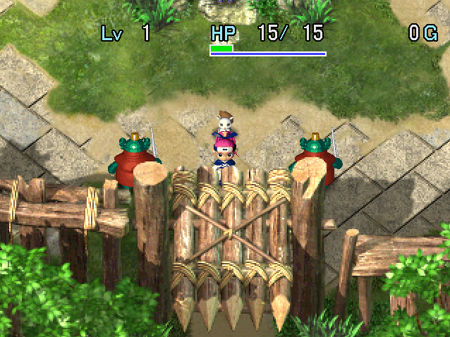

   

Dungeon where Mon Boxes and circuits can be found on the ground, and you progress using Mon Boxes. Weapons and shields can be obtained by bringing Kengo types, and you always start with an Escape Scroll.

You're allowed to bring Mon Boxes, so it's quite easy if you level up and upgrade a bunch of Mon Boxes. The first clear can be achieved without bringing items without much trouble, but 99F would be very hard.

Events between Baribari and Kichizo progress as you return to Yakagura Forest between adventures, which result in either new Mon Boxes for sale at the Mon Box shop, or Baribari gifting you Mon Boxes. Once Kengo becomes available, you can purchase Ether Devil from Baribari inside the Rescue Branch.

<ul class="quickLinksUL">
  <li><a href="#overview">Overview</a></li>
  <li><a href="#strategy">Strategy</a></li>
  <li><a href="#floor-guide">Floor Guide</a></li>
  <li><a href="#monsters">Monsters</a></li>
  <li><a href="#items">Items</a></li>
  <li><a href="#traps">Traps</a></li>
</ul>

# Overview

<table class="dungeonOverview">
  <tr>
    <th>Unlock</th>
    <td class="highlightYellow">Arrive in Yakagura Forest after clearing Tenrin Hard.</td>
  </tr>
  <tr>
    <th>Entrance</th>
    <td class="highlightYellow">Yakagura Forest (South exit)</td>
  </tr>
</table>

<table class="dungeonTable">
  <tr>
    <th>JP Name</th>
    <td colspan="3">ブフーの試練</td>
  </tr>
  <tr>
    <th>Floors</th>
    <td>19F (first) / 99F</td>
    <th>Stairs</th>
    <td>Descending</td>
  </tr>
  <tr>
    <th>Bring Items</th>
    <td>Mon Boxes only</td>
    <th>Allies</th>
    <td>Yes</td>
  </tr>
  <tr>
    <th>Unidentified</th>
    <td colspan="3">None</td>
  </tr>
  <tr>
    <th>Shops</th>
    <td>Yes</td>
    <th>Monster Houses</th>
    <td>Regular, Special</td>
  </tr>
  <tr>
    <th>Clear Icon</th>
    <td></td>
    <th>Reward (99F)</th>
    <td>Onigiri Sword (DC) Sheriff Box (PC)</td>
  </tr>
</table>

# Strategy

<ul class="quickLinksUL">
  <li><a href="#general">General</a></li>
  <li><a href="#equipment">Equipment</a></li>
  <li><a href="#mon-box">Mon Box</a></li>
</ul>

### General

#### Story Clear (19F)

Asuka doesn't gain experience points while wearing a Mon Box, so have ally Mon Boxes defeat enemies. High level monsters can be created by throwing weak Mon Boxes to quickly level up, but doing so without a plan for defeating the leveled up monster often results in a failed run, so think carefully before throwing Mon Boxes. ※ Mon Boxes only need 1/2 the experience points compared to Asuka to level up.

The quickest strategy is to buy 1 Horse Ronin and some Mamels in Yakagura Forest, then create Cave Mamels out of Pit Mamels (1-2F) to rapidly level up and breeze through the dungeon with a high level Horse Ronin while keeping an eye out for staves that can be used to support Horse Ronin.

That said, it's perfectly fine to take your time and enjoy collecting, leveling, and ranking up Mon Boxes instead of rushing through this dungeon in a single attempt - in fact, doing so will give you a big advantage for later dungeons.

#### Full Version (99F)

Level up on floors where kangaroos and Archdragons don't spawn, then wear strong Mon Boxes and rush stairs. Spend a few turns near the stairs to check for Astral Devil before unequipping a Mon Box to avoid surprise attacks. It helps to bring Shihan to collect a few Scout Bracelets and Decoy Bracelets, along with Rocket Boar and Thief Pelican to create a Festive Shield+20 or so with 5 弟 (Otogiriso) seals.

Vision Bracelet is shop-exclusive, so be wary of traps. Mon Boxes fall to the side instead of underfoot when you unequip them while standing on a trap tile, and the Mon Box is lost if you accidentally trigger a Landmine, Pitfall, or Monster Trap.

Baribari can appear inside this dungeon, but is quite uncommon compared to Skeleton's Challenge, and unlike Skeleton's Challenge, he doesn't offer to repair or rank up Mon Boxes.

#### 99F Speedrun

Throw weak Mon Boxes at Nigiri Novice (3-4F) to create a Nigiri Master, then throw an onigiri to level up. Level 19 or so gives a decent chance at surviving a surprise attack by Astral Devil when unequipping a Mon Box. You can restock Large Onigiri using Nigiri Master as you go, so there's no need to increase max fullness. A triple speed Iron Zalokleft can be used to warp in search of the stairs, but the Mon Box is lost if you warp into a Gitan room, so some luck is involved. If all goes well, you can clear the dungeon in less than an hour.

### Equipment

#### Weapon

Club and Nagamaki can be obtained using Iai or Shihan, which can be turned into Healing Sword. However, you can't keep up with late game enemies with such low attack power, so most skip a weapon. Minotaur's Axe and Ironhead's Head can also be obtained, but the only usable seal for them is 回.

##### Main Weapon

<table class="dungeonTable">
  <thead>
    <tr>
      <th>Name</th>
      <th>Atk</th>
      <th>Slot</th>
      <th>Notes</th>
    </tr>
  </thead>
  <tbody>
    <tr>
      <td class="highlightGray">Healing Sword</td>
      <td class="centeredText">6</td>
      <td class="centeredText">3</td>
      <td>Restores HP equal to 1/3 of damage dealt. How to Obtain: Synthesize Herb, Otogiriso, Life Grass into any weapon.</td>
    </tr>
  </tbody>
</table>

##### Seals

<table class="dungeonTable">
  <thead>
    <tr>
      <th>Seal</th>
      <th>Item</th>
      <th>Notes</th>
    </tr>
  </thead>
  <tbody>
    <tr>
      <td class="highlightGray">回</td>
      <td>Healing Sword</td>
      <td>Heal HP equal to 1/3 of damage dealt. ※ Does not stack.</td>
    </tr>
    <tr>
      <td class="highlightGray">会</td>
      <td>Minotaur's Axe</td>
      <td>1/4 chance to land a critical hit.</td>
    </tr>
    <tr>
      <td class="highlightGray">弟</td>
      <td>Otogiriso</td>
      <td>Direct attacks restore 3.5 HP (Rounded up).</td>
    </tr>
  </tbody>
</table>

#### Shield

Festive Shield raises shield base defense by 10 per ally character, and can be obtained using Kengo. Mon Boxes are counted as allies, so you can quickly boost Asuka's defense by pushing Mon Boxes. Otogiriso can be purchased in Gokokudani, so synthesize 5 弟 seals to finalize the shield. If you have a Thief Pelican, you can reach +99 upgrade value, but it's frankly overkill.

##### Main Shield

<table class="dungeonTable">
  <thead>
    <tr>
      <th>Name</th>
      <th>Def</th>
      <th>Slot</th>
      <th>Notes</th>
    </tr>
  </thead>
  <tbody>
    <tr>
      <td class="highlightGray">Festive Shield</td>
      <td class="centeredText">4</td>
      <td class="centeredText">5</td>
      <td>Increases shield base defense by 10 per ally character.</td>
    </tr>
  </tbody>
</table>

##### Seals

<table class="dungeonTable">
  <thead>
    <tr>
      <th>Seal</th>
      <th>Item</th>
      <th>Notes</th>
    </tr>
  </thead>
  <tbody>
    <tr>
      <td class="highlightGray">弟</td>
      <td>Otogiriso</td>
      <td>Restore 3.5 HP (Rounded up) after taking damage.</td>
    </tr>
  </tbody>
</table>

#### Bracelets

<table class="dungeonTable">
  <thead>
    <tr>
      <th>Name</th>
      <th>Notes</th>
    </tr>
  </thead>
  <tbody>
    <tr>
      <td class="highlightGray">Scout Bracelet</td>
      <td>Reveals the locations of enemies and items on the map. Can be obtained using Shihan.</td>
    </tr>
    <tr>
      <td class="highlightGray">Decoy Bracelet</td>
      <td>Revives you if you collapse while it's equipped. Can be purchased in Gokokudani, or obtained using Shihan.</td>
    </tr>
    <tr>
      <td class="highlightGray">Vision Bracelet</td>
      <td>Shop-exclusive. Reveals traps and Ether Devil types. Makes it safe to walk with Mon Box allies out.</td>
    </tr>
    <tr>
      <td class="highlightGray">Thief Bracelet</td>
      <td>Shop-exclusive. Monsters won't wake up from your footsteps. Equip it before advancing to the next floor to counter Monster Houses.</td>
    </tr>
  </tbody>
</table>

### Mon Box

Most Mon Boxes can be used effectively even if they haven't reached their level cap. Baribari appears inside this dungeon, but unlike Skeleton's Challenge, he can't be used to rank up a Mon Box.

##### Story Clear (19F)

<table class="dungeonTable">
  <thead>
    <tr>
      <th>Name</th>
      <th>Notes</th>
    </tr>
  </thead>
  <tbody>
    <tr>
      <td class="highlightGray">Horse Ronin</td>
      <td>Can be purchased in Yakagura Forest from the start. Silver arrows are great for Monster Houses, but watch where you stand.</td>
    </tr>
    <tr>
      <td class="highlightGray">Zalokleft</td>
      <td>Can be found between 5-7F. Steal 1 item per enemy, or escape from a bad situation. Insert a Steady Circuit if you don't want to warp.</td>
    </tr>
    <tr>
      <td class="highlightGray">Soldier Ant</td>
      <td>Can be found between 13-14F. Dig paths through walls. Double speed when ranked up to General Ant.</td>
    </tr>
    <tr>
      <td class="highlightGray">Shagga</td>
      <td>Can be found between 13-18F. Wear it to attack 3 times per turn. Makes the boss fight a breeze, especially with circuits that raise attack power.</td>
    </tr>
  </tbody>
</table>

##### Full Version (99F)

<table class="dungeonTable">
  <thead>
    <tr>
      <th>Name</th>
      <th>Notes</th>
    </tr>
  </thead>
  <tbody>
    <tr>
      <td class="highlightGray">Cave Mamel</td>
      <td>Purchase Mamel in Yakagura Forest and make this as soon as possible. 99 defense + 3 Protect Circuits = receive 0 damage from most direct attacks.</td>
    </tr>
    <tr>
      <td class="highlightGray">Gold Mamel</td>
      <td>Synthesize a Lv99 Cave Mamel with a Fuuma Stone to obtain Silver Mamel. Another 99 defense Mon Box, but only 10 HP, so don't leave it out.</td>
    </tr>
    <tr>
      <td class="highlightGray">Nigiri Master</td>
      <td>Ensures you won't starve. Nigiri Boss works as well.</td>
    </tr>
    <tr>
      <td class="highlightGray">Astral Devil</td>
      <td>Fight or run away at triple speed. Mirage Devil works as well.</td>
    </tr>
    <tr>
      <td class="highlightGray">Horse Shogun</td>
      <td>Shoot silver arrows from behind Cave Mamel at double speed.</td>
    </tr>
    <tr>
      <td class="highlightGray">Porkon</td>
      <td>Use it with Devil Kangaroo to wipe out any monster before they get close.</td>
    </tr>
    <tr>
      <td class="highlightGray">Iron Zalokleft</td>
      <td>Insert Swift Circuits and warp in search of the stairs at triple speed. Be warned that if you warp into a Gitan room, the Mon Box is lost.</td>
    </tr>
    <tr>
      <td class="highlightGray">Shihan</td>
      <td>Easily obtain Scout Bracelet and Decoy Bracelet.</td>
    </tr>
    <tr>
      <td class="highlightGray">Thief Pelican</td>
      <td>Use it with Rocket Boar or Zalokleft to prepare a Festive Shield.</td>
    </tr>
  </tbody>
</table>

# Floor Guide

### 1-2F

Push Mon Boxes and have them defeat enemies as an ally so that they gain experience points. Asuka doesn't gain experience points while wearing a Mon Box, and fullness also depletes at x5 speed, so avoid wearing Mon Boxes early on if you don't have a Nigiri Boss or Nigiri Master to restock onigiri.

If you're feeling adventurous, create a Cave Mamel by throwing weak Mon Boxes at a Pit Mamel (1-2F), then defeat it for 500 experience points.

If you're aiming for 99F, wear Shihan to obtain 1 Festive Shield and at least 2 Scout Bracelets. Decoy Bracelets are also needed. Parry Bracelets can be sold for a high price, so it's fine to keep a few on hand. Nigiri Master can be used to increase max fullness at the same time.

### 3-4F

Circuits you don't need can be inserted into broken or unneeded Mon Boxes, which can then be sold to a shop.

Sluggy (3-4F) lowers strength, but a Mon Box's stats reset when they return to their box, so it's a non-issue. If you have extra onigiri, create a Nigiri Master by throwing weak Mon Boxes at a Nigiri Novice (3-4F), then throw an onigiri at the Nigiri Master to one-shot it for 1600 experience points.

If you're aiming for 99F, continue collecting bracelets + increasing max fullness.

### 5-6F

Use Mon Boxes to fight Gazers (5-7F), since its hypnosis just inflicts Confused status against Mon Boxes. If you wear Horse Ronin, you can still shoot silver arrows in the direction you're facing while confused.

Zalokleft (5-7F) appears - Never suspend on a floor if a Zalokleft type has stolen a registered Mon Box. There's a major glitch where Mr. Gen won't retrieve the Mon Box, meaning you can no longer recover or register a Mon Box of the stolen type on that save file.

If you're feeling adventurous, create a Hyper Gazer by throwing weak Mon Boxes and defeat it for 2000 exp.

### 7-8F

Hallways are a bit risky since Nigiri Morph (6-8F) can transform a Mon Box in your inventory into an onigiri. If you're concerned, go ahead and wear a Mon Box while navigating through hallways.

Thief Pelican (7-9F) appears, so synthesize 弟 (Otogiriso) into a Festive Shield if you brought a Kengo type. ※ Don't worry if you haven't found any Otogiriso yet, since you can buy some in the upcoming village.

### Gokokudani

Sell unneeded circuits, Mon Boxes, bracelets, etc. and purchase items depending on what Mon Boxes you have:

- Some Huge Onigiri if you didn't bring a Nigiri Boss or Nigiri Master.
- 5 Otogiriso to synthesize into a Festive Shield if you brought a Kengo type.
- 1\~3 Decoy Bracelets is plenty for the story clear, but 3\~5 is best if aiming for 99F.
- Fill remaining inventory slots with Storage Pots containing Otogiriso to increase max HP.

##### Mutaikon Tip

Poison Grass can be sold for 700G, and can be produced by wearing a Mutaikon Box inside the storage building. Therefore, it's possible to shop infinitely if you bring a Mutaikon Box into the dungeon.

#### Inn

Pay 500 Gitan to fully restore HP and fullness. ※ Bring Minamo to this Inn for a special event that unlocks her making Strange Onigiri for you.

#### Item Shop

|Item|Price|
|-|-|
|Large Onigiri|200|
|Huge Onigiri|300|
|Otogiriso|500|
|Heal Staff[4]|1120|
|Storage Pot[4]|1440|
|Heal Pot[4]|1200|
|Decoy Bracelet|7500|
|Escape Scroll|1000|

### 9-19F

Thief Pelican is still around on 9F, and Robber Pelican (12-16F) appears shortly afterward. This is the last floor range where you can synthesize items if you didn't bring a Thief Pelican into the dungeon. ※ Falcon Tengu (12-13F) overlaps with Robber Pelican, so it's best to avoid synthesizing on those floors.

After synthesizing 5 Otogiriso into your shield, go ahead and eat any remaining Otogiriso to increase max HP.

Watch out for Curse Girls (12-14F), since Purify Scrolls are uncommon in this dungeon. If you're concerned, go ahead and wear a Mon Box while navigating through hallways on those floors.

If you're aiming for the story clear, search for Shagga and Ironhead boxes from 15F onward. They have high offensive capabilities between their attack power and special attacks, and are worth leveling up. If you're not having much luck, you can wear Zalokleft and steal from enemies to increase your odds. That said, the boss fight is still doable with Horse Ronin, so don't worry about it too much.

If you found Drain Circuits, insert them into your main attacker before advancing past 19F.

### Boss

Fight against Kufuku.

|Name|HP|Atk|Def|Exp|Notes|
|-|-|-|-|-|-|
|Kufuku|200|40|15|3000|・Decreases max fullness by 50%. ・Warps and summons 1 Dance Polygon when hit.|

Kufuku summons a Dance Polygon and warps when hit, and has a special attack that lowers max fullness by 50%. Lowered max fullness isn't really an issue here, though, since the current adventure ends after the fight.

Ghost Circuit is effective against Kufuku, and Drain Circuit against Dance Polygons. Wear Shagga and use its triple attack, or push Ironhead / Horse Ronin and let them use ranged attacks. It may be easier to let a few Mon Boxes deal with Kufuku while Asuka acts as a decoy for Dance Polygons.

If you have strong Mon Boxes like Cave Mamel or Shihan, just throw them at Kufuku at the start to win. Another strategy is to stock up on Gitan bags using Froggo, then have Asuka throw Gitan at Kufuku.

### 20-99F

If you have strong Mon Boxes, reaching 99F isn't difficult as long as you don't make a major misplay. Keep Scout Bracelet and Decoy Bracelet equipped, and play carefully on Devil Kangaroo (41-50F, 61-70F) floors. Wear Cave Mamel against Astral Devils, and wear Astral Devil with Cold Circuits against Archdragons. If you find a Blank Scroll, it's best to turn it into Extinction Scroll and throw it at an Archdragon.

Common misplays:

- Walk without checking for traps while Mon Boxes are out → Step on a Pitfall (21F+) and lose Mon Boxes.
- Unequip a Mon Box and try to grab it without checking underfoot → Trigger a Landmine and lose the Mon Box.
- Unequip a Mon Box while standing adjacent to water → Trap was underfoot, so Mon Box fell into water.
    - Submerged Mon Boxes can be reclaimed if you have Zalokleft or Bored Kappa.
- Curse Girl type cursed a Mon Box in your inventory → Mon Box is unusable without a Purify Scroll.
- Nigiri Master turned a Mon Box in your inventory into an onigiri → Likely game over if it was a key Mon Box.

# Monsters

Enemy Colors: Farming Useful Destroys Items Dangerous Very Dangerous

<table class="monsterTable">
  <thead>
    <tr>
      <th>F</th>
      <th colspan="7">Monsters</th>
    </tr>
  </thead>
  <tbody>
    <tr>
      <th>1</th>
      <td>Mamel</td>
      <td>Pit Mamel</td>
      <td>Chintala</td>
      <td class="highlightGray"></td>
      <td class="highlightGray"></td>
      <td class="highlightGray"></td>
      <td class="highlightGray"></td>
    </tr>
    <tr>
      <th>2</th>
      <td>Mamel</td>
      <td>Pit Mamel</td>
      <td>Chintala</td>
      <td>Lady Locks</td>
      <td class="highlightGray"></td>
      <td class="highlightGray"></td>
      <td class="highlightGray"></td>
    </tr>
    <tr>
      <th>3</th>
      <td>Nigiri Novice</td>
      <td>Tug Frog</td>
      <td>Sluggy</td>
      <td>Lady Locks</td>
      <td class="highlightGray"></td>
      <td class="highlightGray"></td>
      <td class="highlightGray"></td>
    </tr>
    <tr>
      <th>4</th>
      <td>Nigiri Novice</td>
      <td>Tug Frog</td>
      <td>Sluggy</td>
      <td>Lady Locks</td>
      <td>Froggo</td>
      <td>Bow Boy</td>
      <td>Crow Tengu</td>
    </tr>
    <tr>
      <th>5</th>
      <td>Laugh Polygon Zalokleft</td>
      <td>Gazer</td>
      <td class="highlightGray"></td>
      <td class="highlightGray"></td>
      <td>Froggo</td>
      <td>Bow Boy</td>
      <td>Crow Tengu</td>
    </tr>
    <tr>
      <th>6</th>
      <td>Laugh Polygon Zalokleft</td>
      <td>Gazer</td>
      <td>Spearfish</td>
      <td>Nigiri Morph</td>
      <td class="highlightGray"></td>
      <td>Mid Chintala</td>
      <td class="highlightGray"></td>
    </tr>
    <tr>
      <th>7</th>
      <td>Thief Pelican Zalokleft</td>
      <td>Gazer</td>
      <td>Spearfish</td>
      <td>Nigiri Morph</td>
      <td>Rocket Boar</td>
      <td>Mid Chintala</td>
      <td>Shadow Hat</td>
    </tr>
    <tr>
      <th>8</th>
      <td>Thief Pelican</td>
      <td>Boy Cart</td>
      <td>Pud</td>
      <td>Nigiri Morph</td>
      <td>Rocket Boar</td>
      <td>Mid Chintala</td>
      <td>Shadow Hat</td>
    </tr>
    <tr>
      <td colspan="8" class="monsterTableVillage">Gokokudani</td>
    </tr>
    <tr>
      <th>9</th>
      <td>Thief Pelican Lt. Spearfish</td>
      <td>Boy Cart Jagan Mask</td>
      <td>Pud Demon Warrior</td>
      <td>Bitter Sluggy</td>
      <td>Rocket Boar</td>
      <td>Pull Frog</td>
      <td>Bored Kappa</td>
    </tr>
    <tr>
      <th>10</th>
      <td>Tiger Tosser Lt. Spearfish</td>
      <td>Boy Cart Jagan Mask</td>
      <td>Pud Demon Warrior</td>
      <td>Bitter Sluggy</td>
      <td class="highlightGray"></td>
      <td>Pull Frog</td>
      <td>Bored Kappa</td>
    </tr>
    <tr>
      <th>11</th>
      <td>Tiger Tosser Spike Dragon</td>
      <td>Falcon Tengu Jagan Mask</td>
      <td>Lovely Locks Demon Warrior</td>
      <td>Bitter Sluggy Pumphantasm</td>
      <td class="highlightGray"></td>
      <td>Pull Frog</td>
      <td>Horse Ronin</td>
    </tr>
    <tr>
      <th>12</th>
      <td>Tiger Tosser Spike Dragon</td>
      <td>Falcon Tengu Spin Polygon</td>
      <td>Lovely Locks</td>
      <td>Robber Pelican Pumphantasm</td>
      <td>Curse Girl</td>
      <td>Mutaikon</td>
      <td>Horse Ronin</td>
    </tr>
    <tr>
      <th>13</th>
      <td>Bone Dragon Spike Dragon</td>
      <td>Falcon Tengu Spin Polygon</td>
      <td>Lovely Locks</td>
      <td>Robber Pelican Pumphantasm</td>
      <td>Curse Girl</td>
      <td>Mutaikon</td>
      <td>Muron</td>
    </tr>
    <tr>
      <th>14</th>
      <td>Bone Dragon Kengo</td>
      <td>Porky Spin Polygon</td>
      <td>Pudding Pop Tank</td>
      <td>Robber Pelican</td>
      <td>Curse Girl</td>
      <td>Mutaikon</td>
      <td>Muron</td>
    </tr>
    <tr>
      <th>15</th>
      <td>Bone Dragon Kengo</td>
      <td>Porky Shagga</td>
      <td>Pudding Pop Tank</td>
      <td>Robber Pelican Soldier Ant</td>
      <td>Schubell</td>
      <td>Hannya Warrior</td>
      <td>Muron</td>
    </tr>
    <tr>
      <th>16</th>
      <td>Floor Dragon Kengo</td>
      <td>Porky Shagga</td>
      <td>Pudding Pop Tank</td>
      <td>Robber Pelican Soldier Ant</td>
      <td>Schubell</td>
      <td>Hannya Warrior</td>
      <td>Horse Samurai</td>
    </tr>
    <tr>
      <th>17</th>
      <td>Floor Dragon Dazikon</td>
      <td>Froggucci Shagga</td>
      <td>Goldie Locks Kigny</td>
      <td>King Tusker Slime</td>
      <td>Dragon Black Hat</td>
      <td>Hannya Warrior</td>
      <td>Horse Samurai</td>
    </tr>
    <tr>
      <th>18</th>
      <td>Floor Dragon Dazikon</td>
      <td>Froggucci Shagga</td>
      <td>Goldie Locks Kigny</td>
      <td>King Tusker Slime</td>
      <td>Dragon Black Hat</td>
      <td>Ironhead</td>
      <td>Horse Samurai</td>
    </tr>
    <tr>
      <th>19</th>
      <td>Ether Devil Dazikon</td>
      <td>Bat Kangaroo Tiny Phoenix</td>
      <td>Goldie Locks Kigny</td>
      <td>King Tusker Slime</td>
      <td>Dragon Black Hat</td>
      <td>Ironhead</td>
      <td>Taur</td>
    </tr>
    <tr>
      <td colspan="8" class="highlightYellow">Boss</td>
    </tr>
    <tr>
      <th>20</th>
      <td>Ether Devil Yenron</td>
      <td>Bat Kangaroo Tiny Phoenix</td>
      <td>Menbell Bomb</td>
      <td>Nigiri Boss</td>
      <td>Dragon Jagar Prince</td>
      <td>Ironhead</td>
      <td>Taur</td>
    </tr>
    <tr>
      <th>21</th>
      <td>Ether Devil Yenron</td>
      <td>Bat Kangaroo Tiny Phoenix</td>
      <td>Menbell Bomb</td>
      <td>Nigiri Boss</td>
      <td>Yank Frog Jagar Prince</td>
      <td>Capt. Spearfish</td>
      <td>Taur</td>
    </tr>
    <tr>
      <th>22</th>
      <td>Jet Boar Yenron</td>
      <td>Pumphantom</td>
      <td>Menbell Bomb</td>
      <td>Iai Nigiri Boss</td>
      <td>Yank Frog Jagar Prince</td>
      <td>Capt. Spearfish</td>
      <td>Lime Zalokleft</td>
    </tr>
    <tr>
      <th>23</th>
      <td>Jet Boar Yenron</td>
      <td>Pumphantom</td>
      <td>Horse Shogun Dragon Head</td>
      <td>Iai Dance Polygon</td>
      <td>Yank Frog Super Gazer</td>
      <td>Capt. Spearfish</td>
      <td>Lime Zalokleft</td>
    </tr>
    <tr>
      <th>24</th>
      <td>Jet Boar Chainhead</td>
      <td>Pumphantom</td>
      <td>Horse Shogun Dragon Head</td>
      <td>Iai Dance Polygon</td>
      <td>Rancor Sluggy Super Gazer</td>
      <td>Capt. Spearfish</td>
      <td>Lime Zalokleft</td>
    </tr>
    <tr>
      <th>25</th>
      <td>Cranky Tank Chainhead</td>
      <td>Minotaur Nashagga</td>
      <td>Horse Shogun Dragon Head</td>
      <td>Monarch Tusker Dance Polygon</td>
      <td>Rancor Sluggy Super Gazer</td>
      <td>Sky Dragon</td>
      <td class="highlightGray"></td>
    </tr>
    <tr>
      <th>26</th>
      <td>Cranky Tank Chainhead</td>
      <td>Minotaur Nashagga</td>
      <td>Evil Kangaroo Big Chintala</td>
      <td>Monarch Tusker Porko</td>
      <td>Rancor Sluggy</td>
      <td>Sky Dragon</td>
      <td>Curse Sister</td>
    </tr>
    <tr>
      <th>27</th>
      <td>Cranky Tank Chainhead</td>
      <td>Minotaur Nashagga</td>
      <td>Evil Kangaroo Big Chintala</td>
      <td>Monarch Tusker Porko</td>
      <td>Rancor Sluggy</td>
      <td>Sky Dragon</td>
      <td>Curse Sister</td>
    </tr>
    <tr>
      <th>28</th>
      <td>Cranky Tank Chainhead</td>
      <td>Minotaur Nashagga</td>
      <td>Evil Kangaroo Big Chintala</td>
      <td>Monarch Tusker Porko</td>
      <td>Rancor Sluggy</td>
      <td>Sky Dragon</td>
      <td>Curse Sister</td>
    </tr>
    <tr>
      <th>29</th>
      <td>Cranky Tank Chainhead</td>
      <td>Minotaur Nashagga</td>
      <td>Evil Kangaroo Big Chintala</td>
      <td>Monarch Tusker Porko</td>
      <td>Rancor Sluggy</td>
      <td>Sky Dragon</td>
      <td>Curse Sister</td>
    </tr>
    <tr>
      <th>30</th>
      <td>Cranky Tank Chainhead</td>
      <td>Minotaur Nashagga</td>
      <td>Evil Kangaroo Big Chintala</td>
      <td>Monarch Tusker Porko</td>
      <td>Rancor Sluggy</td>
      <td>Sky Dragon</td>
      <td>Curse Sister</td>
    </tr>
    <tr>
      <th>31</th>
      <td>Cranky Tank Earth Needle</td>
      <td>Minotaur Phantom Devil</td>
      <td>Skull Dragon Grime</td>
      <td>Tunnel Dragon</td>
      <td>Tiger Hurler Shogun</td>
      <td>Sky Dragon</td>
      <td>Curse Sister</td>
    </tr>
    <tr>
      <th>32</th>
      <td>Cranky Tank Earth Needle</td>
      <td>Minotaur Phantom Devil</td>
      <td>Skull Dragon Grime</td>
      <td>Tunnel Dragon</td>
      <td>Tiger Hurler Shogun</td>
      <td>Sky Dragon</td>
      <td>Curse Sister</td>
    </tr>
    <tr>
      <th>33</th>
      <td>Cranky Tank Earth Needle</td>
      <td>Minotaur Phantom Devil</td>
      <td>Skull Dragon Grime</td>
      <td>Tunnel Dragon</td>
      <td>Tiger Hurler Shogun</td>
      <td>Sky Dragon</td>
      <td>Curse Sister</td>
    </tr>
    <tr>
      <th>34</th>
      <td>Cranky Tank Earth Needle</td>
      <td>Minotaur Phantom Devil</td>
      <td>Skull Dragon Grime</td>
      <td>Tunnel Dragon</td>
      <td>Tiger Hurler Shogun</td>
      <td>Sky Dragon</td>
      <td>Curse Sister</td>
    </tr>
    <tr>
      <th>35</th>
      <td>Cranky Tank Earth Needle</td>
      <td>Minotaur Phantom Devil</td>
      <td>Skull Dragon Grime</td>
      <td>Tunnel Dragon</td>
      <td>Tiger Hurler Shogun</td>
      <td>Sky Dragon</td>
      <td>Chainhead</td>
    </tr>
    <tr>
      <th>36</th>
      <td>Froggon Earth Needle</td>
      <td>Elec Bomb Phantom Devil</td>
      <td>Skull Dragon Grime</td>
      <td>Tunnel Dragon</td>
      <td>Tiger Hurler Shogun</td>
      <td>Captain Ant</td>
      <td>Chainhead</td>
    </tr>
    <tr>
      <th>37</th>
      <td>Froggon Earth Needle</td>
      <td>Elec Bomb Phantom Devil</td>
      <td>Skull Dragon Grime</td>
      <td>Tunnel Dragon</td>
      <td>Tiger Hurler Shogun</td>
      <td>Captain Ant</td>
      <td>Chainhead</td>
    </tr>
    <tr>
      <th>38</th>
      <td>Froggon Earth Needle</td>
      <td>Elec Bomb Phantom Devil</td>
      <td>Skull Dragon Grime</td>
      <td>Tunnel Dragon</td>
      <td>Tiger Hurler Shogun</td>
      <td>Captain Ant</td>
      <td>Chainhead</td>
    </tr>
    <tr>
      <th>39</th>
      <td>Froggon Earth Needle</td>
      <td>Elec Bomb Phantom Devil</td>
      <td>Skull Dragon Grime</td>
      <td>Tunnel Dragon</td>
      <td>Tiger Hurler Shogun</td>
      <td>Captain Ant</td>
      <td>Chainhead</td>
    </tr>
    <tr>
      <th>40</th>
      <td>Froggon Earth Needle</td>
      <td>Elec Bomb Phantom Devil</td>
      <td>Skull Dragon Grime</td>
      <td>Tunnel Dragon</td>
      <td>Tiger Hurler Shogun</td>
      <td>Captain Ant</td>
      <td>Chainhead</td>
    </tr>
    <tr>
      <th>41</th>
      <td>Iron Zalokleft Earth Needle</td>
      <td>Elec Bomb Phantom Devil</td>
      <td>Skull Dragon Nigiri Master</td>
      <td>Tunnel Dragon Adm. Spearfish</td>
      <td>Tiger Hurler</td>
      <td>Cave Mamel</td>
      <td>Devil Kangaroo</td>
    </tr>
    <tr>
      <th>42</th>
      <td>Iron Zalokleft Earth Needle</td>
      <td>Elec Bomb Phantom Devil</td>
      <td>Skull Dragon Nigiri Master</td>
      <td>Tunnel Dragon Adm. Spearfish</td>
      <td>Tiger Hurler</td>
      <td>Cave Mamel</td>
      <td>Devil Kangaroo</td>
    </tr>
    <tr>
      <th>43</th>
      <td>Iron Zalokleft Earth Needle</td>
      <td>Elec Bomb Phantom Devil</td>
      <td>Skull Dragon Nigiri Master</td>
      <td>Tunnel Dragon Adm. Spearfish</td>
      <td>Tiger Hurler</td>
      <td>Cave Mamel</td>
      <td>Devil Kangaroo</td>
    </tr>
    <tr>
      <th>44</th>
      <td>Iron Zalokleft Earth Needle</td>
      <td>Elec Bomb Phantom Devil</td>
      <td>Skull Dragon Nigiri Master</td>
      <td>Tunnel Dragon Adm. Spearfish</td>
      <td>Tiger Hurler</td>
      <td>Cave Mamel</td>
      <td>Devil Kangaroo</td>
    </tr>
    <tr>
      <th>45</th>
      <td>Iron Zalokleft Earth Needle</td>
      <td>Elec Bomb Phantom Devil</td>
      <td>Skull Dragon Nigiri Master</td>
      <td>Tunnel Dragon Adm. Spearfish</td>
      <td>Tiger Hurler</td>
      <td>Cave Mamel</td>
      <td>Devil Kangaroo</td>
    </tr>
    <tr>
      <th>46</th>
      <td>Froggon Earth Needle</td>
      <td>Jagar King Phantom Devil</td>
      <td>Ooze Nigiri Master</td>
      <td>Adm. Spearfish</td>
      <td>Shogun</td>
      <td>Cave Mamel</td>
      <td>Devil Kangaroo</td>
    </tr>
    <tr>
      <th>47</th>
      <td>Froggon Earth Needle</td>
      <td>Jagar King Phantom Devil</td>
      <td>Ooze Nigiri Master</td>
      <td>Adm. Spearfish</td>
      <td>Shogun</td>
      <td>Cave Mamel</td>
      <td>Devil Kangaroo</td>
    </tr>
    <tr>
      <th>48</th>
      <td>Froggon Earth Needle</td>
      <td>Jagar King Phantom Devil</td>
      <td>Ooze Nigiri Master</td>
      <td>Adm. Spearfish</td>
      <td>Shogun</td>
      <td>Cave Mamel</td>
      <td>Devil Kangaroo</td>
    </tr>
    <tr>
      <th>49</th>
      <td>Froggon Earth Needle</td>
      <td>Jagar King Phantom Devil</td>
      <td>Ooze Nigiri Master</td>
      <td>Adm. Spearfish</td>
      <td>Eagle Tengu Shogun</td>
      <td>Cave Mamel</td>
      <td>Devil Kangaroo</td>
    </tr>
    <tr>
      <th>50</th>
      <td>Froggon Earth Needle</td>
      <td>Jagar King Phantom Devil</td>
      <td>Ooze Nigiri Master</td>
      <td>Adm. Spearfish</td>
      <td>Eagle Tengu Shogun</td>
      <td>Cave Mamel</td>
      <td>Devil Kangaroo</td>
    </tr>
    <tr>
      <th>51</th>
      <td>Iron Zalokleft Curse Mom</td>
      <td>Jagar King Vexing Kappa</td>
      <td>Ooze Nigiri Master</td>
      <td>Dark Hat</td>
      <td>Eagle Tengu Shogun</td>
      <td>Sky Dragon</td>
      <td class="highlightGray"></td>
    </tr>
    <tr>
      <th>52</th>
      <td>Iron Zalokleft Curse Mom</td>
      <td>Jagar King Vexing Kappa</td>
      <td>Ooze Nigiri Master</td>
      <td>Dark Hat</td>
      <td>Eagle Tengu Shogun</td>
      <td>Sky Dragon</td>
      <td class="highlightGray"></td>
    </tr>
    <tr>
      <th>53</th>
      <td>Iron Zalokleft Curse Mom</td>
      <td>Jagar King Vexing Kappa</td>
      <td>Ooze Nigiri Master</td>
      <td>Dark Hat</td>
      <td>Eagle Tengu Shogun</td>
      <td>Sky Dragon</td>
      <td class="highlightGray"></td>
    </tr>
    <tr>
      <th>54</th>
      <td>Iron Zalokleft Curse Mom</td>
      <td>Jagar King Vexing Kappa</td>
      <td>Ooze Nigiri Master</td>
      <td>Dark Hat</td>
      <td>Eagle Tengu Shogun</td>
      <td>Sky Dragon</td>
      <td class="highlightGray"></td>
    </tr>
    <tr>
      <th>55</th>
      <td>Iron Zalokleft Curse Mom</td>
      <td>Jagar King Vexing Kappa</td>
      <td>Ooze Nigiri Master</td>
      <td>Dark Hat</td>
      <td>Eagle Tengu Shogun</td>
      <td>Sky Dragon</td>
      <td class="highlightGray"></td>
    </tr>
    <tr>
      <th>56</th>
      <td>Custard Curse Mom</td>
      <td>Tiger Chucker Vexing Kappa</td>
      <td>General Ant Nigiri Master</td>
      <td>Venom Sluggy Dark Hat</td>
      <td>Eagle Tengu</td>
      <td>Sky Dragon</td>
      <td class="highlightGray"></td>
    </tr>
    <tr>
      <th>57</th>
      <td>Custard Curse Mom</td>
      <td>Tiger Chucker Vexing Kappa</td>
      <td>General Ant Nigiri Master</td>
      <td>Venom Sluggy Dark Hat</td>
      <td>Eagle Tengu</td>
      <td>Sky Dragon</td>
      <td class="highlightGray"></td>
    </tr>
    <tr>
      <th>58</th>
      <td>Custard Curse Mom</td>
      <td>Tiger Chucker Vexing Kappa</td>
      <td>General Ant Nigiri Master</td>
      <td>Venom Sluggy Dark Hat</td>
      <td>Eagle Tengu</td>
      <td>Sky Dragon</td>
      <td class="highlightGray"></td>
    </tr>
    <tr>
      <th>59</th>
      <td>Custard Curse Mom</td>
      <td>Tiger Chucker Vexing Kappa</td>
      <td>General Ant Nigiri Master</td>
      <td>Venom Sluggy Dark Hat</td>
      <td>Eagle Tengu</td>
      <td>Sky Dragon</td>
      <td class="highlightGray"></td>
    </tr>
    <tr>
      <th>60</th>
      <td>Custard Curse Mom</td>
      <td>Tiger Chucker Vexing Kappa</td>
      <td>General Ant Nigiri Master</td>
      <td>Venom Sluggy Dark Hat</td>
      <td>Eagle Tengu</td>
      <td>Sky Dragon</td>
      <td class="highlightGray"></td>
    </tr>
    <tr>
      <th>61</th>
      <td>Custard Curse Mom</td>
      <td>Tiger Chucker Vexing Kappa</td>
      <td>Mirage Devil Fire Bomb</td>
      <td>Venom Sluggy Dark Hat</td>
      <td>Eagle Tengu Porkon</td>
      <td>Sonic Boar</td>
      <td>Devil Kangaroo</td>
    </tr>
    <tr>
      <th>62</th>
      <td>Custard Curse Mom</td>
      <td>Tiger Chucker Vexing Kappa</td>
      <td>Mirage Devil Fire Bomb</td>
      <td>Venom Sluggy Dark Hat</td>
      <td>Eagle Tengu Porkon</td>
      <td>Sonic Boar</td>
      <td>Devil Kangaroo</td>
    </tr>
    <tr>
      <th>63</th>
      <td>Custard Curse Mom</td>
      <td>Tiger Chucker Vexing Kappa</td>
      <td>Mirage Devil Fire Bomb</td>
      <td>Venom Sluggy Dark Hat</td>
      <td>Eagle Tengu Porkon</td>
      <td>Sonic Boar</td>
      <td>Devil Kangaroo</td>
    </tr>
    <tr>
      <th>64</th>
      <td>Custard Curse Mom</td>
      <td>Tiger Chucker Vexing Kappa</td>
      <td>Mirage Devil Fire Bomb</td>
      <td>Venom Sluggy Dark Hat</td>
      <td>Eagle Tengu Porkon</td>
      <td>Sonic Boar</td>
      <td>Devil Kangaroo</td>
    </tr>
    <tr>
      <th>65</th>
      <td>Custard Curse Mom</td>
      <td>Tiger Chucker Vexing Kappa</td>
      <td>Mirage Devil Fire Bomb</td>
      <td>Venom Sluggy Dark Hat</td>
      <td>Eagle Tengu Porkon</td>
      <td>Sonic Boar Hyper Gazer</td>
      <td>Devil Kangaroo</td>
    </tr>
    <tr>
      <th>66</th>
      <td>Custard Curse Mom</td>
      <td>Thunder Lance</td>
      <td>General Ant Fire Bomb</td>
      <td>Venom Sluggy Sludge</td>
      <td>Eagle Tengu Porkon</td>
      <td>Sonic Boar Hyper Gazer</td>
      <td>Devil Kangaroo</td>
    </tr>
    <tr>
      <th>67</th>
      <td>Custard Curse Mom</td>
      <td>Thunder Lance</td>
      <td>General Ant Fire Bomb</td>
      <td>Venom Sluggy Sludge</td>
      <td>Eagle Tengu Porkon</td>
      <td>Sonic Boar Hyper Gazer</td>
      <td>Devil Kangaroo</td>
    </tr>
    <tr>
      <th>68</th>
      <td>Custard Curse Mom</td>
      <td>Thunder Lance</td>
      <td>General Ant Fire Bomb</td>
      <td>Venom Sluggy Sludge</td>
      <td>Eagle Tengu Porkon</td>
      <td>Sonic Boar Hyper Gazer</td>
      <td>Devil Kangaroo</td>
    </tr>
    <tr>
      <th>69</th>
      <td>Custard Curse Mom</td>
      <td>Thunder Lance</td>
      <td>General Ant Fire Bomb</td>
      <td>Venom Sluggy Sludge</td>
      <td>Eagle Tengu Porkon</td>
      <td>Sonic Boar Hyper Gazer</td>
      <td>Devil Kangaroo</td>
    </tr>
    <tr>
      <th>70</th>
      <td>Custard Curse Mom</td>
      <td>Thunder Lance</td>
      <td>General Ant Fire Bomb</td>
      <td>Venom Sluggy Sludge</td>
      <td>Eagle Tengu Porkon</td>
      <td>Sonic Boar Hyper Gazer</td>
      <td>Devil Kangaroo</td>
    </tr>
    <tr>
      <th>71</th>
      <td>Emperor Tusker Pumpanshee</td>
      <td>Astral Devil Thunder Lance</td>
      <td>Mirage Devil</td>
      <td>Goldie Locks Sludge</td>
      <td>Sing Polygon Porkon</td>
      <td>Sonic Boar Hyper Gazer</td>
      <td>Shihan</td>
    </tr>
    <tr>
      <th>72</th>
      <td>Emperor Tusker Pumpanshee</td>
      <td>Astral Devil Thunder Lance</td>
      <td>Mirage Devil</td>
      <td>Goldie Locks Sludge</td>
      <td>Sing Polygon Porkon</td>
      <td>Sonic Boar Hyper Gazer</td>
      <td>Shihan</td>
    </tr>
    <tr>
      <th>73</th>
      <td>Emperor Tusker Pumpanshee</td>
      <td>Astral Devil Thunder Lance</td>
      <td>Mirage Devil</td>
      <td>Goldie Locks Sludge</td>
      <td>Sing Polygon Porkon</td>
      <td>Sonic Boar Hyper Gazer</td>
      <td>Shihan</td>
    </tr>
    <tr>
      <th>74</th>
      <td>Emperor Tusker Pumpanshee</td>
      <td>Astral Devil Thunder Lance</td>
      <td>Mirage Devil</td>
      <td>Goldie Locks Sludge</td>
      <td>Sing Polygon Porkon</td>
      <td>Sonic Boar Hyper Gazer</td>
      <td>Shihan</td>
    </tr>
    <tr>
      <th>75</th>
      <td>Emperor Tusker Pumpanshee</td>
      <td>Astral Devil Thunder Lance</td>
      <td>Mirage Devil</td>
      <td>Goldie Locks Sludge</td>
      <td>Sing Polygon Porkon</td>
      <td>Sonic Boar Hyper Gazer</td>
      <td>Shihan</td>
    </tr>
    <tr>
      <th>76</th>
      <td>Emperor Tusker Pumpanshee</td>
      <td>Astral Devil Thunder Lance</td>
      <td>Bellthoven Megataur</td>
      <td>Sludge</td>
      <td>Sing Polygon</td>
      <td>Dozikon</td>
      <td>Shihan</td>
    </tr>
    <tr>
      <th>77</th>
      <td>Emperor Tusker Pumpanshee</td>
      <td>Astral Devil Thunder Lance</td>
      <td>Bellthoven Megataur</td>
      <td>Sludge</td>
      <td>Sing Polygon</td>
      <td>Dozikon</td>
      <td>Shihan</td>
    </tr>
    <tr>
      <th>78</th>
      <td>Emperor Tusker Pumpanshee</td>
      <td>Astral Devil Thunder Lance</td>
      <td>Bellthoven Megataur</td>
      <td>Sludge</td>
      <td>Sing Polygon</td>
      <td>Dozikon</td>
      <td>Shihan</td>
    </tr>
    <tr>
      <th>79</th>
      <td>Emperor Tusker Pumpanshee</td>
      <td>Astral Devil Thunder Lance</td>
      <td>Bellthoven Megataur</td>
      <td>Sludge</td>
      <td>Sing Polygon</td>
      <td>Dozikon</td>
      <td>Shihan</td>
    </tr>
    <tr>
      <th>80</th>
      <td>Emperor Tusker Pumpanshee</td>
      <td>Astral Devil Thunder Lance</td>
      <td>Bellthoven Megataur</td>
      <td>Sludge</td>
      <td>Sing Polygon</td>
      <td>Dozikon</td>
      <td>Shihan</td>
    </tr>
    <tr>
      <th>81</th>
      <td>Emperor Tusker Pumpanshee</td>
      <td>Tiger Chucker Gigahead</td>
      <td>Bellthoven Megataur</td>
      <td>Shenron</td>
      <td>Garm Dragon</td>
      <td>Dozikon</td>
      <td>Shihan</td>
    </tr>
    <tr>
      <th>82</th>
      <td>Emperor Tusker Pumpanshee</td>
      <td>Tiger Chucker Gigahead</td>
      <td>Bellthoven Megataur</td>
      <td>Shenron</td>
      <td>Garm Dragon</td>
      <td>Dozikon</td>
      <td>Shihan</td>
    </tr>
    <tr>
      <th>83</th>
      <td>Emperor Tusker Pumpanshee</td>
      <td>Tiger Chucker Gigahead</td>
      <td>Bellthoven Megataur</td>
      <td>Shenron</td>
      <td>Garm Dragon</td>
      <td>Dozikon</td>
      <td>Shihan</td>
    </tr>
    <tr>
      <th>84</th>
      <td>Emperor Tusker Pumpanshee</td>
      <td>Tiger Chucker Gigahead</td>
      <td>Bellthoven Megataur</td>
      <td>Shenron</td>
      <td>Garm Dragon</td>
      <td>Dozikon</td>
      <td>Shihan</td>
    </tr>
    <tr>
      <th>85</th>
      <td>Emperor Tusker Pumpanshee</td>
      <td>Tiger Chucker Gigahead</td>
      <td>Lashagga Megataur</td>
      <td>Shenron</td>
      <td>Garm Dragon</td>
      <td>Dozikon</td>
      <td>Shihan</td>
    </tr>
    <tr>
      <th>86</th>
      <td>Archdragon Horse Emperor</td>
      <td>Tiger Chucker Gigahead</td>
      <td>Lashagga Megataur</td>
      <td>Hyper Gazer Shenron</td>
      <td>Garm Dragon</td>
      <td>Dozikon</td>
      <td>Eagle Tengu</td>
    </tr>
    <tr>
      <th>87</th>
      <td>Archdragon Horse Emperor</td>
      <td>Tiger Chucker Gigahead</td>
      <td>Lashagga Megataur</td>
      <td>Hyper Gazer Shenron</td>
      <td>Garm Dragon</td>
      <td>Dozikon</td>
      <td>Eagle Tengu</td>
    </tr>
    <tr>
      <th>88</th>
      <td>Archdragon Horse Emperor</td>
      <td>Tiger Chucker Gigahead</td>
      <td>Lashagga Megataur</td>
      <td>Hyper Gazer Shenron</td>
      <td>Garm Dragon</td>
      <td>Dozikon</td>
      <td>Eagle Tengu</td>
    </tr>
    <tr>
      <th>89</th>
      <td>Archdragon Horse Emperor</td>
      <td>Tiger Chucker Gigahead</td>
      <td>Lashagga Megataur</td>
      <td>Hyper Gazer Shenron</td>
      <td>Garm Dragon</td>
      <td>Dozikon</td>
      <td>Eagle Tengu</td>
    </tr>
    <tr>
      <th>90</th>
      <td>Archdragon Horse Emperor</td>
      <td>Tiger Chucker Gigahead</td>
      <td>Lashagga Megataur</td>
      <td>Hyper Gazer Shenron</td>
      <td>Garm Dragon</td>
      <td>Dozikon</td>
      <td>Eagle Tengu</td>
    </tr>
    <tr>
      <th>91</th>
      <td>Archdragon Horse Emperor</td>
      <td>Astral Devil Gigahead</td>
      <td>Lashagga Megataur</td>
      <td>Hyper Gazer Shenron</td>
      <td>Garm Dragon Pumpanshee</td>
      <td>Sing Polygon</td>
      <td>Shihan</td>
    </tr>
    <tr>
      <th>92</th>
      <td>Archdragon Horse Emperor</td>
      <td>Astral Devil Gigahead</td>
      <td>Lashagga Megataur</td>
      <td>Hyper Gazer Shenron</td>
      <td>Garm Dragon Pumpanshee</td>
      <td>Sing Polygon</td>
      <td>Shihan</td>
    </tr>
    <tr>
      <th>93</th>
      <td>Archdragon Horse Emperor</td>
      <td>Astral Devil Gigahead</td>
      <td>Lashagga Megataur</td>
      <td>Hyper Gazer Shenron</td>
      <td>Garm Dragon Pumpanshee</td>
      <td>Sing Polygon</td>
      <td>Shihan</td>
    </tr>
    <tr>
      <th>94</th>
      <td>Archdragon Horse Emperor</td>
      <td>Astral Devil Gigahead</td>
      <td>Lashagga Megataur</td>
      <td>Hyper Gazer Shenron</td>
      <td>Garm Dragon Pumpanshee</td>
      <td>Sing Polygon</td>
      <td>Shihan</td>
    </tr>
    <tr>
      <th>95</th>
      <td>Archdragon Horse Emperor</td>
      <td>Astral Devil Gigahead</td>
      <td>Lashagga Megataur</td>
      <td>Hyper Gazer Shenron</td>
      <td>Garm Dragon Pumpanshee</td>
      <td>Sing Polygon</td>
      <td>Shihan</td>
    </tr>
    <tr>
      <th>96</th>
      <td>Archdragon Horse Emperor</td>
      <td>Astral Devil Gigahead</td>
      <td>Lashagga Megataur</td>
      <td>Hyper Gazer Shenron</td>
      <td>Garm Dragon Pumpanshee</td>
      <td>Sing Polygon</td>
      <td>Shihan</td>
    </tr>
    <tr>
      <th>97</th>
      <td>Archdragon Horse Emperor</td>
      <td>Astral Devil Gigahead</td>
      <td>Lashagga Megataur</td>
      <td>Hyper Gazer Shenron</td>
      <td>Garm Dragon Pumpanshee</td>
      <td>Sing Polygon</td>
      <td>Shihan</td>
    </tr>
    <tr>
      <th>98</th>
      <td>Archdragon Horse Emperor</td>
      <td>Astral Devil Gigahead</td>
      <td>Lashagga Megataur</td>
      <td>Hyper Gazer Shenron</td>
      <td>Garm Dragon Pumpanshee</td>
      <td>Sing Polygon</td>
      <td>Shihan</td>
    </tr>
    <tr>
      <th>99</th>
      <td>Archdragon Horse Emperor</td>
      <td>Astral Devil Gigahead</td>
      <td>Lashagga Megataur</td>
      <td>Hyper Gazer Shenron</td>
      <td>Garm Dragon Pumpanshee</td>
      <td>Sing Polygon</td>
      <td>Shihan</td>
    </tr>
  </tbody>
</table>

# Items

#### General

The values like "3+" in columns represent the floor where the item can begin to appear.

- F = Floor
- S = Shop

 

<table class="dungeonItemTable">
  <tr>
    <th colspan="3" class="highlightNeon">Weapon</th>
    <th rowspan="76"></th>
    <th colspan="3" class="highlightNeon">Bracelet</th>
    <th rowspan="76"></th>
    <th colspan="3" class="highlightNeon">Grass</th>
  </tr>
  <tr>
    <th>Name</th>
    <th>F</th>
    <th>S</th>
    <th>Name</th>
    <th>F</th>
    <th>S</th>
    <th>Name</th>
    <th>F</th>
    <th>S</th>
  </tr>
  <tr>
    <td class="leftText">Wooden Sword</td>
    <td></td>
    <td></td>
    <td class="leftText">Calm Bracelet</td>
    <td></td>
    <td></td>
    <td class="leftText">Weeds</td>
    <td></td>
    <td></td>
  </tr>
  <tr>
    <td class="leftText">Club</td>
    <td></td>
    <td></td>
    <td class="leftText">No-Rust Bracelet</td>
    <td></td>
    <td></td>
    <td class="leftText">Herb</td>
    <td>X</td>
    <td></td>
  </tr>
  <tr>
    <td class="leftText">Nagamaki</td>
    <td></td>
    <td></td>
    <td class="leftText">Alert Bracelet</td>
    <td></td>
    <td></td>
    <td class="leftText">Sleep Grass</td>
    <td></td>
    <td></td>
  </tr>
  <tr>
    <td class="leftText">Katana</td>
    <td></td>
    <td></td>
    <td class="leftText">Holy Bracelet</td>
    <td>X</td>
    <td>X</td>
    <td class="leftText">Dizzy Grass</td>
    <td></td>
    <td></td>
  </tr>
  <tr>
    <td class="leftText">Dotanuki</td>
    <td></td>
    <td></td>
    <td class="leftText">Bind Bracelet</td>
    <td></td>
    <td></td>
    <td class="leftText">Swift Seed</td>
    <td>X</td>
    <td></td>
  </tr>
  <tr>
    <td class="leftText">Kabura's Blade</td>
    <td></td>
    <td></td>
    <td class="leftText">Warp Bracelet</td>
    <td></td>
    <td></td>
    <td class="leftText">Warp Grass</td>
    <td>X</td>
    <td></td>
  </tr>
  <tr>
    <td class="leftText">Ghost Sickle</td>
    <td></td>
    <td></td>
    <td class="leftText">Strength Bracelet</td>
    <td></td>
    <td></td>
    <td class="leftText">Amnesia Grass</td>
    <td></td>
    <td></td>
  </tr>
  <tr>
    <td class="leftText">Marine Slasher</td>
    <td></td>
    <td></td>
    <td class="leftText">Thief Bracelet</td>
    <td></td>
    <td>X</td>
    <td class="leftText">Kigny Seed</td>
    <td></td>
    <td></td>
  </tr>
  <tr>
    <td class="leftText">Cyclops Killer</td>
    <td></td>
    <td></td>
    <td class="leftText">Wish Bracelet</td>
    <td></td>
    <td></td>
    <td class="leftText">Twisty Grass</td>
    <td></td>
    <td></td>
  </tr>
  <tr>
    <td class="leftText">Drain Buster</td>
    <td></td>
    <td></td>
    <td class="leftText">Pierce Bracelet</td>
    <td></td>
    <td></td>
    <td class="leftText">Life Grass</td>
    <td>X</td>
    <td>X</td>
  </tr>
  <tr>
    <td class="leftText">Crescent Arm</td>
    <td></td>
    <td></td>
    <td class="leftText">Bullseye Bracelet</td>
    <td></td>
    <td></td>
    <td class="leftText">Antidote Grass</td>
    <td>X</td>
    <td>X</td>
  </tr>
  <tr>
    <td class="leftText">Dragon Killer</td>
    <td></td>
    <td></td>
    <td class="leftText">Bend Bracelet</td>
    <td>X</td>
    <td></td>
    <td class="leftText">Expand Seed</td>
    <td>X</td>
    <td>X</td>
  </tr>
  <tr>
    <td class="leftText">Sapping Branch</td>
    <td></td>
    <td></td>
    <td class="leftText">Heal Bracelet</td>
    <td></td>
    <td>X</td>
    <td class="leftText">Shrink Seed</td>
    <td></td>
    <td></td>
  </tr>
  <tr>
    <td class="leftText">Pickaxe</td>
    <td></td>
    <td></td>
    <td class="leftText">No-Drain Bracelet</td>
    <td></td>
    <td>X</td>
    <td class="leftText">Disaster Seed</td>
    <td></td>
    <td></td>
  </tr>
  <tr>
    <td class="leftText">Razor Wind</td>
    <td></td>
    <td></td>
    <td class="leftText">Vision Bracelet</td>
    <td></td>
    <td>X</td>
    <td class="leftText">Otogiriso</td>
    <td>X</td>
    <td>X</td>
  </tr>
  <tr>
    <td class="leftText">Froggo Whip</td>
    <td></td>
    <td></td>
    <td class="leftText">Critical Bracelet</td>
    <td></td>
    <td></td>
    <td class="leftText">Sight Grass</td>
    <td>X</td>
    <td>X</td>
  </tr>
  <tr>
    <td class="leftText">Bamboo Sword</td>
    <td></td>
    <td></td>
    <td class="leftText">Regret Bracelet</td>
    <td></td>
    <td></td>
    <td class="leftText">Dragon Grass</td>
    <td></td>
    <td>X</td>
  </tr>
  <tr>
    <td class="leftText">Gold Sword</td>
    <td></td>
    <td></td>
    <td class="leftText">Protect Bracelet</td>
    <td>X</td>
    <td>X</td>
    <td class="leftText">Flame Grass</td>
    <td>X</td>
    <td></td>
  </tr>
  <tr>
    <td class="leftText">Onigiri Sword</td>
    <td></td>
    <td></td>
    <td class="leftText">Decoy Bracelet</td>
    <td>X</td>
    <td>X</td>
    <td class="leftText">Boost Grass</td>
    <td></td>
    <td>X</td>
  </tr>
  <tr>
    <td class="leftText">Homing Blade</td>
    <td></td>
    <td></td>
    <td class="leftText">Float Bracelet</td>
    <td></td>
    <td></td>
    <td class="leftText">Strength Seed</td>
    <td>X</td>
    <td>X</td>
  </tr>
  <tr>
    <td class="leftText">Dried Bonito</td>
    <td></td>
    <td></td>
    <td class="leftText">Scout Bracelet</td>
    <td>X</td>
    <td>X</td>
    <td class="leftText">Poison Grass</td>
    <td></td>
    <td></td>
  </tr>
  <tr>
    <td class="leftText">Bladed Wheel</td>
    <td></td>
    <td></td>
    <td class="leftText">Phantasm Bracelet</td>
    <td></td>
    <td></td>
    <td class="leftText">Happy Grass</td>
    <td>X</td>
    <td>X</td>
  </tr>
  <tr>
    <td class="leftText">Crisis Sword</td>
    <td></td>
    <td></td>
    <td class="leftText">Bargain Bracelet</td>
    <td></td>
    <td></td>
    <td class="leftText">Unlucky Seed</td>
    <td></td>
    <td></td>
  </tr>
  <tr>
    <td class="leftText">Kengo's Katana</td>
    <td></td>
    <td></td>
    <td class="leftText">Parry Bracelet</td>
    <td>X</td>
    <td>X</td>
    <td class="leftText">Invincible Grass</td>
    <td></td>
    <td>X</td>
  </tr>
  <tr>
    <td class="leftText">Tessen</td>
    <td></td>
    <td></td>
    <td class="leftText">Happy Bracelet</td>
    <td></td>
    <td></td>
    <td class="leftText">Revival Grass</td>
    <td></td>
    <td></td>
  </tr>
  <tr>
    <td class="leftText">Shoddy Sword</td>
    <td></td>
    <td></td>
    <td class="leftText">Nirvana Bracelet</td>
    <td></td>
    <td></td>
    <td class="leftText">Angel Seed</td>
    <td></td>
    <td>X</td>
  </tr>
  <tr>
    <td class="leftText">Morning Star</td>
    <td></td>
    <td></td>
    <td class="leftText">Hunger Bracelet</td>
    <td></td>
    <td></td>
    <th colspan="3" class="highlightNeon">Staff</th>
  </tr>
  <tr>
    <td class="leftText">Power Pole</td>
    <td></td>
    <td></td>
    <td class="leftText">Spirit Bracelet</td>
    <td></td>
    <td></td>
    <th>Name</th>
    <th>F</th>
    <th>S</th>
  </tr>
  <tr>
    <td class="leftText">Ironhead's Head</td>
    <td></td>
    <td></td>
    <td class="leftText">Identify Bracelet</td>
    <td></td>
    <td></td>
    <td class="leftText">Knockback Staff</td>
    <td>X</td>
    <td></td>
  </tr>
  <tr>
    <td class="leftText">Spear</td>
    <td></td>
    <td></td>
    <td class="leftText">Trapper Bracelet</td>
    <td></td>
    <td></td>
    <td class="leftText">Rage Staff</td>
    <td></td>
    <td></td>
  </tr>
  <tr>
    <td class="leftText">Blast Hammer</td>
    <td></td>
    <td></td>
    <th colspan="3" class="highlightNeon">Scroll</th>
    <td class="leftText">Empathy Staff</td>
    <td></td>
    <td></td>
  </tr>
  <tr>
    <td class="leftText">Mallet</td>
    <td></td>
    <td></td>
    <th>Name</th>
    <th>F</th>
    <th>S</th>
    <td class="leftText">Exchange Staff</td>
    <td>X</td>
    <td></td>
  </tr>
  <tr>
    <td class="leftText">Minotaur's Axe</td>
    <td></td>
    <td></td>
    <td class="leftText">Trap Scroll</td>
    <td></td>
    <td></td>
    <td class="leftText">Monster Staff</td>
    <td></td>
    <td></td>
  </tr>
  <tr>
    <td class="leftText">Yomino Minasoko</td>
    <td></td>
    <td></td>
    <td class="leftText">Identify Scroll</td>
    <td></td>
    <td></td>
    <td class="leftText">Bomb Staff</td>
    <td></td>
    <td></td>
  </tr>
  <tr>
    <th colspan="3" class="highlightNeon">Shield</th>
    <td class="leftText">Navigation Scroll</td>
    <td>X</td>
    <td>X</td>
    <td class="leftText">Swap Staff</td>
    <td>X</td>
    <td></td>
  </tr>
  <tr>
    <th>Name</th>
    <th>F</th>
    <th>S</th>
    <td class="leftText">Puddle Scroll</td>
    <td>X</td>
    <td>X</td>
    <td class="leftText">Pull Staff</td>
    <td>X</td>
    <td></td>
  </tr>
  <tr>
    <td class="leftText">Wooden Shield</td>
    <td></td>
    <td></td>
    <td class="leftText">Burn Scroll</td>
    <td></td>
    <td></td>
    <td class="leftText">Heal Staff</td>
    <td>X</td>
    <td></td>
  </tr>
  <tr>
    <td class="leftText">Elegant Shield</td>
    <td></td>
    <td></td>
    <td class="leftText">Retreat Scroll</td>
    <td></td>
    <td></td>
    <td class="leftText">Balance Staff</td>
    <td>X</td>
    <td></td>
  </tr>
  <tr>
    <td class="leftText">Bronze Shield</td>
    <td></td>
    <td></td>
    <td class="leftText">Purify Scroll</td>
    <td>X</td>
    <td>X</td>
    <td class="leftText">Slow Staff</td>
    <td>3+</td>
    <td></td>
  </tr>
  <tr>
    <td class="leftText">Iron Shield</td>
    <td></td>
    <td></td>
    <td class="leftText">Fear Scroll</td>
    <td></td>
    <td></td>
    <td class="leftText">Transient Staff</td>
    <td></td>
    <td></td>
  </tr>
  <tr>
    <td class="leftText">Beast Shield</td>
    <td></td>
    <td></td>
    <td class="leftText">Accuracy Scroll</td>
    <td>X</td>
    <td></td>
    <td class="leftText">Paralysis Staff</td>
    <td>X</td>
    <td></td>
  </tr>
  <tr>
    <td class="leftText">Fuuma Shield</td>
    <td></td>
    <td></td>
    <td class="leftText">Cheer Scroll</td>
    <td>X</td>
    <td></td>
    <td class="leftText">Seal Staff</td>
    <td></td>
    <td></td>
  </tr>
  <tr>
    <td class="leftText">Leather Shield</td>
    <td></td>
    <td></td>
    <td class="leftText">Trap Erase Scroll</td>
    <td>X</td>
    <td>X</td>
    <td class="leftText">Lightning Staff</td>
    <td></td>
    <td></td>
  </tr>
  <tr>
    <td class="leftText">Spry Shield</td>
    <td></td>
    <td></td>
    <td class="leftText">Pin Scroll</td>
    <td>X</td>
    <td></td>
    <td class="leftText">Invisible Staff</td>
    <td></td>
    <td></td>
  </tr>
  <tr>
    <td class="leftText">Echo Shield</td>
    <td></td>
    <td></td>
    <td class="leftText">Gravity Scroll</td>
    <td></td>
    <td></td>
    <td class="leftText">Tunnel Staff</td>
    <td></td>
    <td></td>
  </tr>
  <tr>
    <td class="leftText">Festive Shield</td>
    <td></td>
    <td></td>
    <td class="leftText">Escape Scroll</td>
    <td>X</td>
    <td></td>
    <td class="leftText">Decoy Staff</td>
    <td></td>
    <td></td>
  </tr>
  <tr>
    <td class="leftText">Walrus Shield</td>
    <td></td>
    <td></td>
    <td class="leftText">Heaven Scroll</td>
    <td></td>
    <td></td>
    <td class="leftText">Quarter Staff</td>
    <td></td>
    <td></td>
  </tr>
  <tr>
    <td class="leftText">Gold Shield</td>
    <td></td>
    <td></td>
    <td class="leftText">Earth Scroll</td>
    <td></td>
    <td></td>
    <td class="leftText">Swift Staff</td>
    <td>X</td>
    <td></td>
  </tr>
  <tr>
    <td class="leftText">Rubber Shield</td>
    <td></td>
    <td></td>
    <td class="leftText">Slumber Scroll</td>
    <td></td>
    <td>X</td>
    <td class="leftText">Fury Staff</td>
    <td></td>
    <td></td>
  </tr>
  <tr>
    <td class="leftText">Froggo Shield</td>
    <td></td>
    <td></td>
    <td class="leftText">Blaze Scroll</td>
    <td></td>
    <td></td>
    <td class="leftText">Miss Staff</td>
    <td>3+</td>
    <td></td>
  </tr>
  <tr>
    <td class="leftText">Blast Shield</td>
    <td></td>
    <td></td>
    <td class="leftText">Confusion Scroll</td>
    <td>X</td>
    <td>X</td>
    <td class="leftText">Fire Staff</td>
    <td></td>
    <td></td>
  </tr>
  <tr>
    <td class="leftText">Counter Shield</td>
    <td></td>
    <td></td>
    <td class="leftText">Rockfall Scroll</td>
    <td></td>
    <td></td>
    <td class="leftText">Happy Staff</td>
    <td>3+</td>
    <td></td>
  </tr>
  <tr>
    <td class="leftText">Bowl Shield</td>
    <td></td>
    <td></td>
    <td class="leftText">Lightning Scroll</td>
    <td></td>
    <td></td>
    <td class="leftText">Unlucky Staff</td>
    <td>X</td>
    <td></td>
  </tr>
  <tr>
    <td class="leftText">Dodge Shield</td>
    <td></td>
    <td></td>
    <td class="leftText">Fixer Scroll</td>
    <td>X</td>
    <td>X</td>
    <th colspan="3" class="highlightNeon">Pot</th>
  </tr>
  <tr>
    <td class="leftText">Scale Shield</td>
    <td></td>
    <td></td>
    <td class="leftText">Trouble Scroll</td>
    <td></td>
    <td></td>
    <th>Name</th>
    <th>F</th>
    <th>S</th>
  </tr>
  <tr>
    <td class="leftText">Happy Shield</td>
    <td></td>
    <td></td>
    <td class="leftText">Mon House Scroll</td>
    <td></td>
    <td></td>
    <td class="leftText">Heal Pot</td>
    <td>X</td>
    <td>X</td>
  </tr>
  <tr>
    <td class="leftText">Steady Shield</td>
    <td></td>
    <td></td>
    <td class="leftText">Technique Scroll</td>
    <td></td>
    <td></td>
    <td class="leftText">Water Pot</td>
    <td>X</td>
    <td></td>
  </tr>
  <tr>
    <td class="leftText">Dragon Shield</td>
    <td></td>
    <td></td>
    <td class="leftText">Desert Scroll</td>
    <td>X</td>
    <td></td>
    <td class="leftText">Degrade Pot</td>
    <td></td>
    <td></td>
  </tr>
  <tr>
    <td class="leftText">Heavy Shield</td>
    <td></td>
    <td></td>
    <td class="leftText">Great Hall Scroll</td>
    <td></td>
    <td></td>
    <td class="leftText">Storage Pot</td>
    <td>X</td>
    <td>X</td>
  </tr>
  <tr>
    <td class="leftText">Frontal Shield</td>
    <td></td>
    <td></td>
    <td class="leftText">Sturdy Pot Scroll</td>
    <td></td>
    <td></td>
    <td class="leftText">Sale Pot</td>
    <td></td>
    <td></td>
  </tr>
  <tr>
    <td class="leftText">Shoddy Shield</td>
    <td></td>
    <td></td>
    <td class="leftText">Pot Expand Scroll</td>
    <td></td>
    <td></td>
    <td class="leftText">Identify Pot</td>
    <td></td>
    <td></td>
  </tr>
  <tr>
    <td class="leftText">Halberd Shield</td>
    <td></td>
    <td></td>
    <td class="leftText">Copy Scroll</td>
    <td></td>
    <td></td>
    <td class="leftText">Presto Pot</td>
    <td></td>
    <td></td>
  </tr>
  <tr>
    <td class="leftText">Grand Counter</td>
    <td></td>
    <td></td>
    <td class="leftText">Suction Scroll</td>
    <td></td>
    <td></td>
    <td class="leftText">Hide Pot</td>
    <td>X</td>
    <td>X</td>
  </tr>
  <tr>
    <td class="leftText">Yomino Mikogami</td>
    <td></td>
    <td></td>
    <td class="leftText">Plating Scroll</td>
    <td></td>
    <td></td>
    <td class="leftText">Black Hole Pot</td>
    <td></td>
    <td></td>
  </tr>
  <tr>
    <th colspan="3" class="highlightNeon">Projectile</th>
    <td class="leftText">Blank Scroll</td>
    <td></td>
    <td>X</td>
    <td class="leftText">Sticky Pot</td>
    <td></td>
    <td></td>
  </tr>
  <tr>
    <th>Name</th>
    <th>F</th>
    <th>S</th>
    <td class="leftText">Sanctuary Scroll</td>
    <td>X</td>
    <td>X</td>
    <td class="leftText">Mailing Pot</td>
    <td></td>
    <td></td>
  </tr>
  <tr>
    <td class="leftText">Wood Arrow</td>
    <td></td>
    <td></td>
    <td class="leftText">Extinction Scroll</td>
    <td></td>
    <td></td>
    <td class="leftText">Synthesis Pot</td>
    <td></td>
    <td></td>
  </tr>
  <tr>
    <td class="leftText">Iron Arrow</td>
    <td></td>
    <td></td>
    <th colspan="3" class="highlightNeon">Food</th>
    <td class="leftText">Blessing Pot</td>
    <td></td>
    <td></td>
  </tr>
  <tr>
    <td class="leftText">Silver Arrow</td>
    <td></td>
    <td></td>
    <th>Name</th>
    <th>F</th>
    <th>S</th>
    <td class="leftText">Upgrade Pot</td>
    <td></td>
    <td></td>
  </tr>
  <tr>
    <td class="leftText">Critical Arrow</td>
    <td></td>
    <td></td>
    <td class="leftText">Onigiri</td>
    <td></td>
    <td></td>
    <th colspan="3" class="highlightNeon">Other</th>
  </tr>
  <tr>
    <td class="leftText">Razor Arrow</td>
    <td></td>
    <td></td>
    <td class="leftText">Large Onigiri</td>
    <td></td>
    <td></td>
    <th>Name</th>
    <th>F</th>
    <th>S</th>
  </tr>
  <tr>
    <td class="leftText">Cannonball</td>
    <td></td>
    <td></td>
    <td class="leftText">Huge Onigiri</td>
    <td></td>
    <td></td>
    <td class="leftText">Gitan</td>
    <td></td>
    <td></td>
  </tr>
  <tr>
    <td class="leftText">Porky Rock</td>
    <td></td>
    <td></td>
    <td class="leftText">Special Onigiri</td>
    <td></td>
    <td></td>
    <td rowspan="2" colspan="3" class="highlightGray"></td>
  </tr>
  <tr>
    <td colspan="3" class="highlightGray"></td>
    <td class="leftText">Spoiled Onigiri</td>
    <td></td>
    <td></td>
  </tr>
</table>

#### Mon Boxes

The values like "2\~4" in columns represent the floor range where the item can appear.

- F = Floor
- E = Special Shop

 

<table class="dungeonItemTable">
  <tr>
    <th colspan="4" class="highlightNeon">Mon Box</th>
  </tr>
  <tr>
    <th>Name</th>
    <th>F</th>
    <th>E</th>
  </tr>
  <tr>
    <td class="leftText">Lady Locks</td>
    <td class="leftText">2~4・11~13・15~19</td>
    <td class="leftText">1~19</td>
  </tr>
  <tr>
    <td class="leftText">Mutaikon</td>
    <td class="leftText">11~12</td>
    <td class="leftText">1~99</td>
  </tr>
  <tr>
    <td class="leftText">Twisty Hani</td>
    <td class="leftText">17~19</td>
    <td class="leftText">1~12</td>
  </tr>
  <tr>
    <td class="leftText">Sluggy</td>
    <td class="leftText">3~4・9~11・24~30・56~70</td>
    <td class="leftText">1~99</td>
  </tr>
  <tr>
    <td class="leftText">Floor Dragon</td>
    <td class="leftText">14~18・23~25・31~45</td>
    <td class="leftText">20~99</td>
  </tr>
  <tr>
    <td class="leftText">Spike Dragon</td>
    <td class="leftText">11~13・31~50・66~80</td>
    <td class="leftText">1~99</td>
  </tr>
  <tr>
    <td class="leftText">Nigiri Novice</td>
    <td class="leftText">3~4・6~8・20~22・41~60</td>
    <td class="leftText">1~19</td>
  </tr>
  <tr>
    <td class="leftText">Zalokleft</td>
    <td class="leftText">5~7・17~19・41~45・51~55</td>
    <td class="leftText">1~19</td>
  </tr>
  <tr>
    <td class="leftText">Dozikon</td>
    <td class="leftText">76~90</td>
    <td class="leftText">-</td>
  </tr>
  <tr>
    <td class="leftText">Bored Kappa</td>
    <td class="leftText">9~10・31~40・51~65</td>
    <td class="leftText">1~99</td>
  </tr>
  <tr>
    <td class="leftText">Ghost Warrior</td>
    <td class="leftText">-</td>
    <td class="leftText">20~99</td>
  </tr>
  <tr>
    <td class="leftText">Dazikon</td>
    <td class="leftText">15~19</td>
    <td class="leftText">-</td>
  </tr>
  <tr>
    <td class="leftText">Tug Frog</td>
    <td class="leftText">3~4・9~11・21~23</td>
    <td class="leftText">1~99</td>
  </tr>
  <tr>
    <td class="leftText">Laugh Polygon</td>
    <td class="leftText">5~6・11~12・23~25・71~80</td>
    <td class="leftText">1~19</td>
  </tr>
  <tr>
    <td class="leftText">Ironhead</td>
    <td class="leftText">16~20・24~30・35~40・81~99</td>
    <td class="leftText">20~99</td>
  </tr>
  <tr>
    <td class="leftText">Ether Devil</td>
    <td class="leftText">-</td>
    <td class="leftText">-</td>
  </tr>
  <tr>
    <td class="leftText">Spearfish</td>
    <td class="leftText">6~7・9~10・21~24・41~50</td>
    <td class="leftText">1~99</td>
  </tr>
  <tr>
    <td class="leftText">Pop Tank</td>
    <td class="leftText">13~14・25~35</td>
    <td class="leftText">-</td>
  </tr>
  <tr>
    <td class="leftText">Crow Tengu</td>
    <td class="leftText">4~5・11~12・49~70</td>
    <td class="leftText">1~99</td>
  </tr>
  <tr>
    <td class="leftText">Froggo</td>
    <td class="leftText">4~5・15~18・36~40・46~50</td>
    <td class="leftText">1~19</td>
  </tr>
  <tr>
    <td class="leftText">Kigny</td>
    <td class="leftText">15~19</td>
    <td class="leftText">1~99</td>
  </tr>
  <tr>
    <td class="leftText">Kengo</td>
    <td class="leftText">80~99</td>
    <td class="leftText">-</td>
  </tr>
  <tr>
    <td class="leftText">Gazer</td>
    <td class="leftText">7~9・23~25・65~75・86~99</td>
    <td class="leftText">1~99</td>
  </tr>
  <tr>
    <td class="leftText">Shagga</td>
    <td class="leftText">13~18・25~30・85~99</td>
    <td class="leftText">20~99</td>
  </tr>
  <tr>
    <td class="leftText">Schubell</td>
    <td class="leftText">13~14・20~22・76~84</td>
    <td class="leftText">1~19</td>
  </tr>
  <tr>
    <td class="leftText">Jagan Mask</td>
    <td class="leftText">9~11・20~22・46~55</td>
    <td class="leftText">1~99</td>
  </tr>
  <tr>
    <td class="leftText">Tiger Tosser</td>
    <td class="leftText">10~12・31~45・50~65・81~90</td>
    <td class="leftText">1~99</td>
  </tr>
  <tr>
    <td class="leftText">Taur</td>
    <td class="leftText">19~21・25~35・76~99</td>
    <td class="leftText">50~99</td>
  </tr>
  <tr>
    <td class="leftText">Bomb</td>
    <td class="leftText">20~22・36~46・61~70</td>
    <td class="leftText">1~99</td>
  </tr>
  <tr>
    <td class="leftText">Chintala</td>
    <td class="leftText">1~2・6~8・26~30</td>
    <td class="leftText">1~99</td>
  </tr>
  <tr>
    <td class="leftText">Porky</td>
    <td class="leftText">13~14・26~30・61~75</td>
    <td class="leftText">20~99</td>
  </tr>
  <tr>
    <td class="leftText">Dragon</td>
    <td class="leftText">-</td>
    <td class="leftText">80~99</td>
  </tr>
  <tr>
    <td class="leftText">Curse Girl</td>
    <td class="leftText">11~12・26~34・51~70</td>
    <td class="leftText">1~99</td>
  </tr>
  <tr>
    <td class="leftText">Bat Kangaroo</td>
    <td class="leftText">19~21・26~30・41~50・61~70</td>
    <td class="leftText">1~99</td>
  </tr>
  <tr>
    <td class="leftText">Pumphantasm</td>
    <td class="leftText">11~12・22~24・71~85</td>
    <td class="leftText">1~99</td>
  </tr>
  <tr>
    <td class="leftText">King Tusker</td>
    <td class="leftText">15~19・25~30・71~85</td>
    <td class="leftText">1~99</td>
  </tr>
  <tr>
    <td class="leftText">Tiny Phoenix</td>
    <td class="leftText">-</td>
    <td class="leftText">-</td>
  </tr>
  <tr>
    <td class="leftText">Pud</td>
    <td class="leftText">8~10・13~14・56~70</td>
    <td class="leftText">1~99</td>
  </tr>
  <tr>
    <td class="leftText">Bone Dragon</td>
    <td class="leftText">12~13・31~45・81~99</td>
    <td class="leftText">20~99</td>
  </tr>
  <tr>
    <td class="leftText">Bow Boy</td>
    <td class="leftText">4~5</td>
    <td class="leftText">1~99</td>
  </tr>
  <tr>
    <td class="leftText">Mamel</td>
    <td class="leftText">1~2・41~50</td>
    <td class="leftText">1~99</td>
  </tr>
  <tr>
    <td class="leftText">Slime</td>
    <td class="leftText">15~19・31~40・46~55・66~80</td>
    <td class="leftText">1~19</td>
  </tr>
  <tr>
    <td class="leftText">Muron</td>
    <td class="leftText">12~13・20~23・81~99</td>
    <td class="leftText">20~99</td>
  </tr>
  <tr>
    <td class="leftText">Rocket Boar</td>
    <td class="leftText">-</td>
    <td class="leftText">30~50・64~99</td>
  </tr>
  <tr>
    <td class="leftText">N'dubba</td>
    <td class="leftText">13~17</td>
    <td class="leftText">1~99</td>
  </tr>
  <tr>
    <td class="leftText">Shadow Hat</td>
    <td class="leftText">7~8・15~19・51~65</td>
    <td class="leftText">20~99</td>
  </tr>
  <tr>
    <td class="leftText">Inferno</td>
    <td class="leftText">17~19</td>
    <td class="leftText">20~99</td>
  </tr>
  <tr>
    <td class="leftText">Thief Pelican</td>
    <td class="leftText">-</td>
    <td class="leftText">60~79</td>
  </tr>
  <tr>
    <td class="leftText">Demon Warrior</td>
    <td class="leftText">9~10・13~17・31~40・46~55</td>
    <td class="leftText">20~99</td>
  </tr>
  <tr>
    <td class="leftText">Horse Ronin</td>
    <td class="leftText">11~12・14~18・23~25・87~99</td>
    <td class="leftText">20~99</td>
  </tr>
  <tr>
    <td class="leftText">Soldier Ant</td>
    <td class="leftText">13~14・36~40・56~60・66~70</td>
    <td class="leftText">-</td>
  </tr>
  <tr>
    <td class="leftText">Guard Dog</td>
    <td class="leftText">-</td>
    <td class="leftText">90~99</td>
  </tr>
  <tr>
    <td class="leftText">Sheriff</td>
    <td class="leftText">-</td>
    <td class="leftText">-</td>
  </tr>
</table>

#### Circuits

The values like "61+" in columns represent the floor where the item can begin to appear.

- F = Floor
- E = Special Shop

 

<table class="dungeonItemTable">
  <tr>
    <th colspan="4" class="highlightNeon">Circuit</th>
  </tr>
  <tr>
    <th>Name</th>
    <th>F</th>
    <th>E</th>
  </tr>
  <tr>
    <td class="leftText">Ghost Circuit</td>
    <td>X</td>
    <td>X</td>
  </tr>
  <tr>
    <td class="leftText">Cyclops Circuit</td>
    <td>X</td>
    <td>X</td>
  </tr>
  <tr>
    <td class="leftText">Drain Circuit</td>
    <td>X</td>
    <td>X</td>
  </tr>
  <tr>
    <td class="leftText">Crescent Circuit</td>
    <td>X</td>
    <td>X</td>
  </tr>
  <tr>
    <td class="leftText">Dragon Circuit</td>
    <td>X</td>
    <td>X</td>
  </tr>
  <tr>
    <td class="leftText">Critical Circuit</td>
    <td>61+</td>
    <td>X</td>
  </tr>
  <tr>
    <td class="leftText">Accuracy Circuit</td>
    <td>51+</td>
    <td>31+</td>
  </tr>
  <tr>
    <td class="leftText">Strength Circuit</td>
    <td>X</td>
    <td>X</td>
  </tr>
  <tr>
    <td class="leftText">Steady Circuit</td>
    <td>X</td>
    <td>X</td>
  </tr>
  <tr>
    <td class="leftText">Evasion Circuit</td>
    <td>X</td>
    <td>X</td>
  </tr>
  <tr>
    <td class="leftText">No-Magic Circuit</td>
    <td>X</td>
    <td>X</td>
  </tr>
  <tr>
    <td class="leftText">Cold Circuit</td>
    <td>X</td>
    <td>X</td>
  </tr>
  <tr>
    <td class="leftText">Blast Circuit</td>
    <td>X</td>
    <td>X</td>
  </tr>
  <tr>
    <td class="leftText">Protect Circuit</td>
    <td>X</td>
    <td>X</td>
  </tr>
  <tr>
    <td class="leftText">Echo Circuit</td>
    <td>20+</td>
    <td>51+</td>
  </tr>
  <tr>
    <td class="leftText">Reflect Circuit</td>
    <td>X</td>
    <td>X</td>
  </tr>
  <tr>
    <td class="leftText">Dodge Circuit</td>
    <td>X</td>
    <td>X</td>
  </tr>
  <tr>
    <td class="leftText">Happy Circuit</td>
    <td>-</td>
    <td>51+</td>
  </tr>
  <tr>
    <td class="leftText">Swift Circuit</td>
    <td>-</td>
    <td>20+</td>
  </tr>
  <tr>
    <td class="leftText">HP Circuit</td>
    <td>X</td>
    <td>X</td>
  </tr>
  <tr>
    <td class="leftText">Revival Circuit</td>
    <td>-</td>
    <td>X</td>
  </tr>
</table>

# Traps
