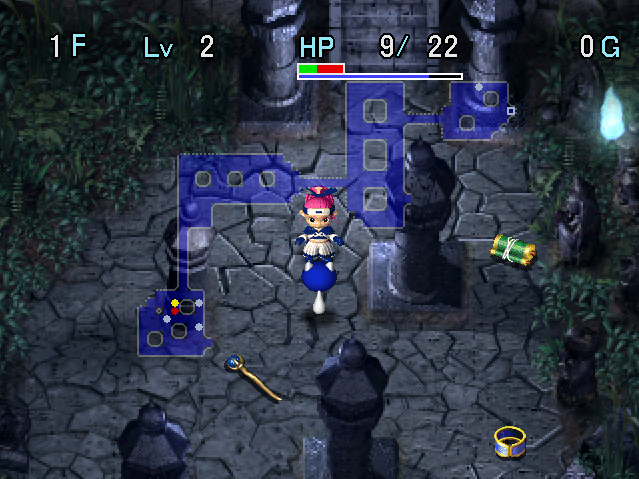

   

Dungeon where you mainly use staves and scrolls to progress - weapons and shields are only sold in shops. Allies can be brought along, so the key is to support them using staves like Fury Staff and Swift Staff.

Powerful items like Extinction Scroll and Scout Bracelet can be found on the ground. However, you can't really upgrade a shield, so the difficulty is on the high end even with such items. That said, the first clear is only 17F, so you can easily clear it by leveling and supporting an ally.

The 99F version can be cleared without allies if you obtain an Ironhead's Head + Scout Bracelet, but you'll still need to have a good understanding of the available staves and scrolls.

<ul class="quickLinksUL">
  <li><a href="#overview">Overview</a></li>
  <li><a href="#strategy">Strategy</a></li>
  <li><a href="#floor-guide">Floor Guide</a></li>
  <li><a href="#monsters">Monsters</a></li>
  <li><a href="#items">Items</a></li>
  <li><a href="#traps">Traps</a></li>
</ul>

# Overview

<table class="dungeonOverview">
  <tr>
    <th>Unlock</th>
    <td class="highlightYellow">Arrive in Yakagura Forest after clearing Tenrin Hard.</td>
  </tr>
  <tr>
    <th>Entrance</th>
    <td class="highlightYellow">Yakagura Forest (South exit)</td>
  </tr>
</table>

<table class="dungeonTable">
  <tr>
    <th>JP Name</th>
    <td colspan="3">ドラスの試練</td>
  </tr>
  <tr>
    <th>Floors</th>
    <td>17F (first) / 99F</td>
    <th>Stairs</th>
    <td>Descending</td>
  </tr>
  <tr>
    <th>Bring Items</th>
    <td>No</td>
    <th>Allies</th>
    <td>Yes</td>
  </tr>
  <tr>
    <th>Unidentified</th>
    <td colspan="3">Scrolls, Staves</td>
  </tr>
  <tr>
    <th>Shops</th>
    <td>Yes</td>
    <th>Monster Houses</th>
    <td>Regular</td>
  </tr>
  <tr>
    <th>Clear Icon</th>
    <td></td>
    <th>Reward (99F)</th>
    <td>Quarter Staff[99], Blessing Pot[10]</td>
  </tr>
</table>

# Strategy

<ul class="quickLinksUL">
  <li><a href="#general">General</a></li>
  <li><a href="#equipment-/-items">Equipment / Items</a></li>
</ul>

### General

#### Story Clear (17F)

The easiest strategy is to bring 1 ally → hunt Iron Zaloklefts on 6\~8F to level up and obtain items. Storage Pots can be purchased after 5F in Ichido Village, and most players go with either Jin or Heiji. If you haven't unlocked allies in Yakagura Forest yet, check the [FAQ](/guides/faq) page.

#### Full Version (99F)

The lack of a shield means your run can easily end if you get surrounded from mid game onward. Simply becoming adjacent to an enemy can be dangerous, let alone starting a floor inside a Monster House. You'll want to pay close attention to your ally's positioning until you have a usable weapon.

Ironhead's Head can be used alongside Scout Bracelet and Vision Bracelet to solo the dungeon, so don't give up right away if your ally collapses due to an accident - linger until the wind blows on 20-22F to see if you can obtain an Ironhead's Head first (8.2% drop rate).

#### Drain Types

It's generally good to let your ally fight monsters, but you should never let them fight Sluggy or Slime types. Sluggy lowers attack, and Slime lowers defense - both effects are permanent for the duration of this adventure. The lowered stats won't be restored even if you change floors, and Antidote Grass cannot be found in this dungeon. So, either throw an Extinction Scroll at them, or have Asuka take the hit for them.

※ Sludge inflicts Sealed status instead of lowering defense, so it's fine to let allies fight them.

#### Extinction Scroll

Good options include:

- Rancor Sluggy (24-30F)
- Grime (31-40F)
- Devil Kangaroo (41-50F, 61-70F)
- Ooze (46-55F)
- Venom Sluggy (56-70F)
- Porkon (61-75F)
- Mirage Devil (61-75F)
- Dozikon (76-90F)
- Astral Devil (76-99F)
- Archdragon (86-99F)

### Equipment / Items

#### Weapon

##### Main Weapon

<table class="dungeonTable">
  <thead>
    <tr>
      <th>Name</th>
      <th>Atk</th>
      <th>Slot</th>
      <th>Notes</th>
    </tr>
  </thead>
  <tbody>
    <tr>
      <td class="highlightGray">Ironhead's Head</td>
      <td class="centeredText">9</td>
      <td class="centeredText">7</td>
      <td>Two-handed, lets you attack enemies up to 3 tiles away. Ideally obtained from Ironheads on 20-22F (8.2% drop rate).</td>
    </tr>
  </tbody>
</table>

##### Seals

<table class="dungeonTable">
  <thead>
    <tr>
      <th>Seal</th>
      <th>Item</th>
      <th>Notes</th>
    </tr>
  </thead>
  <tbody>
    <tr>
      <td class="highlightGray">衰</td>
      <td>Sapping Branch</td>
      <td>Lowers target's attack by 25%, inflicts HP drain.</td>
    </tr>
    <tr>
      <td class="highlightGray">会</td>
      <td>Minotaur's Axe</td>
      <td>1/4 chance to land a critical hit.</td>
    </tr>
    <tr>
      <td class="highlightGray">眠</td>
      <td>Slumber Scroll</td>
      <td>12.5% chance to put target to sleep. Sleeping Sluggy or Slimes can't multiply.</td>
    </tr>
    <tr>
      <td class="highlightGray">識</td>
      <td>Identify Scroll</td>
      <td>If you want allies to be able to detect Ether Devil types.</td>
    </tr>
    <tr>
      <td class="highlightGray">飯</td>
      <td>(Any onigiri)</td>
      <td>Defeated enemies drop onigiri more often (n/32). Synthesize 2 of these to avoid starvation.</td>
    </tr>
    <tr>
      <td class="highlightGray">銀</td>
      <td>Silver Arrow</td>
      <td>Hit Astral Devil and Pumphantasm types inside walls. Requires a cursed Silver Arrow to synthesize.</td>
    </tr>
    <tr>
      <td class="highlightGray">祓</td>
      <td>Purify Scroll</td>
      <td>Weapon can't be cursed. Probably better to keep the Purify Scroll on hand.</td>
    </tr>
    <tr>
      <td class="highlightGray">幸</td>
      <td>Happy Grass</td>
      <td>Defeated enemies provide x1.1 experience points. Obtained from Pudding, but not worth taking up a slot.</td>
    </tr>
    <tr>
      <td class="highlightGray">ち</td>
      <td>Strength Seed</td>
      <td>Increases weapon base attack by 2. Obtained from Pud, but not worth taking up a slot.</td>
    </tr>
  </tbody>
</table>

#### Shield

Ironhead's Head is two-handed, so you can't equip a shield if you use that weapon. This isn't a problem, since there are only 3 types of shields sold in shops, and they're all weak.

##### Main Shield

<table class="dungeonTable">
  <thead>
    <tr>
      <th>Name</th>
      <th>Def</th>
      <th>Slot</th>
      <th>Notes</th>
    </tr>
  </thead>
  <tbody>
    <tr>
      <td class="highlightGray">Leather Shield</td>
      <td class="centeredText">2</td>
      <td class="centeredText">5</td>
      <td>Halves hunger rate. Rustproof.</td>
    </tr>
    <tr>
      <td class="highlightGray">Rubber Shield</td>
      <td class="centeredText">5</td>
      <td class="centeredText">3</td>
      <td>Makes you immune to electric damage.</td>
    </tr>
    <tr>
      <td class="highlightGray">Echo Shield</td>
      <td class="centeredText">3</td>
      <td class="centeredText">5</td>
      <td>Reflects magic.</td>
    </tr>
  </tbody>
</table>

##### Seals

<table class="dungeonTable">
  <thead>
    <tr>
      <th>Seal</th>
      <th>Item</th>
      <th>Notes</th>
    </tr>
  </thead>
  <tbody>
    <tr>
      <td class="highlightGray">眠</td>
      <td>Slumber Scroll</td>
      <td>Chance to put attacker to sleep when hit (n/16).</td>
    </tr>
    <tr>
      <td class="highlightGray">識</td>
      <td>Identify Scroll</td>
      <td>If you want allies to be able to detect Ether Devil types.</td>
    </tr>
  </tbody>
</table>

#### Bracelets

<table class="dungeonTable">
  <thead>
    <tr>
      <th>Name</th>
      <th>Notes</th>
    </tr>
  </thead>
  <tbody>
    <tr>
      <td class="highlightGray">Scout Bracelet</td>
      <td>Reveals the locations of enemies and items on the map. Plays extremely well with Ironhead's Head.</td>
    </tr>
    <tr>
      <td class="highlightGray">Decoy Bracelet</td>
      <td>Revives you if you collapse while it's equipped. Can be used to restore strength and fullness.</td>
    </tr>
    <tr>
      <td class="highlightGray">Vision Bracelet</td>
      <td>Reveals traps and Ether Devil types.</td>
    </tr>
    <tr>
      <td class="highlightGray">Protect Bracelet</td>
      <td>Can be helpful on Archdragon or Porkon floors.</td>
    </tr>
    <tr>
      <td class="highlightGray">Pierce Bracelet</td>
      <td>Throw Balance Staff to obtain items, snipe Bored Kappas, etc.</td>
    </tr>
  </tbody>
</table>

#### Scrolls

<table class="dungeonTable">
  <thead>
    <tr>
      <th>Name</th>
      <th>Notes</th>
    </tr>
  </thead>
  <tbody>
    <tr>
      <td class="highlightGray">Blank Scroll</td>
      <td>Use it as any scroll you've read in the past.</td>
    </tr>
    <tr>
      <td class="highlightGray">Copy Scroll</td>
      <td>Make a copy of valuable scrolls like Extinction or Plating.</td>
    </tr>
    <tr>
      <td class="highlightGray">Extinction Scroll</td>
      <td>Throw it at a target to prevent them from spawning.</td>
    </tr>
    <tr>
      <td class="highlightGray">Plating Scroll</td>
      <td>Ironhead's Head has high enough base attack to be worth plating. However, these are best used to repair bracelets.</td>
    </tr>
    <tr>
      <td class="highlightGray">Fixer Scroll</td>
      <td>Can be used to restore strength if current strength is &le; 1.</td>
    </tr>
    <tr>
      <td class="highlightGray">Gravity Scroll</td>
      <td>Counter Bored Kappas, collect Silver Arrows or Porky Rocks, etc. Keep some on hand for furious Porkons on 61~70F.</td>
    </tr>
    <tr>
      <td class="highlightGray">Suction Scroll</td>
      <td>Reuse Identify Pot or Synthesis Pot.</td>
    </tr>
    <tr>
      <td class="highlightGray">Identify Scroll Slumber Scroll</td>
      <td>Synthesize these into an Ironhead's Head if possible.</td>
    </tr>
  </tbody>
</table>

#### Staves

<table class="dungeonTable">
  <thead>
    <tr>
      <th>Name</th>
      <th>Notes</th>
    </tr>
  </thead>
  <tbody>
    <tr>
      <td class="highlightGray">Happy Staff</td>
      <td>Needed to create and hunt Iron Zaloklefts on 6~8F. If you're past that point, it's fine to use them on an ally.</td>
    </tr>
    <tr>
      <td class="highlightGray">Decoy Staff</td>
      <td>Keep 1 on hand at all times in case of emergencies. Use it on an ally if you run into a Thief Pelican in a hallway to safely synthesize.</td>
    </tr>
    <tr>
      <td class="highlightGray">Tunnel Staff</td>
      <td>Create shortcuts, avoid becoming separated from your ally on spring floors.</td>
    </tr>
    <tr>
      <td class="highlightGray">Balance Staff</td>
      <td>Not too important if you have a Vision Bracelet. Throw it at a line of monsters with a Pierce Bracelet equipped to obtain tiems.</td>
    </tr>
    <tr>
      <td class="highlightGray">Bomb Staff</td>
      <td>Enemies afflicted with HP drain immediately explode if their HP &lt; 1/2. Plays well with Ironhead's Head if you've synthesized 衰 (Sapping Branch).</td>
    </tr>
    <tr>
      <td class="highlightGray">Heal Staff</td>
      <td>Ally support No. 1 - Use it if you become concerned about their remaining HP.</td>
    </tr>
    <tr>
      <td class="highlightGray">Swift Staff</td>
      <td>Ally support No. 2 - Increase an ally's action speed for 10 turns.</td>
    </tr>
    <tr>
      <td class="highlightGray">Rage Staff</td>
      <td>Ally support No. 3 - Enraged status lasts for 50 turns.</td>
    </tr>
    <tr>
      <td class="highlightGray">Fury Staff</td>
      <td>Ally support No. 4 - Combination of Swift + Rage. Only found from 23F onward.</td>
    </tr>
    <tr>
      <td class="highlightGray">Invisible Staff</td>
      <td>Ally support No. 5 - Decoy Staff → Invisible Staff is an option.</td>
    </tr>
  </tbody>
</table>

#### Pots

<table class="dungeonTable">
  <thead>
    <tr>
      <th>Name</th>
      <th>Notes</th>
    </tr>
  </thead>
  <tbody>
    <tr>
      <td class="highlightGray">Synthesis Pot</td>
      <td>Mostly used with staves to free up inventory space.</td>
    </tr>
    <tr>
      <td class="highlightGray">Heal Pot</td>
      <td>Fixer Scroll or Decoy Bracelet can do the same thing while taking up less space.</td>
    </tr>
    <tr>
      <td class="highlightGray">Storage Pot</td>
      <td>Uncommon compared to other pots, so stock up in Ichido Village.</td>
    </tr>
  </tbody>
</table>

# Floor Guide

### 1-5F

Check every room and pick up all items - you shouldn't have problems if you bring an ally. Identify staves by using them on an ally or monster from at least 1 tile away in case it's a Lightning Staff. If you find a Happy Staff, save it for creating an Iron Zalokleft instead of creating a Cave Mamel.

Don't let Sluggy (4-5F) lick allies - Antidote Grass can't be found, so strength loss for allies is permanent. Asuka can recover strength using Decoy Bracelet or Fixer Scroll, so have her take the hit instead.

The ideal start if aiming for 99F is to find a Happy Staff, Sapping Branch (shop-exclusive), and enough items to sell to be able to buy items at the Ichido Village item shop.

### Ichido Village

Sell unneeded items and buy 5\~10 Storage Pots. If you're only aiming for the story clear, go ahead and buy lots of Navigation Scrolls.

##### Fixer Scroll Tip (Dreamcast)

If you read a Fixer Scroll inside the storage building when you have 0 Gitan, you'll gain 10,000 Gitan. ※ PC version reduced it to 1,000 Gitan to prevent being able to shop infinitely.

#### Gambler

Pay 100 Gitan per play.

#### Item Shop

|Item|Price|
|-|-|
|Identify Scroll|500|
|Navigation Scroll|500|
|Blaze Scroll|1200|
|Fixer Scroll|1500|
|Swap Staff[5]|1000|
|Knockback Staff[5]|625|
|Transient Staff[5]|1500|
|Seal Staff[5]|2500|
|Huge Onigiri|300|
|Storage Pot[4]|1440|

### 6-11F

Zalokleft (6-8F) appears, so create an Iron Zalokleft for your ally to fight if you found a Happy Staff. Zaloklefts can't steal from allies, so step out of the room and let your ally handle the situation. The ideal result here in terms of item drops is at least 1 Scout Bracelet and 1 Vision Bracelet. ※ Don't worry if you weren't able to find a Happy Staff for this - the dungeon can still be cleared.

Combine staves using Thief Pelicans (7-10F) to free up inventory space, but beware of Crow Tengus on 7F. If you have lots of food, consider hunting Pud (9-10F) until the wind blows for Strength Seeds.

### Shimei Beach

The only facility here is a storage building where you can deposit items.

### 12-17F

Pumphantasm (11-13F) and Muron (14-16F) can cause you to become separated from your ally. Try to avoid having Mutaikon (12-14F) throw Poison Grass at allies - Heiji is fine, since he'll throw it back.

Robber Pelican (14-16F) overlaps with Falcon Tengu (15-16F), so check if it's real before synthesizing. Pop Tank (15-16F) and Horse Samurai (17-19F) can hit both you and your ally from a distance.

### Boss

Fight against Nemuri and her enamored monster followers. The fight begins with 9 other monsters on the field, including Dazikon, Horse Samurai, and Yenron.

|Name|HP|Atk|Def|Exp|Notes|
|-|-|-|-|-|-|
|Nemuri|80|30|15|3000|・Doesn't move, but warps and summons 1 monster when hit. ・Fires a long ranged 30 damage piercing laser when lined up. ・Reflects magic, and is immune to status conditions.|

Nemuri only has 80 HP, but always fires a laser that deals 30 damage when you're lined up with her. She reflects staff magic, which can be used to your advantage to buff Asuka if desired.

An ally supported by staves like Swift, Rage, Heal, and Invisible can make quick work of enemies. If you're alone, use Lightning Staff, Lightning Scroll, and Rockfall Scroll to reduce the number of monsters.

Nemuri won't move unless she receives damage, so once you two are alone on the field, you can step in place to safely recover HP as much as you want between attacks as long as you avoid lining up with her. However, she can summon Tiny Phoenix, so expect her HP to be fully restored if that happens.

### 18-23F

Ironhead appears between 20-22F, so linger until the wind blows in search of an Ironhead's Head. Monster Staff, Mon House Scroll, and Monster Trap can be used to generate additional Ironheads. (Swinging a Happy Staff → Unlucky Staff is said to add an extra drop chance)

### 24-30F

Rancor Sluggy (24-30F) can multiply when hit, so either throw an Extinction Scroll or use Seal Staff. If you haven't found an Ironhead's Head yet, use Unlucky Staff on Chainhead (24-30F, 35-40F).

### 31-40F

Grime (31-40F) sharply lowers ally defense, so avoid having your ally fight them. Unequip items if they're not plated and have Asuka fight instead, or throw an Extinction Scroll.

### 41-55F

Devil Kangaroo (41-50F) isn't as common here compared to Kron Trial or Bufu Trial, so you can usually get by without having to throw an Extinction Scroll if you rush stairs.

Ooze (46-55F) reduces ally defense to 0 and can multiply when hit - consider throwing an Extinction Scroll.

Vexing Kappa (51-65F) can throw Extinction Scrolls found on the ground to one-shot you, so it's best to equip a Decoy Bracelet before stepping into rooms.

### 56-75F

Venom Sluggy (56-70F) is dangerous for both you and your ally, similar to Rancor Sluggy. 
Tiger Chucker (56-65F, 81-90F) can separate you from your ally, so don't be stingy with Seal Staff. Devil Kangaroo (61-70F) returns, but has a low spawn rate like before.

Porkon (61-75F) deals massive damage thanks to the lack of a shield, so throw an Extinction Scroll. Invisible Mirage Devils (61-75F) hit hard and have tricky movement, so keep a Vision Bracelet equipped. They reflect staff magic, so use items like Fear Scroll (also affects allies) or Sanctuary Scroll instead.

### 76-99F

Dozikon (76-90F), Astral Devil (76-99F), and Archdragon (86-99F) are major threats. Recommended to throw an Extinction Scroll at Archdragon, or Astral Devil if you're out of Vision Bracelets.

# Monsters

Enemy Colors: Farming Useful Destroys Items Dangerous Very Dangerous

<table class="monsterTable">
  <thead>
    <tr>
      <th>F</th>
      <th colspan="7">Monsters</th>
    </tr>
  </thead>
  <tbody>
    <tr>
      <th>1</th>
      <td>Mamel</td>
      <td>Pit Mamel</td>
      <td>Chintala</td>
      <td class="highlightGray"></td>
      <td class="highlightGray"></td>
      <td class="highlightGray"></td>
      <td class="highlightGray"></td>
    </tr>
    <tr>
      <th>2</th>
      <td>Mamel</td>
      <td>Pit Mamel</td>
      <td>Chintala</td>
      <td>Lady Locks</td>
      <td class="highlightGray"></td>
      <td class="highlightGray"></td>
      <td class="highlightGray"></td>
    </tr>
    <tr>
      <th>3</th>
      <td>Nigiri Novice</td>
      <td>Pit Mamel</td>
      <td>Chintala</td>
      <td>Lady Locks</td>
      <td>Tug Frog</td>
      <td class="highlightGray"></td>
      <td class="highlightGray"></td>
    </tr>
    <tr>
      <th>4</th>
      <td>Nigiri Novice</td>
      <td>Sluggy</td>
      <td class="highlightGray"></td>
      <td>Lady Locks</td>
      <td>Tug Frog</td>
      <td class="highlightGray"></td>
      <td class="highlightGray"></td>
    </tr>
    <tr>
      <th>5</th>
      <td>Nigiri Novice</td>
      <td>Sluggy</td>
      <td>Froggo</td>
      <td>Bow Boy</td>
      <td>Tug Frog</td>
      <td>Crow Tengu</td>
      <td class="highlightGray"></td>
    </tr>
    <tr>
      <td colspan="8" class="monsterTableVillage">Ichido Village</td>
    </tr>
    <tr>
      <th>6</th>
      <td>Gazer</td>
      <td>Zalokleft</td>
      <td>Froggo</td>
      <td>Bow Boy</td>
      <td class="highlightGray"></td>
      <td>Crow Tengu</td>
      <td class="highlightGray"></td>
    </tr>
    <tr>
      <th>7</th>
      <td>Gazer Thief Pelican</td>
      <td>Zalokleft</td>
      <td>N'dubba</td>
      <td>Bow Boy</td>
      <td>Laugh Polygon</td>
      <td>Crow Tengu</td>
      <td>Mid Chintala</td>
    </tr>
    <tr>
      <th>8</th>
      <td>Gazer Thief Pelican</td>
      <td>Zalokleft</td>
      <td>N'dubba</td>
      <td>Nigiri Morph</td>
      <td>Laugh Polygon</td>
      <td class="highlightGray"></td>
      <td>Mid Chintala</td>
    </tr>
    <tr>
      <th>9</th>
      <td>Boy Cart Thief Pelican</td>
      <td>Spearfish</td>
      <td>N'dubba Jagan Mask</td>
      <td>Nigiri Morph Pud</td>
      <td>Laugh Polygon Shadow Hat</td>
      <td>Rocket Boar</td>
      <td>Mid Chintala Bored Kappa</td>
    </tr>
    <tr>
      <th>10</th>
      <td>Boy Cart Thief Pelican</td>
      <td>Twisty Hani Spearfish</td>
      <td>N'dubba Jagan Mask</td>
      <td>Nigiri Morph Pud</td>
      <td>Demon Warrior Shadow Hat</td>
      <td>Rocket Boar Tiger Tosser</td>
      <td>Bored Kappa</td>
    </tr>
    <tr>
      <th>11</th>
      <td>Pumphantasm</td>
      <td>Twisty Hani</td>
      <td>Lovely Locks Jagan Mask</td>
      <td>Horse Ronin</td>
      <td>Demon Warrior</td>
      <td>Rocket Boar Tiger Tosser</td>
      <td class="highlightGray"></td>
    </tr>
    <tr>
      <td colspan="8" class="monsterTableVillage">Shimei Beach</td>
    </tr>
    <tr>
      <th>12</th>
      <td>Pumphantasm Spike Dragon</td>
      <td>Twisty Hani</td>
      <td>Lovely Locks</td>
      <td>Horse Ronin</td>
      <td>Demon Warrior</td>
      <td>Pull Frog Tiger Tosser</td>
      <td>Mutaikon</td>
    </tr>
    <tr>
      <th>13</th>
      <td>Pumphantasm Spike Dragon</td>
      <td>Curse Girl</td>
      <td>Lovely Locks</td>
      <td>Kappa Pest</td>
      <td>Lt. Spearfish</td>
      <td>Pull Frog</td>
      <td>Mutaikon</td>
    </tr>
    <tr>
      <th>14</th>
      <td>Muron Spike Dragon</td>
      <td>Curse Girl Robber Pelican</td>
      <td>Pudding</td>
      <td>Kappa Pest</td>
      <td>Lt. Spearfish</td>
      <td>Pull Frog</td>
      <td>Mutaikon</td>
    </tr>
    <tr>
      <th>15</th>
      <td>Muron</td>
      <td>Curse Girl Robber Pelican</td>
      <td>Pudding</td>
      <td>Kappa Pest</td>
      <td>Schubell</td>
      <td>Pop Tank</td>
      <td>Falcon Tengu</td>
    </tr>
    <tr>
      <th>16</th>
      <td>Muron</td>
      <td>Robber Pelican</td>
      <td>Pudding</td>
      <td class="highlightGray"></td>
      <td>Schubell</td>
      <td>Pop Tank</td>
      <td>Falcon Tengu</td>
    </tr>
    <tr>
      <th>17</th>
      <td>Dazikon Goldie Locks</td>
      <td>Kigny Black Hat</td>
      <td>Hannya Warrior</td>
      <td>Floor Dragon</td>
      <td>Horse Samurai</td>
      <td>King Tusker</td>
      <td>Shagga</td>
    </tr>
    <tr>
      <td colspan="8" class="highlightYellow">Boss</td>
    </tr>
    <tr>
      <th>18</th>
      <td>Dazikon Goldie Locks</td>
      <td>Kigny Black Hat</td>
      <td>Hannya Warrior</td>
      <td>Floor Dragon</td>
      <td>Horse Samurai</td>
      <td>King Tusker</td>
      <td>Shagga</td>
    </tr>
    <tr>
      <th>19</th>
      <td>Dazikon Goldie Locks</td>
      <td>Kigny Bat Kangaroo</td>
      <td>Hannya Warrior Tiny Phoenix</td>
      <td>Floor Dragon</td>
      <td>Horse Samurai</td>
      <td>King Tusker</td>
      <td>Ether Devil</td>
    </tr>
    <tr>
      <th>20</th>
      <td>Menbell Yenron</td>
      <td>Taur Bat Kangaroo</td>
      <td>Hannya Warrior Tiny Phoenix</td>
      <td>Dragon Ironhead</td>
      <td>Nigiri Boss Bone Dragon</td>
      <td>Bomb</td>
      <td>Ether Devil</td>
    </tr>
    <tr>
      <th>21</th>
      <td>Menbell Yenron</td>
      <td>Taur Bat Kangaroo</td>
      <td>Capt. Spearfish Tiny Phoenix</td>
      <td>Dragon Ironhead</td>
      <td>Nigiri Boss Bone Dragon</td>
      <td>Bomb</td>
      <td>Ether Devil</td>
    </tr>
    <tr>
      <th>22</th>
      <td>Menbell Yenron</td>
      <td>Taur Bat Kangaroo</td>
      <td>Capt. Spearfish Tiny Phoenix</td>
      <td>Dragon Ironhead</td>
      <td>Nigiri Boss Bone Dragon</td>
      <td>Bomb</td>
      <td>Ether Devil</td>
    </tr>
    <tr>
      <th>23</th>
      <td>Jet Boar Yenron</td>
      <td>Horse Shogun Iai</td>
      <td>Capt. Spearfish Dragon Head</td>
      <td>Bandit Pelican Dance Polygon</td>
      <td>Yank Frog Super Gazer</td>
      <td>Pumphantom</td>
      <td>Lime Zalokleft</td>
    </tr>
    <tr>
      <th>24</th>
      <td>Jet Boar Chainhead</td>
      <td>Horse Shogun Iai</td>
      <td>Capt. Spearfish Dragon Head</td>
      <td>Bandit Pelican Dance Polygon</td>
      <td>Rancor Sluggy Super Gazer</td>
      <td>Pumphantom</td>
      <td>Lime Zalokleft</td>
    </tr>
    <tr>
      <th>25</th>
      <td>Cranky Tank Chainhead</td>
      <td>Horse Shogun Nashagga</td>
      <td>Dragon Head</td>
      <td>Monarch Tusker Dance Polygon</td>
      <td>Rancor Sluggy Super Gazer</td>
      <td>Sky Dragon</td>
      <td>Minotaur</td>
    </tr>
    <tr>
      <th>26</th>
      <td>Cranky Tank Chainhead</td>
      <td>Evil Kangaroo Nashagga</td>
      <td>Porko Curse Sister</td>
      <td>Monarch Tusker Big Chintala</td>
      <td>Rancor Sluggy</td>
      <td>Sky Dragon</td>
      <td>Minotaur</td>
    </tr>
    <tr>
      <th>27</th>
      <td>Cranky Tank Chainhead</td>
      <td>Evil Kangaroo Nashagga</td>
      <td>Porko Curse Sister</td>
      <td>Monarch Tusker Big Chintala</td>
      <td>Rancor Sluggy</td>
      <td>Sky Dragon</td>
      <td>Minotaur</td>
    </tr>
    <tr>
      <th>28</th>
      <td>Cranky Tank Chainhead</td>
      <td>Evil Kangaroo Nashagga</td>
      <td>Porko Curse Sister</td>
      <td>Monarch Tusker Big Chintala</td>
      <td>Rancor Sluggy</td>
      <td>Sky Dragon</td>
      <td>Minotaur</td>
    </tr>
    <tr>
      <th>29</th>
      <td>Cranky Tank Chainhead</td>
      <td>Evil Kangaroo Nashagga</td>
      <td>Porko Curse Sister</td>
      <td>Monarch Tusker Big Chintala</td>
      <td>Rancor Sluggy</td>
      <td>Sky Dragon</td>
      <td>Minotaur</td>
    </tr>
    <tr>
      <th>30</th>
      <td>Cranky Tank Chainhead</td>
      <td>Evil Kangaroo Nashagga</td>
      <td>Porko Curse Sister</td>
      <td>Monarch Tusker Big Chintala</td>
      <td>Rancor Sluggy</td>
      <td>Sky Dragon</td>
      <td>Minotaur</td>
    </tr>
    <tr>
      <th>31</th>
      <td>Cranky Tank Earth Needle</td>
      <td>Phantom Devil</td>
      <td>Skull Dragon Curse Sister</td>
      <td>Tunnel Dragon Grime</td>
      <td>Tiger Hurler Shogun</td>
      <td>Sky Dragon</td>
      <td>Minotaur</td>
    </tr>
    <tr>
      <th>32</th>
      <td>Cranky Tank Earth Needle</td>
      <td>Phantom Devil</td>
      <td>Skull Dragon Curse Sister</td>
      <td>Tunnel Dragon Grime</td>
      <td>Tiger Hurler Shogun</td>
      <td>Sky Dragon</td>
      <td>Minotaur</td>
    </tr>
    <tr>
      <th>33</th>
      <td>Cranky Tank Earth Needle</td>
      <td>Phantom Devil</td>
      <td>Skull Dragon Curse Sister</td>
      <td>Tunnel Dragon Grime</td>
      <td>Tiger Hurler Shogun</td>
      <td>Sky Dragon</td>
      <td>Minotaur</td>
    </tr>
    <tr>
      <th>34</th>
      <td>Cranky Tank Earth Needle</td>
      <td>Phantom Devil</td>
      <td>Skull Dragon Curse Sister</td>
      <td>Tunnel Dragon Grime</td>
      <td>Tiger Hurler Shogun</td>
      <td>Sky Dragon</td>
      <td>Minotaur</td>
    </tr>
    <tr>
      <th>35</th>
      <td>Cranky Tank Earth Needle</td>
      <td>Phantom Devil</td>
      <td>Skull Dragon Chainhead</td>
      <td>Tunnel Dragon Grime</td>
      <td>Tiger Hurler Shogun</td>
      <td>Sky Dragon</td>
      <td>Minotaur</td>
    </tr>
    <tr>
      <th>36</th>
      <td>Froggon Earth Needle</td>
      <td>Elec Bomb Phantom Devil</td>
      <td>Skull Dragon Chainhead</td>
      <td>Tunnel Dragon Grime</td>
      <td>Tiger Hurler Shogun</td>
      <td>Captain Ant</td>
      <td class="highlightGray"></td>
    </tr>
    <tr>
      <th>37</th>
      <td>Froggon Earth Needle</td>
      <td>Elec Bomb Phantom Devil</td>
      <td>Skull Dragon Chainhead</td>
      <td>Tunnel Dragon Grime</td>
      <td>Tiger Hurler Shogun</td>
      <td>Captain Ant</td>
      <td class="highlightGray"></td>
    </tr>
    <tr>
      <th>38</th>
      <td>Froggon Earth Needle</td>
      <td>Elec Bomb Phantom Devil</td>
      <td>Skull Dragon Chainhead</td>
      <td>Tunnel Dragon Grime</td>
      <td>Tiger Hurler Shogun</td>
      <td>Captain Ant</td>
      <td class="highlightGray"></td>
    </tr>
    <tr>
      <th>39</th>
      <td>Froggon Earth Needle</td>
      <td>Elec Bomb Phantom Devil</td>
      <td>Skull Dragon Chainhead</td>
      <td>Tunnel Dragon Grime</td>
      <td>Tiger Hurler Shogun</td>
      <td>Captain Ant</td>
      <td class="highlightGray"></td>
    </tr>
    <tr>
      <th>40</th>
      <td>Froggon Earth Needle</td>
      <td>Elec Bomb Phantom Devil</td>
      <td>Skull Dragon Chainhead</td>
      <td>Tunnel Dragon Grime</td>
      <td>Tiger Hurler Shogun</td>
      <td>Captain Ant</td>
      <td class="highlightGray"></td>
    </tr>
    <tr>
      <th>41</th>
      <td>Iron Zalokleft Earth Needle</td>
      <td>Elec Bomb Phantom Devil</td>
      <td>Skull Dragon Nigiri Master</td>
      <td>Tunnel Dragon Adm. Spearfish</td>
      <td>Tiger Hurler</td>
      <td>Cave Mamel</td>
      <td>Devil Kangaroo</td>
    </tr>
    <tr>
      <th>42</th>
      <td>Iron Zalokleft Earth Needle</td>
      <td>Elec Bomb Phantom Devil</td>
      <td>Skull Dragon Nigiri Master</td>
      <td>Tunnel Dragon Adm. Spearfish</td>
      <td>Tiger Hurler</td>
      <td>Cave Mamel</td>
      <td>Devil Kangaroo</td>
    </tr>
    <tr>
      <th>43</th>
      <td>Iron Zalokleft Earth Needle</td>
      <td>Elec Bomb Phantom Devil</td>
      <td>Skull Dragon Nigiri Master</td>
      <td>Tunnel Dragon Adm. Spearfish</td>
      <td>Tiger Hurler</td>
      <td>Cave Mamel</td>
      <td>Devil Kangaroo</td>
    </tr>
    <tr>
      <th>44</th>
      <td>Iron Zalokleft Earth Needle</td>
      <td>Elec Bomb Phantom Devil</td>
      <td>Skull Dragon Nigiri Master</td>
      <td>Tunnel Dragon Adm. Spearfish</td>
      <td>Tiger Hurler</td>
      <td>Cave Mamel</td>
      <td>Devil Kangaroo</td>
    </tr>
    <tr>
      <th>45</th>
      <td>Iron Zalokleft Earth Needle</td>
      <td>Elec Bomb Phantom Devil</td>
      <td>Skull Dragon Nigiri Master</td>
      <td>Tunnel Dragon Adm. Spearfish</td>
      <td>Tiger Hurler</td>
      <td>Cave Mamel</td>
      <td>Devil Kangaroo</td>
    </tr>
    <tr>
      <th>46</th>
      <td>Froggon Earth Needle</td>
      <td>Jagar King Phantom Devil</td>
      <td>Ooze Nigiri Master</td>
      <td>Raider Pelican Adm. Spearfish</td>
      <td>Shogun</td>
      <td>Cave Mamel</td>
      <td>Devil Kangaroo</td>
    </tr>
    <tr>
      <th>47</th>
      <td>Froggon Earth Needle</td>
      <td>Jagar King Phantom Devil</td>
      <td>Ooze Nigiri Master</td>
      <td>Raider Pelican Adm. Spearfish</td>
      <td>Shogun</td>
      <td>Cave Mamel</td>
      <td>Devil Kangaroo</td>
    </tr>
    <tr>
      <th>48</th>
      <td>Froggon Earth Needle</td>
      <td>Jagar King Phantom Devil</td>
      <td>Ooze Nigiri Master</td>
      <td>Raider Pelican Adm. Spearfish</td>
      <td>Shogun</td>
      <td>Cave Mamel</td>
      <td>Devil Kangaroo</td>
    </tr>
    <tr>
      <th>49</th>
      <td>Froggon Earth Needle</td>
      <td>Jagar King Phantom Devil</td>
      <td>Ooze Nigiri Master</td>
      <td>Raider Pelican Adm. Spearfish</td>
      <td>Eagle Tengu Shogun</td>
      <td>Cave Mamel</td>
      <td>Devil Kangaroo</td>
    </tr>
    <tr>
      <th>50</th>
      <td>Froggon Earth Needle</td>
      <td>Jagar King Phantom Devil</td>
      <td>Ooze Nigiri Master</td>
      <td>Raider Pelican Adm. Spearfish</td>
      <td>Eagle Tengu Shogun</td>
      <td>Cave Mamel</td>
      <td>Devil Kangaroo</td>
    </tr>
    <tr>
      <th>51</th>
      <td>Iron Zalokleft Curse Mom</td>
      <td>Jagar King Vexing Kappa</td>
      <td>Ooze Nigiri Master</td>
      <td>Raider Pelican Dark Hat</td>
      <td>Eagle Tengu Shogun</td>
      <td>Sky Dragon</td>
      <td class="highlightGray"></td>
    </tr>
    <tr>
      <th>52</th>
      <td>Iron Zalokleft Curse Mom</td>
      <td>Jagar King Vexing Kappa</td>
      <td>Ooze Nigiri Master</td>
      <td>Raider Pelican Dark Hat</td>
      <td>Eagle Tengu Shogun</td>
      <td>Sky Dragon</td>
      <td class="highlightGray"></td>
    </tr>
    <tr>
      <th>53</th>
      <td>Iron Zalokleft Curse Mom</td>
      <td>Jagar King Vexing Kappa</td>
      <td>Ooze Nigiri Master</td>
      <td>Raider Pelican Dark Hat</td>
      <td>Eagle Tengu Shogun</td>
      <td>Sky Dragon</td>
      <td class="highlightGray"></td>
    </tr>
    <tr>
      <th>54</th>
      <td>Iron Zalokleft Curse Mom</td>
      <td>Jagar King Vexing Kappa</td>
      <td>Ooze Nigiri Master</td>
      <td>Raider Pelican Dark Hat</td>
      <td>Eagle Tengu Shogun</td>
      <td>Sky Dragon</td>
      <td class="highlightGray"></td>
    </tr>
    <tr>
      <th>55</th>
      <td>Iron Zalokleft Curse Mom</td>
      <td>Jagar King Vexing Kappa</td>
      <td>Ooze Nigiri Master</td>
      <td>Raider Pelican Dark Hat</td>
      <td>Eagle Tengu Shogun</td>
      <td>Sky Dragon</td>
      <td class="highlightGray"></td>
    </tr>
    <tr>
      <th>56</th>
      <td>Custard Curse Mom</td>
      <td>Tiger Chucker Vexing Kappa</td>
      <td>General Ant Nigiri Master</td>
      <td>Venom Sluggy Dark Hat</td>
      <td>Eagle Tengu</td>
      <td>Sky Dragon</td>
      <td class="highlightGray"></td>
    </tr>
    <tr>
      <th>57</th>
      <td>Custard Curse Mom</td>
      <td>Tiger Chucker Vexing Kappa</td>
      <td>General Ant Nigiri Master</td>
      <td>Venom Sluggy Dark Hat</td>
      <td>Eagle Tengu</td>
      <td>Sky Dragon</td>
      <td class="highlightGray"></td>
    </tr>
    <tr>
      <th>58</th>
      <td>Custard Curse Mom</td>
      <td>Tiger Chucker Vexing Kappa</td>
      <td>General Ant Nigiri Master</td>
      <td>Venom Sluggy Dark Hat</td>
      <td>Eagle Tengu</td>
      <td>Sky Dragon</td>
      <td class="highlightGray"></td>
    </tr>
    <tr>
      <th>59</th>
      <td>Custard Curse Mom</td>
      <td>Tiger Chucker Vexing Kappa</td>
      <td>General Ant Nigiri Master</td>
      <td>Venom Sluggy Dark Hat</td>
      <td>Eagle Tengu</td>
      <td>Sky Dragon</td>
      <td class="highlightGray"></td>
    </tr>
    <tr>
      <th>60</th>
      <td>Custard Curse Mom</td>
      <td>Tiger Chucker Vexing Kappa</td>
      <td>General Ant Nigiri Master</td>
      <td>Venom Sluggy Dark Hat</td>
      <td>Eagle Tengu</td>
      <td>Sky Dragon</td>
      <td class="highlightGray"></td>
    </tr>
    <tr>
      <th>61</th>
      <td>Custard Curse Mom</td>
      <td>Tiger Chucker Vexing Kappa</td>
      <td>Mirage Devil Fire Bomb</td>
      <td>Venom Sluggy Dark Hat</td>
      <td>Eagle Tengu Porkon</td>
      <td>Sonic Boar</td>
      <td>Devil Kangaroo</td>
    </tr>
    <tr>
      <th>62</th>
      <td>Custard Curse Mom</td>
      <td>Tiger Chucker Vexing Kappa</td>
      <td>Mirage Devil Fire Bomb</td>
      <td>Venom Sluggy Dark Hat</td>
      <td>Eagle Tengu Porkon</td>
      <td>Sonic Boar</td>
      <td>Devil Kangaroo</td>
    </tr>
    <tr>
      <th>63</th>
      <td>Custard Curse Mom</td>
      <td>Tiger Chucker Vexing Kappa</td>
      <td>Mirage Devil Fire Bomb</td>
      <td>Venom Sluggy Dark Hat</td>
      <td>Eagle Tengu Porkon</td>
      <td>Sonic Boar</td>
      <td>Devil Kangaroo</td>
    </tr>
    <tr>
      <th>64</th>
      <td>Custard Curse Mom</td>
      <td>Tiger Chucker Vexing Kappa</td>
      <td>Mirage Devil Fire Bomb</td>
      <td>Venom Sluggy Dark Hat</td>
      <td>Eagle Tengu Porkon</td>
      <td>Sonic Boar</td>
      <td>Devil Kangaroo</td>
    </tr>
    <tr>
      <th>65</th>
      <td>Custard Curse Mom</td>
      <td>Tiger Chucker Vexing Kappa</td>
      <td>Mirage Devil Fire Bomb</td>
      <td>Venom Sluggy Dark Hat</td>
      <td>Eagle Tengu Porkon</td>
      <td>Sonic Boar Hyper Gazer</td>
      <td>Devil Kangaroo</td>
    </tr>
    <tr>
      <th>66</th>
      <td>Custard Curse Mom</td>
      <td>General Ant Thunder Lance</td>
      <td>Mirage Devil Fire Bomb</td>
      <td>Venom Sluggy Sludge</td>
      <td>Eagle Tengu Porkon</td>
      <td>Sonic Boar Hyper Gazer</td>
      <td>Devil Kangaroo</td>
    </tr>
    <tr>
      <th>67</th>
      <td>Custard Curse Mom</td>
      <td>General Ant Thunder Lance</td>
      <td>Mirage Devil Fire Bomb</td>
      <td>Venom Sluggy Sludge</td>
      <td>Eagle Tengu Porkon</td>
      <td>Sonic Boar Hyper Gazer</td>
      <td>Devil Kangaroo</td>
    </tr>
    <tr>
      <th>68</th>
      <td>Custard Curse Mom</td>
      <td>General Ant Thunder Lance</td>
      <td>Mirage Devil Fire Bomb</td>
      <td>Venom Sluggy Sludge</td>
      <td>Eagle Tengu Porkon</td>
      <td>Sonic Boar Hyper Gazer</td>
      <td>Devil Kangaroo</td>
    </tr>
    <tr>
      <th>69</th>
      <td>Custard Curse Mom</td>
      <td>General Ant Thunder Lance</td>
      <td>Mirage Devil Fire Bomb</td>
      <td>Venom Sluggy Sludge</td>
      <td>Eagle Tengu Porkon</td>
      <td>Sonic Boar Hyper Gazer</td>
      <td>Devil Kangaroo</td>
    </tr>
    <tr>
      <th>70</th>
      <td>Custard Curse Mom</td>
      <td>General Ant Thunder Lance</td>
      <td>Mirage Devil Fire Bomb</td>
      <td>Venom Sluggy Sludge</td>
      <td>Eagle Tengu Porkon</td>
      <td>Sonic Boar Hyper Gazer</td>
      <td>Devil Kangaroo</td>
    </tr>
    <tr>
      <th>71</th>
      <td>Emperor Tusker Pumpanshee</td>
      <td>Thunder Lance</td>
      <td>Mirage Devil</td>
      <td>Goldie Locks Sludge</td>
      <td>Sing Polygon Porkon</td>
      <td>Sonic Boar Hyper Gazer</td>
      <td>Shihan</td>
    </tr>
    <tr>
      <th>72</th>
      <td>Emperor Tusker Pumpanshee</td>
      <td>Thunder Lance</td>
      <td>Mirage Devil</td>
      <td>Goldie Locks Sludge</td>
      <td>Sing Polygon Porkon</td>
      <td>Sonic Boar Hyper Gazer</td>
      <td>Shihan</td>
    </tr>
    <tr>
      <th>73</th>
      <td>Emperor Tusker Pumpanshee</td>
      <td>Thunder Lance</td>
      <td>Mirage Devil</td>
      <td>Goldie Locks Sludge</td>
      <td>Sing Polygon Porkon</td>
      <td>Sonic Boar Hyper Gazer</td>
      <td>Shihan</td>
    </tr>
    <tr>
      <th>74</th>
      <td>Emperor Tusker Pumpanshee</td>
      <td>Thunder Lance</td>
      <td>Mirage Devil</td>
      <td>Goldie Locks Sludge</td>
      <td>Sing Polygon Porkon</td>
      <td>Sonic Boar Hyper Gazer</td>
      <td>Shihan</td>
    </tr>
    <tr>
      <th>75</th>
      <td>Emperor Tusker Pumpanshee</td>
      <td>Thunder Lance</td>
      <td>Mirage Devil</td>
      <td>Goldie Locks Sludge</td>
      <td>Sing Polygon Porkon</td>
      <td>Sonic Boar Hyper Gazer</td>
      <td>Shihan</td>
    </tr>
    <tr>
      <th>76</th>
      <td>Emperor Tusker Pumpanshee</td>
      <td>Astral Devil Thunder Lance</td>
      <td>Bellthoven Megataur</td>
      <td>Raider Pelican Sludge</td>
      <td>Sing Polygon</td>
      <td>Dozikon</td>
      <td>Shihan</td>
    </tr>
    <tr>
      <th>77</th>
      <td>Emperor Tusker Pumpanshee</td>
      <td>Astral Devil Thunder Lance</td>
      <td>Bellthoven Megataur</td>
      <td>Raider Pelican Sludge</td>
      <td>Sing Polygon</td>
      <td>Dozikon</td>
      <td>Shihan</td>
    </tr>
    <tr>
      <th>78</th>
      <td>Emperor Tusker Pumpanshee</td>
      <td>Astral Devil Thunder Lance</td>
      <td>Bellthoven Megataur</td>
      <td>Raider Pelican Sludge</td>
      <td>Sing Polygon</td>
      <td>Dozikon</td>
      <td>Shihan</td>
    </tr>
    <tr>
      <th>79</th>
      <td>Emperor Tusker Pumpanshee</td>
      <td>Astral Devil Thunder Lance</td>
      <td>Bellthoven Megataur</td>
      <td>Raider Pelican Sludge</td>
      <td>Sing Polygon</td>
      <td>Dozikon</td>
      <td>Shihan</td>
    </tr>
    <tr>
      <th>80</th>
      <td>Emperor Tusker Pumpanshee</td>
      <td>Astral Devil Thunder Lance</td>
      <td>Bellthoven Megataur</td>
      <td>Raider Pelican Sludge</td>
      <td>Sing Polygon</td>
      <td>Dozikon</td>
      <td>Shihan</td>
    </tr>
    <tr>
      <th>81</th>
      <td>Emperor Tusker Pumpanshee</td>
      <td>Astral Devil Gigahead</td>
      <td>Bellthoven Megataur</td>
      <td>Raider Pelican Shenron</td>
      <td>Garm Dragon Tiger Chucker</td>
      <td>Dozikon</td>
      <td>Shihan</td>
    </tr>
    <tr>
      <th>82</th>
      <td>Emperor Tusker Pumpanshee</td>
      <td>Astral Devil Gigahead</td>
      <td>Bellthoven Megataur</td>
      <td>Raider Pelican Shenron</td>
      <td>Garm Dragon Tiger Chucker</td>
      <td>Dozikon</td>
      <td>Shihan</td>
    </tr>
    <tr>
      <th>83</th>
      <td>Emperor Tusker Pumpanshee</td>
      <td>Astral Devil Gigahead</td>
      <td>Bellthoven Megataur</td>
      <td>Raider Pelican Shenron</td>
      <td>Garm Dragon Tiger Chucker</td>
      <td>Dozikon</td>
      <td>Shihan</td>
    </tr>
    <tr>
      <th>84</th>
      <td>Emperor Tusker Pumpanshee</td>
      <td>Astral Devil Gigahead</td>
      <td>Bellthoven Megataur</td>
      <td>Raider Pelican Shenron</td>
      <td>Garm Dragon Tiger Chucker</td>
      <td>Dozikon</td>
      <td>Shihan</td>
    </tr>
    <tr>
      <th>85</th>
      <td>Emperor Tusker Pumpanshee</td>
      <td>Astral Devil Gigahead</td>
      <td>Lashagga Megataur</td>
      <td>Raider Pelican Shenron</td>
      <td>Garm Dragon Tiger Chucker</td>
      <td>Dozikon</td>
      <td>Shihan</td>
    </tr>
    <tr>
      <th>86</th>
      <td>Archdragon Horse Emperor</td>
      <td>Astral Devil Gigahead</td>
      <td>Lashagga Megataur</td>
      <td>Hyper Gazer Shenron</td>
      <td>Garm Dragon Tiger Chucker</td>
      <td>Dozikon</td>
      <td>Eagle Tengu</td>
    </tr>
    <tr>
      <th>87</th>
      <td>Archdragon Horse Emperor</td>
      <td>Astral Devil Gigahead</td>
      <td>Lashagga Megataur</td>
      <td>Hyper Gazer Shenron</td>
      <td>Garm Dragon Tiger Chucker</td>
      <td>Dozikon</td>
      <td>Eagle Tengu</td>
    </tr>
    <tr>
      <th>88</th>
      <td>Archdragon Horse Emperor</td>
      <td>Astral Devil Gigahead</td>
      <td>Lashagga Megataur</td>
      <td>Hyper Gazer Shenron</td>
      <td>Garm Dragon Tiger Chucker</td>
      <td>Dozikon</td>
      <td>Eagle Tengu</td>
    </tr>
    <tr>
      <th>89</th>
      <td>Archdragon Horse Emperor</td>
      <td>Astral Devil Gigahead</td>
      <td>Lashagga Megataur</td>
      <td>Hyper Gazer Shenron</td>
      <td>Garm Dragon Tiger Chucker</td>
      <td>Dozikon</td>
      <td>Eagle Tengu</td>
    </tr>
    <tr>
      <th>90</th>
      <td>Archdragon Horse Emperor</td>
      <td>Astral Devil Gigahead</td>
      <td>Lashagga Megataur</td>
      <td>Hyper Gazer Shenron</td>
      <td>Garm Dragon Tiger Chucker</td>
      <td>Dozikon</td>
      <td>Eagle Tengu</td>
    </tr>
    <tr>
      <th>91</th>
      <td>Archdragon Horse Emperor</td>
      <td>Astral Devil Gigahead</td>
      <td>Lashagga Megataur</td>
      <td>Hyper Gazer Shenron</td>
      <td>Garm Dragon Pumpanshee</td>
      <td>Sing Polygon</td>
      <td>Shihan</td>
    </tr>
    <tr>
      <th>92</th>
      <td>Archdragon Horse Emperor</td>
      <td>Astral Devil Gigahead</td>
      <td>Lashagga Megataur</td>
      <td>Hyper Gazer Shenron</td>
      <td>Garm Dragon Pumpanshee</td>
      <td>Sing Polygon</td>
      <td>Shihan</td>
    </tr>
    <tr>
      <th>93</th>
      <td>Archdragon Horse Emperor</td>
      <td>Astral Devil Gigahead</td>
      <td>Lashagga Megataur</td>
      <td>Hyper Gazer Shenron</td>
      <td>Garm Dragon Pumpanshee</td>
      <td>Sing Polygon</td>
      <td>Shihan</td>
    </tr>
    <tr>
      <th>94</th>
      <td>Archdragon Horse Emperor</td>
      <td>Astral Devil Gigahead</td>
      <td>Lashagga Megataur</td>
      <td>Hyper Gazer Shenron</td>
      <td>Garm Dragon Pumpanshee</td>
      <td>Sing Polygon</td>
      <td>Shihan</td>
    </tr>
    <tr>
      <th>95</th>
      <td>Archdragon Horse Emperor</td>
      <td>Astral Devil Gigahead</td>
      <td>Lashagga Megataur</td>
      <td>Hyper Gazer Shenron</td>
      <td>Garm Dragon Pumpanshee</td>
      <td>Sing Polygon</td>
      <td>Shihan</td>
    </tr>
    <tr>
      <th>96</th>
      <td>Archdragon Horse Emperor</td>
      <td>Astral Devil Gigahead</td>
      <td>Lashagga Megataur</td>
      <td>Hyper Gazer Shenron</td>
      <td>Garm Dragon Pumpanshee</td>
      <td>Sing Polygon</td>
      <td>Shihan</td>
    </tr>
    <tr>
      <th>97</th>
      <td>Archdragon Horse Emperor</td>
      <td>Astral Devil Gigahead</td>
      <td>Lashagga Megataur</td>
      <td>Hyper Gazer Shenron</td>
      <td>Garm Dragon Pumpanshee</td>
      <td>Sing Polygon</td>
      <td>Shihan</td>
    </tr>
    <tr>
      <th>98</th>
      <td>Archdragon Horse Emperor</td>
      <td>Astral Devil Gigahead</td>
      <td>Lashagga Megataur</td>
      <td>Hyper Gazer Shenron</td>
      <td>Garm Dragon Pumpanshee</td>
      <td>Sing Polygon</td>
      <td>Shihan</td>
    </tr>
    <tr>
      <th>99</th>
      <td>Archdragon Horse Emperor</td>
      <td>Astral Devil Gigahead</td>
      <td>Lashagga Megataur</td>
      <td>Hyper Gazer Shenron</td>
      <td>Garm Dragon Pumpanshee</td>
      <td>Sing Polygon</td>
      <td>Shihan</td>
    </tr>
  </tbody>
</table>

# Items

The values like "23+" in columns represent the floor range where the item can appear.

- F = Floor
- S = Shop
- E = Special Shop

 

<table class="dungeonItemTable">
  <tr>
    <th colspan="4" class="highlightNeon">Weapon</th>
    <th rowspan="76"></th>
    <th colspan="4" class="highlightNeon">Bracelet</th>
    <th rowspan="76"></th>
    <th colspan="4" class="highlightNeon">Grass</th>
  </tr>
  <tr>
    <th>Name</th>
    <th>F</th>
    <th>S</th>
    <th>E</th>
    <th>Name</th>
    <th>F</th>
    <th>S</th>
    <th>E</th>
    <th>Name</th>
    <th>F</th>
    <th>S</th>
    <th>E</th>
  </tr>
  <tr>
    <td class="leftText">Wooden Sword</td>
    <td></td>
    <td></td>
    <td></td>
    <td class="leftText">Calm Bracelet</td>
    <td></td>
    <td></td>
    <td></td>
    <td class="leftText">Weeds</td>
    <td></td>
    <td></td>
    <td></td>
  </tr>
  <tr>
    <td class="leftText">Club</td>
    <td></td>
    <td>X</td>
    <td></td>
    <td class="leftText">No-Rust Bracelet</td>
    <td></td>
    <td></td>
    <td></td>
    <td class="leftText">Herb</td>
    <td></td>
    <td></td>
    <td></td>
  </tr>
  <tr>
    <td class="leftText">Nagamaki</td>
    <td></td>
    <td>X</td>
    <td></td>
    <td class="leftText">Alert Bracelet</td>
    <td></td>
    <td></td>
    <td></td>
    <td class="leftText">Sleep Grass</td>
    <td></td>
    <td></td>
    <td></td>
  </tr>
  <tr>
    <td class="leftText">Katana</td>
    <td></td>
    <td></td>
    <td></td>
    <td class="leftText">Holy Bracelet</td>
    <td></td>
    <td></td>
    <td></td>
    <td class="leftText">Dizzy Grass</td>
    <td></td>
    <td></td>
    <td></td>
  </tr>
  <tr>
    <td class="leftText">Dotanuki</td>
    <td></td>
    <td></td>
    <td></td>
    <td class="leftText">Bind Bracelet</td>
    <td></td>
    <td></td>
    <td></td>
    <td class="leftText">Swift Seed</td>
    <td></td>
    <td></td>
    <td></td>
  </tr>
  <tr>
    <td class="leftText">Kabura's Blade</td>
    <td></td>
    <td></td>
    <td></td>
    <td class="leftText">Warp Bracelet</td>
    <td></td>
    <td></td>
    <td></td>
    <td class="leftText">Warp Grass</td>
    <td></td>
    <td></td>
    <td></td>
  </tr>
  <tr>
    <td class="leftText">Ghost Sickle</td>
    <td></td>
    <td></td>
    <td></td>
    <td class="leftText">Strength Bracelet</td>
    <td></td>
    <td></td>
    <td></td>
    <td class="leftText">Amnesia Grass</td>
    <td></td>
    <td></td>
    <td></td>
  </tr>
  <tr>
    <td class="leftText">Marine Slasher</td>
    <td></td>
    <td></td>
    <td></td>
    <td class="leftText">Thief Bracelet</td>
    <td></td>
    <td></td>
    <td></td>
    <td class="leftText">Kigny Seed</td>
    <td></td>
    <td></td>
    <td></td>
  </tr>
  <tr>
    <td class="leftText">Cyclops Killer</td>
    <td></td>
    <td></td>
    <td></td>
    <td class="leftText">Wish Bracelet</td>
    <td></td>
    <td></td>
    <td></td>
    <td class="leftText">Twisty Grass</td>
    <td></td>
    <td></td>
    <td></td>
  </tr>
  <tr>
    <td class="leftText">Drain Buster</td>
    <td></td>
    <td></td>
    <td></td>
    <td class="leftText">Pierce Bracelet</td>
    <td>X</td>
    <td>X</td>
    <td>X</td>
    <td class="leftText">Life Grass</td>
    <td></td>
    <td></td>
    <td></td>
  </tr>
  <tr>
    <td class="leftText">Crescent Arm</td>
    <td></td>
    <td></td>
    <td></td>
    <td class="leftText">Bullseye Bracelet</td>
    <td></td>
    <td></td>
    <td></td>
    <td class="leftText">Antidote Grass</td>
    <td></td>
    <td></td>
    <td></td>
  </tr>
  <tr>
    <td class="leftText">Dragon Killer</td>
    <td></td>
    <td></td>
    <td></td>
    <td class="leftText">Bend Bracelet</td>
    <td></td>
    <td></td>
    <td></td>
    <td class="leftText">Expand Seed</td>
    <td></td>
    <td></td>
    <td></td>
  </tr>
  <tr>
    <td class="leftText">Sapping Branch</td>
    <td></td>
    <td>X</td>
    <td></td>
    <td class="leftText">Heal Bracelet</td>
    <td></td>
    <td></td>
    <td></td>
    <td class="leftText">Shrink Seed</td>
    <td></td>
    <td></td>
    <td></td>
  </tr>
  <tr>
    <td class="leftText">Pickaxe</td>
    <td></td>
    <td></td>
    <td></td>
    <td class="leftText">No-Drain Bracelet</td>
    <td></td>
    <td></td>
    <td></td>
    <td class="leftText">Disaster Seed</td>
    <td></td>
    <td></td>
    <td></td>
  </tr>
  <tr>
    <td class="leftText">Razor Wind</td>
    <td></td>
    <td></td>
    <td></td>
    <td class="leftText">Vision Bracelet</td>
    <td>X</td>
    <td>X</td>
    <td>X</td>
    <td class="leftText">Otogiriso</td>
    <td></td>
    <td></td>
    <td></td>
  </tr>
  <tr>
    <td class="leftText">Froggo Whip</td>
    <td></td>
    <td></td>
    <td></td>
    <td class="leftText">Critical Bracelet</td>
    <td></td>
    <td></td>
    <td></td>
    <td class="leftText">Sight Grass</td>
    <td></td>
    <td></td>
    <td></td>
  </tr>
  <tr>
    <td class="leftText">Bamboo Sword</td>
    <td></td>
    <td></td>
    <td></td>
    <td class="leftText">Regret Bracelet</td>
    <td></td>
    <td></td>
    <td></td>
    <td class="leftText">Dragon Grass</td>
    <td></td>
    <td></td>
    <td></td>
  </tr>
  <tr>
    <td class="leftText">Gold Sword</td>
    <td></td>
    <td></td>
    <td></td>
    <td class="leftText">Protect Bracelet</td>
    <td>X</td>
    <td>X</td>
    <td>X</td>
    <td class="leftText">Flame Grass</td>
    <td></td>
    <td></td>
    <td></td>
  </tr>
  <tr>
    <td class="leftText">Onigiri Sword</td>
    <td></td>
    <td></td>
    <td></td>
    <td class="leftText">Decoy Bracelet</td>
    <td>X</td>
    <td>X</td>
    <td>X</td>
    <td class="leftText">Boost Grass</td>
    <td></td>
    <td></td>
    <td></td>
  </tr>
  <tr>
    <td class="leftText">Homing Blade</td>
    <td></td>
    <td></td>
    <td></td>
    <td class="leftText">Float Bracelet</td>
    <td></td>
    <td></td>
    <td></td>
    <td class="leftText">Strength Seed</td>
    <td></td>
    <td></td>
    <td></td>
  </tr>
  <tr>
    <td class="leftText">Dried Bonito</td>
    <td></td>
    <td></td>
    <td></td>
    <td class="leftText">Scout Bracelet</td>
    <td>X</td>
    <td>X</td>
    <td>X</td>
    <td class="leftText">Poison Grass</td>
    <td></td>
    <td></td>
    <td></td>
  </tr>
  <tr>
    <td class="leftText">Bladed Wheel</td>
    <td></td>
    <td></td>
    <td></td>
    <td class="leftText">Phantasm Bracelet</td>
    <td></td>
    <td></td>
    <td></td>
    <td class="leftText">Happy Grass</td>
    <td></td>
    <td></td>
    <td></td>
  </tr>
  <tr>
    <td class="leftText">Crisis Sword</td>
    <td></td>
    <td></td>
    <td></td>
    <td class="leftText">Bargain Bracelet</td>
    <td></td>
    <td></td>
    <td></td>
    <td class="leftText">Unlucky Seed</td>
    <td></td>
    <td></td>
    <td></td>
  </tr>
  <tr>
    <td class="leftText">Kengo's Katana</td>
    <td></td>
    <td></td>
    <td></td>
    <td class="leftText">Parry Bracelet</td>
    <td></td>
    <td></td>
    <td></td>
    <td class="leftText">Invincible Grass</td>
    <td></td>
    <td></td>
    <td></td>
  </tr>
  <tr>
    <td class="leftText">Tessen</td>
    <td></td>
    <td></td>
    <td></td>
    <td class="leftText">Happy Bracelet</td>
    <td></td>
    <td></td>
    <td></td>
    <td class="leftText">Revival Grass</td>
    <td></td>
    <td></td>
    <td></td>
  </tr>
  <tr>
    <td class="leftText">Shoddy Sword</td>
    <td></td>
    <td></td>
    <td></td>
    <td class="leftText">Nirvana Bracelet</td>
    <td></td>
    <td></td>
    <td></td>
    <td class="leftText">Angel Seed</td>
    <td></td>
    <td></td>
    <td></td>
  </tr>
  <tr>
    <td class="leftText">Morning Star</td>
    <td></td>
    <td></td>
    <td></td>
    <td class="leftText">Hunger Bracelet</td>
    <td></td>
    <td></td>
    <td></td>
    <th colspan="4" class="highlightNeon">Staff</th>
  </tr>
  <tr>
    <td class="leftText">Power Pole</td>
    <td></td>
    <td></td>
    <td></td>
    <td class="leftText">Spirit Bracelet</td>
    <td></td>
    <td></td>
    <td></td>
    <th>Name</th>
    <th>F</th>
    <th>S</th>
    <th>E</th>
  </tr>
  <tr>
    <td class="leftText">Ironhead's Head</td>
    <td></td>
    <td></td>
    <td></td>
    <td class="leftText">Identify Bracelet</td>
    <td></td>
    <td></td>
    <td></td>
    <td class="leftText">Knockback Staff</td>
    <td>X</td>
    <td>X</td>
    <td>X</td>
  </tr>
  <tr>
    <td class="leftText">Spear</td>
    <td></td>
    <td></td>
    <td></td>
    <td class="leftText">Trapper Bracelet</td>
    <td></td>
    <td></td>
    <td></td>
    <td class="leftText">Rage Staff</td>
    <td>X</td>
    <td>X</td>
    <td>X</td>
  </tr>
  <tr>
    <td class="leftText">Blast Hammer</td>
    <td></td>
    <td></td>
    <td></td>
    <th colspan="4" class="highlightNeon">Scroll</th>
    <td class="leftText">Empathy Staff</td>
    <td>X</td>
    <td>X</td>
    <td>X</td>
  </tr>
  <tr>
    <td class="leftText">Mallet</td>
    <td></td>
    <td></td>
    <td></td>
    <th>Name</th>
    <th>F</th>
    <th>S</th>
    <th>E</th>
    <td class="leftText">Exchange Staff</td>
    <td>X</td>
    <td>X</td>
    <td>X</td>
  </tr>
  <tr>
    <td class="leftText">Minotaur's Axe</td>
    <td></td>
    <td></td>
    <td></td>
    <td class="leftText">Trap Scroll</td>
    <td>X</td>
    <td>X</td>
    <td>X</td>
    <td class="leftText">Monster Staff</td>
    <td>X</td>
    <td>X</td>
    <td>X</td>
  </tr>
  <tr>
    <td class="leftText">Yomino Minasoko</td>
    <td></td>
    <td></td>
    <td></td>
    <td class="leftText">Identify Scroll</td>
    <td>X</td>
    <td>X</td>
    <td>X</td>
    <td class="leftText">Bomb Staff</td>
    <td>X</td>
    <td>X</td>
    <td>X</td>
  </tr>
  <tr>
    <th colspan="4" class="highlightNeon">Shield</th>
    <td class="leftText">Navigation Scroll</td>
    <td>X</td>
    <td>X</td>
    <td>X</td>
    <td class="leftText">Swap Staff</td>
    <td>X</td>
    <td>X</td>
    <td>X</td>
  </tr>
  <tr>
    <th>Name</th>
    <th>F</th>
    <th>S</th>
    <th>E</th>
    <td class="leftText">Puddle Scroll</td>
    <td>X</td>
    <td>X</td>
    <td>X</td>
    <td class="leftText">Pull Staff</td>
    <td>X</td>
    <td>X</td>
    <td>X</td>
  </tr>
  <tr>
    <td class="leftText">Wooden Shield</td>
    <td></td>
    <td></td>
    <td></td>
    <td class="leftText">Burn Scroll</td>
    <td>X</td>
    <td>X</td>
    <td>X</td>
    <td class="leftText">Heal Staff</td>
    <td>X</td>
    <td>X</td>
    <td>X</td>
  </tr>
  <tr>
    <td class="leftText">Elegant Shield</td>
    <td></td>
    <td></td>
    <td></td>
    <td class="leftText">Retreat Scroll</td>
    <td></td>
    <td></td>
    <td></td>
    <td class="leftText">Balance Staff</td>
    <td>X</td>
    <td>X</td>
    <td>X</td>
  </tr>
  <tr>
    <td class="leftText">Bronze Shield</td>
    <td></td>
    <td></td>
    <td></td>
    <td class="leftText">Purify Scroll</td>
    <td>X</td>
    <td>X</td>
    <td>X</td>
    <td class="leftText">Slow Staff</td>
    <td>X</td>
    <td>X</td>
    <td>X</td>
  </tr>
  <tr>
    <td class="leftText">Iron Shield</td>
    <td></td>
    <td></td>
    <td></td>
    <td class="leftText">Fear Scroll</td>
    <td>X</td>
    <td>X</td>
    <td>X</td>
    <td class="leftText">Transient Staff</td>
    <td>X</td>
    <td>X</td>
    <td>X</td>
  </tr>
  <tr>
    <td class="leftText">Beast Shield</td>
    <td></td>
    <td></td>
    <td></td>
    <td class="leftText">Accuracy Scroll</td>
    <td>X</td>
    <td>X</td>
    <td>X</td>
    <td class="leftText">Paralysis Staff</td>
    <td>X</td>
    <td>X</td>
    <td>X</td>
  </tr>
  <tr>
    <td class="leftText">Fuuma Shield</td>
    <td></td>
    <td></td>
    <td></td>
    <td class="leftText">Cheer Scroll</td>
    <td></td>
    <td></td>
    <td></td>
    <td class="leftText">Seal Staff</td>
    <td>X</td>
    <td>X</td>
    <td>X</td>
  </tr>
  <tr>
    <td class="leftText">Leather Shield</td>
    <td></td>
    <td>X</td>
    <td></td>
    <td class="leftText">Trap Erase Scroll</td>
    <td>X</td>
    <td>X</td>
    <td>X</td>
    <td class="leftText">Lightning Staff</td>
    <td>X</td>
    <td>X</td>
    <td>X</td>
  </tr>
  <tr>
    <td class="leftText">Spry Shield</td>
    <td></td>
    <td></td>
    <td></td>
    <td class="leftText">Pin Scroll</td>
    <td>X</td>
    <td>X</td>
    <td>X</td>
    <td class="leftText">Invisible Staff</td>
    <td>X</td>
    <td>X</td>
    <td>X</td>
  </tr>
  <tr>
    <td class="leftText">Echo Shield</td>
    <td></td>
    <td>X</td>
    <td></td>
    <td class="leftText">Gravity Scroll</td>
    <td>X</td>
    <td>X</td>
    <td>X</td>
    <td class="leftText">Tunnel Staff</td>
    <td>X</td>
    <td>X</td>
    <td>X</td>
  </tr>
  <tr>
    <td class="leftText">Festive Shield</td>
    <td></td>
    <td></td>
    <td></td>
    <td class="leftText">Escape Scroll</td>
    <td></td>
    <td></td>
    <td></td>
    <td class="leftText">Decoy Staff</td>
    <td>X</td>
    <td>X</td>
    <td>X</td>
  </tr>
  <tr>
    <td class="leftText">Walrus Shield</td>
    <td></td>
    <td></td>
    <td></td>
    <td class="leftText">Heaven Scroll</td>
    <td></td>
    <td>X</td>
    <td>X</td>
    <td class="leftText">Quarter Staff</td>
    <td></td>
    <td></td>
    <td></td>
  </tr>
  <tr>
    <td class="leftText">Gold Shield</td>
    <td></td>
    <td></td>
    <td></td>
    <td class="leftText">Earth Scroll</td>
    <td></td>
    <td>X</td>
    <td>X</td>
    <td class="leftText">Swift Staff</td>
    <td>X</td>
    <td>X</td>
    <td>X</td>
  </tr>
  <tr>
    <td class="leftText">Rubber Shield</td>
    <td></td>
    <td>X</td>
    <td></td>
    <td class="leftText">Slumber Scroll</td>
    <td>X</td>
    <td>X</td>
    <td>X</td>
    <td class="leftText">Fury Staff</td>
    <td>23+</td>
    <td>23+</td>
    <td>23+</td>
  </tr>
  <tr>
    <td class="leftText">Froggo Shield</td>
    <td></td>
    <td></td>
    <td></td>
    <td class="leftText">Blaze Scroll</td>
    <td>X</td>
    <td>X</td>
    <td>X</td>
    <td class="leftText">Miss Staff</td>
    <td>X</td>
    <td>X</td>
    <td>X</td>
  </tr>
  <tr>
    <td class="leftText">Blast Shield</td>
    <td></td>
    <td></td>
    <td></td>
    <td class="leftText">Confusion Scroll</td>
    <td>X</td>
    <td>X</td>
    <td>X</td>
    <td class="leftText">Fire Staff</td>
    <td>X</td>
    <td>X</td>
    <td>X</td>
  </tr>
  <tr>
    <td class="leftText">Counter Shield</td>
    <td></td>
    <td></td>
    <td></td>
    <td class="leftText">Rockfall Scroll</td>
    <td>X</td>
    <td>X</td>
    <td>X</td>
    <td class="leftText">Happy Staff</td>
    <td>X</td>
    <td>X</td>
    <td>X</td>
  </tr>
  <tr>
    <td class="leftText">Bowl Shield</td>
    <td></td>
    <td></td>
    <td></td>
    <td class="leftText">Lightning Scroll</td>
    <td>X</td>
    <td>X</td>
    <td>X</td>
    <td class="leftText">Unlucky Staff</td>
    <td>X</td>
    <td>X</td>
    <td>X</td>
  </tr>
  <tr>
    <td class="leftText">Dodge Shield</td>
    <td></td>
    <td></td>
    <td></td>
    <td class="leftText">Fixer Scroll</td>
    <td>X</td>
    <td>X</td>
    <td>X</td>
    <th colspan="4" class="highlightNeon">Pot</th>
  </tr>
  <tr>
    <td class="leftText">Scale Shield</td>
    <td></td>
    <td></td>
    <td></td>
    <td class="leftText">Trouble Scroll</td>
    <td>X</td>
    <td>X</td>
    <td>X</td>
    <th>Name</th>
    <th>F</th>
    <th>S</th>
    <th>E</th>
  </tr>
  <tr>
    <td class="leftText">Happy Shield</td>
    <td></td>
    <td></td>
    <td></td>
    <td class="leftText">Mon House Scroll</td>
    <td>X</td>
    <td>X</td>
    <td>X</td>
    <td class="leftText">Heal Pot</td>
    <td>X</td>
    <td>X</td>
    <td>X</td>
  </tr>
  <tr>
    <td class="leftText">Steady Shield</td>
    <td></td>
    <td></td>
    <td></td>
    <td class="leftText">Technique Scroll</td>
    <td></td>
    <td></td>
    <td></td>
    <td class="leftText">Water Pot</td>
    <td></td>
    <td></td>
    <td></td>
  </tr>
  <tr>
    <td class="leftText">Dragon Shield</td>
    <td></td>
    <td></td>
    <td></td>
    <td class="leftText">Desert Scroll</td>
    <td>X</td>
    <td></td>
    <td></td>
    <td class="leftText">Degrade Pot</td>
    <td></td>
    <td></td>
    <td></td>
  </tr>
  <tr>
    <td class="leftText">Heavy Shield</td>
    <td></td>
    <td></td>
    <td></td>
    <td class="leftText">Great Hall Scroll</td>
    <td>X</td>
    <td>X</td>
    <td>X</td>
    <td class="leftText">Storage Pot</td>
    <td>X</td>
    <td>X</td>
    <td>X</td>
  </tr>
  <tr>
    <td class="leftText">Frontal Shield</td>
    <td></td>
    <td></td>
    <td></td>
    <td class="leftText">Sturdy Pot Scroll</td>
    <td>X</td>
    <td>X</td>
    <td>X</td>
    <td class="leftText">Sale Pot</td>
    <td></td>
    <td></td>
    <td></td>
  </tr>
  <tr>
    <td class="leftText">Shoddy Shield</td>
    <td></td>
    <td></td>
    <td></td>
    <td class="leftText">Pot Expand Scroll</td>
    <td>X</td>
    <td>X</td>
    <td>X</td>
    <td class="leftText">Identify Pot</td>
    <td>X</td>
    <td>X</td>
    <td>X</td>
  </tr>
  <tr>
    <td class="leftText">Halberd Shield</td>
    <td></td>
    <td></td>
    <td></td>
    <td class="leftText">Copy Scroll</td>
    <td>X</td>
    <td>X</td>
    <td>X</td>
    <td class="leftText">Presto Pot</td>
    <td></td>
    <td></td>
    <td></td>
  </tr>
  <tr>
    <td class="leftText">Grand Counter</td>
    <td></td>
    <td></td>
    <td></td>
    <td class="leftText">Suction Scroll</td>
    <td>X</td>
    <td>X</td>
    <td>X</td>
    <td class="leftText">Hide Pot</td>
    <td></td>
    <td>X</td>
    <td>X</td>
  </tr>
  <tr>
    <td class="leftText">Yomino Mikogami</td>
    <td></td>
    <td></td>
    <td></td>
    <td class="leftText">Plating Scroll</td>
    <td>X</td>
    <td>X</td>
    <td>X</td>
    <td class="leftText">Black Hole Pot</td>
    <td></td>
    <td></td>
    <td></td>
  </tr>
  <tr>
    <th colspan="4" class="highlightNeon">Projectile</th>
    <td class="leftText">Blank Scroll</td>
    <td>X</td>
    <td>X</td>
    <td>X</td>
    <td class="leftText">Sticky Pot</td>
    <td></td>
    <td></td>
    <td></td>
  </tr>
  <tr>
    <th>Name</th>
    <th>F</th>
    <th>S</th>
    <th>E</th>
    <td class="leftText">Sanctuary Scroll</td>
    <td>X</td>
    <td>X</td>
    <td>X</td>
    <td class="leftText">Mailing Pot</td>
    <td></td>
    <td></td>
    <td></td>
  </tr>
  <tr>
    <td class="leftText">Wood Arrow</td>
    <td></td>
    <td></td>
    <td></td>
    <td class="leftText">Extinction Scroll</td>
    <td>X</td>
    <td>X</td>
    <td>X</td>
    <td class="leftText">Synthesis Pot</td>
    <td>X</td>
    <td>X</td>
    <td>X</td>
  </tr>
  <tr>
    <td class="leftText">Iron Arrow</td>
    <td></td>
    <td></td>
    <td></td>
    <th colspan="4" class="highlightNeon">Food</th>
    <td class="leftText">Blessing Pot</td>
    <td></td>
    <td></td>
    <td></td>
  </tr>
  <tr>
    <td class="leftText">Silver Arrow</td>
    <td></td>
    <td></td>
    <td></td>
    <th>Name</th>
    <th>F</th>
    <th>S</th>
    <th>E</th>
    <td class="leftText">Upgrade Pot</td>
    <td></td>
    <td></td>
    <td></td>
  </tr>
  <tr>
    <td class="leftText">Critical Arrow</td>
    <td></td>
    <td></td>
    <td></td>
    <td class="leftText">Onigiri</td>
    <td>X</td>
    <td>X</td>
    <td>X</td>
    <th colspan="4" class="highlightNeon">Other</th>
  </tr>
  <tr>
    <td class="leftText">Razor Arrow</td>
    <td></td>
    <td></td>
    <td></td>
    <td class="leftText">Large Onigiri</td>
    <td>X</td>
    <td>X</td>
    <td>X</td>
    <th>Name</th>
    <th>F</th>
    <th>S</th>
    <th>E</th>
  </tr>
  <tr>
    <td class="leftText">Cannonball</td>
    <td></td>
    <td></td>
    <td></td>
    <td class="leftText">Huge Onigiri</td>
    <td>X</td>
    <td>X</td>
    <td>X</td>
    <td class="leftText">Gitan</td>
    <td></td>
    <td></td>
    <td></td>
  </tr>
  <tr>
    <td class="leftText">Porky Rock</td>
    <td></td>
    <td></td>
    <td></td>
    <td class="leftText">Special Onigiri</td>
    <td></td>
    <td>X</td>
    <td>X</td>
    <td rowspan="2" colspan="4" class="highlightGray"></td>
  </tr>
  <tr>
    <td colspan="4" class="highlightGray"></td>
    <td class="leftText">Spoiled Onigiri</td>
    <td></td>
    <td></td>
    <td></td>
  </tr>
</table>

# Traps
