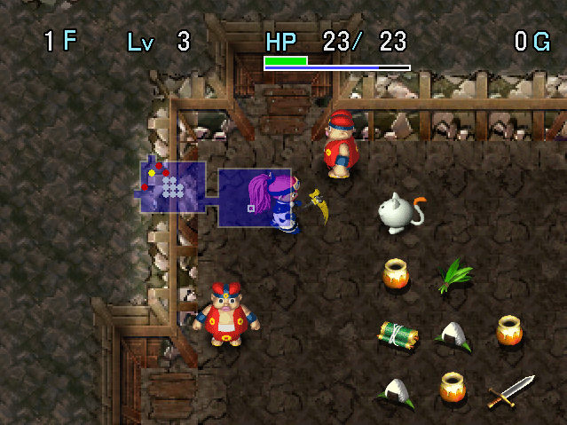

   

Dungeon where each floor consists of multiple rooms but no hallways. You start with an unbreakable Wonder Pick, so the idea is to dig your own path to reach other rooms. There are 15 floors total, and unlike other trials, subsequent clears have the same depth.

Monster Houses and shops are extremely common, and Gitan rooms with a Silver Mamel or Gold Mamel also have a high chance of being generated. Herb, Otogiriso, and Tunnel Staff are commonly found on the ground, and shops generally have a much wider variety of items for sale compared to floor items.

Rescue requests are allowed, but the player attempting the rescue doesn't start with a Wonder Pick, so it's probably best to retry instead of sending a request which might not even be possible to complete.

<ul class="quickLinksUL">
  <li><a href="#overview">Overview</a></li>
  <li><a href="#strategy">Strategy</a></li>
  <li><a href="#floor-guide">Floor Guide</a></li>
  <li><a href="#monsters">Monsters</a></li>
  <li><a href="#items">Items</a></li>
  <li><a href="#traps">Traps</a></li>
</ul>

# Overview

<table class="dungeonOverview">
  <tr>
    <th>Unlock</th>
    <td class="highlightYellow">Obtain 4 ceremonial items in Yakagura Forest.</td>
  </tr>
  <tr>
    <th>Entrance</th>
    <td class="highlightYellow">Yakagura Forest (North exit)</td>
  </tr>
</table>

<table class="dungeonTable">
  <tr>
    <th>JP Name</th>
    <td colspan="3">ギトーの試練</td>
  </tr>
  <tr>
    <th>Floors</th>
    <td>15F</td>
    <th>Stairs</th>
    <td>Descending</td>
  </tr>
  <tr>
    <th>Bring Items</th>
    <td>No</td>
    <th>Allies</th>
    <td>No</td>
  </tr>
  <tr>
    <th>Unidentified</th>
    <td colspan="3"></td>
  </tr>
  <tr>
    <th>Shops</th>
    <td>Yes</td>
    <th>Monster Houses</th>
    <td>Regular</td>
  </tr>
  <tr>
    <th>Clear Icon</th>
    <td></td>
    <th>Reward</th>
    <td>None</td>
  </tr>
</table>

# Strategy

<ul class="quickLinksUL">
  <li><a href="#equipment">Equipment</a></li>
  <li><a href="#other-items">Other Items</a></li>
</ul>

### Equipment

#### Weapon

Wonder Pick (or its サ seal) is essential to clearing the dungeon, so don't lose it. Beware of Crow Tengu disguised as Thief Pelican - Swing Tunnel Staff 2 times to check if a pelican is real.

##### Main Weapon

<table class="dungeonTable">
  <thead>
    <tr>
      <th>Name</th>
      <th>Atk</th>
      <th>Slot</th>
      <th>Notes</th>
    </tr>
  </thead>
  <tbody>
    <tr>
      <td class="highlightGray">Wonder Pick</td>
      <td class="centeredText">8</td>
      <td class="centeredText">4</td>
      <td>Dig out wall tiles, never breaks.</td>
    </tr>
    <tr>
      <td class="highlightGray">Kabura's Blade</td>
      <td class="centeredText">18</td>
      <td class="centeredText">6</td>
      <td>Transfer the サ (Wonder Pick) seal to this if you obtain it. The damage increase is quite noticeable.</td>
    </tr>
    <tr>
      <td class="highlightGray">Dotanuki</td>
      <td class="centeredText">10</td>
      <td class="centeredText">6</td>
      <td>Transfer the サ (Wonder Pick) seal to this if you obtain it. Not much stronger than Wonder Pick, though.</td>
    </tr>
  </tbody>
</table>

##### Seals

<table class="dungeonTable">
  <thead>
    <tr>
      <th>Seal</th>
      <th>Item</th>
      <th>Notes</th>
    </tr>
  </thead>
  <tbody>
    <tr>
      <td class="highlightGray">三</td>
      <td>Razor Wind</td>
      <td>Lets you attack in 3 forward directions.</td>
    </tr>
    <tr>
      <td class="highlightGray">サ</td>
      <td>Wonder Pick</td>
      <td>Synthesize Wonder Pick if you find Kabura's Blade or Dotanuki.</td>
    </tr>
    <tr>
      <td class="highlightGray">弟</td>
      <td>Otogiriso</td>
      <td>Direct attacks restore 3.5 HP (Rounded up).</td>
    </tr>
    <tr>
      <td class="highlightGray">薬</td>
      <td>Herb</td>
      <td>Direct attacks restore 1.875 HP (Rounded up).</td>
    </tr>
    <tr>
      <td class="highlightGray">回</td>
      <td>Healing Sword</td>
      <td>Heal HP equal to 1/3 of damage dealt. Healing Sword → Synthesize Herb, Otogiriso, and Life Grass into a weapon.</td>
    </tr>
    <tr>
      <td class="highlightGray">飯</td>
      <td>Onigiri</td>
      <td>Avoid starvation before reaching Sanba Fort.</td>
    </tr>
  </tbody>
</table>

#### Shield

##### Main Shield

Any shield you find in a shop works as long as it has a decent slot count to stack 弟 seals. That said, Spry Shield or Echo Shield makes for a great main shield if you happen to find either one.

##### Seals

<table class="dungeonTable">
  <thead>
    <tr>
      <th>Seal</th>
      <th>Item</th>
      <th>Notes</th>
    </tr>
  </thead>
  <tbody>
    <tr>
      <td class="highlightGray">弟</td>
      <td>Otogiriso</td>
      <td>Restore 3.5 HP (Rounded up) after taking damage.</td>
    </tr>
  </tbody>
</table>

#### Bracelets

<table class="dungeonTable">
  <thead>
    <tr>
      <th>Item</th>
      <th>Notes</th>
    </tr>
  </thead>
  <tbody>
    <tr>
      <td class="highlightGray">Vision Bracelet</td>
      <td>Removes the need to carry Sight Grass, can check for Monster Houses.</td>
    </tr>
    <tr>
      <td class="highlightGray">Decoy Bracelet</td>
      <td>Fullness is replenished when you revive.</td>
    </tr>
    <tr>
      <td class="highlightGray">Thief Bracelet</td>
      <td>Enter Gitan rooms or Monster Houses without waking up monsters.</td>
    </tr>
  </tbody>
</table>

### Other Items

<table class="dungeonTable">
  <thead>
    <tr>
      <th>Item</th>
      <th>Notes</th>
    </tr>
  </thead>
  <tbody>
    <tr>
      <td class="highlightGray">Otogiriso</td>
      <td>Eat these when you're at full HP to increase max HP. Keep 2~3 on hand at all times for emergencies and synthesis.</td>
    </tr>
    <tr>
      <td class="highlightGray">Sight Grass</td>
      <td>Removes the need to check for traps in Monster Houses.</td>
    </tr>
    <tr>
      <td class="highlightGray">Tunnel Staff</td>
      <td>Faster method of digging compared to using Wonder Pick.</td>
    </tr>
    <tr>
      <td class="highlightGray">Great Hall Scroll</td>
      <td>Easily steal from a shop if there's only 1 Shopkeeper.</td>
    </tr>
    <tr>
      <td class="highlightGray">Mon House Scroll</td>
      <td>Obtain more items, but don't get blown out of the dungeon by wind.</td>
    </tr>
    <tr>
      <td class="highlightGray">Navigation Scroll</td>
      <td>Locate stairs, shops, Gitan rooms, and Monster Houses.</td>
    </tr>
  </tbody>
</table>

# Floor Guide

### 1-2F

If there are multiple monsters in the starting room, dig out a wall tile to fight them 1 vs 1. Eat Herbs and Otogiriso you find on the ground when your HP is full to increase max HP.

Read Mon House Scrolls to level up and obtain more items. ※ Unlike Shiren 5, you can continue to create new Monster Houses on the same floor.

### 3-4F

Thief Pelican (3-4F) appears, but it overlaps with Crow Tengu (3-4F). Crow Tengu has 16 HP, and Thief Pelican has 28 HP - Swing a Tunnel Staff 2 times to check if a pelican is real.

The number of 弟 (Otogiriso) seals you stack often determines whether or not you clear the dungeon.

### 5-6F

Demon Warrior (5-6F) and Tiger Tosser (5-6F) appear. Ghost Warrior can be defeated in 1 hit using Tunnel Staff, and Tiger Tosser can throw you into a Monster House.

### 7-8F

Robber Pelican (7-12F) provides another chance to synthesize items. Crow Tengu types aren't around on these floors, so every Robber Pelican you see is a real one.

### Sanba Fort

Buy 5\~6 Storage Pots, 1\~2 Decoy Bracelets, and some Huge Onigiri. 

#### Item Shop

|Item|Price|
|-|-|
|Huge Onigiri|300|
|Otogiriso|500|
|Tunnel Staff[5]|2500|
|Antidote Grass|400|
|Storage Pot[4]|1440|
|Heal Pot[4]|1200|
|Decoy Bracelet|7500|
|Escape Scroll|1000|

### 9-15F

Gitan rooms change to containing a Gold Mamel instead of a Silver Mamel from this point. It's immune to status conditions and you won't be able to defeat it by trading hits even with high max HP, so it's best to ignore Gitan rooms unless you have Invincible Grass or Sanctuary Scroll.

The last floor where Robber Pelican appears is 12F - Just rush stairs after you finish synthesizing.

### Boss

Fight against Sanju.

|Name|HP|Atk|Def|Exp|Notes|
|-|-|-|-|-|-|
|Sanju|150|30|12|3000|・Warps and summons 1 Sanju clone when hit. ・Steals an item and warps. (Can't be blocked by Walrus Shield) ・Uses the stolen item on himself, or throws it at Asuka.|

Sanju can steal an item (can't be blocked by Walrus Shield), which he either uses on himself or throws at Asuka. He can't steal items on the floor, so you can protect important items by placing them on the ground.

Sanju warps and summons 1 clone when he receives damage. The clone has the same stats as the real Sanju, but only uses direct attacks and can't steal items.

It's possible to one-shot Sanju by throwing high value Gitan obtained from Silver Mamel or Gold Mamel, but otherwise you might struggle a little bit if your level is low and you don't have healing items.

# Monsters

- S = Silver Mamel Lv1 Lv2

Enemy Colors: Farming Useful Destroys Items Dangerous Very Dangerous

<table class="monsterTable">
  <thead>
    <tr>
      <th>F</th>
      <th colspan="7">Monsters</th>
      <th>S</th>
    </tr>
  </thead>
  <tbody>
    <tr>
      <th>1</th>
      <td>Mamel</td>
      <td>Pit Mamel</td>
      <td>Chintala</td>
      <td>Lady Locks</td>
      <td>Tug Frog</td>
      <td class="highlightGray"></td>
      <td class="highlightGray"></td>
      <td rowspan="8" class="monsterTableSilver">1</td>
    </tr>
    <tr>
      <th>2</th>
      <td>Nigiri Novice</td>
      <td>Pit Mamel</td>
      <td>Chintala</td>
      <td>Lady Locks</td>
      <td>Tug Frog</td>
      <td>Sluggy</td>
      <td>Laugh Polygon</td>
    </tr>
    <tr>
      <th>3</th>
      <td>Froggo Mid Chintala</td>
      <td>Twisty Hani Crow Tengu</td>
      <td>Zalokleft Spearfish</td>
      <td>Boy Cart Thief Pelican</td>
      <td>Nigiri Morph Shadow Hat</td>
      <td>Sluggy</td>
      <td>Laugh Polygon</td>
    </tr>
    <tr>
      <th>4</th>
      <td>Froggo Mid Chintala</td>
      <td>Twisty Hani Crow Tengu</td>
      <td>Zalokleft Spearfish</td>
      <td>Boy Cart Thief Pelican</td>
      <td>Nigiri Morph Shadow Hat</td>
      <td class="highlightGray"></td>
      <td class="highlightGray"></td>
    </tr>
    <tr>
      <th>5</th>
      <td>Pumphantasm Lt. Spearfish</td>
      <td>Demon Warrior Jagan Mask</td>
      <td>Falcon Tengu Pud</td>
      <td>Bored Kappa Pudding</td>
      <td>Horse Ronin Lovely Locks</td>
      <td>Tiger Tosser Pull Frog</td>
      <td>Bitter Sluggy Spike Dragon</td>
    </tr>
    <tr>
      <th>6</th>
      <td>Pumphantasm Lt. Spearfish</td>
      <td>Demon Warrior Jagan Mask</td>
      <td>Falcon Tengu Pud</td>
      <td>Bored Kappa Pudding</td>
      <td>Horse Ronin Lovely Locks</td>
      <td>Tiger Tosser Pull Frog</td>
      <td>Bitter Sluggy Spike Dragon</td>
    </tr>
    <tr>
      <th>7</th>
      <td>Schubell Shagga N'dubba</td>
      <td>Porky Bone Dragon</td>
      <td>Pop Tank Muron</td>
      <td>Mutaikon Pudding</td>
      <td>Hannya Warrior</td>
      <td>Soldier Ant Robber Pelican</td>
      <td>Horse Samurai</td>
    </tr>
    <tr>
      <th>8</th>
      <td>Schubell Shagga N'dubba</td>
      <td>Porky Bone Dragon</td>
      <td>Pop Tank Muron</td>
      <td>Mutaikon Pudding</td>
      <td>Hannya Warrior</td>
      <td>Soldier Ant Robber Pelican</td>
      <td>Horse Samurai</td>
    </tr>
    <tr>
      <td colspan="9" class="monsterTableVillage">Sanba Fort</td>
    </tr>
    <tr>
      <th>9</th>
      <td>Menbell Capt. Spearfish</td>
      <td>Taur Tiny Phoenix</td>
      <td>Dragon Ironhead</td>
      <td>Nigiri Boss Yenron</td>
      <td>Ether Devil Yank Frog</td>
      <td>Bomb Robber Pelican</td>
      <td>Bat Kangaroo Black Hat</td>
      <td rowspan="7" class="monsterTableGold">2</td>
    </tr>
    <tr>
      <th>10</th>
      <td>Menbell Capt. Spearfish</td>
      <td>Taur Tiny Phoenix</td>
      <td>Dragon Ironhead</td>
      <td>Nigiri Boss Yenron</td>
      <td>Ether Devil Yank Frog</td>
      <td>Bomb Robber Pelican</td>
      <td>Bat Kangaroo Black Hat</td>
    </tr>
    <tr>
      <th>11</th>
      <td>Menbell Capt. Spearfish N'dubba</td>
      <td>Taur Tiny Phoenix</td>
      <td>Dragon Ironhead</td>
      <td>Nigiri Boss Yenron</td>
      <td>Ether Devil Yank Frog</td>
      <td>Bomb Robber Pelican</td>
      <td>Bat Kangaroo Black Hat</td>
    </tr>
    <tr>
      <th>12</th>
      <td>Menbell Capt. Spearfish N'dubba</td>
      <td>Taur Tiny Phoenix</td>
      <td>Dragon Ironhead</td>
      <td>Nigiri Boss Yenron</td>
      <td>Ether Devil Yank Frog</td>
      <td>Bomb Robber Pelican</td>
      <td>Bat Kangaroo Black Hat</td>
    </tr>
    <tr>
      <th>13</th>
      <td>Super Gazer Capt. Spearfish</td>
      <td>Lime Zalokleft Iai</td>
      <td>Pumphantom Bandit Pelican</td>
      <td>Dragon Head Yenron</td>
      <td>Dance Polygon Yank Frog</td>
      <td>Jet Boar</td>
      <td>Horse Shogun</td>
    </tr>
    <tr>
      <th>14</th>
      <td>Super Gazer Capt. Spearfish</td>
      <td>Lime Zalokleft Iai</td>
      <td>Pumphantom Bandit Pelican</td>
      <td>Dragon Head Chainhead</td>
      <td>Dance Polygon</td>
      <td>Jet Boar</td>
      <td>Horse Shogun</td>
    </tr>
    <tr>
      <th>15</th>
      <td>Super Gazer Minotaur Nashagga</td>
      <td>Lime Zalokleft Iai</td>
      <td>Pumphantom Sky Dragon</td>
      <td>Dragon Head Chainhead</td>
      <td>Dance Polygon Cranky Tank</td>
      <td>Jet Boar Monarch Tusker</td>
      <td>Horse Shogun Rancor Sluggy</td>
    </tr>
    <tr>
      <td colspan="9" class="highlightYellow">Boss</td>
    </tr>
  </tbody>
</table>

※ Silver Mamel types are only found in Gitan rooms.

# Items

# Traps
