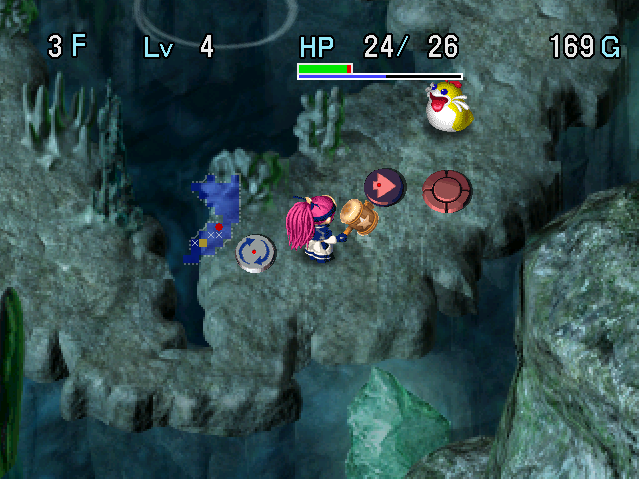

   

Dungeon where you make use of traps to progress, similar to Halfway Well in Shiren 2. Traps can be picked up, placed, and tossed at monsters so that they land underfoot and activate.

Weapons and shields are rare, and Thief Pelicans don't appear so synthesis is not possible. Strong enemies appear earlier than in most other dungeons, including Earth Needle from 12F.

One misplay can lead to a collapse, so players who rely on equipment a lot typically struggle. You could say it's a dungeon where player skill shines more than other dungeons.

<ul class="quickLinksUL">
  <li><a href="#overview">Overview</a></li>
  <li><a href="#strategy">Strategy</a></li>
  <li><a href="#floor-guide">Floor Guide</a></li>
  <li><a href="#monsters">Monsters</a></li>
  <li><a href="#items">Items</a></li>
  <li><a href="#traps">Traps</a></li>
</ul>

# Overview

<table class="dungeonOverview">
  <tr>
    <th>Unlock</th>
    <td class="highlightYellow">Obtain 4 ceremonial items in Yakagura Forest.</td>
  </tr>
  <tr>
    <th>Entrance</th>
    <td class="highlightYellow">Yakagura Forest (North exit)</td>
  </tr>
</table>

<table class="dungeonTable">
  <tr>
    <th>JP Name</th>
    <td colspan="3">カカ・ルーの試練</td>
  </tr>
  <tr>
    <th>Floors</th>
    <td>15F (first) / 50F</td>
    <th>Stairs</th>
    <td>Descending</td>
  </tr>
  <tr>
    <th>Bring Items</th>
    <td>No</td>
    <th>Allies</th>
    <td>No</td>
  </tr>
  <tr>
    <th>Unidentified</th>
    <td colspan="3">Scrolls, Staves</td>
  </tr>
  <tr>
    <th>Shops</th>
    <td>Yes</td>
    <th>Monster Houses</th>
    <td>Regular</td>
  </tr>
  <tr>
    <th>Clear Icon</th>
    <td></td>
    <th>Reward (50F)</th>
    <td>Dodge Shield</td>
  </tr>
</table>

# Strategy

<ul class="quickLinksUL">
  <li><a href="#general">General</a></li>
  <li><a href="#equipment-/-items">Equipment / Items</a></li>
  <li><a href="#traps">Traps</a></li>
</ul>

### General

#### Story Clear (15F)

Weapons and shields are rare. Traps can make up for a lack of weapon, but defense remains a problem. A shield can't be upgraded even if you find one, so there's no avoiding high damage if a stronger monster hits you. In addition, single large room Monster Houses have a higher chance of being generated on 10\~13F.

Unlike Shiren 2's Halfway Well, Trapper status doesn't reduce the player's attack power. Therefore, arrows are an effective source of damage - stock up using Wood Arrow and Iron Arrow traps. Boy Cart (6-7F) can be used to collect a stack of 99 Iron Arrows, which should last until the end. If you have arrows and find a Scout or Phantasm bracelet, you'll have an even easier time.

#### Full Version (50F)

50F sounds easy, but end game enemies appear, including floors where Archdragon and Devil Kangaroo overlap. The key is to use Scout and Phantasm bracelets to evade enemies, but Vision Bracelet can't be found, so Ether Devil types are a major threat - Use Pitfalls and Navigation Scrolls from 40F to avoid Astral Devils.

The number of Storage Pots you find greatly impacts difficulty, since this pot lets you carry more traps. Make enemies trip early game to stock up on Storage Pots, and use Trap Scrolls to search for Trip Stones. Blast Hammer is basically the helper item for those that struggle to clear the dungeon.

### Equipment / Items

#### Weapon / Shield

##### Story Clear

Mallet has pretty reliable attack power compared to other options. Pickaxe + Leather Shield or Bowl Shield is also decent, or Bronze Shield if you can't find anything better. Avoid equipping Steady Shield since it doubles your hunger rate, and discard Clubs. Worst case, you can still reach 15F without any equipment.

##### 50F Clear

<table class="dungeonTable">
  <thead>
    <tr>
      <th>Name</th>
      <th>Atk</th>
      <th>Notes</th>
    </tr>
  </thead>
  <tbody>
    <tr>
      <td class="highlightGray">Blast Hammer</td>
      <td class="centeredText">10</td>
      <td>Deals 3 tiles of knockback when a direct attack hits. Shop-exclusive (1~2F, 10~13F, 16F+), so it's hard to obtain early on. Knockback doesn't occur if you miss, so don't rely on it end game.</td>
    </tr>
    <tr>
      <td class="highlightGray">Ironhead's Head</td>
      <td class="centeredText">9</td>
      <td>Lets you attack up to 3 tiles ahead. Plays well with traps like Bear Trap and One-Way Trap. Hard to obtain - Chainhead (16-22F) or Gigahead (38-50F)</td>
    </tr>
    <tr>
      <td class="highlightGray">Minotaur's Axe</td>
      <td class="centeredText">20</td>
      <td>1/4 chance to land a x2.0 damage critical hit. Level up a Taur (12-15F) to obtain early, or aim for it on 19-23F.</td>
    </tr>
    <tr>
      <td class="highlightGray">Pickaxe</td>
      <td class="centeredText">2</td>
      <td>Dig through walls. Breaks after digging for a while. Worthless attack power, but digging out walls can come in handy. Pair it with a Leather Shield if possible.</td>
    </tr>
  </tbody>
</table>

#### Bracelets

<table class="dungeonTable">
  <thead>
    <tr>
      <th>Name</th>
      <th>Notes</th>
    </tr>
  </thead>
  <tbody>
    <tr>
      <td class="highlightGray">Scout Bracelet</td>
      <td>Reveals the locations of enemies and items on the map. Porkon and such make it shatter easily, so try to keep multiple on hand.</td>
    </tr>
    <tr>
      <td class="highlightGray">Phantasm Bracelet</td>
      <td>Shop-exclusive. Lets you move inside walls and walk on water and lava tiles. Receive damage equal to 5% of your max HP inside walls.</td>
    </tr>
    <tr>
      <td class="highlightGray">Decoy Bracelet</td>
      <td>Revives you if you collapse while it's equipped. Keep it equipped at all times on Astral Devil (40-50F) floors.</td>
    </tr>
    <tr>
      <td class="highlightGray">Pierce Bracelet</td>
      <td>Shop-exclusive. Arrows and thrown items pierce through walls and creatures. Use with arrows and Scout Bracelet to snipe Porkon, Archdragon, etc.</td>
    </tr>
    <tr>
      <td class="highlightGray">Float Bracelet</td>
      <td>Lets you walk on water and lava tiles. Use with Scout Bracelet on water floors to safely collect items and traps. Pointless to keep it on hand if you found a Phantasm Bracelet.</td>
    </tr>
  </tbody>
</table>

#### Staves

Try to keep Tunnel, Swap, and Knockback staves on hand at all times. (2\~3 if aiming for 50F) Tunnel Staff is used to misdirect monsters, and Knockback is used with Swap Staff to evade enemies. Pull Staff isn't essential, but is nice for stealing from a shop or relocating traps.

<table class="dungeonTable">
  <thead>
    <tr>
      <th>Name</th>
      <th>Notes</th>
    </tr>
  </thead>
  <tbody>
    <tr>
      <td class="highlightGray">Tunnel Staff</td>
      <td>Breaks a line of wall tiles, but cannot dig in diagonal directions.</td>
    </tr>
    <tr>
      <td class="highlightGray">Swap Staff</td>
      <td>Swap places with a target.</td>
    </tr>
    <tr>
      <td class="highlightGray">Knockback Staff</td>
      <td>Knocks a target back 10 tiles, and deals 5 damage.</td>
    </tr>
    <tr>
      <td class="highlightGray">Pull Staff</td>
      <td>Pulls a character, item, trap, or stairs toward you.</td>
    </tr>
  </tbody>
</table>

#### Pots

<table class="dungeonTable">
  <thead>
    <tr>
      <th>Name</th>
      <th>Notes</th>
    </tr>
  </thead>
  <tbody>
    <tr>
      <td class="highlightGray">Storage Pot</td>
      <td>Insert and take out items freely, including traps. Storage Pots are somewhat rare, so take good care of any you find.</td>
    </tr>
    <tr>
      <td class="highlightGray">Sticky Pot</td>
      <td>Use it as a container if your weapon is cursed. If you're in an overworld area, your hand won't get stuck. Only insert 1 Pitfall, since you can't retrieve items without breaking the pot.</td>
    </tr>
    <tr>
      <td class="highlightGray">Heal Pot</td>
      <td>Can be purchased in Nikotama Village. Insert an item to restore all of your HP, but the item vanishes.</td>
    </tr>
  </tbody>
</table>

#### Scrolls

<table class="dungeonTable">
  <thead>
    <tr>
      <th>Name</th>
      <th>Notes</th>
    </tr>
  </thead>
  <tbody>
    <tr>
      <td class="highlightGray">Navigation Scroll</td>
      <td>Reveals the current floor's layout + enemy and item locations. Save these for 40F+ if you're aiming for the 2nd clear.</td>
    </tr>
    <tr>
      <td class="highlightGray">Trap Scroll</td>
      <td>Generates new traps in the room. Keep 2~3 on hand. Best to read from 10F+ for a chance of Pitfalls.</td>
    </tr>
    <tr>
      <td class="highlightGray">Pin Scroll</td>
      <td>Prevents characters in the room from moving for 30 turns. Decent counter to Monster Houses.</td>
    </tr>
    <tr>
      <td class="highlightGray">Gravity Scroll</td>
      <td>Projectiles will immediately fall to the ground for 30 turns. If you throw a trap while it's in effect, it will activate under Asuka. Mainly used to collect Cannonballs or Silver Arrows.</td>
    </tr>
  </tbody>
</table>

### Traps

Traps can be picked up and thrown - Unlike some other games, placing traps consumes your turn. Thrown traps activate when they land on the ground, and will land underfoot if thrown at an enemy. Floating monsters can move over traps without activating them, but thrown traps are still effective.

#### Break Chance

<table class="dungeonTable">
  <thead>
    <tr>
      <th>5%</th>
      <td>Wood Arrow</td>
      <td>Bear</td>
      <td class="highlightGray"></td>
      <td class="highlightGray"></td>
      <td class="highlightGray"></td>
      <td class="highlightGray"></td>
    </tr>
    <tr>
      <th>6%</th>
      <td>Spring</td>
      <td>One-Way</td>
      <td class="highlightGray"></td>
      <td class="highlightGray"></td>
      <td class="highlightGray"></td>
      <td class="highlightGray"></td>
    </tr>
    <tr>
      <th>10%</th>
      <td>Monster</td>
      <td>Droplet</td>
      <td>Strip</td>
      <td class="highlightGray"></td>
      <td class="highlightGray"></td>
      <td class="highlightGray"></td>
    </tr>
    <tr>
      <th>12%</th>
      <td>Iron Arrow</td>
      <td>Burr</td>
      <td>Spike</td>
      <td>Log</td>
      <td>Trip</td>
      <td>Alert</td>
    </tr>
    <tr>
      <th>15%</th>
      <td>Poison Arrow</td>
      <td>Curse</td>
      <td class="highlightGray"></td>
      <td class="highlightGray"></td>
      <td class="highlightGray"></td>
      <td class="highlightGray"></td>
    </tr>
    <tr>
      <th>16%</th>
      <td>Slow</td>
      <td class="highlightGray"></td>
      <td class="highlightGray"></td>
      <td class="highlightGray"></td>
      <td class="highlightGray"></td>
      <td class="highlightGray"></td>
    </tr>
    <tr>
      <th>20%</th>
      <td>Rockfall</td>
      <td>Spoil</td>
      <td>Sleep</td>
      <td>Spin</td>
      <td>Rust</td>
      <td>Rage</td>
    </tr>
    <tr>
      <th>30%</th>
      <td>Landmine</td>
      <td>Rockslide</td>
      <td class="highlightGray"></td>
      <td class="highlightGray"></td>
      <td class="highlightGray"></td>
      <td class="highlightGray"></td>
    </tr>
    <tr>
      <th>50%</th>
      <td>Big Landmine</td>
      <td>Zap</td>
      <td class="highlightGray"></td>
      <td class="highlightGray"></td>
      <td class="highlightGray"></td>
      <td class="highlightGray"></td>
    </tr>
    <tr>
      <th>100%</th>
      <td>Summon</td>
      <td>Multiply</td>
      <td>Pitfall</td>
      <td class="highlightGray"></td>
      <td class="highlightGray"></td>
      <td class="highlightGray"></td>
    </tr>
  </thead>
</table>

#### Explanations

Landmine and Spoil Trap are fantastic, but if you only use the most useful traps, you'll quickly run out. So it's important to be able to utilize all traps, while taking break chance into account.

- Multiply (10F+)
    - Restock traps, similar to a Trap Scroll.
    - Avoid carrying more than 3 of these, since you need inventory space for other traps too.
- Pitfall (10F+)
    - Skip to the next floor. (Doesn't work between 14-15F)
    - Extremely rare, but essential for Astral Devil (40F+) floors if aiming for the 2nd clear.
    - If you're adjacent to a wall, throw it at the wall to activate it underfoot in 1 turn.
- Landmine (4F+), Big Landmine (6F+)
    - Capable of instantly defeating multiple enemies in one activation.
    - Also used to obtain Grilled Onigiri, but has a high chance to break after activation.
    - Effective against Ether Devil types, so try to keep 4\~5 on hand.
- Spoil (3F+)
    - Instantly defeats a monster by turning them into a Spoiled Onigiri.
    - Use this as your main offensive trap if you have lots of Storage Pots. If inventory space is limited, mix in Curse, Slow, Strip, and Poison Arrow traps.
- Strip (6F+)
    - Seals a monster, preventing the use of their special attack and disabling any abilities.
    - 10% chance to break means it typically lasts a long time, and it's best to set it in a hallway.
    - Purify Scroll can't be found, so this trap is the only way to unequip cursed equipment.
- Poison Arrow (1F+)
    - Reduces a monster's strength to 0, and plays well with Strip Trap.
    - Can be used with Bowl Shield to replenish fullness.
    - Poison arrows shot from your inventory deal a fixed 10 damage and lower strength by 20%, so consider stocking some once you're near Cave Mamel (26-29F) floors.
- Curse (5F+)
    - Inflicts Blind status on a monster, and has a 15% chance to break.
    - Have monsters defeat each other to level up for lots of experience points, place it near the entrance of a Monster House to thin out monsters, etc.
- Slow (1F+)
    - This appears from 1F, so it's often used early game to conserve better traps. Recommended to place it in a hallway if possible.
- Spring (1F+)
    - Keep 1~2 on hand for emergencies, even if you have a Warp Bracelet.
    - Postponing a strong monster is quite valuable, and Asuka can warp without RNG being a factor.
- Sleep (1F+)
    - Puts a monster to sleep for 5 turns.
    - It's effective, but has the same break chance as Spoil Trap, so prioritize the latter.
- Spin (1F+)
    - Inflicts Confused status on a monster, which isn't that great of a status condition.
    - This appears from 1F, so it's often used early game to conserve better traps.
    - Can be used with Bear and One-Way traps to create a Cave Mamel on 1-2F.
- Trip (1F+)
    - Makes a monster trip and drop an item, and has a pretty low chance of being generated.
    - Utilize it until it breaks early game - Use Summon and Monster traps to spawn more monsters.
- Wood Arrow (1F+), Iron Arrow (5F+)
    - Arrows are usually collected from Boy Cart (6-7F) instead of traps, but can be nice early game. Wood Arrow Trap has a low 5% chance to break, so it's easy to stock up.
- Rockslide (4F+), Zap (10F+)
    - Decent power during early game, but high chance to break.
    - Zap Trap might be useful for small Monster Houses, but it's not worth carrying around.
- Rust (6F+)
    - Reduces a monster's defense to 0, and one-shots Inferno (12-15F).
    - More effective from mid game onward, but it's not worth carrying around.
- Bear (1F+)
    - Prevents a monster from moving for 8 turns.
    - Shoot arrows or attack the monster from a distance using an Ironhead's Head.
    - If you have a Phantasm Bracelet, place it near a hallway corner to safely defeat enemies.
- One-Way (1F+)
    - Mostly useless on its own, but can be placed in a hallway with another trap to form a chain.
    - The arrow direction is based on the direction Asuka is facing when the trap is placed.
- Rage (8F+)
    - Place it in a spot where monsters won't step on it, and use it to buff Asuka's attack power.
- Droplet (6F+), Burr (1F+), Spike (5F+), Log (1F+), Rockfall (2F+)
    - Not very useful - Place them in hallways to soften monsters up a bit, but that's about it.
    - Log Trap can be used to escape from a Monster House, or steal from a shop on a water floor.
    - Be warned that Rancor Sluggy (16-23F) and Venom Sluggy (27-38F) will multiply from the damage.
- Monster (8F+), Summon (1F+)
    - Use these alongside a Trip Stone to collect items from monsters.
    - Consider destroying them using Mallet, Water Pot, or Pierce Bracelet if you don't need them.
- Alert (8F+)
    - Undesirable, but can be handy to wake up monsters while collecting items with a Trip Stone.

# Floor Guide

### 1-2F

Recommended to bring Strange Onigiri and Koyori's Onigiri into the dungeon. 
※ Strange Onigiri is unlocked by staying overnight at [Gokoku Valley](/dungeons/bufu-trial)'s inn with Minamo in your party.

Early game becomes much easier if you level up a Pit Mamel (1-2F) into a Cave Mamel and defeat it. Have Pit Mamel and Mamel follow you into a hallway, and toss a Spin Trap at the Pit Mamel in a hallway bend. This ensures Mamel won't run away, and Pit Mamel is free to attack it.

Shops can be generated on 1-2F, so keep an eye out for Blast Hammer if you find a shop. You likely won't be able to afford it this early in the dungeon, so you'll usually have to steal it instead. Use Tunnel or Pull staves, wait until the wind blows so you can see the locations of enemies, etc. ※ Spoil Traps can only be generated starting on 3F, so be careful not to starve if you linger.

### 3-5F

Gazer (4-5F), Mid Chintala (4-6F), Spearfish (4-5F), Bitter Sluggy (5-7F), and Bored Kappa (5-6F) appear. You can quickly end up collapsed fighting any of these 1 vs 1 if you didn't level up, so use arrows or traps.

Crow Tengu (3-4F) can be disguised as a weaker monster like Nigiri Novice, so don't let your guard down.

### 6-7F

Lovely Locks (6-7F) is very strong at this point, so don't trade hits with it - Use Sleep or Slow traps. Lovely Locks reflects items and staff magic, but can't reflect thrown traps when you have Trapper status.

Collect Iron Arrows using Boy Cart (6-7F) and favorable terrain. Use a Poison Arrow Trap on the Boy Cart for added safety - Bowl Shield can then be used to replenish fullness. 99 arrows is usually enough for the story clear, but you'll want 3\~5 sets of 99 arrows if aiming for 50F. ※ If you aren't able to collect arrows here, utilize Wood Arrow and Iron Arrow traps.

Beware of Curse Girl (6-9F) - There's no way to purify items in this dungeon, so keep arrows inside pots.

Nigiri Morph (6-9F) can be used to obtain Large Onigiri and raise max fullness to 200 if desired. Lower its strength to 0 using a Poison Arrow Trap, then step in place until it uses its special attack. ※ You can buy Huge Onigiri at the village right after this floor range, so it's best to focus on arrows.

### Nikotama Village

Storage Pots are not available in the item shop. Heal Pot restores HP even when you insert a trap, so it's good to have at least 1 pot on hand. If you have lots of Gitan, stock up on Otogiriso and eat them on 8F to increase max HP. ※ Max HP won't increase if you eat them inside the storage building.

#### Inn

Pay 500 Gitan to fully restore HP and fullness.

#### Item Shop

|Item|Price|
|-|-|
|Huge Onigiri|300|
|Otogiriso|500|
|Heal Pot[4]|1200|
|Mallet|3000|
|Pickaxe|3500|
|Decoy Bracelet|7500|

### 8-9F

Shuffle Dungeon that usually has a lots of 1x1 tile pillars in rooms, making it easier to run from enemies. Again, beware of Curse Girl (6-9F) and Nigiri Morph (6-9F) special attacks.

Defeat Demon Warriors (8-11F) and use their ghosts to create a Tiger Chucker or Shihan for lots of experience. Curse Trap can also be used to level up a monster by having it defeat another monster.

### 10-15F

Earth Needle (12-23F) is a major threat around these floors. It has 150 HP and 15 defense, so you'll burn through lots of arrows if you try to defeat it. It's usually better to run away or use a trap that one-shots it such as Spoil Trap or Landmine. You can also loop retreat 3 steps → attack → retreat 5 steps → attack to safely defeat it.

#### 10-13F

Random Dungeon that seems to have a higher chance of generating a single room Monster House. If you're unlucky, Nemuri can interfere by turning the next floor into a Monster House as well. Equip a Decoy Bracelet before descending the stairs if you happen to have one on hand.

If you end up in a Monster House, ignore items and rush to the stairs. Monster Traps and Kappa Pests (10-13F) make item collection difficult, and lingering introduces risk. Use items like Pitfall, Pin Scroll, or Swap Staff for safety.

Multiply Traps and Pitfalls can be generated starting on 10F, so it's a good time to use Trap Scrolls. Use Trip Stones to obtain items - Scout Bracelet, Warp Bracelet, Storage Pot, Navigation Scroll are all great.

### 14-15F

Shuffle Dungeon, meaning you can't use Pitfalls to skip to the next floor.

The monster table hasn't changed much from the previous floor range, but Curse Sister (14-16F) appears, so keep important items inside pots.

### Boss

Fight against Tina and 2 Taurs.

|Name|HP|Atk|Def|Exp|Notes|
|-|-|-|-|-|-|
|Tina|200|50|10|3000|・Throws Asuka or a monster within a 20 tile radius.|

Tina is immune to things like Spoil Trap, Sleep Trap, and Pin Scroll, but Bear Trap is effective on her. Throw a Landmine or Spoil Trap at Taurs to one-shot them, then pin Tina in place using a Bear Trap and shoot arrows at her to have a one-sided fight.

#### Trapper Bracelet

If you return to this room after clearing the dungeon, you can obtain a Trapper Bracelet. There will be 2 exits - One is used to return to Yakagura Forest, and the other continues to the 2nd clear.

### 16-21F

Cranky Tank (16-21F) and Horse Shogun (20-28F) act at double speed. Rancor Sluggy (16-23F) can multiply when hit, so use Landmine or Spoil Trap to one-shot it, or a Strip Trap to seal it. Dragon (16-23F)'s fire breath can be used to grill onigiri.

It's best to place a Strip Trap in a hallway to counter Rancor Sluggy, Nigiri Boss (20-25F), and swift enemies created by Evil Kangaroo (18-19F) - Strip Trap has a 10% chance to break, so it usually lasts a while. This technique gets more important the deeper you go to counter Venom Sluggy, Porkon, Archdragon, etc.

### 22-25F

Iai (22-25F) and Sonic Boar (22-25F) can cause item loss. Sonic Boar also has 150 HP and 20 defense, making it quite a threat just to fight normally.

Phantom Devil (23-28F) appears, which is an invisible monster that acts at double speed. If you get hit while standing on a water tile, unequip your Float or Phantasm bracelet to warp to a room, then activate a Landmine after it approaches and hits you again to one-shot it. ※ You can throw a Landmine at an adjacent wall to activate it on the same turn.

Tiger Chucker (24-35F) provides lots of experience points, so hunt some to level up if desired.

### 26-29F

Evil Kangaroo (26-29F) returns, so there's a constant possibility of swift monsters. Cave Mamel (26-29F) can be defeated in 1 hit by shooting a Poison Arrow.

### 30-36F

Mirage Devil (31-36F) is invisible and acts at triple speed. Same as before - Use a Landmine to one-shot it after you get hit by its attack.

Porkon (30-36F) appears, dealing high damage to both you and your equipped bracelets. It's ideal to have 2\~3 Heal Pots on hand on these floors, and remember to set a Strip Trap in a hallway.

Fire Bomb (28-39F)'s area blaze → Sonic Boar (30-38F) knocking you into the flames can be a nasty combo.

### 37-39F

Throw Spoiled Onigiri at Nigiri Master (35-38F) to instantly defeat them. Lashagga (38-50F)'s triple attack is deadly due to the lack of a strong shield, so use a trap against it.

### 40-50F

Astral Devil (40-50F) is invisible, acts at triple speed, and can pass through walls. Use Pitfalls and Navigation Scrolls for safety, and keep a Decoy Bracelet equipped at all times. Walk along walls if possible, and throw a Landmine at the wall if you get hit by an Astral Devil. ※ Ether Devil types are guaranteed to be adjacent to Asuka after getting hit by them.

Porkon (40-44F) makes another appearance, and Archdragon (44-50F) also appears. If you get hit by fire, check Archdragon's position using Scout Bracelet, then warp closer using Warp Bracelet.

Bellthoven (40-50F) can summon three level 3 monsters at once, so never let it act when adjacent. Evil Kangaroo (43-44F) and Devil Kangaroo (48-50F) also appear, so just rush stairs.

Traps are worth 10,000 points each, so read a Trap Scroll on 50F if you're aiming for a high score.

# Monsters

Enemy Colors: Farming Useful Destroys Items Strong Dangerous Very Dangerous

<table class="monsterTable">
  <thead>
    <tr>
      <th>F</th>
      <th colspan="7">Monsters</th>
    </tr>
  </thead>
  <tbody>
    <tr>
      <th>1</th>
      <td>Mamel</td>
      <td>Pit Mamel</td>
      <td>Chintala</td>
      <td class="highlightGray"></td>
      <td class="highlightGray"></td>
      <td class="highlightGray"></td>
      <td class="highlightGray"></td>
    </tr>
    <tr>
      <th>2</th>
      <td>Mamel</td>
      <td>Pit Mamel</td>
      <td>Chintala</td>
      <td>Nigiri Novice</td>
      <td>Lady Locks</td>
      <td class="highlightGray"></td>
      <td class="highlightGray"></td>
    </tr>
    <tr>
      <th>3</th>
      <td>Sluggy</td>
      <td>Crow Tengu</td>
      <td>Tug Frog</td>
      <td>Nigiri Novice</td>
      <td>Lady Locks</td>
      <td class="highlightGray"></td>
      <td class="highlightGray"></td>
    </tr>
    <tr>
      <th>4</th>
      <td>Sluggy Gazer</td>
      <td>Crow Tengu</td>
      <td>Tug Frog</td>
      <td>Laugh Polygon</td>
      <td>Spearfish</td>
      <td>Bow Boy</td>
      <td>Mid Chintala</td>
    </tr>
    <tr>
      <th>5</th>
      <td>Bitter Sluggy Gazer</td>
      <td>Bored Kappa</td>
      <td class="highlightGray"></td>
      <td>Laugh Polygon</td>
      <td>Spearfish</td>
      <td>Bow Boy</td>
      <td>Mid Chintala</td>
    </tr>
    <tr>
      <th>6</th>
      <td>Bitter Sluggy Nigiri Morph</td>
      <td>Bored Kappa Curse Girl</td>
      <td>Twisty Hani N'dubba</td>
      <td>Laugh Polygon Lovely Locks</td>
      <td>Lt. Spearfish Shadow Hat</td>
      <td>Boy Cart</td>
      <td>Mid Chintala</td>
    </tr>
    <tr>
      <th>7</th>
      <td>Bitter Sluggy Nigiri Morph</td>
      <td>Curse Girl</td>
      <td>Twisty Hani N'dubba</td>
      <td>Laugh Polygon Lovely Locks</td>
      <td>Lt. Spearfish Shadow Hat</td>
      <td>Boy Cart</td>
      <td class="highlightGray"></td>
    </tr>
    <tr>
      <td colspan="8" class="monsterTableVillage">Nikotama Village</td>
    </tr>
    <tr>
      <th>8</th>
      <td>Pumphantasm Nigiri Morph</td>
      <td>Bone Dragon Curse Girl</td>
      <td>Twisty Hani Kengo</td>
      <td>Laugh Polygon Spike Dragon</td>
      <td>Jagan Mask</td>
      <td>Demon Warrior</td>
      <td>Tiger Tosser</td>
    </tr>
    <tr>
      <th>9</th>
      <td>Pumphantasm Nigiri Morph</td>
      <td>Bone Dragon Curse Girl</td>
      <td>Twisty Hani Kengo</td>
      <td>Laugh Polygon Spike Dragon</td>
      <td>Jagan Mask</td>
      <td>Demon Warrior</td>
      <td>Tiger Tosser</td>
    </tr>
    <tr>
      <th>10</th>
      <td>Pumphantasm Floor Dragon Soldier Ant</td>
      <td>Bone Dragon Rocket Boar Schubell</td>
      <td>Twisty Hani Kappa Pest Pop Tank</td>
      <td>Mutaikon Pull Frog Horse Ronin</td>
      <td>Jagan Mask Shadow Hat</td>
      <td>Demon Warrior Falcon Tengu</td>
      <td>Bat Kangaroo Bomb</td>
    </tr>
    <tr>
      <th>11</th>
      <td>Pumphantasm Floor Dragon Soldier Ant</td>
      <td>Bone Dragon Rocket Boar Schubell</td>
      <td>Twisty Hani Kappa Pest Pop Tank</td>
      <td>Mutaikon Pull Frog Horse Ronin</td>
      <td>Shadow Hat</td>
      <td>Demon Warrior Falcon Tengu</td>
      <td>Bat Kangaroo Bomb</td>
    </tr>
    <tr>
      <th>12</th>
      <td>Pumphantasm Floor Dragon Ether Devil</td>
      <td>Earth Needle Rocket Boar Inferno</td>
      <td>Twisty Hani Kappa Pest Tiger Hurler</td>
      <td>Mutaikon Pull Frog Muron</td>
      <td>Spin Polygon Super Gazer Goldie Locks</td>
      <td>Shagga Taur King Tusker</td>
      <td>Bat Kangaroo Porky</td>
    </tr>
    <tr>
      <th>13</th>
      <td>Pumphantasm Floor Dragon Ether Devil</td>
      <td>Earth Needle Rocket Boar Inferno</td>
      <td>Twisty Hani Kappa Pest Tiger Hurler</td>
      <td>Mutaikon Muron</td>
      <td>Spin Polygon Super Gazer Goldie Locks</td>
      <td>Shagga Taur King Tusker</td>
      <td>Bat Kangaroo Porky</td>
    </tr>
    <tr>
      <th>14</th>
      <td>Pumphantasm Curse Sister Ether Devil</td>
      <td>Earth Needle Tiny Phoenix Inferno</td>
      <td>Black Hat Tiger Hurler</td>
      <td>Mutaikon Muron</td>
      <td>Spin Polygon Super Gazer Goldie Locks</td>
      <td>Shagga Taur</td>
      <td>Bat Kangaroo Porky</td>
    </tr>
    <tr>
      <th>15</th>
      <td>Curse Sister Ether Devil</td>
      <td>Earth Needle Tiny Phoenix Inferno</td>
      <td>Black Hat Tiger Hurler</td>
      <td>Mutaikon Muron</td>
      <td>Spin Polygon Super Gazer Goldie Locks</td>
      <td>Shagga Taur</td>
      <td>Bat Kangaroo Porky</td>
    </tr>
    <tr>
      <td colspan="8" class="highlightYellow">Boss</td>
    </tr>
    <tr>
      <th>16</th>
      <td>Horse Samurai Curse Sister Cranky Tank</td>
      <td>Earth Needle Rancor Sluggy Pumphantom</td>
      <td>Black Hat Dragon Head Yenron</td>
      <td>Dragon Skull Dragon Hannya Warrior</td>
      <td>Dance Polygon Chainhead Big Chintala</td>
      <td>Shagga Monarch Tusker Jet Boar</td>
      <td>Elec Bomb Menbell</td>
    </tr>
    <tr>
      <th>17</th>
      <td>Horse Samurai Yank Frog Cranky Tank</td>
      <td>Earth Needle Rancor Sluggy Pumphantom</td>
      <td>Black Hat Dragon Head Yenron</td>
      <td>Dragon Skull Dragon Hannya Warrior</td>
      <td>Dance Polygon Chainhead Big Chintala</td>
      <td>Shagga Monarch Tusker Jet Boar</td>
      <td>Elec Bomb Menbell Captain Ant</td>
    </tr>
    <tr>
      <th>18</th>
      <td>Horse Samurai Yank Frog Cranky Tank</td>
      <td>Earth Needle Rancor Sluggy Pumphantom</td>
      <td>Black Hat Dragon Head Yenron</td>
      <td>Dragon Skull Dragon Hannya Warrior</td>
      <td>Dance Polygon Chainhead Big Chintala</td>
      <td>Evil Kangaroo Monarch Tusker</td>
      <td>Elec Bomb Menbell Captain Ant</td>
    </tr>
    <tr>
      <th>19</th>
      <td>Horse Samurai Yank Frog Cranky Tank</td>
      <td>Earth Needle Rancor Sluggy Pumphantom</td>
      <td>Minotaur Dragon Head Yenron</td>
      <td>Dragon Skull Dragon Capt. Spearfish</td>
      <td>Dance Polygon Chainhead</td>
      <td>Evil Kangaroo Monarch Tusker</td>
      <td>Elec Bomb Menbell Captain Ant</td>
    </tr>
    <tr>
      <th>20</th>
      <td>Horse Shogun Yank Frog Cranky Tank</td>
      <td>Earth Needle Rancor Sluggy Jagar Prince</td>
      <td>Minotaur Dragon Head</td>
      <td>Dragon Skull Dragon Capt. Spearfish</td>
      <td>Dance Polygon Chainhead</td>
      <td>Nigiri Boss Monarch Tusker</td>
      <td>Elec Bomb Menbell Captain Ant</td>
    </tr>
    <tr>
      <th>21</th>
      <td>Horse Shogun Yank Frog Cranky Tank</td>
      <td>Earth Needle Rancor Sluggy Jagar Prince</td>
      <td>Minotaur Dragon Head Nashagga</td>
      <td>Dragon Skull Dragon Capt. Spearfish</td>
      <td>Dance Polygon Chainhead</td>
      <td>Nigiri Boss Monarch Tusker</td>
      <td>Elec Bomb Menbell Captain Ant</td>
    </tr>
    <tr>
      <th>22</th>
      <td>Horse Shogun Yank Frog Iai</td>
      <td>Earth Needle Rancor Sluggy Jagar Prince</td>
      <td>Minotaur Dragon Head Nashagga</td>
      <td>Dragon Skull Dragon Capt. Spearfish</td>
      <td>Dance Polygon Chainhead</td>
      <td>Nigiri Boss Porko</td>
      <td>Elec Bomb Sonic Boar</td>
    </tr>
    <tr>
      <th>23</th>
      <td>Horse Shogun Yank Frog Iai</td>
      <td>Earth Needle Rancor Sluggy Jagar Prince</td>
      <td>Minotaur Phantom Devil Nashagga</td>
      <td>Dragon Tunnel Dragon Capt. Spearfish</td>
      <td>Dance Polygon</td>
      <td>Nigiri Boss Porko</td>
      <td>Elec Bomb Sonic Boar</td>
    </tr>
    <tr>
      <th>24</th>
      <td>Horse Shogun Yank Frog Iai</td>
      <td>Tiger Chucker Jagar Prince</td>
      <td>Phantom Devil Nashagga</td>
      <td>Tunnel Dragon Capt. Spearfish</td>
      <td class="highlightGray"></td>
      <td>Nigiri Boss Porko</td>
      <td>Sonic Boar</td>
    </tr>
    <tr>
      <th>25</th>
      <td>Horse Shogun Yank Frog Iai</td>
      <td>Tiger Chucker Jagar Prince</td>
      <td>Black Hat Phantom Devil Nashagga</td>
      <td>Tunnel Dragon Capt. Spearfish</td>
      <td class="highlightGray"></td>
      <td>Nigiri Boss Porko</td>
      <td>Sonic Boar</td>
    </tr>
    <tr>
      <th>26</th>
      <td>Horse Shogun</td>
      <td>Tiger Chucker</td>
      <td>Black Hat Phantom Devil Nashagga</td>
      <td>Eagle Tengu Tunnel Dragon Capt. Spearfish</td>
      <td>Sky Dragon</td>
      <td>Evil Kangaroo</td>
      <td>Cave Mamel</td>
    </tr>
    <tr>
      <th>27</th>
      <td>Horse Shogun Venom Sluggy</td>
      <td>Tiger Chucker</td>
      <td>Black Hat Phantom Devil Nashagga</td>
      <td>Eagle Tengu Tunnel Dragon Capt. Spearfish</td>
      <td>Sky Dragon</td>
      <td>Evil Kangaroo</td>
      <td>Cave Mamel</td>
    </tr>
    <tr>
      <th>28</th>
      <td>Horse Shogun Venom Sluggy</td>
      <td>Tiger Chucker Emperor Tusker</td>
      <td>Black Hat Phantom Devil Nashagga</td>
      <td>Eagle Tengu Tunnel Dragon Adm. Spearfish</td>
      <td>Sky Dragon Fire Bomb</td>
      <td>Evil Kangaroo General Ant</td>
      <td>Cave Mamel</td>
    </tr>
    <tr>
      <th>29</th>
      <td>Venom Sluggy</td>
      <td>Tiger Chucker Emperor Tusker</td>
      <td>Black Hat Nashagga</td>
      <td>Eagle Tengu Adm. Spearfish</td>
      <td>Sky Dragon Fire Bomb</td>
      <td>Evil Kangaroo General Ant</td>
      <td>Cave Mamel</td>
    </tr>
    <tr>
      <th>30</th>
      <td>Porkon Venom Sluggy</td>
      <td>Tiger Chucker Emperor Tusker</td>
      <td>Black Hat Jagar King Nashagga</td>
      <td>Eagle Tengu Adm. Spearfish</td>
      <td>Sonic Boar Fire Bomb</td>
      <td>General Ant</td>
      <td>Shihan</td>
    </tr>
    <tr>
      <th>31</th>
      <td>Porkon Venom Sluggy</td>
      <td>Tiger Chucker Emperor Tusker</td>
      <td>Black Hat Jagar King Nashagga</td>
      <td>Eagle Tengu Mirage Devil Adm. Spearfish</td>
      <td>Sonic Boar Fire Bomb</td>
      <td>General Ant</td>
      <td>Shihan</td>
    </tr>
    <tr>
      <th>32</th>
      <td>Porkon Venom Sluggy</td>
      <td>Tiger Chucker</td>
      <td>Black Hat Jagar King</td>
      <td>Eagle Tengu Mirage Devil Adm. Spearfish</td>
      <td>Sonic Boar Fire Bomb</td>
      <td class="highlightGray"></td>
      <td>Shihan Shogun</td>
    </tr>
    <tr>
      <th>33</th>
      <td>Porkon Venom Sluggy</td>
      <td>Tiger Chucker</td>
      <td>Black Hat Jagar King</td>
      <td>Eagle Tengu Mirage Devil Adm. Spearfish</td>
      <td>Sonic Boar Fire Bomb</td>
      <td class="highlightGray"></td>
      <td>Shihan Shogun</td>
    </tr>
    <tr>
      <th>34</th>
      <td>Porkon Venom Sluggy</td>
      <td>Tiger Chucker</td>
      <td>Black Hat Jagar King</td>
      <td>Eagle Tengu Mirage Devil Adm. Spearfish</td>
      <td>Sonic Boar Fire Bomb</td>
      <td class="highlightGray"></td>
      <td>Shihan Shogun</td>
    </tr>
    <tr>
      <th>35</th>
      <td>Porkon Venom Sluggy Nigiri Master</td>
      <td>Tiger Chucker</td>
      <td>Black Hat Jagar King</td>
      <td>Eagle Tengu Mirage Devil Adm. Spearfish</td>
      <td>Sonic Boar Fire Bomb</td>
      <td>General Ant</td>
      <td>Shihan Shogun</td>
    </tr>
    <tr>
      <th>36</th>
      <td>Porkon Venom Sluggy Nigiri Master</td>
      <td class="highlightGray"></td>
      <td>Black Hat Jagar King</td>
      <td>Eagle Tengu Mirage Devil Adm. Spearfish</td>
      <td>Sonic Boar Fire Bomb</td>
      <td>Bat Kangaroo General Ant</td>
      <td>Shihan Shogun</td>
    </tr>
    <tr>
      <th>37</th>
      <td>Venom Sluggy Nigiri Master</td>
      <td class="highlightGray"></td>
      <td>Black Hat Jagar King</td>
      <td>Eagle Tengu Hyper Gazer Adm. Spearfish</td>
      <td>Sonic Boar Fire Bomb</td>
      <td>Bat Kangaroo General Ant</td>
      <td>Shihan Shogun</td>
    </tr>
    <tr>
      <th>38</th>
      <td>Venom Sluggy Nigiri Master</td>
      <td>Emperor Tusker Gigahead</td>
      <td>Pumpanshee Garm Dragon Lashagga</td>
      <td>Eagle Tengu Hyper Gazer Adm. Spearfish</td>
      <td>Sonic Boar Fire Bomb</td>
      <td>Bat Kangaroo General Ant</td>
      <td>Shihan Shogun</td>
    </tr>
    <tr>
      <th>39</th>
      <td class="highlightGray"></td>
      <td>Emperor Tusker Gigahead</td>
      <td>Pumpanshee Garm Dragon Lashagga</td>
      <td>Dark Hat Hyper Gazer Adm. Spearfish</td>
      <td>Fire Bomb Thunder Lance</td>
      <td>General Ant</td>
      <td>Shogun</td>
    </tr>
    <tr>
      <th>40</th>
      <td>Porkon Bellthoven</td>
      <td>Emperor Tusker Gigahead</td>
      <td>Pumpanshee Garm Dragon Lashagga</td>
      <td>Dark Hat Hyper Gazer</td>
      <td>Astral Devil Thunder Lance</td>
      <td class="highlightGray"></td>
      <td>Sing Polygon</td>
    </tr>
    <tr>
      <th>41</th>
      <td>Porkon Bellthoven</td>
      <td>Emperor Tusker Gigahead</td>
      <td>Pumpanshee Garm Dragon Lashagga</td>
      <td>Dark Hat Hyper Gazer</td>
      <td>Astral Devil Thunder Lance</td>
      <td class="highlightGray"></td>
      <td>Sing Polygon</td>
    </tr>
    <tr>
      <th>42</th>
      <td>Porkon Bellthoven</td>
      <td>Emperor Tusker Gigahead</td>
      <td>Pumpanshee Garm Dragon Lashagga</td>
      <td>Dark Hat Hyper Gazer</td>
      <td>Astral Devil Thunder Lance</td>
      <td class="highlightGray"></td>
      <td>Sing Polygon</td>
    </tr>
    <tr>
      <th>43</th>
      <td>Porkon Bellthoven</td>
      <td>Tiger Chucker Emperor Tusker Gigahead</td>
      <td>Pumpanshee Garm Dragon Lashagga</td>
      <td>Dark Hat Hyper Gazer</td>
      <td>Astral Devil Megataur Thunder Lance</td>
      <td>Evil Kangaroo</td>
      <td>Sing Polygon</td>
    </tr>
    <tr>
      <th>44</th>
      <td>Porkon Bellthoven</td>
      <td>Tiger Chucker Emperor Tusker Gigahead</td>
      <td>Pumpanshee Garm Dragon Lashagga</td>
      <td>Dark Hat Hyper Gazer Eagle Tengu</td>
      <td>Astral Devil Megataur Thunder Lance</td>
      <td>Evil Kangaroo Archdragon Horse Emperor</td>
      <td>Sing Polygon Cranky Tank Shenron</td>
    </tr>
    <tr>
      <th>45</th>
      <td>Bellthoven Jagar King</td>
      <td>Tiger Chucker Emperor Tusker Gigahead</td>
      <td>Pumpanshee Garm Dragon Lashagga</td>
      <td>Dark Hat Hyper Gazer Eagle Tengu</td>
      <td>Astral Devil Megataur Thunder Lance</td>
      <td>Archdragon Horse Emperor</td>
      <td>Sing Polygon Cranky Tank Shenron</td>
    </tr>
    <tr>
      <th>46</th>
      <td>Bellthoven Jagar King</td>
      <td>Tiger Chucker Emperor Tusker Gigahead</td>
      <td>Pumpanshee Garm Dragon Lashagga</td>
      <td>Dark Hat Eagle Tengu</td>
      <td>Astral Devil Megataur Thunder Lance</td>
      <td>Archdragon Horse Emperor</td>
      <td>Sing Polygon Cranky Tank Shenron</td>
    </tr>
    <tr>
      <th>47</th>
      <td>Bellthoven Jagar King</td>
      <td>Tiger Chucker Emperor Tusker Gigahead</td>
      <td>Pumpanshee Garm Dragon Lashagga</td>
      <td>Dark Hat Eagle Tengu</td>
      <td>Astral Devil Megataur Thunder Lance</td>
      <td>Archdragon Horse Emperor</td>
      <td>Sing Polygon Cranky Tank Shenron</td>
    </tr>
    <tr>
      <th>48</th>
      <td>Bellthoven Nigiri Master</td>
      <td>Tiger Chucker Emperor Tusker Gigahead</td>
      <td>Pumpanshee Garm Dragon Lashagga</td>
      <td>Dark Hat Eagle Tengu</td>
      <td>Astral Devil Megataur Thunder Lance</td>
      <td>Devil Kangaroo Archdragon Horse Emperor</td>
      <td>Sing Polygon Cranky Tank Shenron</td>
    </tr>
    <tr>
      <th>49</th>
      <td>Bellthoven Nigiri Master</td>
      <td>Tiger Chucker Emperor Tusker Gigahead</td>
      <td>Garm Dragon Lashagga</td>
      <td>Dark Hat Eagle Tengu</td>
      <td>Astral Devil Megataur Thunder Lance</td>
      <td>Devil Kangaroo Archdragon Horse Emperor</td>
      <td>Sing Polygon Cranky Tank Shenron</td>
    </tr>
    <tr>
      <th>50</th>
      <td>Bellthoven Nigiri Master</td>
      <td>Tiger Chucker Emperor Tusker Gigahead</td>
      <td>Garm Dragon Lashagga</td>
      <td>Dark Hat Eagle Tengu</td>
      <td>Astral Devil Megataur Thunder Lance</td>
      <td>Devil Kangaroo Archdragon Horse Emperor</td>
      <td>Sing Polygon Cranky Tank Shenron</td>
    </tr>
  </tbody>
</table>

# Items

- F = Floor
- S = Shop

 

<table class="dungeonItemTable">
  <tr>
    <th colspan="3" class="highlightNeon">Weapon</th>
    <th rowspan="76"></th>
    <th colspan="3" class="highlightNeon">Bracelet</th>
    <th rowspan="76"></th>
    <th colspan="3" class="highlightNeon">Grass</th>
  </tr>
  <tr>
    <th>Name</th>
    <th>F</th>
    <th>S</th>
    <th>Name</th>
    <th>F</th>
    <th>S</th>
    <th>Name</th>
    <th>F</th>
    <th>S</th>
  </tr>
  <tr>
    <td class="leftText">Wooden Sword</td>
    <td></td>
    <td></td>
    <td class="leftText">Calm Bracelet</td>
    <td></td>
    <td></td>
    <td class="leftText">Weeds</td>
    <td></td>
    <td></td>
  </tr>
  <tr>
    <td class="leftText">Club</td>
    <td>X</td>
    <td></td>
    <td class="leftText">No-Rust Bracelet</td>
    <td></td>
    <td></td>
    <td class="leftText">Herb</td>
    <td></td>
    <td>X</td>
  </tr>
  <tr>
    <td class="leftText">Nagamaki</td>
    <td></td>
    <td></td>
    <td class="leftText">Alert Bracelet</td>
    <td></td>
    <td>X</td>
    <td class="leftText">Sleep Grass</td>
    <td></td>
    <td></td>
  </tr>
  <tr>
    <td class="leftText">Katana</td>
    <td></td>
    <td></td>
    <td class="leftText">Holy Bracelet</td>
    <td></td>
    <td></td>
    <td class="leftText">Dizzy Grass</td>
    <td></td>
    <td></td>
  </tr>
  <tr>
    <td class="leftText">Dotanuki</td>
    <td></td>
    <td></td>
    <td class="leftText">Bind Bracelet</td>
    <td></td>
    <td></td>
    <td class="leftText">Swift Seed</td>
    <td></td>
    <td></td>
  </tr>
  <tr>
    <td class="leftText">Kabura's Blade</td>
    <td></td>
    <td></td>
    <td class="leftText">Warp Bracelet</td>
    <td>X</td>
    <td></td>
    <td class="leftText">Warp Grass</td>
    <td></td>
    <td></td>
  </tr>
  <tr>
    <td class="leftText">Ghost Sickle</td>
    <td></td>
    <td></td>
    <td class="leftText">Strength Bracelet</td>
    <td></td>
    <td></td>
    <td class="leftText">Amnesia Grass</td>
    <td></td>
    <td></td>
  </tr>
  <tr>
    <td class="leftText">Marine Slasher</td>
    <td></td>
    <td></td>
    <td class="leftText">Thief Bracelet</td>
    <td></td>
    <td></td>
    <td class="leftText">Kigny Seed</td>
    <td></td>
    <td></td>
  </tr>
  <tr>
    <td class="leftText">Cyclops Killer</td>
    <td></td>
    <td></td>
    <td class="leftText">Wish Bracelet</td>
    <td></td>
    <td></td>
    <td class="leftText">Twisty Grass</td>
    <td></td>
    <td></td>
  </tr>
  <tr>
    <td class="leftText">Drain Buster</td>
    <td></td>
    <td></td>
    <td class="leftText">Pierce Bracelet</td>
    <td></td>
    <td>X</td>
    <td class="leftText">Life Grass</td>
    <td></td>
    <td>X</td>
  </tr>
  <tr>
    <td class="leftText">Crescent Arm</td>
    <td></td>
    <td></td>
    <td class="leftText">Bullseye Bracelet</td>
    <td></td>
    <td></td>
    <td class="leftText">Antidote Grass</td>
    <td></td>
    <td>X</td>
  </tr>
  <tr>
    <td class="leftText">Dragon Killer</td>
    <td></td>
    <td></td>
    <td class="leftText">Bend Bracelet</td>
    <td>X</td>
    <td>X</td>
    <td class="leftText">Expand Seed</td>
    <td></td>
    <td></td>
  </tr>
  <tr>
    <td class="leftText">Sapping Branch</td>
    <td></td>
    <td></td>
    <td class="leftText">Heal Bracelet</td>
    <td></td>
    <td></td>
    <td class="leftText">Shrink Seed</td>
    <td></td>
    <td></td>
  </tr>
  <tr>
    <td class="leftText">Pickaxe</td>
    <td>X</td>
    <td>X</td>
    <td class="leftText">No-Drain Bracelet</td>
    <td></td>
    <td></td>
    <td class="leftText">Disaster Seed</td>
    <td></td>
    <td></td>
  </tr>
  <tr>
    <td class="leftText">Razor Wind</td>
    <td></td>
    <td></td>
    <td class="leftText">Vision Bracelet</td>
    <td></td>
    <td></td>
    <td class="leftText">Otogiriso</td>
    <td></td>
    <td>X</td>
  </tr>
  <tr>
    <td class="leftText">Froggo Whip</td>
    <td></td>
    <td></td>
    <td class="leftText">Critical Bracelet</td>
    <td></td>
    <td></td>
    <td class="leftText">Sight Grass</td>
    <td></td>
    <td></td>
  </tr>
  <tr>
    <td class="leftText">Bamboo Sword</td>
    <td></td>
    <td></td>
    <td class="leftText">Regret Bracelet</td>
    <td></td>
    <td></td>
    <td class="leftText">Dragon Grass</td>
    <td></td>
    <td></td>
  </tr>
  <tr>
    <td class="leftText">Gold Sword</td>
    <td></td>
    <td></td>
    <td class="leftText">Protect Bracelet</td>
    <td></td>
    <td>X</td>
    <td class="leftText">Flame Grass</td>
    <td></td>
    <td>X</td>
  </tr>
  <tr>
    <td class="leftText">Onigiri Sword</td>
    <td></td>
    <td></td>
    <td class="leftText">Decoy Bracelet</td>
    <td>X</td>
    <td>X</td>
    <td class="leftText">Boost Grass</td>
    <td></td>
    <td></td>
  </tr>
  <tr>
    <td class="leftText">Homing Blade</td>
    <td></td>
    <td></td>
    <td class="leftText">Float Bracelet</td>
    <td>X</td>
    <td>X</td>
    <td class="leftText">Strength Seed</td>
    <td></td>
    <td></td>
  </tr>
  <tr>
    <td class="leftText">Dried Bonito</td>
    <td></td>
    <td></td>
    <td class="leftText">Scout Bracelet</td>
    <td>X</td>
    <td></td>
    <td class="leftText">Poison Grass</td>
    <td></td>
    <td></td>
  </tr>
  <tr>
    <td class="leftText">Bladed Wheel</td>
    <td></td>
    <td></td>
    <td class="leftText">Phantasm Bracelet</td>
    <td></td>
    <td>X</td>
    <td class="leftText">Happy Grass</td>
    <td></td>
    <td></td>
  </tr>
  <tr>
    <td class="leftText">Crisis Sword</td>
    <td></td>
    <td></td>
    <td class="leftText">Bargain Bracelet</td>
    <td></td>
    <td></td>
    <td class="leftText">Unlucky Seed</td>
    <td></td>
    <td></td>
  </tr>
  <tr>
    <td class="leftText">Kengo's Katana</td>
    <td></td>
    <td></td>
    <td class="leftText">Parry Bracelet</td>
    <td></td>
    <td></td>
    <td class="leftText">Invincible Grass</td>
    <td></td>
    <td></td>
  </tr>
  <tr>
    <td class="leftText">Tessen</td>
    <td></td>
    <td></td>
    <td class="leftText">Happy Bracelet</td>
    <td></td>
    <td></td>
    <td class="leftText">Revival Grass</td>
    <td></td>
    <td></td>
  </tr>
  <tr>
    <td class="leftText">Shoddy Sword</td>
    <td></td>
    <td></td>
    <td class="leftText">Nirvana Bracelet</td>
    <td></td>
    <td></td>
    <td class="leftText">Angel Seed</td>
    <td></td>
    <td></td>
  </tr>
  <tr>
    <td class="leftText">Morning Star</td>
    <td></td>
    <td></td>
    <td class="leftText">Hunger Bracelet</td>
    <td></td>
    <td></td>
    <th colspan="3" class="highlightNeon">Staff</th>
  </tr>
  <tr>
    <td class="leftText">Power Pole</td>
    <td></td>
    <td></td>
    <td class="leftText">Spirit Bracelet</td>
    <td></td>
    <td></td>
    <th>Name</th>
    <th>F</th>
    <th>S</th>
  </tr>
  <tr>
    <td class="leftText">Ironhead's Head</td>
    <td></td>
    <td></td>
    <td class="leftText">Identify Bracelet</td>
    <td></td>
    <td></td>
    <td class="leftText">Knockback Staff</td>
    <td>X</td>
    <td>X</td>
  </tr>
  <tr>
    <td class="leftText">Spear</td>
    <td></td>
    <td></td>
    <td class="leftText">Trapper Bracelet</td>
    <td></td>
    <td></td>
    <td class="leftText">Rage Staff</td>
    <td></td>
    <td></td>
  </tr>
  <tr>
    <td class="leftText">Blast Hammer</td>
    <td></td>
    <td>X</td>
    <th colspan="3" class="highlightNeon">Scroll</th>
    <td class="leftText">Empathy Staff</td>
    <td></td>
    <td></td>
  </tr>
  <tr>
    <td class="leftText">Mallet</td>
    <td>X</td>
    <td>X</td>
    <th>Name</th>
    <th>F</th>
    <th>S</th>
    <td class="leftText">Exchange Staff</td>
    <td></td>
    <td></td>
  </tr>
  <tr>
    <td class="leftText">Minotaur's Axe</td>
    <td></td>
    <td></td>
    <td class="leftText">Trap Scroll</td>
    <td>X</td>
    <td>X</td>
    <td class="leftText">Monster Staff</td>
    <td></td>
    <td></td>
  </tr>
  <tr>
    <td class="leftText">Yomino Minasoko</td>
    <td></td>
    <td></td>
    <td class="leftText">Identify Scroll</td>
    <td></td>
    <td></td>
    <td class="leftText">Bomb Staff</td>
    <td></td>
    <td></td>
  </tr>
  <tr>
    <th colspan="3" class="highlightNeon">Shield</th>
    <td class="leftText">Navigation Scroll</td>
    <td>X</td>
    <td>X</td>
    <td class="leftText">Swap Staff</td>
    <td>X</td>
    <td>X</td>
  </tr>
  <tr>
    <th>Name</th>
    <th>F</th>
    <th>S</th>
    <td class="leftText">Puddle Scroll</td>
    <td>X</td>
    <td>X</td>
    <td class="leftText">Pull Staff</td>
    <td>X</td>
    <td>X</td>
  </tr>
  <tr>
    <td class="leftText">Wooden Shield</td>
    <td></td>
    <td></td>
    <td class="leftText">Burn Scroll</td>
    <td>X</td>
    <td></td>
    <td class="leftText">Heal Staff</td>
    <td></td>
    <td></td>
  </tr>
  <tr>
    <td class="leftText">Elegant Shield</td>
    <td></td>
    <td></td>
    <td class="leftText">Retreat Scroll</td>
    <td></td>
    <td></td>
    <td class="leftText">Balance Staff</td>
    <td></td>
    <td></td>
  </tr>
  <tr>
    <td class="leftText">Bronze Shield</td>
    <td>X</td>
    <td></td>
    <td class="leftText">Purify Scroll</td>
    <td></td>
    <td></td>
    <td class="leftText">Slow Staff</td>
    <td></td>
    <td></td>
  </tr>
  <tr>
    <td class="leftText">Iron Shield</td>
    <td></td>
    <td></td>
    <td class="leftText">Fear Scroll</td>
    <td></td>
    <td></td>
    <td class="leftText">Transient Staff</td>
    <td></td>
    <td></td>
  </tr>
  <tr>
    <td class="leftText">Beast Shield</td>
    <td></td>
    <td></td>
    <td class="leftText">Accuracy Scroll</td>
    <td>X</td>
    <td></td>
    <td class="leftText">Paralysis Staff</td>
    <td></td>
    <td></td>
  </tr>
  <tr>
    <td class="leftText">Fuuma Shield</td>
    <td></td>
    <td></td>
    <td class="leftText">Cheer Scroll</td>
    <td></td>
    <td></td>
    <td class="leftText">Seal Staff</td>
    <td></td>
    <td></td>
  </tr>
  <tr>
    <td class="leftText">Leather Shield</td>
    <td>X</td>
    <td></td>
    <td class="leftText">Trap Erase Scroll</td>
    <td>X</td>
    <td>X</td>
    <td class="leftText">Lightning Staff</td>
    <td></td>
    <td></td>
  </tr>
  <tr>
    <td class="leftText">Spry Shield</td>
    <td></td>
    <td></td>
    <td class="leftText">Pin Scroll</td>
    <td>X</td>
    <td>X</td>
    <td class="leftText">Invisible Staff</td>
    <td></td>
    <td></td>
  </tr>
  <tr>
    <td class="leftText">Echo Shield</td>
    <td></td>
    <td></td>
    <td class="leftText">Gravity Scroll</td>
    <td>X</td>
    <td>X</td>
    <td class="leftText">Tunnel Staff</td>
    <td>X</td>
    <td>X</td>
  </tr>
  <tr>
    <td class="leftText">Festive Shield</td>
    <td></td>
    <td></td>
    <td class="leftText">Escape Scroll</td>
    <td></td>
    <td></td>
    <td class="leftText">Decoy Staff</td>
    <td></td>
    <td></td>
  </tr>
  <tr>
    <td class="leftText">Walrus Shield</td>
    <td></td>
    <td></td>
    <td class="leftText">Heaven Scroll</td>
    <td></td>
    <td></td>
    <td class="leftText">Quarter Staff</td>
    <td></td>
    <td></td>
  </tr>
  <tr>
    <td class="leftText">Gold Shield</td>
    <td></td>
    <td></td>
    <td class="leftText">Earth Scroll</td>
    <td></td>
    <td></td>
    <td class="leftText">Swift Staff</td>
    <td></td>
    <td></td>
  </tr>
  <tr>
    <td class="leftText">Rubber Shield</td>
    <td></td>
    <td></td>
    <td class="leftText">Slumber Scroll</td>
    <td></td>
    <td></td>
    <td class="leftText">Fury Staff</td>
    <td></td>
    <td></td>
  </tr>
  <tr>
    <td class="leftText">Froggo Shield</td>
    <td></td>
    <td></td>
    <td class="leftText">Blaze Scroll</td>
    <td></td>
    <td></td>
    <td class="leftText">Miss Staff</td>
    <td></td>
    <td></td>
  </tr>
  <tr>
    <td class="leftText">Blast Shield</td>
    <td></td>
    <td></td>
    <td class="leftText">Confusion Scroll</td>
    <td></td>
    <td></td>
    <td class="leftText">Fire Staff</td>
    <td></td>
    <td></td>
  </tr>
  <tr>
    <td class="leftText">Counter Shield</td>
    <td></td>
    <td></td>
    <td class="leftText">Rockfall Scroll</td>
    <td></td>
    <td></td>
    <td class="leftText">Happy Staff</td>
    <td></td>
    <td></td>
  </tr>
  <tr>
    <td class="leftText">Bowl Shield</td>
    <td>X</td>
    <td>X</td>
    <td class="leftText">Lightning Scroll</td>
    <td></td>
    <td></td>
    <td class="leftText">Unlucky Staff</td>
    <td></td>
    <td></td>
  </tr>
  <tr>
    <td class="leftText">Dodge Shield</td>
    <td></td>
    <td></td>
    <td class="leftText">Fixer Scroll</td>
    <td></td>
    <td></td>
    <th colspan="3" class="highlightNeon">Pot</th>
  </tr>
  <tr>
    <td class="leftText">Scale Shield</td>
    <td></td>
    <td></td>
    <td class="leftText">Trouble Scroll</td>
    <td></td>
    <td></td>
    <th>Name</th>
    <th>F</th>
    <th>S</th>
  </tr>
  <tr>
    <td class="leftText">Happy Shield</td>
    <td></td>
    <td></td>
    <td class="leftText">Mon House Scroll</td>
    <td>X</td>
    <td></td>
    <td class="leftText">Heal Pot</td>
    <td>X</td>
    <td></td>
  </tr>
  <tr>
    <td class="leftText">Steady Shield</td>
    <td>X</td>
    <td>X</td>
    <td class="leftText">Technique Scroll</td>
    <td></td>
    <td></td>
    <td class="leftText">Water Pot</td>
    <td>X</td>
    <td>X</td>
  </tr>
  <tr>
    <td class="leftText">Dragon Shield</td>
    <td></td>
    <td></td>
    <td class="leftText">Desert Scroll</td>
    <td>X</td>
    <td></td>
    <td class="leftText">Degrade Pot</td>
    <td></td>
    <td></td>
  </tr>
  <tr>
    <td class="leftText">Heavy Shield</td>
    <td></td>
    <td></td>
    <td class="leftText">Great Hall Scroll</td>
    <td>X</td>
    <td></td>
    <td class="leftText">Storage Pot</td>
    <td>X</td>
    <td>X</td>
  </tr>
  <tr>
    <td class="leftText">Frontal Shield</td>
    <td></td>
    <td></td>
    <td class="leftText">Sturdy Pot Scroll</td>
    <td></td>
    <td></td>
    <td class="leftText">Sale Pot</td>
    <td></td>
    <td></td>
  </tr>
  <tr>
    <td class="leftText">Shoddy Shield</td>
    <td></td>
    <td></td>
    <td class="leftText">Pot Expand Scroll</td>
    <td></td>
    <td></td>
    <td class="leftText">Identify Pot</td>
    <td></td>
    <td></td>
  </tr>
  <tr>
    <td class="leftText">Halberd Shield</td>
    <td></td>
    <td></td>
    <td class="leftText">Copy Scroll</td>
    <td></td>
    <td></td>
    <td class="leftText">Presto Pot</td>
    <td></td>
    <td></td>
  </tr>
  <tr>
    <td class="leftText">Grand Counter</td>
    <td></td>
    <td></td>
    <td class="leftText">Suction Scroll</td>
    <td></td>
    <td></td>
    <td class="leftText">Hide Pot</td>
    <td>X</td>
    <td>X</td>
  </tr>
  <tr>
    <td class="leftText">Yomino Mikogami</td>
    <td></td>
    <td></td>
    <td class="leftText">Plating Scroll</td>
    <td></td>
    <td></td>
    <td class="leftText">Black Hole Pot</td>
    <td></td>
    <td></td>
  </tr>
  <tr>
    <th colspan="3" class="highlightNeon">Projectile</th>
    <td class="leftText">Blank Scroll</td>
    <td></td>
    <td></td>
    <td class="leftText">Sticky Pot</td>
    <td>X</td>
    <td>X</td>
  </tr>
  <tr>
    <th>Name</th>
    <th>F</th>
    <th>S</th>
    <td class="leftText">Sanctuary Scroll</td>
    <td></td>
    <td></td>
    <td class="leftText">Mailing Pot</td>
    <td></td>
    <td></td>
  </tr>
  <tr>
    <td class="leftText">Wood Arrow</td>
    <td></td>
    <td></td>
    <td class="leftText">Extinction Scroll</td>
    <td></td>
    <td></td>
    <td class="leftText">Synthesis Pot</td>
    <td></td>
    <td></td>
  </tr>
  <tr>
    <td class="leftText">Iron Arrow</td>
    <td></td>
    <td></td>
    <th colspan="3" class="highlightNeon">Food</th>
    <td class="leftText">Blessing Pot</td>
    <td></td>
    <td></td>
  </tr>
  <tr>
    <td class="leftText">Silver Arrow</td>
    <td></td>
    <td></td>
    <th>Name</th>
    <th>F</th>
    <th>S</th>
    <td class="leftText">Upgrade Pot</td>
    <td></td>
    <td></td>
  </tr>
  <tr>
    <td class="leftText">Critical Arrow</td>
    <td></td>
    <td></td>
    <td class="leftText">Onigiri</td>
    <td></td>
    <td>X</td>
    <th colspan="3" class="highlightNeon">Other</th>
  </tr>
  <tr>
    <td class="leftText">Razor Arrow</td>
    <td></td>
    <td></td>
    <td class="leftText">Large Onigiri</td>
    <td></td>
    <td>X</td>
    <th>Name</th>
    <th>F</th>
    <th>S</th>
  </tr>
  <tr>
    <td class="leftText">Cannonball</td>
    <td>X</td>
    <td></td>
    <td class="leftText">Huge Onigiri</td>
    <td></td>
    <td>X</td>
    <td class="leftText">Gitan</td>
    <td>X</td>
    <td></td>
  </tr>
  <tr>
    <td class="leftText">Porky Rock</td>
    <td>X</td>
    <td></td>
    <td class="leftText">Special Onigiri</td>
    <td></td>
    <td>X</td>
    <td rowspan="2" colspan="3" class="highlightGray"></td>
  </tr>
  <tr>
    <td colspan="3" class="highlightGray"></td>
    <td class="leftText">Spoiled Onigiri</td>
    <td></td>
    <td></td>
  </tr>
</table>

# Traps
