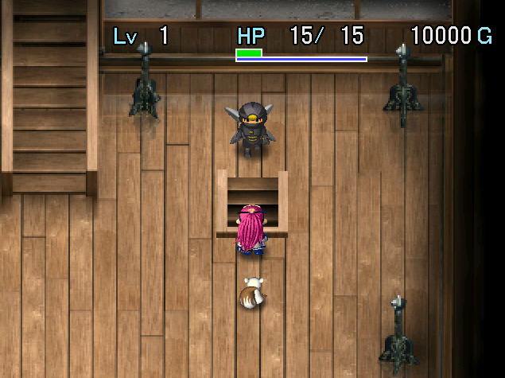

  

Harder dungeon that allows carry-in items located in the basement of Kouga Castle. It was initially a treasure room, but was turned into a Mystery Dungeon to counter thieves.

Powerful monsters appear from 1F, and there are lots of initial monsters per floor. In addition, there are zero items on the ground, and it seems monsters never drop items either. There are also special floors where only Curse Girl types spawn, or only Slime types, and so on.

It might sound intimidating, but it's generally not that bad if you bring powerful equipment and items. In particular, it's recommended to bring an Extinction Scroll for Devil Kangaroo or Archdragon.

The score calculation for this dungeon is unique - the total value of your items is subtracted from the score, so it's pretty easy to end up with a score of 0 if you bring a full inventory of powerful items.

<ul class="quickLinksUL">
  <li><a href="#overview">Overview</a></li>
  <li><a href="#strategy">Strategy</a></li>
  <li><a href="#floor-guide">Floor Guide</a></li>
  <li><a href="#monsters">Monsters</a></li>
  <li><a href="#items">Items</a></li>
  <li><a href="#traps">Traps</a></li>
</ul>

# Overview

<table class="dungeonOverview">
  <tr>
    <th>Unlock</th>
    <td class="highlightYellow">Revisit Kouga Village after clearing Tenrin Hard.</td>
  </tr>
  <tr>
    <th>Entrance</th>
    <td class="highlightYellow">Kouga Village (Ninja in Castle)</td>
  </tr>
</table>

<table class="dungeonTable">
  <tr>
    <th>JP Name</th>
    <td colspan="3">鋼賀の隠し穴</td>
  </tr>
  <tr>
    <th>Floors</th>
    <td>50F</td>
    <th>Stairs</th>
    <td>Descending</td>
  </tr>
  <tr>
    <th>Bring Items</th>
    <td>Yes</td>
    <th>Allies</th>
    <td>No</td>
  </tr>
  <tr>
    <th>Unidentified</th>
    <td colspan="3">None</td>
  </tr>
  <tr>
    <th>Shops</th>
    <td>Yes</td>
    <th>Monster Houses</th>
    <td>Regular, Special</td>
  </tr>
  <tr>
    <th>Clear Icon</th>
    <td></td>
    <th>Reward</th>
    <td>Kabura's Blade (8 slots)</td>
  </tr>
</table>

※ PC version reward is randomly selected from Kabura's Blade, Fuuma Shield, or Kengo's Katana. (All have 8 slots)

# Strategy

<ul class="quickLinksUL">
  <li><a href="#equipment">Equipment</a></li>
  <li><a href="#mon-box">Mon Box</a></li>
  <li><a href="#other-items">Other Items</a></li>
</ul>

### Equipment

#### Weapon

##### Main Weapon

<table class="dungeonTable">
  <thead>
    <tr>
      <th>Name</th>
      <th>Atk</th>
      <th>Slot</th>
      <th>Notes</th>
    </tr>
  </thead>
  <tbody>
    <tr>
      <td class="highlightGray">Kaburasutegi</td>
      <td class="centeredText">99</td>
      <td class="centeredText">8</td>
      <td>Normally you enter this dungeon to create this weapon.</td>
    </tr>
    <tr>
      <td class="highlightGray">Amano Kagura</td>
      <td class="centeredText">30</td>
      <td class="centeredText">10</td>
      <td>Weapon isn't permanently lost if you collapse.</td>
    </tr>
  </tbody>
</table>

##### Seals

<table class="dungeonTable">
  <thead>
    <tr>
      <th>Seal</th>
      <th>Item</th>
      <th>Notes</th>
    </tr>
  </thead>
  <tbody>
    <tr>
      <td class="highlightGray">に or 飯</td>
      <td>Onigiri Sword (Any onigiri)</td>
      <td>Food can't be found on the ground, so you'll starve without this. Alternatively, bring a Nigiri Master Mon Box into the dungeon.</td>
    </tr>
    <tr>
      <td class="highlightGray">回</td>
      <td>Healing Sword</td>
      <td>Heal HP equal to 1/3 of damage dealt.</td>
    </tr>
    <tr>
      <td class="highlightGray">金</td>
      <td>Plating Scroll Gold Sword</td>
      <td>Upgrade value never decreases due to rust.</td>
    </tr>
    <tr>
      <td class="highlightGray">会</td>
      <td>Minotaur's Axe</td>
      <td>1/4 chance to land a critical hit.</td>
    </tr>
    <tr>
      <td class="highlightGray">根</td>
      <td>Bamboo Sword</td>
      <td>Increase strength by 1 every 100 swings. Unnecessary for Kaburasutegi, but add 2~3 to Amano Kagura.</td>
    </tr>
    <tr>
      <td class="highlightGray">三</td>
      <td>Razor Wind</td>
      <td>Lets you attack in 3 forward directions.</td>
    </tr>
    <tr>
      <td class="highlightGray">龍</td>
      <td>Ryujin Sword</td>
      <td>Deal x2.0 damage to Dragon types.</td>
    </tr>
    <tr>
      <td class="highlightGray">ド</td>
      <td>Drain Buster</td>
      <td>Deal x1.5 damage to Drain types.</td>
    </tr>
  </tbody>
</table>

#### Shield

##### Main Shield

<table class="dungeonTable">
  <thead>
    <tr>
      <th>Name</th>
      <th>Def</th>
      <th>Slot</th>
      <th>Notes</th>
    </tr>
  </thead>
  <tbody>
    <tr>
      <td class="highlightGray">Helix Shield</td>
      <td class="centeredText">99</td>
      <td class="centeredText">8</td>
      <td>Strongest shield in the game, but hard to obtain.</td>
    </tr>
    <tr>
      <td class="highlightGray">Hoshino Mikoshi</td>
      <td class="centeredText">30</td>
      <td class="centeredText">10</td>
      <td>Shield isn't permanently lost if you collapse.</td>
    </tr>
  </tbody>
</table>

##### Seals

<table class="dungeonTable">
  <thead>
    <tr>
      <th>Seal</th>
      <th>Item</th>
      <th>Notes</th>
    </tr>
  </thead>
  <tbody>
    <tr>
      <td class="highlightGray">竜</td>
      <td>Dragon Shield</td>
      <td>Reduces fire damage by 50%.</td>
    </tr>
    <tr>
      <td class="highlightGray">弟</td>
      <td>Otogiriso</td>
      <td>Restore 3.5 HP (Rounded up) after taking damage. 竜 + 5 弟 seals completely negates Archdragon's fire.</td>
    </tr>
    <tr>
      <td class="highlightGray">山</td>
      <td>Echo Shield</td>
      <td>Reflects magic, including Gazer hypnosis.</td>
    </tr>
    <tr>
      <td class="highlightGray">消 or う</td>
      <td>Antidote Grass Scale Shield</td>
      <td>Prevents strength loss from poisons and slug licks.</td>
    </tr>
    <tr>
      <td class="highlightGray">金</td>
      <td>Plating Scroll Gold Shield</td>
      <td>Upgrade value never decreases due to rust. Rustproof Bracelet is needed against Sludge.</td>
    </tr>
    <tr>
      <td class="highlightGray">ト</td>
      <td>Walrus Shield</td>
      <td>Prevent theft by Zaloklefts and Thief Pelicans.</td>
    </tr>
    <tr>
      <td class="highlightGray">爆</td>
      <td>Blast Shield</td>
      <td>Reduces explosion damage by 50%.</td>
    </tr>
    <tr>
      <td class="highlightGray">見</td>
      <td>Spry Shield</td>
      <td>Evade enemy direct attacks more often.</td>
    </tr>
    <tr>
      <td class="highlightGray">身</td>
      <td>Dodge Shield</td>
      <td>Projectiles aimed at you will miss.</td>
    </tr>
  </tbody>
</table>

#### Bracelet

<table class="dungeonTable">
  <thead>
    <tr>
      <th>Item</th>
      <th>Notes</th>
    </tr>
  </thead>
  <tbody>
    <tr>
      <td class="highlightGray">Spirit Bracelet</td>
      <td>Can be used instead of Extinction Scroll if you've learned Death's Gate.</td>
    </tr>
    <tr>
      <td class="highlightGray">Bind Bracelet</td>
      <td>Necessary to avoid equipment loss against furious Shihan.</td>
    </tr>
    <tr>
      <td class="highlightGray">Scout Bracelet</td>
      <td>Avoid surprise attacks in hallways.</td>
    </tr>
    <tr>
      <td class="highlightGray">Vision Bracelet</td>
      <td>Lets you avoid traps and detect Astral Devil.</td>
    </tr>
    <tr>
      <td class="highlightGray">Trapper Bracelet</td>
      <td>Another option for avoiding traps, but not as good as Vision Bracelet.</td>
    </tr>
    <tr>
      <td class="highlightGray">Holy Bracelet</td>
      <td>Keep it equipped on Curse Girl floors (31-33F).</td>
    </tr>
    <tr>
      <td class="highlightGray">Rustproof Bracelet</td>
      <td>Keep it equipped on Sludge floors to avoid losing seals (40-42F).</td>
    </tr>
    <tr>
      <td class="highlightGray">Phantasm Bracelet</td>
      <td>Nice to have, but not essential with a strong weapon and shield.</td>
    </tr>
  </tbody>
</table>

### Mon Box

<table class="dungeonTable">
  <thead>
    <tr>
      <th>Item</th>
      <th>Notes</th>
    </tr>
  </thead>
  <tbody>
    <tr>
      <td class="highlightGray">Cave Mamel</td>
      <td>Main Mon Box No. 1 - Insert 5~6 Cold Circuits to counter Archdragon's fire.</td>
    </tr>
    <tr>
      <td class="highlightGray">Gold Mamel</td>
      <td>Main Mon Box No. 2 - Alternate between this and Cave Mamel.</td>
    </tr>
    <tr>
      <td class="highlightGray">Nigiri Master</td>
      <td>Needed to avoid starvation if you don't have に or 飯 seals on your weapon.</td>
    </tr>
    <tr>
      <td class="highlightGray">Astral Devil</td>
      <td>Mainly used to run away from dangerous situations.</td>
    </tr>
    <tr>
      <td class="highlightGray">Tiny Phoenix</td>
      <td>Helps against Archdragon's fire.</td>
    </tr>
  </tbody>
</table>

### Other Items

<table class="dungeonTable">
  <thead>
    <tr>
      <th>Item</th>
      <th>Notes</th>
    </tr>
  </thead>
  <tbody>
    <tr>
      <td class="highlightGray">Balance Staff</td>
      <td>Protect against being tripped.</td>
    </tr>
    <tr>
      <td class="highlightGray">Escape Scroll</td>
      <td>Read it if you run out of Revival Grass to avoid item loss.</td>
    </tr>
    <tr>
      <td class="highlightGray">Decoy Staff</td>
      <td>Handy for Monster Houses and such.</td>
    </tr>
    <tr>
      <td class="highlightGray">Revival Grass</td>
      <td>Revives you on the spot if you collapse - No effect if it's inside a pot.</td>
    </tr>
    <tr>
      <td class="highlightGray">Extinction Scroll (Blank Scroll)</td>
      <td>Highly recommended to throw Extinction Scroll at Devil Kangaroo.</td>
    </tr>
    <tr>
      <td class="highlightGray">Plating Scroll</td>
      <td>Repair cracked bracelets if you don't have unbreakable ones yet.</td>
    </tr>
  </tbody>
</table>

# Floor Guide

### 1-30F

Strong monsters appear from 1F, and there are lots of initial monsters per floor. Items can't be found on the ground, so rush stairs unless you're aiming for a high score.

### 31-33F

Curse Girl, Curse Sister, and Curse Mom are the only monsters on these floors. Keep a Holy Bracelet or Scout Bracelet equipped to avoid having items cursed in hallways.

### 35-39F

Archdragon can spawn starting from 35F, along with either Bat Kangaroo or Devil Kangaroo. If a furious Archdragon occurs, one counter is to read a Great Hall Scroll → Confusion Scroll.

### 40-42F

Slime, Grime, Ooze, Sludge, and Astral Devil are the only monsters on these floors. Since Astral Devil spawns, it's not safe to keep your weapon and shield unequipped. Equip a Rustproof Bracelet when fighting Sludge to avoid losing seals.

### 43F

A shop containing Yomino Minasoko and Yomino Mikogami has an extremely low chance of being generated. They cost 60,000 Gitan each, so don't forget to bring Gitan if you want them.

### 44-50F

Continue rushing stairs until the end. The reward is always a Kabura's Blade (8 slots) if playing the Dreamcast version. PC version reward is randomly selected from Kabura's Blade, Fuuma Shield, or Kengo's Katana. (All have 8 slots)

# Monsters

# Items

The value "43" in columns represent the single floor where the item can appear.

- F = Floor
- S = Shop
- E = Special Shop

 

<table class="dungeonItemTable">
  <tr>
    <th colspan="4" class="highlightNeon">Weapon</th>
    <th rowspan="76"></th>
    <th colspan="4" class="highlightNeon">Bracelet</th>
    <th rowspan="76"></th>
    <th colspan="4" class="highlightNeon">Grass</th>
  </tr>
  <tr>
    <th>Name</th>
    <th>F</th>
    <th>S</th>
    <th>E</th>
    <th>Name</th>
    <th>F</th>
    <th>S</th>
    <th>E</th>
    <th>Name</th>
    <th>F</th>
    <th>S</th>
    <th>E</th>
  </tr>
  <tr>
    <td class="leftText">Wooden Sword</td>
    <td></td>
    <td></td>
    <td></td>
    <td class="leftText">Calm Bracelet</td>
    <td></td>
    <td></td>
    <td></td>
    <td class="leftText">Weeds</td>
    <td></td>
    <td></td>
    <td></td>
  </tr>
  <tr>
    <td class="leftText">Club</td>
    <td></td>
    <td></td>
    <td></td>
    <td class="leftText">No-Rust Bracelet</td>
    <td></td>
    <td></td>
    <td></td>
    <td class="leftText">Herb</td>
    <td></td>
    <td></td>
    <td></td>
  </tr>
  <tr>
    <td class="leftText">Nagamaki</td>
    <td></td>
    <td></td>
    <td></td>
    <td class="leftText">Alert Bracelet</td>
    <td></td>
    <td></td>
    <td></td>
    <td class="leftText">Sleep Grass</td>
    <td></td>
    <td></td>
    <td></td>
  </tr>
  <tr>
    <td class="leftText">Katana</td>
    <td></td>
    <td></td>
    <td></td>
    <td class="leftText">Holy Bracelet</td>
    <td></td>
    <td></td>
    <td></td>
    <td class="leftText">Dizzy Grass</td>
    <td></td>
    <td></td>
    <td></td>
  </tr>
  <tr>
    <td class="leftText">Dotanuki</td>
    <td></td>
    <td></td>
    <td></td>
    <td class="leftText">Bind Bracelet</td>
    <td></td>
    <td></td>
    <td></td>
    <td class="leftText">Swift Seed</td>
    <td></td>
    <td></td>
    <td></td>
  </tr>
  <tr>
    <td class="leftText">Kabura's Blade</td>
    <td></td>
    <td></td>
    <td></td>
    <td class="leftText">Warp Bracelet</td>
    <td></td>
    <td></td>
    <td></td>
    <td class="leftText">Warp Grass</td>
    <td></td>
    <td></td>
    <td></td>
  </tr>
  <tr>
    <td class="leftText">Ghost Sickle</td>
    <td></td>
    <td></td>
    <td></td>
    <td class="leftText">Strength Bracelet</td>
    <td></td>
    <td></td>
    <td></td>
    <td class="leftText">Amnesia Grass</td>
    <td></td>
    <td></td>
    <td></td>
  </tr>
  <tr>
    <td class="leftText">Marine Slasher</td>
    <td></td>
    <td></td>
    <td></td>
    <td class="leftText">Thief Bracelet</td>
    <td></td>
    <td></td>
    <td></td>
    <td class="leftText">Kigny Seed</td>
    <td></td>
    <td></td>
    <td></td>
  </tr>
  <tr>
    <td class="leftText">Cyclops Killer</td>
    <td></td>
    <td></td>
    <td></td>
    <td class="leftText">Wish Bracelet</td>
    <td></td>
    <td></td>
    <td></td>
    <td class="leftText">Twisty Grass</td>
    <td></td>
    <td></td>
    <td></td>
  </tr>
  <tr>
    <td class="leftText">Drain Buster</td>
    <td></td>
    <td></td>
    <td></td>
    <td class="leftText">Pierce Bracelet</td>
    <td></td>
    <td></td>
    <td></td>
    <td class="leftText">Life Grass</td>
    <td></td>
    <td></td>
    <td></td>
  </tr>
  <tr>
    <td class="leftText">Crescent Arm</td>
    <td></td>
    <td></td>
    <td></td>
    <td class="leftText">Bullseye Bracelet</td>
    <td></td>
    <td></td>
    <td></td>
    <td class="leftText">Antidote Grass</td>
    <td></td>
    <td></td>
    <td></td>
  </tr>
  <tr>
    <td class="leftText">Dragon Killer</td>
    <td></td>
    <td></td>
    <td></td>
    <td class="leftText">Bend Bracelet</td>
    <td></td>
    <td></td>
    <td></td>
    <td class="leftText">Expand Seed</td>
    <td></td>
    <td></td>
    <td></td>
  </tr>
  <tr>
    <td class="leftText">Sapping Branch</td>
    <td></td>
    <td></td>
    <td></td>
    <td class="leftText">Heal Bracelet</td>
    <td></td>
    <td></td>
    <td></td>
    <td class="leftText">Shrink Seed</td>
    <td></td>
    <td></td>
    <td></td>
  </tr>
  <tr>
    <td class="leftText">Pickaxe</td>
    <td></td>
    <td></td>
    <td></td>
    <td class="leftText">No-Drain Bracelet</td>
    <td></td>
    <td></td>
    <td></td>
    <td class="leftText">Disaster Seed</td>
    <td></td>
    <td></td>
    <td></td>
  </tr>
  <tr>
    <td class="leftText">Razor Wind</td>
    <td></td>
    <td></td>
    <td></td>
    <td class="leftText">Vision Bracelet</td>
    <td></td>
    <td></td>
    <td></td>
    <td class="leftText">Otogiriso</td>
    <td></td>
    <td></td>
    <td></td>
  </tr>
  <tr>
    <td class="leftText">Froggo Whip</td>
    <td></td>
    <td></td>
    <td></td>
    <td class="leftText">Critical Bracelet</td>
    <td></td>
    <td></td>
    <td></td>
    <td class="leftText">Sight Grass</td>
    <td></td>
    <td></td>
    <td></td>
  </tr>
  <tr>
    <td class="leftText">Bamboo Sword</td>
    <td></td>
    <td></td>
    <td></td>
    <td class="leftText">Regret Bracelet</td>
    <td></td>
    <td></td>
    <td></td>
    <td class="leftText">Dragon Grass</td>
    <td></td>
    <td></td>
    <td></td>
  </tr>
  <tr>
    <td class="leftText">Gold Sword</td>
    <td></td>
    <td></td>
    <td></td>
    <td class="leftText">Protect Bracelet</td>
    <td></td>
    <td></td>
    <td></td>
    <td class="leftText">Flame Grass</td>
    <td></td>
    <td></td>
    <td></td>
  </tr>
  <tr>
    <td class="leftText">Onigiri Sword</td>
    <td></td>
    <td></td>
    <td></td>
    <td class="leftText">Decoy Bracelet</td>
    <td></td>
    <td></td>
    <td></td>
    <td class="leftText">Boost Grass</td>
    <td></td>
    <td></td>
    <td></td>
  </tr>
  <tr>
    <td class="leftText">Homing Blade</td>
    <td></td>
    <td></td>
    <td></td>
    <td class="leftText">Float Bracelet</td>
    <td></td>
    <td></td>
    <td></td>
    <td class="leftText">Strength Seed</td>
    <td></td>
    <td></td>
    <td></td>
  </tr>
  <tr>
    <td class="leftText">Dried Bonito</td>
    <td></td>
    <td></td>
    <td></td>
    <td class="leftText">Scout Bracelet</td>
    <td></td>
    <td></td>
    <td></td>
    <td class="leftText">Poison Grass</td>
    <td></td>
    <td></td>
    <td></td>
  </tr>
  <tr>
    <td class="leftText">Bladed Wheel</td>
    <td></td>
    <td></td>
    <td></td>
    <td class="leftText">Phantasm Bracelet</td>
    <td></td>
    <td></td>
    <td></td>
    <td class="leftText">Happy Grass</td>
    <td></td>
    <td></td>
    <td></td>
  </tr>
  <tr>
    <td class="leftText">Crisis Sword</td>
    <td></td>
    <td></td>
    <td></td>
    <td class="leftText">Bargain Bracelet</td>
    <td></td>
    <td></td>
    <td></td>
    <td class="leftText">Unlucky Seed</td>
    <td></td>
    <td></td>
    <td></td>
  </tr>
  <tr>
    <td class="leftText">Kengo's Katana</td>
    <td></td>
    <td></td>
    <td></td>
    <td class="leftText">Parry Bracelet</td>
    <td></td>
    <td></td>
    <td></td>
    <td class="leftText">Invincible Grass</td>
    <td></td>
    <td></td>
    <td></td>
  </tr>
  <tr>
    <td class="leftText">Tessen</td>
    <td></td>
    <td></td>
    <td></td>
    <td class="leftText">Happy Bracelet</td>
    <td></td>
    <td></td>
    <td></td>
    <td class="leftText">Revival Grass</td>
    <td></td>
    <td></td>
    <td></td>
  </tr>
  <tr>
    <td class="leftText">Shoddy Sword</td>
    <td></td>
    <td></td>
    <td></td>
    <td class="leftText">Nirvana Bracelet</td>
    <td></td>
    <td></td>
    <td></td>
    <td class="leftText">Angel Seed</td>
    <td></td>
    <td></td>
    <td></td>
  </tr>
  <tr>
    <td class="leftText">Morning Star</td>
    <td></td>
    <td></td>
    <td></td>
    <td class="leftText">Hunger Bracelet</td>
    <td></td>
    <td></td>
    <td></td>
    <th colspan="4" class="highlightNeon">Staff</th>
  </tr>
  <tr>
    <td class="leftText">Power Pole</td>
    <td></td>
    <td></td>
    <td></td>
    <td class="leftText">Spirit Bracelet</td>
    <td></td>
    <td></td>
    <td></td>
    <th>Name</th>
    <th>F</th>
    <th>S</th>
    <th>E</th>
  </tr>
  <tr>
    <td class="leftText">Ironhead's Head</td>
    <td></td>
    <td></td>
    <td></td>
    <td class="leftText">Identify Bracelet</td>
    <td></td>
    <td></td>
    <td></td>
    <td class="leftText">Knockback Staff</td>
    <td></td>
    <td></td>
    <td></td>
  </tr>
  <tr>
    <td class="leftText">Spear</td>
    <td></td>
    <td></td>
    <td></td>
    <td class="leftText">Trapper Bracelet</td>
    <td></td>
    <td></td>
    <td></td>
    <td class="leftText">Rage Staff</td>
    <td></td>
    <td></td>
    <td></td>
  </tr>
  <tr>
    <td class="leftText">Blast Hammer</td>
    <td></td>
    <td></td>
    <td></td>
    <th colspan="4" class="highlightNeon">Scroll</th>
    <td class="leftText">Empathy Staff</td>
    <td></td>
    <td></td>
    <td></td>
  </tr>
  <tr>
    <td class="leftText">Mallet</td>
    <td></td>
    <td></td>
    <td></td>
    <th>Name</th>
    <th>F</th>
    <th>S</th>
    <th>E</th>
    <td class="leftText">Exchange Staff</td>
    <td></td>
    <td></td>
    <td></td>
  </tr>
  <tr>
    <td class="leftText">Minotaur's Axe</td>
    <td></td>
    <td></td>
    <td></td>
    <td class="leftText">Trap Scroll</td>
    <td></td>
    <td></td>
    <td></td>
    <td class="leftText">Monster Staff</td>
    <td></td>
    <td></td>
    <td></td>
  </tr>
  <tr>
    <td class="leftText">Yomino Minasoko</td>
    <td></td>
    <td></td>
    <td>43</td>
    <td class="leftText">Identify Scroll</td>
    <td></td>
    <td></td>
    <td></td>
    <td class="leftText">Bomb Staff</td>
    <td></td>
    <td></td>
    <td></td>
  </tr>
  <tr>
    <th colspan="4" class="highlightNeon">Shield</th>
    <td class="leftText">Navigation Scroll</td>
    <td></td>
    <td></td>
    <td></td>
    <td class="leftText">Swap Staff</td>
    <td></td>
    <td></td>
    <td></td>
  </tr>
  <tr>
    <th>Name</th>
    <th>F</th>
    <th>S</th>
    <th>E</th>
    <td class="leftText">Puddle Scroll</td>
    <td></td>
    <td></td>
    <td></td>
    <td class="leftText">Pull Staff</td>
    <td></td>
    <td></td>
    <td></td>
  </tr>
  <tr>
    <td class="leftText">Wooden Shield</td>
    <td></td>
    <td></td>
    <td></td>
    <td class="leftText">Burn Scroll</td>
    <td></td>
    <td></td>
    <td></td>
    <td class="leftText">Heal Staff</td>
    <td></td>
    <td></td>
    <td></td>
  </tr>
  <tr>
    <td class="leftText">Elegant Shield</td>
    <td></td>
    <td></td>
    <td></td>
    <td class="leftText">Retreat Scroll</td>
    <td></td>
    <td></td>
    <td></td>
    <td class="leftText">Balance Staff</td>
    <td></td>
    <td></td>
    <td></td>
  </tr>
  <tr>
    <td class="leftText">Bronze Shield</td>
    <td></td>
    <td></td>
    <td></td>
    <td class="leftText">Purify Scroll</td>
    <td></td>
    <td></td>
    <td></td>
    <td class="leftText">Slow Staff</td>
    <td></td>
    <td></td>
    <td></td>
  </tr>
  <tr>
    <td class="leftText">Iron Shield</td>
    <td></td>
    <td></td>
    <td></td>
    <td class="leftText">Fear Scroll</td>
    <td></td>
    <td></td>
    <td></td>
    <td class="leftText">Transient Staff</td>
    <td></td>
    <td></td>
    <td></td>
  </tr>
  <tr>
    <td class="leftText">Beast Shield</td>
    <td></td>
    <td></td>
    <td></td>
    <td class="leftText">Accuracy Scroll</td>
    <td></td>
    <td></td>
    <td></td>
    <td class="leftText">Paralysis Staff</td>
    <td></td>
    <td></td>
    <td></td>
  </tr>
  <tr>
    <td class="leftText">Fuuma Shield</td>
    <td></td>
    <td></td>
    <td></td>
    <td class="leftText">Cheer Scroll</td>
    <td></td>
    <td></td>
    <td></td>
    <td class="leftText">Seal Staff</td>
    <td></td>
    <td></td>
    <td></td>
  </tr>
  <tr>
    <td class="leftText">Leather Shield</td>
    <td></td>
    <td></td>
    <td></td>
    <td class="leftText">Trap Erase Scroll</td>
    <td></td>
    <td></td>
    <td></td>
    <td class="leftText">Lightning Staff</td>
    <td></td>
    <td></td>
    <td></td>
  </tr>
  <tr>
    <td class="leftText">Spry Shield</td>
    <td></td>
    <td></td>
    <td></td>
    <td class="leftText">Pin Scroll</td>
    <td></td>
    <td></td>
    <td></td>
    <td class="leftText">Invisible Staff</td>
    <td></td>
    <td></td>
    <td></td>
  </tr>
  <tr>
    <td class="leftText">Echo Shield</td>
    <td></td>
    <td></td>
    <td></td>
    <td class="leftText">Gravity Scroll</td>
    <td></td>
    <td></td>
    <td></td>
    <td class="leftText">Tunnel Staff</td>
    <td></td>
    <td></td>
    <td></td>
  </tr>
  <tr>
    <td class="leftText">Festive Shield</td>
    <td></td>
    <td></td>
    <td></td>
    <td class="leftText">Escape Scroll</td>
    <td></td>
    <td></td>
    <td></td>
    <td class="leftText">Decoy Staff</td>
    <td></td>
    <td></td>
    <td></td>
  </tr>
  <tr>
    <td class="leftText">Walrus Shield</td>
    <td></td>
    <td></td>
    <td></td>
    <td class="leftText">Heaven Scroll</td>
    <td></td>
    <td></td>
    <td></td>
    <td class="leftText">Quarter Staff</td>
    <td></td>
    <td></td>
    <td></td>
  </tr>
  <tr>
    <td class="leftText">Gold Shield</td>
    <td></td>
    <td></td>
    <td></td>
    <td class="leftText">Earth Scroll</td>
    <td></td>
    <td></td>
    <td></td>
    <td class="leftText">Swift Staff</td>
    <td></td>
    <td></td>
    <td></td>
  </tr>
  <tr>
    <td class="leftText">Rubber Shield</td>
    <td></td>
    <td></td>
    <td></td>
    <td class="leftText">Slumber Scroll</td>
    <td></td>
    <td></td>
    <td></td>
    <td class="leftText">Fury Staff</td>
    <td></td>
    <td></td>
    <td></td>
  </tr>
  <tr>
    <td class="leftText">Froggo Shield</td>
    <td></td>
    <td></td>
    <td></td>
    <td class="leftText">Blaze Scroll</td>
    <td></td>
    <td></td>
    <td></td>
    <td class="leftText">Miss Staff</td>
    <td></td>
    <td></td>
    <td></td>
  </tr>
  <tr>
    <td class="leftText">Blast Shield</td>
    <td></td>
    <td></td>
    <td></td>
    <td class="leftText">Confusion Scroll</td>
    <td></td>
    <td></td>
    <td></td>
    <td class="leftText">Fire Staff</td>
    <td></td>
    <td></td>
    <td></td>
  </tr>
  <tr>
    <td class="leftText">Counter Shield</td>
    <td></td>
    <td></td>
    <td></td>
    <td class="leftText">Rockfall Scroll</td>
    <td></td>
    <td></td>
    <td></td>
    <td class="leftText">Happy Staff</td>
    <td></td>
    <td></td>
    <td></td>
  </tr>
  <tr>
    <td class="leftText">Bowl Shield</td>
    <td></td>
    <td></td>
    <td></td>
    <td class="leftText">Lightning Scroll</td>
    <td></td>
    <td></td>
    <td></td>
    <td class="leftText">Unlucky Staff</td>
    <td></td>
    <td></td>
    <td></td>
  </tr>
  <tr>
    <td class="leftText">Dodge Shield</td>
    <td></td>
    <td></td>
    <td></td>
    <td class="leftText">Fixer Scroll</td>
    <td></td>
    <td></td>
    <td></td>
    <th colspan="4" class="highlightNeon">Pot</th>
  </tr>
  <tr>
    <td class="leftText">Scale Shield</td>
    <td></td>
    <td></td>
    <td></td>
    <td class="leftText">Trouble Scroll</td>
    <td></td>
    <td></td>
    <td></td>
    <th>Name</th>
    <th>F</th>
    <th>S</th>
    <th>E</th>
  </tr>
  <tr>
    <td class="leftText">Happy Shield</td>
    <td></td>
    <td></td>
    <td></td>
    <td class="leftText">Mon House Scroll</td>
    <td></td>
    <td></td>
    <td></td>
    <td class="leftText">Heal Pot</td>
    <td></td>
    <td></td>
    <td></td>
  </tr>
  <tr>
    <td class="leftText">Steady Shield</td>
    <td></td>
    <td></td>
    <td></td>
    <td class="leftText">Technique Scroll</td>
    <td></td>
    <td></td>
    <td></td>
    <td class="leftText">Water Pot</td>
    <td></td>
    <td></td>
    <td></td>
  </tr>
  <tr>
    <td class="leftText">Dragon Shield</td>
    <td></td>
    <td></td>
    <td></td>
    <td class="leftText">Desert Scroll</td>
    <td></td>
    <td></td>
    <td></td>
    <td class="leftText">Degrade Pot</td>
    <td></td>
    <td></td>
    <td></td>
  </tr>
  <tr>
    <td class="leftText">Heavy Shield</td>
    <td></td>
    <td></td>
    <td></td>
    <td class="leftText">Great Hall Scroll</td>
    <td></td>
    <td></td>
    <td></td>
    <td class="leftText">Storage Pot</td>
    <td></td>
    <td></td>
    <td></td>
  </tr>
  <tr>
    <td class="leftText">Frontal Shield</td>
    <td></td>
    <td></td>
    <td></td>
    <td class="leftText">Sturdy Pot Scroll</td>
    <td></td>
    <td></td>
    <td></td>
    <td class="leftText">Sale Pot</td>
    <td></td>
    <td></td>
    <td></td>
  </tr>
  <tr>
    <td class="leftText">Shoddy Shield</td>
    <td></td>
    <td></td>
    <td></td>
    <td class="leftText">Pot Expand Scroll</td>
    <td></td>
    <td></td>
    <td></td>
    <td class="leftText">Identify Pot</td>
    <td></td>
    <td></td>
    <td></td>
  </tr>
  <tr>
    <td class="leftText">Halberd Shield</td>
    <td></td>
    <td></td>
    <td></td>
    <td class="leftText">Copy Scroll</td>
    <td></td>
    <td></td>
    <td></td>
    <td class="leftText">Presto Pot</td>
    <td></td>
    <td></td>
    <td></td>
  </tr>
  <tr>
    <td class="leftText">Grand Counter</td>
    <td></td>
    <td></td>
    <td></td>
    <td class="leftText">Suction Scroll</td>
    <td></td>
    <td></td>
    <td></td>
    <td class="leftText">Hide Pot</td>
    <td></td>
    <td></td>
    <td></td>
  </tr>
  <tr>
    <td class="leftText">Yomino Mikogami</td>
    <td></td>
    <td></td>
    <td>43</td>
    <td class="leftText">Plating Scroll</td>
    <td></td>
    <td></td>
    <td></td>
    <td class="leftText">Black Hole Pot</td>
    <td></td>
    <td></td>
    <td></td>
  </tr>
  <tr>
    <th colspan="4" class="highlightNeon">Projectile</th>
    <td class="leftText">Blank Scroll</td>
    <td></td>
    <td></td>
    <td></td>
    <td class="leftText">Sticky Pot</td>
    <td></td>
    <td></td>
    <td></td>
  </tr>
  <tr>
    <th>Name</th>
    <th>F</th>
    <th>S</th>
    <th>E</th>
    <td class="leftText">Sanctuary Scroll</td>
    <td></td>
    <td></td>
    <td></td>
    <td class="leftText">Mailing Pot</td>
    <td></td>
    <td></td>
    <td></td>
  </tr>
  <tr>
    <td class="leftText">Wood Arrow</td>
    <td></td>
    <td></td>
    <td></td>
    <td class="leftText">Extinction Scroll</td>
    <td></td>
    <td></td>
    <td></td>
    <td class="leftText">Synthesis Pot</td>
    <td></td>
    <td></td>
    <td></td>
  </tr>
  <tr>
    <td class="leftText">Iron Arrow</td>
    <td></td>
    <td></td>
    <td></td>
    <th colspan="4" class="highlightNeon">Food</th>
    <td class="leftText">Blessing Pot</td>
    <td></td>
    <td></td>
    <td></td>
  </tr>
  <tr>
    <td class="leftText">Silver Arrow</td>
    <td></td>
    <td></td>
    <td></td>
    <th>Name</th>
    <th>F</th>
    <th>S</th>
    <th>E</th>
    <td class="leftText">Upgrade Pot</td>
    <td></td>
    <td></td>
    <td></td>
  </tr>
  <tr>
    <td class="leftText">Critical Arrow</td>
    <td></td>
    <td></td>
    <td></td>
    <td class="leftText">Onigiri</td>
    <td></td>
    <td></td>
    <td></td>
    <th colspan="4" class="highlightNeon">Other</th>
  </tr>
  <tr>
    <td class="leftText">Razor Arrow</td>
    <td></td>
    <td></td>
    <td></td>
    <td class="leftText">Large Onigiri</td>
    <td></td>
    <td></td>
    <td></td>
    <th>Name</th>
    <th>F</th>
    <th>S</th>
    <th>E</th>
  </tr>
  <tr>
    <td class="leftText">Cannonball</td>
    <td></td>
    <td></td>
    <td></td>
    <td class="leftText">Huge Onigiri</td>
    <td></td>
    <td></td>
    <td></td>
    <td class="leftText">Gitan</td>
    <td></td>
    <td></td>
    <td></td>
  </tr>
  <tr>
    <td class="leftText">Porky Rock</td>
    <td></td>
    <td></td>
    <td></td>
    <td class="leftText">Special Onigiri</td>
    <td></td>
    <td></td>
    <td></td>
    <td rowspan="2" colspan="4" class="highlightGray"></td>
  </tr>
  <tr>
    <td colspan="4" class="highlightGray"></td>
    <td class="leftText">Spoiled Onigiri</td>
    <td></td>
    <td></td>
    <td></td>
  </tr>
</table>

# Traps
