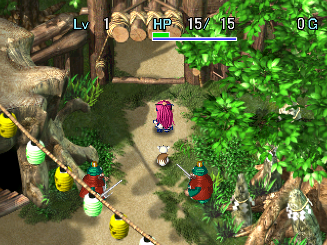
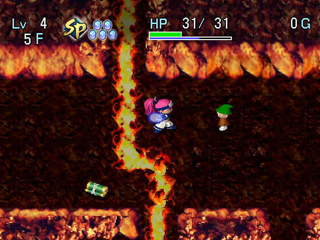

   

Dungeon where you make use of a new [Secret Skill](/system/secret-skills) gameplay system to progress. Secret skills are learned by reading skill scrolls, and spirit charges as turns elapse or you take damage. Skill scrolls can be found in this dungeon, and you can bring any number of skill scrolls when entering. Allies are also allowed, so keep that in mind if you're struggling to clear it on your own.

It might seem counterintuitive, but intentionally taking damage can be an effective way to charge spirit. Islands with items are pretty common, and can be reached using the Strider skill.

<ul class="quickLinksUL">
  <li><a href="#overview">Overview</a></li>
  <li><a href="#strategy">Strategy</a></li>
  <li><a href="#floor-guide">Floor Guide</a></li>
  <li><a href="#monsters">Monsters</a></li>
  <li><a href="#items">Items</a></li>
  <li><a href="#traps">Traps</a></li>
</ul>

# Overview

<table class="dungeonOverview">
  <tr>
    <th>Unlock</th>
    <td class="highlightYellow">Obtain 4 ceremonial items in Yakagura Forest.</td>
  </tr>
  <tr>
    <th>Entrance</th>
    <td class="highlightYellow">Yakagura Forest (North exit)</td>
  </tr>
</table>

<table class="dungeonTable">
  <tr>
    <th>JP Name</th>
    <td colspan="3">クロンの試練</td>
  </tr>
  <tr>
    <th>Floors</th>
    <td>16F (first) / 99F</td>
    <th>Stairs</th>
    <td>Descending</td>
  </tr>
  <tr>
    <th>Bring Items</th>
    <td>Skill Scrolls only</td>
    <th>Allies</th>
    <td>Yes</td>
  </tr>
  <tr>
    <th>Unidentified</th>
    <td colspan="3"></td>
  </tr>
  <tr>
    <th>Shops</th>
    <td>Yes</td>
    <th>Monster Houses</th>
    <td>Regular</td>
  </tr>
  <tr>
    <th>Clear Icon</th>
    <td></td>
    <th>Reward (99F)</th>
    <td>Death's Gate</td>
  </tr>
</table>

# Strategy

<ul class="quickLinksUL">
  <li><a href="#general">General</a></li>
  <li><a href="#secret-skills">Secret Skills</a></li>
  <li><a href="#equipment">Equipment</a></li>
  <li><a href="#other-items">Other Items</a></li>
</ul>

### General

See [Secret Skills](/system/secret-skills) for an overview about the Secret Skill gameplay system.

#### Story Clear (16F)

The story clear is on the easier side, but you'll need to know how to collect arrows to have a smooth run. Ideally, you'll also want a skill that deals damage to multiple enemies in case you encounter a Monster House. But generally speaking, you'll likely be fine if you have arrows and the Power Bow skill.

Arrow traps are common, so throw items onto arrow traps from 10 tiles away to collect arrows. If there isn't enough distance, you can dig out wall tiles using Rock Break or Rock Crush. Alternatively, use Dodge on a Boy Cart (8-10F) floor to easily collect 99 Iron Arrows.

When descending to the next floor, it's best to have full HP and spirit meter, and at least 50% fullness. It's best to charge up 1 spirit before entering hallways so that you have access to Precise Sword, and use said skill instead of a normal direct attack against monsters with troublesome specials.

It's easy to forget, but the dungeon allows allies, so bring Jin or Minamo along if you're struggling.

#### Full Version (99F)

The 2nd clear is significantly harder - It's recommended to master most skills before attempting it. You can easily master skills by equipping a Spirit Bracelet + Gold Sword + Gold Shield (with Otogiriso seals), followed by bringing skill scrolls to Tenrin Easy and intentionally getting hit by monster attacks. ※ Spirit charges slower in Kron Trial compared to Soaring Bird's Challenge (鳥飛魔天の挑戦).

The ideal pace is to obtain Bamboo Sword, Decoy Bracelets, Gold Sword, and Gold Shield by 10F. Once you've obtained a Bamboo Sword, swing the weapon until the wind blows to increase max strength. This is usually enough to have a smooth time until Devil Kangaroo (41-50, 61-70F) floors. Ironhead's Head helps conserve arrows and prevents surprise attacks in hallways.

Rush stairs on Devil Kangaroo floors - You can level up and restock items after those floors. Intentionally collapsing with a Decoy Bracelet equipped can be an advantage since you revive with \~10 spirit. An example would be using Keen Sight to look for a Pitfall or Blind to buy some time in a Monster House. Decoy Bracelets aren't too rare if you use Steal or Sumo Stamp to obtain items.

### Secret Skills

#### Chart

<table>
  <thead>
    <tr>
      <th>Tier</th>
      <th>Runes</th>
    </tr>
  </thead>
  <tbody>
    <tr>
      <td class="highlightRed">S</td>
      <td>Deep Breathing, Air Meal, Precise Sword, Rock Break, Power Bow, Demon Lunge, Silk Palm, Keen Sight, Soft Pitch, Dodge, Purify, Strider</td>
    </tr>
    <tr>
      <td class="highlightPink">A</td>
      <td>Cat Clap, Ignite, Flee, Nullify Blast, Zen, Electric Sword, Nullify Lightning, Wild Dance, Slumber Scent, Blind, Thunder, Steal, Disarm, Sumo Stamp</td>
    </tr>
  </tbody>
</table>

※ Other skills that aren't listed can be useful depending on the situation.

#### List

Number in parenthesis is the skill's spirit cost.

- Deep Breathing (5)
    - Lets you win most 1 vs 1 fights as long as the monster doesn't have a special attack.
- Air Meal (6)
    - Replenishes 30 fullness.
- Precise Sword (1)
    - Perform a direct attack with 100% accuracy, even against a Pumphantasm type inside a wall.
- Power Bow (1)
    - Shoot an arrow with double power - It often deals more damage than a direct attack.
- Rock Break (1)
    - Digs out a wall tile in front of you.
- Ghost Slash (3)
    - Deals x5.0 damage to Ghost types, and can be used to one-shot Ghost Warrior.
- Drain Slash (3)
    - Deals x5.0 damage to Drain types.
- Keen Sight (10)
    - Reveals hidden traps and Ether Devil types.
- Purify (10)
    - Removes curses from all items in your inventory.
- Disarm (10)
    - Knocks away a weapon from an enemy - Aim for Bamboo Sword, Gold Sword, and Bladed Wheel.
- Nullify Blast (2)
    - Makes you immune to explosion damage - Great against Pop Tank types.
- Zen (6)
    - Makes you immune to fire damage - Essential for Archdragon floors.
- Nullify Lightning (2)
    - Makes you immune to electric damage - Pud types, avoid damage when using Electric Sword, etc.
- Electric Sword (3)
    - Attack that travels through all adjacent creatures, similar to Lightning Staff.
- Wild Dance (4)
    - Doubles your attack power at the exchange of 0 defense for 10 turns.
- Strider (5)
    - Lets you walk on water or lava tiles for a little while.
- Silk Palm (5)
    - Puts an enemy in front of you to sleep for 5 turns.
- Slumber Scent (10)
    - Same effect as Slumber Scroll - Great for rushing stairs in a Monster House.
- Thunder (5) or Rockslide (6)
    - Same effect as Lightning Scroll or Rockfall Scroll.
- Dodge (6)
    - Dodge all projectiles aimed at you for the duration of the current floor.
    - Makes collecting arrows from Boy Carts trivial.
- Flee (5)
    - Warp to a different room on the current floor.
- Steal (7)
    - Steal an item from an enemy - Derived from Walrus Guard.
- Sumo Stamp (10)
    - Makes all monsters in the room drop an item.
- Blind (8)
    - Inflicts Blind status on all monsters in the room.

### Equipment

#### Weapon

- Bamboo Sword
    - It takes a long time, but raising max strength to 99 is very helpful for the 2nd clear.
- Bladed Wheel
    - Use it as a projectile after raising max strength to conserve arrows.
    - A cursed Bladed Wheel can be used with a Spoil Trap to obtain Spoiled Onigiri.
- Gold Sword
    - Pair it with a Gold Shield to activate a resonance effect that prevents bracelet damage.
- Ironhead's Head
    - Being able to hit enemies before they're adjacent is powerful.

#### Shield

- Frontal Shield
    - Win most 1 vs 1 fights from the front, but be careful not to get hit from the sides or back.
    - Keep an escape item like Flee Scroll on hand in case you get surrounded.
- Gold Shield
    - Pair it with a Gold Sword to activate a resonance effect that prevents bracelet damage.

#### Bracelets

- Protect Bracelet
    - Shop exclusive - Reduces damage received by 25%.
- Decoy Bracelet
    - Revives you if you collapse - Keep it equipped on Devil Kangaroo floors.

### Other Items

Some of the other notable items.

- Storage Pot
    - Shop exclusive - Always buy any of these that you find in a shop.
- Heal Pot
    - Keep 2\~3 on hand to have peace of mind.
    - However, be aware that Gazer has the possibility of making you insert key items.
- Revival Grass
    - Obtained from Custard.
- Arrows
    - Rocks and Poison Arrows are handy, but prioritize Wood and Iron arrows since they're more common.
    - Store arrows in Storage Pots to protect them from getting cursed.
- Paralysis Staff, Seal Staff
    - Dropped by King Tusker and Monarch Tusker.
    - Lets you deal with furious monsters on Devil Kangaroo floors without having to spend spirit.
- Sight Scroll, Swift Scroll, Flee Scroll
    - Nice to have in case you start the floor in a Monster House.

# Floor Guide

This section is mostly written with the 2nd clear in mind. You don't really need to farm items or grind if you're just aiming for the story clear.

### 1-2F

Monsters are weak, so you shouldn't have problems. It's fine to read skill scrolls if you haven't learned or mastered the skill yet, but otherwise save them for later. Reading a skill scroll performs the skill without spending spirit, and duplicate scrolls can be sold.

If you're aiming for the 2nd clear, it's best to master Disarm and Steal beforehand so that you can collect items like Bamboo Sword, Bladed Wheel, Gold Sword, and Decoy Bracelet on these floors. Charge spirit faster by intentionally getting hit by monster attacks.

### 3-8F

Traps can be generated starting on 3F. If you find a Monster Trap, spread items around and turn them into monsters, then use Sumo Stamp. A Trip Stone + cursed Bladed Wheel or Soft Pitch or Spirit Throw can also be used to obtain items.

Use Dodge to collect Wood Arrows from Bow Boy (4-5F) and Iron Arrows from Boy Cart (8-10F). If you have Nullify Blast, create a Cranky Tank and defeat it to level up.

If aiming for the 2nd clear, it's recommended to raise max fullness to 200 using Nigiri Morph (6-8F). Frontal Shield or Deep Breathing can be used instead of Poison Arrows.

### Shichiten City

Buy P.Bow Scroll, Precise Scroll, and Meal Scroll if you haven't learned those skills yet. ※ The item shop will become unavailable during the final part of the main story.

#### Gambler

Pay 100 Gitan per play.

#### Item Shop

|Item|Price|
|-|-|
|Meal Scroll|1500|
|Precise Scroll|1200|
|Bullet Scroll|600|
|Swap Scroll|300|
|P.Bow Scroll|400|
|Assess Scroll|1000|
|Huge Onigiri|300|
|Heal Pot[4]|1200|
|Decoy Bracelet|7500|
|Retreat Scroll|500|

### 9-10F

Continue collecting Iron Arrows from Boy Cart (8-10F) and hunting Cranky Tanks if possible.

Keep swinging Bamboo Sword to raise max strength while using Steal to obtain skill scrolls. If you don't have Bamboo Sword yet, use Disarm instead.

### 11-16F

Have Spike Dragon (11-13F) defeat other enemies and turn into a Thunder Lance, then defeat it to level up. Hannya Warrior (13-17F) and Dragon (15-20F) overlap, so you could try for an Archdragon as well. However, in that case you'll need the Zen skill and lots of projectiles.

### Boss

Fight against Aquila.

|Name|HP|Atk|Def|Exp|Notes|
|-|-|-|-|-|-|
|Aquila|100|20|5|3000|・Tries to stay at least 2 tiles away from Asuka. ・Does a knockback attack when adjacent. ・Summons Whirlwinds.|
|Whirlwind|5|3|1|6|・Converts non-fixed damage attacks to 1 damage. ・Does a knockback attack when adjacent, then vanishes. ・Reflects projectiles.|

Aquila and Whirlwinds both have attacks that deal knockback, so it's difficult to approach Aquila. Projectiles are reflected by Whirlwinds but are effective against Aquila, so the easiest strategy is to shoot about 3 Iron Arrows while using the Power Bow skill to quickly defeat the boss at the start.

#### Spirit Bracelet

If you return to this room after clearing the dungeon, you can obtain a Spirit Bracelet. There will be 2 exits - One is used to return to Yakagura Forest, and the other continues to the 2nd clear.

### 17-25F

Dazikon (15-19F), King Tusker (15-19F), Twisty Hani (19-21F), and Bat Kangaroo (19-21F) appear. 19F is particularly dangerous since all of the above overlap, and there's risk of a Twisty Dance party occurring.

You shouldn't struggle if you're at 99 strength, but you'll start to encounter enemies you can't one-shot soon.

### 26-30F

Evil Kangaroo (26-30F) appears, and has a high chance of being generated. Triple speed Minotaurs can quickly reduce your HP to 0, so it might be best to rush stairs. Frontal Shield helps, but be aware that swift monsters can sneak up behind you in hallways.

### 31-40F

Bat Kangaroo types don't appear on these floors, so it's relatively safe. Stock up on skill scrolls, Decoy Bracelets, and shop exclusive items prior to the dreaded 41-50F floor range.

Shogun (31-40F), Earth Needle (31-50F), and Sky Dragon (25-35F) appear, so hunt some Lv3 monsters to level up. If you plan on lingering for a while, use Keen Sight to avoid surprise attacks by Phantom Devil (31-50F).

### 41-50F

Devil Kangaroo (41-50F) and Nigiri Master (41-60F) overlap - Devil Kangaroo has a high spawn rate. You're very likely to encounter furious monsters, so keep a Decoy Bracelet equipped and rush stairs. Some players prefer to stay in a room until the wind blows to gain the Navigation Scroll effect before exploring. Elec Bomb can be used to block off a hallway, but keep in mind that Tiger Hurler can throw the Elec Bomb.

If you're worried about getting sandwiched in a hallway, use Rock Crush to dig a path instead.

### 51-60F

Vexing Kappa (51-65F), Tiger Chucker (56-65F), Custard (56-70F), and Venom Sluggy (56-70F) appear. It's safer than the previous floor range, but some of these enemy special attacks can be troublesome. Don't forget to use Dodge in addition to Keen Sight to avoid getting hit by items thrown by Vexing Kappa. Use Power Bow to defeat Venom Sluggy in one hit to prevent it from multiplying.

Custard has a \~3.5% chance to drop Revival Grass when defeated, so don't use Steal on it. It's best to hunt them between 56-60F, since Devil Kangaroo appears again from 61F.

### 61-70F

Mirage Devil (61-65F), Devil Kangaroo (61-70F), Fire Bomb (61-70F), Porkon (61-75F), Sonic Boar (61-75F), Hyper Gazer (66-75F), Sludge (66-80F), etc.

The nightmare of Devil Kangaroo returns - Devil Kangaroo has a high spawn rate. Keep a Decoy Bracelet equipped at all times, and beware of item loss due to Sonic Boar's tripping attack. Balance Staff, Desert Scroll, and Great Hall Scroll can't be found, so items in water can't be retrieved.

Use Dodge to avoid rocks thrown by Porkons, and consider blocking off a hallway using Fire Bomb or using Sludge as a wall and waiting until the wind blows if you're having a hard time with surprise attacks. Try your best to descend the stairs with 10 spirit charged up.

### 71-99F

Astral Devil (71-80, 91-99F) and Dozikon (76-90F) appear. Use Keen Sight at the start of a floor to reveal Astral Devils, but prioritize Dodge if you see a Dozikon. If you didn't have enough spirit and got attacked by an invisible Astral Devil, use Counter to reflect its attacks. Even if you don't defeat it, Asuka will face the Astral Devil, so you can finish it off with Precise Sword.

81-90F is the final floor range where you can safely restock items - Don't forget to use Dodge first. Archdragon (86-99F)'s fire breath isn't much of a threat if you have the Zen skill, so the main threat is Astral Devil.

# Monsters

Enemy Colors: Farming Useful Destroys Items Dangerous Very Dangerous

<table class="monsterTable">
  <thead>
    <tr>
      <th>F</th>
      <th colspan="7">Monsters</th>
    </tr>
  </thead>
  <tbody>
    <tr>
      <th>1</th>
      <td>Mamel</td>
      <td>Pit Mamel</td>
      <td>Chintala</td>
      <td class="highlightGray"></td>
      <td class="highlightGray"></td>
      <td class="highlightGray"></td>
      <td class="highlightGray"></td>
    </tr>
    <tr>
      <th>2</th>
      <td>Mamel</td>
      <td>Pit Mamel</td>
      <td>Chintala</td>
      <td>Lady Locks</td>
      <td class="highlightGray"></td>
      <td class="highlightGray"></td>
      <td class="highlightGray"></td>
    </tr>
    <tr>
      <th>3</th>
      <td>Nigiri Novice</td>
      <td>Tug Frog</td>
      <td>Sluggy</td>
      <td>Lady Locks</td>
      <td class="highlightGray"></td>
      <td class="highlightGray"></td>
      <td class="highlightGray"></td>
    </tr>
    <tr>
      <th>4</th>
      <td>Nigiri Novice</td>
      <td>Tug Frog</td>
      <td>Sluggy</td>
      <td>Lady Locks</td>
      <td>Froggo</td>
      <td>Bow Boy</td>
      <td>Crow Tengu</td>
    </tr>
    <tr>
      <th>5</th>
      <td>Laugh Polygon</td>
      <td>Gazer</td>
      <td>Zalokleft</td>
      <td class="highlightGray"></td>
      <td>Froggo</td>
      <td>Bow Boy</td>
      <td>Crow Tengu</td>
    </tr>
    <tr>
      <th>6</th>
      <td>Laugh Polygon</td>
      <td>Gazer</td>
      <td>Zalokleft</td>
      <td>Nigiri Morph</td>
      <td>Mid Chintala</td>
      <td class="highlightGray"></td>
      <td>Spearfish</td>
    </tr>
    <tr>
      <th>7</th>
      <td>Rocket Boar</td>
      <td>Gazer</td>
      <td>Zalokleft</td>
      <td>Nigiri Morph</td>
      <td>Mid Chintala</td>
      <td>Shadow Hat</td>
      <td>Spearfish</td>
    </tr>
    <tr>
      <th>8</th>
      <td>Rocket Boar</td>
      <td>Boy Cart</td>
      <td>Pud</td>
      <td>Nigiri Morph</td>
      <td>Mid Chintala</td>
      <td>Shadow Hat</td>
      <td class="highlightGray"></td>
    </tr>
    <tr>
      <td colspan="8" class="monsterTableVillage">Shichiten City</td>
    </tr>
    <tr>
      <th>9</th>
      <td>Rocket Boar Lt. Spearfish</td>
      <td>Boy Cart Demon Warrior</td>
      <td>Pud</td>
      <td>Bitter Sluggy</td>
      <td>Pull Frog</td>
      <td>Jagan Mask</td>
      <td>Bored Kappa</td>
    </tr>
    <tr>
      <th>10</th>
      <td>Tiger Tosser Lt. Spearfish</td>
      <td>Boy Cart Demon Warrior</td>
      <td>Pud</td>
      <td>Bitter Sluggy</td>
      <td>Pull Frog</td>
      <td>Jagan Mask</td>
      <td>Bored Kappa</td>
    </tr>
    <tr>
      <th>11</th>
      <td>Tiger Tosser Falcon Tengu</td>
      <td>Pumphantasm Horse Ronin</td>
      <td>Mutaikon Curse Girl</td>
      <td>Bitter Sluggy Lovely Locks</td>
      <td>Pull Frog Spike Dragon</td>
      <td>Jagan Mask</td>
      <td>Spin Polygon</td>
    </tr>
    <tr>
      <th>12</th>
      <td>Tiger Tosser Falcon Tengu</td>
      <td>Pumphantasm Horse Ronin</td>
      <td>Mutaikon Curse Girl</td>
      <td>Bone Dragon Lovely Locks</td>
      <td>Muron Spike Dragon</td>
      <td class="highlightGray"></td>
      <td>Spin Polygon</td>
    </tr>
    <tr>
      <th>13</th>
      <td>Schubell Kengo</td>
      <td>Porky Shagga</td>
      <td>Pop Tank Pudding</td>
      <td>Bone Dragon Lovely Locks</td>
      <td>Muron Spike Dragon</td>
      <td>Hannya Warrior</td>
      <td>Soldier Ant</td>
    </tr>
    <tr>
      <th>14</th>
      <td>Schubell Kengo</td>
      <td>Porky Shagga</td>
      <td>Pop Tank Pudding</td>
      <td>Horse Samurai</td>
      <td>Floor Dragon</td>
      <td>Hannya Warrior</td>
      <td>Soldier Ant</td>
    </tr>
    <tr>
      <th>15</th>
      <td>Froggucci King Tusker</td>
      <td>Dragon Shagga</td>
      <td>Dazikon Kigny</td>
      <td>Horse Samurai Goldie Locks</td>
      <td>Floor Dragon Black Hat</td>
      <td>Hannya Warrior</td>
      <td>Slime</td>
    </tr>
    <tr>
      <th>16</th>
      <td>Froggucci King Tusker</td>
      <td>Dragon Shagga</td>
      <td>Dazikon Kigny</td>
      <td>Horse Samurai Goldie Locks</td>
      <td>Floor Dragon Black Hat</td>
      <td>Hannya Warrior Ironhead</td>
      <td>Slime</td>
    </tr>
    <tr>
      <td colspan="8" class="highlightYellow">Boss</td>
    </tr>
    <tr>
      <th>17</th>
      <td>Froggucci King Tusker</td>
      <td>Dragon Shagga</td>
      <td>Dazikon Kigny</td>
      <td>Horse Samurai Goldie Locks</td>
      <td>Floor Dragon Black Hat</td>
      <td>Hannya Warrior Ironhead</td>
      <td>Slime</td>
    </tr>
    <tr>
      <th>18</th>
      <td>Froggucci King Tusker</td>
      <td>Dragon Shagga</td>
      <td>Dazikon Kigny</td>
      <td>Horse Samurai Goldie Locks</td>
      <td>Floor Dragon Black Hat</td>
      <td>Ironhead</td>
      <td>Slime</td>
    </tr>
    <tr>
      <th>19</th>
      <td>Twisty Hani King Tusker</td>
      <td>Dragon Tiny Phoenix</td>
      <td>Dazikon Kigny</td>
      <td>Taur Goldie Locks</td>
      <td>Ether Devil Black Hat</td>
      <td>Bat Kangaroo Ironhead</td>
      <td>Slime</td>
    </tr>
    <tr>
      <th>20</th>
      <td>Twisty Hani Bomb</td>
      <td>Dragon Tiny Phoenix</td>
      <td>Menbell Nigiri Boss</td>
      <td>Taur Jagar Prince</td>
      <td>Ether Devil</td>
      <td>Bat Kangaroo Ironhead</td>
      <td>Yenron</td>
    </tr>
    <tr>
      <th>21</th>
      <td>Twisty Hani Bomb</td>
      <td>Capt. Spearfish Tiny Phoenix</td>
      <td>Menbell Nigiri Boss</td>
      <td>Taur Jagar Prince</td>
      <td>Ether Devil</td>
      <td>Bat Kangaroo Yank Frog</td>
      <td>Yenron</td>
    </tr>
    <tr>
      <th>22</th>
      <td>Jet Boar Bomb</td>
      <td>Capt. Spearfish Lime Zalokleft</td>
      <td>Menbell Nigiri Boss</td>
      <td>Iai Jagar Prince</td>
      <td class="highlightGray"></td>
      <td>Pumphantom Yank Frog</td>
      <td>Yenron</td>
    </tr>
    <tr>
      <th>23</th>
      <td>Jet Boar</td>
      <td>Capt. Spearfish Lime Zalokleft</td>
      <td>Horse Shogun Dragon Head</td>
      <td>Iai Dance Polygon</td>
      <td>Super Gazer</td>
      <td>Pumphantom Yank Frog</td>
      <td>Yenron</td>
    </tr>
    <tr>
      <th>24</th>
      <td>Jet Boar Chainhead</td>
      <td>Capt. Spearfish Lime Zalokleft</td>
      <td>Horse Shogun Dragon Head</td>
      <td>Iai Dance Polygon</td>
      <td>Rancor Sluggy Super Gazer</td>
      <td>Pumphantom</td>
      <td class="highlightGray"></td>
    </tr>
    <tr>
      <th>25</th>
      <td>Cranky Tank Chainhead</td>
      <td>Minotaur Nashagga</td>
      <td>Horse Shogun Dragon Head</td>
      <td>Monarch Tusker Dance Polygon</td>
      <td>Rancor Sluggy Super Gazer</td>
      <td>Sky Dragon</td>
      <td class="highlightGray"></td>
    </tr>
    <tr>
      <th>26</th>
      <td>Cranky Tank Chainhead</td>
      <td>Minotaur Nashagga</td>
      <td>Evil Kangaroo Big Chintala</td>
      <td>Monarch Tusker Porko</td>
      <td>Rancor Sluggy</td>
      <td>Sky Dragon</td>
      <td>Curse Sister</td>
    </tr>
    <tr>
      <th>27</th>
      <td>Cranky Tank Chainhead</td>
      <td>Minotaur Nashagga</td>
      <td>Evil Kangaroo Big Chintala</td>
      <td>Monarch Tusker Porko</td>
      <td>Rancor Sluggy</td>
      <td>Sky Dragon</td>
      <td>Curse Sister</td>
    </tr>
    <tr>
      <th>28</th>
      <td>Cranky Tank Chainhead</td>
      <td>Minotaur Nashagga</td>
      <td>Evil Kangaroo Big Chintala</td>
      <td>Monarch Tusker Porko</td>
      <td>Rancor Sluggy</td>
      <td>Sky Dragon</td>
      <td>Curse Sister</td>
    </tr>
    <tr>
      <th>29</th>
      <td>Cranky Tank Chainhead</td>
      <td>Minotaur Nashagga</td>
      <td>Evil Kangaroo Big Chintala</td>
      <td>Monarch Tusker Porko</td>
      <td>Rancor Sluggy</td>
      <td>Sky Dragon</td>
      <td>Curse Sister</td>
    </tr>
    <tr>
      <th>30</th>
      <td>Cranky Tank Chainhead</td>
      <td>Minotaur Nashagga</td>
      <td>Evil Kangaroo Big Chintala</td>
      <td>Monarch Tusker Porko</td>
      <td>Rancor Sluggy</td>
      <td>Sky Dragon</td>
      <td>Curse Sister</td>
    </tr>
    <tr>
      <th>31</th>
      <td>Cranky Tank Earth Needle</td>
      <td>Minotaur Phantom Devil</td>
      <td>Skull Dragon Grime</td>
      <td>Tunnel Dragon</td>
      <td>Tiger Hurler Shogun</td>
      <td>Sky Dragon</td>
      <td>Curse Sister</td>
    </tr>
    <tr>
      <th>32</th>
      <td>Cranky Tank Earth Needle</td>
      <td>Minotaur Phantom Devil</td>
      <td>Skull Dragon Grime</td>
      <td>Tunnel Dragon</td>
      <td>Tiger Hurler Shogun</td>
      <td>Sky Dragon</td>
      <td>Curse Sister</td>
    </tr>
    <tr>
      <th>33</th>
      <td>Cranky Tank Earth Needle</td>
      <td>Minotaur Phantom Devil</td>
      <td>Skull Dragon Grime</td>
      <td>Tunnel Dragon</td>
      <td>Tiger Hurler Shogun</td>
      <td>Sky Dragon</td>
      <td>Curse Sister</td>
    </tr>
    <tr>
      <th>34</th>
      <td>Cranky Tank Earth Needle</td>
      <td>Minotaur Phantom Devil</td>
      <td>Skull Dragon Grime</td>
      <td>Tunnel Dragon</td>
      <td>Tiger Hurler Shogun</td>
      <td>Sky Dragon</td>
      <td>Curse Sister</td>
    </tr>
    <tr>
      <th>35</th>
      <td>Cranky Tank Earth Needle</td>
      <td>Minotaur Phantom Devil</td>
      <td>Skull Dragon Grime</td>
      <td>Tunnel Dragon</td>
      <td>Tiger Hurler Shogun</td>
      <td>Sky Dragon</td>
      <td>Chainhead</td>
    </tr>
    <tr>
      <th>36</th>
      <td>Froggon Earth Needle</td>
      <td>Elec Bomb Phantom Devil</td>
      <td>Skull Dragon Grime</td>
      <td>Tunnel Dragon</td>
      <td>Tiger Hurler Shogun</td>
      <td>Captain Ant</td>
      <td>Chainhead</td>
    </tr>
    <tr>
      <th>37</th>
      <td>Froggon Earth Needle</td>
      <td>Elec Bomb Phantom Devil</td>
      <td>Skull Dragon Grime</td>
      <td>Tunnel Dragon</td>
      <td>Tiger Hurler Shogun</td>
      <td>Captain Ant</td>
      <td>Chainhead</td>
    </tr>
    <tr>
      <th>38</th>
      <td>Froggon Earth Needle</td>
      <td>Elec Bomb Phantom Devil</td>
      <td>Skull Dragon Grime</td>
      <td>Tunnel Dragon</td>
      <td>Tiger Hurler Shogun</td>
      <td>Captain Ant</td>
      <td>Chainhead</td>
    </tr>
    <tr>
      <th>39</th>
      <td>Froggon Earth Needle</td>
      <td>Elec Bomb Phantom Devil</td>
      <td>Skull Dragon Grime</td>
      <td>Tunnel Dragon</td>
      <td>Tiger Hurler Shogun</td>
      <td>Captain Ant</td>
      <td>Chainhead</td>
    </tr>
    <tr>
      <th>40</th>
      <td>Froggon Earth Needle</td>
      <td>Elec Bomb Phantom Devil</td>
      <td>Skull Dragon Grime</td>
      <td>Tunnel Dragon</td>
      <td>Tiger Hurler Shogun</td>
      <td>Captain Ant</td>
      <td>Chainhead</td>
    </tr>
    <tr>
      <th>41</th>
      <td>Iron Zalokleft Earth Needle</td>
      <td>Elec Bomb Phantom Devil</td>
      <td>Skull Dragon Nigiri Master</td>
      <td>Tunnel Dragon Adm. Spearfish</td>
      <td>Tiger Hurler</td>
      <td>Cave Mamel</td>
      <td>Devil Kangaroo</td>
    </tr>
    <tr>
      <th>42</th>
      <td>Iron Zalokleft Earth Needle</td>
      <td>Elec Bomb Phantom Devil</td>
      <td>Skull Dragon Nigiri Master</td>
      <td>Tunnel Dragon Adm. Spearfish</td>
      <td>Tiger Hurler</td>
      <td>Cave Mamel</td>
      <td>Devil Kangaroo</td>
    </tr>
    <tr>
      <th>43</th>
      <td>Iron Zalokleft Earth Needle</td>
      <td>Elec Bomb Phantom Devil</td>
      <td>Skull Dragon Nigiri Master</td>
      <td>Tunnel Dragon Adm. Spearfish</td>
      <td>Tiger Hurler</td>
      <td>Cave Mamel</td>
      <td>Devil Kangaroo</td>
    </tr>
    <tr>
      <th>44</th>
      <td>Iron Zalokleft Earth Needle</td>
      <td>Elec Bomb Phantom Devil</td>
      <td>Skull Dragon Nigiri Master</td>
      <td>Tunnel Dragon Adm. Spearfish</td>
      <td>Tiger Hurler</td>
      <td>Cave Mamel</td>
      <td>Devil Kangaroo</td>
    </tr>
    <tr>
      <th>45</th>
      <td>Iron Zalokleft Earth Needle</td>
      <td>Elec Bomb Phantom Devil</td>
      <td>Skull Dragon Nigiri Master</td>
      <td>Tunnel Dragon Adm. Spearfish</td>
      <td>Tiger Hurler</td>
      <td>Cave Mamel</td>
      <td>Devil Kangaroo</td>
    </tr>
    <tr>
      <th>46</th>
      <td>Froggon Earth Needle</td>
      <td>Jagar King Phantom Devil</td>
      <td>Ooze Nigiri Master</td>
      <td>Adm. Spearfish</td>
      <td>Shogun</td>
      <td>Cave Mamel</td>
      <td>Devil Kangaroo</td>
    </tr>
    <tr>
      <th>47</th>
      <td>Froggon Earth Needle</td>
      <td>Jagar King Phantom Devil</td>
      <td>Ooze Nigiri Master</td>
      <td>Adm. Spearfish</td>
      <td>Shogun</td>
      <td>Cave Mamel</td>
      <td>Devil Kangaroo</td>
    </tr>
    <tr>
      <th>48</th>
      <td>Froggon Earth Needle</td>
      <td>Jagar King Phantom Devil</td>
      <td>Ooze Nigiri Master</td>
      <td>Adm. Spearfish</td>
      <td>Shogun</td>
      <td>Cave Mamel</td>
      <td>Devil Kangaroo</td>
    </tr>
    <tr>
      <th>49</th>
      <td>Froggon Earth Needle</td>
      <td>Jagar King Phantom Devil</td>
      <td>Ooze Nigiri Master</td>
      <td>Adm. Spearfish</td>
      <td>Eagle Tengu Shogun</td>
      <td>Cave Mamel</td>
      <td>Devil Kangaroo</td>
    </tr>
    <tr>
      <th>50</th>
      <td>Froggon Earth Needle</td>
      <td>Jagar King Phantom Devil</td>
      <td>Ooze Nigiri Master</td>
      <td>Adm. Spearfish</td>
      <td>Eagle Tengu Shogun</td>
      <td>Cave Mamel</td>
      <td>Devil Kangaroo</td>
    </tr>
    <tr>
      <th>51</th>
      <td>Iron Zalokleft Curse Mom</td>
      <td>Jagar King Vexing Kappa</td>
      <td>Ooze Nigiri Master</td>
      <td>Dark Hat</td>
      <td>Eagle Tengu Shogun</td>
      <td>Sky Dragon</td>
      <td class="highlightGray"></td>
    </tr>
    <tr>
      <th>52</th>
      <td>Iron Zalokleft Curse Mom</td>
      <td>Jagar King Vexing Kappa</td>
      <td>Ooze Nigiri Master</td>
      <td>Dark Hat</td>
      <td>Eagle Tengu Shogun</td>
      <td>Sky Dragon</td>
      <td class="highlightGray"></td>
    </tr>
    <tr>
      <th>53</th>
      <td>Iron Zalokleft Curse Mom</td>
      <td>Jagar King Vexing Kappa</td>
      <td>Ooze Nigiri Master</td>
      <td>Dark Hat</td>
      <td>Eagle Tengu Shogun</td>
      <td>Sky Dragon</td>
      <td class="highlightGray"></td>
    </tr>
    <tr>
      <th>54</th>
      <td>Iron Zalokleft Curse Mom</td>
      <td>Jagar King Vexing Kappa</td>
      <td>Ooze Nigiri Master</td>
      <td>Dark Hat</td>
      <td>Eagle Tengu Shogun</td>
      <td>Sky Dragon</td>
      <td class="highlightGray"></td>
    </tr>
    <tr>
      <th>55</th>
      <td>Iron Zalokleft Curse Mom</td>
      <td>Jagar King Vexing Kappa</td>
      <td>Ooze Nigiri Master</td>
      <td>Dark Hat</td>
      <td>Eagle Tengu Shogun</td>
      <td>Sky Dragon</td>
      <td class="highlightGray"></td>
    </tr>
    <tr>
      <th>56</th>
      <td>Custard Curse Mom</td>
      <td>Tiger Chucker Vexing Kappa</td>
      <td>General Ant Nigiri Master</td>
      <td>Venom Sluggy Dark Hat</td>
      <td>Eagle Tengu</td>
      <td>Sky Dragon</td>
      <td class="highlightGray"></td>
    </tr>
    <tr>
      <th>57</th>
      <td>Custard Curse Mom</td>
      <td>Tiger Chucker Vexing Kappa</td>
      <td>General Ant Nigiri Master</td>
      <td>Venom Sluggy Dark Hat</td>
      <td>Eagle Tengu</td>
      <td>Sky Dragon</td>
      <td class="highlightGray"></td>
    </tr>
    <tr>
      <th>58</th>
      <td>Custard Curse Mom</td>
      <td>Tiger Chucker Vexing Kappa</td>
      <td>General Ant Nigiri Master</td>
      <td>Venom Sluggy Dark Hat</td>
      <td>Eagle Tengu</td>
      <td>Sky Dragon</td>
      <td class="highlightGray"></td>
    </tr>
    <tr>
      <th>59</th>
      <td>Custard Curse Mom</td>
      <td>Tiger Chucker Vexing Kappa</td>
      <td>General Ant Nigiri Master</td>
      <td>Venom Sluggy Dark Hat</td>
      <td>Eagle Tengu</td>
      <td>Sky Dragon</td>
      <td class="highlightGray"></td>
    </tr>
    <tr>
      <th>60</th>
      <td>Custard Curse Mom</td>
      <td>Tiger Chucker Vexing Kappa</td>
      <td>General Ant Nigiri Master</td>
      <td>Venom Sluggy Dark Hat</td>
      <td>Eagle Tengu</td>
      <td>Sky Dragon</td>
      <td class="highlightGray"></td>
    </tr>
    <tr>
      <th>61</th>
      <td>Custard Curse Mom</td>
      <td>Tiger Chucker Vexing Kappa</td>
      <td>Mirage Devil Fire Bomb</td>
      <td>Venom Sluggy Dark Hat</td>
      <td>Eagle Tengu Porkon</td>
      <td>Sonic Boar</td>
      <td>Devil Kangaroo</td>
    </tr>
    <tr>
      <th>62</th>
      <td>Custard Curse Mom</td>
      <td>Tiger Chucker Vexing Kappa</td>
      <td>Mirage Devil Fire Bomb</td>
      <td>Venom Sluggy Dark Hat</td>
      <td>Eagle Tengu Porkon</td>
      <td>Sonic Boar</td>
      <td>Devil Kangaroo</td>
    </tr>
    <tr>
      <th>63</th>
      <td>Custard Curse Mom</td>
      <td>Tiger Chucker Vexing Kappa</td>
      <td>Mirage Devil Fire Bomb</td>
      <td>Venom Sluggy Dark Hat</td>
      <td>Eagle Tengu Porkon</td>
      <td>Sonic Boar</td>
      <td>Devil Kangaroo</td>
    </tr>
    <tr>
      <th>64</th>
      <td>Custard Curse Mom</td>
      <td>Tiger Chucker Vexing Kappa</td>
      <td>Mirage Devil Fire Bomb</td>
      <td>Venom Sluggy Dark Hat</td>
      <td>Eagle Tengu Porkon</td>
      <td>Sonic Boar</td>
      <td>Devil Kangaroo</td>
    </tr>
    <tr>
      <th>65</th>
      <td>Custard Curse Mom</td>
      <td>Tiger Chucker Vexing Kappa</td>
      <td>Mirage Devil Fire Bomb</td>
      <td>Venom Sluggy Dark Hat</td>
      <td>Eagle Tengu Porkon</td>
      <td>Sonic Boar Hyper Gazer</td>
      <td>Devil Kangaroo</td>
    </tr>
    <tr>
      <th>66</th>
      <td>Custard Curse Mom</td>
      <td>Thunder Lance</td>
      <td>General Ant Fire Bomb</td>
      <td>Venom Sluggy Sludge</td>
      <td>Eagle Tengu Porkon</td>
      <td>Sonic Boar Hyper Gazer</td>
      <td>Devil Kangaroo</td>
    </tr>
    <tr>
      <th>67</th>
      <td>Custard Curse Mom</td>
      <td>Thunder Lance</td>
      <td>General Ant Fire Bomb</td>
      <td>Venom Sluggy Sludge</td>
      <td>Eagle Tengu Porkon</td>
      <td>Sonic Boar Hyper Gazer</td>
      <td>Devil Kangaroo</td>
    </tr>
    <tr>
      <th>68</th>
      <td>Custard Curse Mom</td>
      <td>Thunder Lance</td>
      <td>General Ant Fire Bomb</td>
      <td>Venom Sluggy Sludge</td>
      <td>Eagle Tengu Porkon</td>
      <td>Sonic Boar Hyper Gazer</td>
      <td>Devil Kangaroo</td>
    </tr>
    <tr>
      <th>69</th>
      <td>Custard Curse Mom</td>
      <td>Thunder Lance</td>
      <td>General Ant Fire Bomb</td>
      <td>Venom Sluggy Sludge</td>
      <td>Eagle Tengu Porkon</td>
      <td>Sonic Boar Hyper Gazer</td>
      <td>Devil Kangaroo</td>
    </tr>
    <tr>
      <th>70</th>
      <td>Custard Curse Mom</td>
      <td>Thunder Lance</td>
      <td>General Ant Fire Bomb</td>
      <td>Venom Sluggy Sludge</td>
      <td>Eagle Tengu Porkon</td>
      <td>Sonic Boar Hyper Gazer</td>
      <td>Devil Kangaroo</td>
    </tr>
    <tr>
      <th>71</th>
      <td>Emperor Tusker Pumpanshee</td>
      <td>Astral Devil Thunder Lance</td>
      <td>Mirage Devil</td>
      <td>Goldie Locks Sludge</td>
      <td>Sing Polygon Porkon</td>
      <td>Sonic Boar Hyper Gazer</td>
      <td>Shihan</td>
    </tr>
    <tr>
      <th>72</th>
      <td>Emperor Tusker Pumpanshee</td>
      <td>Astral Devil Thunder Lance</td>
      <td>Mirage Devil</td>
      <td>Goldie Locks Sludge</td>
      <td>Sing Polygon Porkon</td>
      <td>Sonic Boar Hyper Gazer</td>
      <td>Shihan</td>
    </tr>
    <tr>
      <th>73</th>
      <td>Emperor Tusker Pumpanshee</td>
      <td>Astral Devil Thunder Lance</td>
      <td>Mirage Devil</td>
      <td>Goldie Locks Sludge</td>
      <td>Sing Polygon Porkon</td>
      <td>Sonic Boar Hyper Gazer</td>
      <td>Shihan</td>
    </tr>
    <tr>
      <th>74</th>
      <td>Emperor Tusker Pumpanshee</td>
      <td>Astral Devil Thunder Lance</td>
      <td>Mirage Devil</td>
      <td>Goldie Locks Sludge</td>
      <td>Sing Polygon Porkon</td>
      <td>Sonic Boar Hyper Gazer</td>
      <td>Shihan</td>
    </tr>
    <tr>
      <th>75</th>
      <td>Emperor Tusker Pumpanshee</td>
      <td>Astral Devil Thunder Lance</td>
      <td>Mirage Devil</td>
      <td>Goldie Locks Sludge</td>
      <td>Sing Polygon Porkon</td>
      <td>Sonic Boar Hyper Gazer</td>
      <td>Shihan</td>
    </tr>
    <tr>
      <th>76</th>
      <td>Emperor Tusker Pumpanshee</td>
      <td>Astral Devil Thunder Lance</td>
      <td>Bellthoven Megataur</td>
      <td>Sludge</td>
      <td>Sing Polygon</td>
      <td>Dozikon</td>
      <td>Shihan</td>
    </tr>
    <tr>
      <th>77</th>
      <td>Emperor Tusker Pumpanshee</td>
      <td>Astral Devil Thunder Lance</td>
      <td>Bellthoven Megataur</td>
      <td>Sludge</td>
      <td>Sing Polygon</td>
      <td>Dozikon</td>
      <td>Shihan</td>
    </tr>
    <tr>
      <th>78</th>
      <td>Emperor Tusker Pumpanshee</td>
      <td>Astral Devil Thunder Lance</td>
      <td>Bellthoven Megataur</td>
      <td>Sludge</td>
      <td>Sing Polygon</td>
      <td>Dozikon</td>
      <td>Shihan</td>
    </tr>
    <tr>
      <th>79</th>
      <td>Emperor Tusker Pumpanshee</td>
      <td>Astral Devil Thunder Lance</td>
      <td>Bellthoven Megataur</td>
      <td>Sludge</td>
      <td>Sing Polygon</td>
      <td>Dozikon</td>
      <td>Shihan</td>
    </tr>
    <tr>
      <th>80</th>
      <td>Emperor Tusker Pumpanshee</td>
      <td>Astral Devil Thunder Lance</td>
      <td>Bellthoven Megataur</td>
      <td>Sludge</td>
      <td>Sing Polygon</td>
      <td>Dozikon</td>
      <td>Shihan</td>
    </tr>
    <tr>
      <th>81</th>
      <td>Emperor Tusker Pumpanshee</td>
      <td>Tiger Chucker Gigahead</td>
      <td>Bellthoven Megataur</td>
      <td>Shenron</td>
      <td>Garm Dragon</td>
      <td>Dozikon</td>
      <td>Shihan</td>
    </tr>
    <tr>
      <th>82</th>
      <td>Emperor Tusker Pumpanshee</td>
      <td>Tiger Chucker Gigahead</td>
      <td>Bellthoven Megataur</td>
      <td>Shenron</td>
      <td>Garm Dragon</td>
      <td>Dozikon</td>
      <td>Shihan</td>
    </tr>
    <tr>
      <th>83</th>
      <td>Emperor Tusker Pumpanshee</td>
      <td>Tiger Chucker Gigahead</td>
      <td>Bellthoven Megataur</td>
      <td>Shenron</td>
      <td>Garm Dragon</td>
      <td>Dozikon</td>
      <td>Shihan</td>
    </tr>
    <tr>
      <th>84</th>
      <td>Emperor Tusker Pumpanshee</td>
      <td>Tiger Chucker Gigahead</td>
      <td>Bellthoven Megataur</td>
      <td>Shenron</td>
      <td>Garm Dragon</td>
      <td>Dozikon</td>
      <td>Shihan</td>
    </tr>
    <tr>
      <th>85</th>
      <td>Emperor Tusker Pumpanshee</td>
      <td>Tiger Chucker Gigahead</td>
      <td>Lashagga Megataur</td>
      <td>Shenron</td>
      <td>Garm Dragon</td>
      <td>Dozikon</td>
      <td>Shihan</td>
    </tr>
    <tr>
      <th>86</th>
      <td>Archdragon Horse Emperor</td>
      <td>Tiger Chucker Gigahead</td>
      <td>Lashagga Megataur</td>
      <td>Hyper Gazer Shenron</td>
      <td>Garm Dragon</td>
      <td>Dozikon</td>
      <td>Eagle Tengu</td>
    </tr>
    <tr>
      <th>87</th>
      <td>Archdragon Horse Emperor</td>
      <td>Tiger Chucker Gigahead</td>
      <td>Lashagga Megataur</td>
      <td>Hyper Gazer Shenron</td>
      <td>Garm Dragon</td>
      <td>Dozikon</td>
      <td>Eagle Tengu</td>
    </tr>
    <tr>
      <th>88</th>
      <td>Archdragon Horse Emperor</td>
      <td>Tiger Chucker Gigahead</td>
      <td>Lashagga Megataur</td>
      <td>Hyper Gazer Shenron</td>
      <td>Garm Dragon</td>
      <td>Dozikon</td>
      <td>Eagle Tengu</td>
    </tr>
    <tr>
      <th>89</th>
      <td>Archdragon Horse Emperor</td>
      <td>Tiger Chucker Gigahead</td>
      <td>Lashagga Megataur</td>
      <td>Hyper Gazer Shenron</td>
      <td>Garm Dragon</td>
      <td>Dozikon</td>
      <td>Eagle Tengu</td>
    </tr>
    <tr>
      <th>90</th>
      <td>Archdragon Horse Emperor</td>
      <td>Tiger Chucker Gigahead</td>
      <td>Lashagga Megataur</td>
      <td>Hyper Gazer Shenron</td>
      <td>Garm Dragon</td>
      <td>Dozikon</td>
      <td>Eagle Tengu</td>
    </tr>
    <tr>
      <th>91</th>
      <td>Archdragon Horse Emperor</td>
      <td>Astral Devil Gigahead</td>
      <td>Lashagga Megataur</td>
      <td>Hyper Gazer Shenron</td>
      <td>Garm Dragon Pumpanshee</td>
      <td>Sing Polygon</td>
      <td>Shihan</td>
    </tr>
    <tr>
      <th>92</th>
      <td>Archdragon Horse Emperor</td>
      <td>Astral Devil Gigahead</td>
      <td>Lashagga Megataur</td>
      <td>Hyper Gazer Shenron</td>
      <td>Garm Dragon Pumpanshee</td>
      <td>Sing Polygon</td>
      <td>Shihan</td>
    </tr>
    <tr>
      <th>93</th>
      <td>Archdragon Horse Emperor</td>
      <td>Astral Devil Gigahead</td>
      <td>Lashagga Megataur</td>
      <td>Hyper Gazer Shenron</td>
      <td>Garm Dragon Pumpanshee</td>
      <td>Sing Polygon</td>
      <td>Shihan</td>
    </tr>
    <tr>
      <th>94</th>
      <td>Archdragon Horse Emperor</td>
      <td>Astral Devil Gigahead</td>
      <td>Lashagga Megataur</td>
      <td>Hyper Gazer Shenron</td>
      <td>Garm Dragon Pumpanshee</td>
      <td>Sing Polygon</td>
      <td>Shihan</td>
    </tr>
    <tr>
      <th>95</th>
      <td>Archdragon Horse Emperor</td>
      <td>Astral Devil Gigahead</td>
      <td>Lashagga Megataur</td>
      <td>Hyper Gazer Shenron</td>
      <td>Garm Dragon Pumpanshee</td>
      <td>Sing Polygon</td>
      <td>Shihan</td>
    </tr>
    <tr>
      <th>96</th>
      <td>Archdragon Horse Emperor</td>
      <td>Astral Devil Gigahead</td>
      <td>Lashagga Megataur</td>
      <td>Hyper Gazer Shenron</td>
      <td>Garm Dragon Pumpanshee</td>
      <td>Sing Polygon</td>
      <td>Shihan</td>
    </tr>
    <tr>
      <th>97</th>
      <td>Archdragon Horse Emperor</td>
      <td>Astral Devil Gigahead</td>
      <td>Lashagga Megataur</td>
      <td>Hyper Gazer Shenron</td>
      <td>Garm Dragon Pumpanshee</td>
      <td>Sing Polygon</td>
      <td>Shihan</td>
    </tr>
    <tr>
      <th>98</th>
      <td>Archdragon Horse Emperor</td>
      <td>Astral Devil Gigahead</td>
      <td>Lashagga Megataur</td>
      <td>Hyper Gazer Shenron</td>
      <td>Garm Dragon Pumpanshee</td>
      <td>Sing Polygon</td>
      <td>Shihan</td>
    </tr>
    <tr>
      <th>99</th>
      <td>Archdragon Horse Emperor</td>
      <td>Astral Devil Gigahead</td>
      <td>Lashagga Megataur</td>
      <td>Hyper Gazer Shenron</td>
      <td>Garm Dragon Pumpanshee</td>
      <td>Sing Polygon</td>
      <td>Shihan</td>
    </tr>
  </tbody>
</table>

# Items

#### General

The values like "13+" in columns represent the floor where the item can begin to appear.

- F = Floor
- S = Shop

 

<table class="dungeonItemTable">
  <tr>
    <th colspan="3" class="highlightNeon">Weapon</th>
    <th rowspan="76"></th>
    <th colspan="3" class="highlightNeon">Bracelet</th>
    <th rowspan="76"></th>
    <th colspan="3" class="highlightNeon">Grass</th>
  </tr>
  <tr>
    <th>Name</th>
    <th>F</th>
    <th>S</th>
    <th>Name</th>
    <th>F</th>
    <th>S</th>
    <th>Name</th>
    <th>F</th>
    <th>S</th>
  </tr>
  <tr>
    <td class="leftText">Wooden Sword</td>
    <td></td>
    <td></td>
    <td class="leftText">Calm Bracelet</td>
    <td></td>
    <td></td>
    <td class="leftText">Weeds</td>
    <td></td>
    <td></td>
  </tr>
  <tr>
    <td class="leftText">Club</td>
    <td>X</td>
    <td></td>
    <td class="leftText">No-Rust Bracelet</td>
    <td></td>
    <td></td>
    <td class="leftText">Herb</td>
    <td></td>
    <td></td>
  </tr>
  <tr>
    <td class="leftText">Nagamaki</td>
    <td>X</td>
    <td></td>
    <td class="leftText">Alert Bracelet</td>
    <td></td>
    <td></td>
    <td class="leftText">Sleep Grass</td>
    <td></td>
    <td></td>
  </tr>
  <tr>
    <td class="leftText">Katana</td>
    <td>X</td>
    <td></td>
    <td class="leftText">Holy Bracelet</td>
    <td></td>
    <td></td>
    <td class="leftText">Dizzy Grass</td>
    <td></td>
    <td></td>
  </tr>
  <tr>
    <td class="leftText">Dotanuki</td>
    <td>X</td>
    <td></td>
    <td class="leftText">Bind Bracelet</td>
    <td>X</td>
    <td>X</td>
    <td class="leftText">Swift Seed</td>
    <td></td>
    <td></td>
  </tr>
  <tr>
    <td class="leftText">Kabura's Blade</td>
    <td>X</td>
    <td></td>
    <td class="leftText">Warp Bracelet</td>
    <td></td>
    <td></td>
    <td class="leftText">Warp Grass</td>
    <td></td>
    <td></td>
  </tr>
  <tr>
    <td class="leftText">Ghost Sickle</td>
    <td></td>
    <td>13+</td>
    <td class="leftText">Strength Bracelet</td>
    <td></td>
    <td>X</td>
    <td class="leftText">Amnesia Grass</td>
    <td></td>
    <td></td>
  </tr>
  <tr>
    <td class="leftText">Marine Slasher</td>
    <td></td>
    <td>13+</td>
    <td class="leftText">Thief Bracelet</td>
    <td></td>
    <td></td>
    <td class="leftText">Kigny Seed</td>
    <td></td>
    <td></td>
  </tr>
  <tr>
    <td class="leftText">Cyclops Killer</td>
    <td></td>
    <td>13+</td>
    <td class="leftText">Wish Bracelet</td>
    <td></td>
    <td></td>
    <td class="leftText">Twisty Grass</td>
    <td></td>
    <td></td>
  </tr>
  <tr>
    <td class="leftText">Drain Buster</td>
    <td></td>
    <td>13+</td>
    <td class="leftText">Pierce Bracelet</td>
    <td></td>
    <td></td>
    <td class="leftText">Life Grass</td>
    <td></td>
    <td>X</td>
  </tr>
  <tr>
    <td class="leftText">Crescent Arm</td>
    <td></td>
    <td>13+</td>
    <td class="leftText">Bullseye Bracelet</td>
    <td></td>
    <td></td>
    <td class="leftText">Antidote Grass</td>
    <td></td>
    <td></td>
  </tr>
  <tr>
    <td class="leftText">Dragon Killer</td>
    <td></td>
    <td>13+</td>
    <td class="leftText">Bend Bracelet</td>
    <td></td>
    <td></td>
    <td class="leftText">Expand Seed</td>
    <td></td>
    <td></td>
  </tr>
  <tr>
    <td class="leftText">Sapping Branch</td>
    <td></td>
    <td></td>
    <td class="leftText">Heal Bracelet</td>
    <td></td>
    <td></td>
    <td class="leftText">Shrink Seed</td>
    <td></td>
    <td></td>
  </tr>
  <tr>
    <td class="leftText">Pickaxe</td>
    <td></td>
    <td></td>
    <td class="leftText">No-Drain Bracelet</td>
    <td></td>
    <td></td>
    <td class="leftText">Disaster Seed</td>
    <td></td>
    <td></td>
  </tr>
  <tr>
    <td class="leftText">Razor Wind</td>
    <td></td>
    <td></td>
    <td class="leftText">Vision Bracelet</td>
    <td></td>
    <td></td>
    <td class="leftText">Otogiriso</td>
    <td></td>
    <td></td>
  </tr>
  <tr>
    <td class="leftText">Froggo Whip</td>
    <td></td>
    <td></td>
    <td class="leftText">Critical Bracelet</td>
    <td></td>
    <td></td>
    <td class="leftText">Sight Grass</td>
    <td></td>
    <td></td>
  </tr>
  <tr>
    <td class="leftText">Bamboo Sword</td>
    <td>X</td>
    <td></td>
    <td class="leftText">Regret Bracelet</td>
    <td></td>
    <td></td>
    <td class="leftText">Dragon Grass</td>
    <td></td>
    <td></td>
  </tr>
  <tr>
    <td class="leftText">Gold Sword</td>
    <td>X</td>
    <td></td>
    <td class="leftText">Protect Bracelet</td>
    <td></td>
    <td>X</td>
    <td class="leftText">Flame Grass</td>
    <td></td>
    <td></td>
  </tr>
  <tr>
    <td class="leftText">Onigiri Sword</td>
    <td></td>
    <td></td>
    <td class="leftText">Decoy Bracelet</td>
    <td>X</td>
    <td>X</td>
    <td class="leftText">Boost Grass</td>
    <td></td>
    <td></td>
  </tr>
  <tr>
    <td class="leftText">Homing Blade</td>
    <td></td>
    <td></td>
    <td class="leftText">Float Bracelet</td>
    <td></td>
    <td></td>
    <td class="leftText">Strength Seed</td>
    <td></td>
    <td></td>
  </tr>
  <tr>
    <td class="leftText">Dried Bonito</td>
    <td></td>
    <td></td>
    <td class="leftText">Scout Bracelet</td>
    <td></td>
    <td></td>
    <td class="leftText">Poison Grass</td>
    <td></td>
    <td></td>
  </tr>
  <tr>
    <td class="leftText">Bladed Wheel</td>
    <td>X</td>
    <td></td>
    <td class="leftText">Phantasm Bracelet</td>
    <td></td>
    <td></td>
    <td class="leftText">Happy Grass</td>
    <td></td>
    <td>X</td>
  </tr>
  <tr>
    <td class="leftText">Crisis Sword</td>
    <td>X</td>
    <td></td>
    <td class="leftText">Bargain Bracelet</td>
    <td></td>
    <td></td>
    <td class="leftText">Unlucky Seed</td>
    <td></td>
    <td></td>
  </tr>
  <tr>
    <td class="leftText">Kengo's Katana</td>
    <td></td>
    <td></td>
    <td class="leftText">Parry Bracelet</td>
    <td></td>
    <td></td>
    <td class="leftText">Invincible Grass</td>
    <td></td>
    <td></td>
  </tr>
  <tr>
    <td class="leftText">Tessen</td>
    <td>X</td>
    <td></td>
    <td class="leftText">Happy Bracelet</td>
    <td></td>
    <td></td>
    <td class="leftText">Revival Grass</td>
    <td></td>
    <td></td>
  </tr>
  <tr>
    <td class="leftText">Shoddy Sword</td>
    <td>X</td>
    <td></td>
    <td class="leftText">Nirvana Bracelet</td>
    <td></td>
    <td></td>
    <td class="leftText">Angel Seed</td>
    <td></td>
    <td></td>
  </tr>
  <tr>
    <td class="leftText">Morning Star</td>
    <td>X</td>
    <td></td>
    <td class="leftText">Hunger Bracelet</td>
    <td></td>
    <td></td>
    <th colspan="3" class="highlightNeon">Staff</th>
  </tr>
  <tr>
    <td class="leftText">Power Pole</td>
    <td></td>
    <td></td>
    <td class="leftText">Spirit Bracelet</td>
    <td></td>
    <td></td>
    <th>Name</th>
    <th>F</th>
    <th>S</th>
  </tr>
  <tr>
    <td class="leftText">Ironhead's Head</td>
    <td></td>
    <td></td>
    <td class="leftText">Identify Bracelet</td>
    <td></td>
    <td></td>
    <td class="leftText">Knockback Staff</td>
    <td></td>
    <td></td>
  </tr>
  <tr>
    <td class="leftText">Spear</td>
    <td>X</td>
    <td></td>
    <td class="leftText">Trapper Bracelet</td>
    <td></td>
    <td></td>
    <td class="leftText">Rage Staff</td>
    <td></td>
    <td></td>
  </tr>
  <tr>
    <td class="leftText">Blast Hammer</td>
    <td></td>
    <td></td>
    <th colspan="3" class="highlightNeon">Scroll</th>
    <td class="leftText">Empathy Staff</td>
    <td></td>
    <td></td>
  </tr>
  <tr>
    <td class="leftText">Mallet</td>
    <td></td>
    <td></td>
    <th>Name</th>
    <th>F</th>
    <th>S</th>
    <td class="leftText">Exchange Staff</td>
    <td></td>
    <td></td>
  </tr>
  <tr>
    <td class="leftText">Minotaur's Axe</td>
    <td></td>
    <td></td>
    <td class="leftText">Trap Scroll</td>
    <td></td>
    <td></td>
    <td class="leftText">Monster Staff</td>
    <td></td>
    <td></td>
  </tr>
  <tr>
    <td class="leftText">Yomino Minasoko</td>
    <td></td>
    <td></td>
    <td class="leftText">Identify Scroll</td>
    <td></td>
    <td></td>
    <td class="leftText">Bomb Staff</td>
    <td></td>
    <td></td>
  </tr>
  <tr>
    <th colspan="3" class="highlightNeon">Shield</th>
    <td class="leftText">Navigation Scroll</td>
    <td></td>
    <td></td>
    <td class="leftText">Swap Staff</td>
    <td></td>
    <td></td>
  </tr>
  <tr>
    <th>Name</th>
    <th>F</th>
    <th>S</th>
    <td class="leftText">Puddle Scroll</td>
    <td></td>
    <td></td>
    <td class="leftText">Pull Staff</td>
    <td></td>
    <td></td>
  </tr>
  <tr>
    <td class="leftText">Wooden Shield</td>
    <td></td>
    <td></td>
    <td class="leftText">Burn Scroll</td>
    <td></td>
    <td></td>
    <td class="leftText">Heal Staff</td>
    <td></td>
    <td></td>
  </tr>
  <tr>
    <td class="leftText">Elegant Shield</td>
    <td>X</td>
    <td></td>
    <td class="leftText">Retreat Scroll</td>
    <td></td>
    <td></td>
    <td class="leftText">Balance Staff</td>
    <td></td>
    <td></td>
  </tr>
  <tr>
    <td class="leftText">Bronze Shield</td>
    <td>X</td>
    <td></td>
    <td class="leftText">Purify Scroll</td>
    <td></td>
    <td></td>
    <td class="leftText">Slow Staff</td>
    <td></td>
    <td></td>
  </tr>
  <tr>
    <td class="leftText">Iron Shield</td>
    <td>X</td>
    <td></td>
    <td class="leftText">Fear Scroll</td>
    <td></td>
    <td></td>
    <td class="leftText">Transient Staff</td>
    <td></td>
    <td></td>
  </tr>
  <tr>
    <td class="leftText">Beast Shield</td>
    <td>X</td>
    <td></td>
    <td class="leftText">Accuracy Scroll</td>
    <td></td>
    <td></td>
    <td class="leftText">Paralysis Staff</td>
    <td></td>
    <td></td>
  </tr>
  <tr>
    <td class="leftText">Fuuma Shield</td>
    <td>X</td>
    <td></td>
    <td class="leftText">Cheer Scroll</td>
    <td></td>
    <td></td>
    <td class="leftText">Seal Staff</td>
    <td></td>
    <td></td>
  </tr>
  <tr>
    <td class="leftText">Leather Shield</td>
    <td>X</td>
    <td></td>
    <td class="leftText">Trap Erase Scroll</td>
    <td></td>
    <td></td>
    <td class="leftText">Lightning Staff</td>
    <td></td>
    <td></td>
  </tr>
  <tr>
    <td class="leftText">Spry Shield</td>
    <td></td>
    <td>13+</td>
    <td class="leftText">Pin Scroll</td>
    <td></td>
    <td></td>
    <td class="leftText">Invisible Staff</td>
    <td></td>
    <td></td>
  </tr>
  <tr>
    <td class="leftText">Echo Shield</td>
    <td></td>
    <td>13+</td>
    <td class="leftText">Gravity Scroll</td>
    <td></td>
    <td></td>
    <td class="leftText">Tunnel Staff</td>
    <td></td>
    <td></td>
  </tr>
  <tr>
    <td class="leftText">Festive Shield</td>
    <td></td>
    <td></td>
    <td class="leftText">Escape Scroll</td>
    <td></td>
    <td></td>
    <td class="leftText">Decoy Staff</td>
    <td></td>
    <td></td>
  </tr>
  <tr>
    <td class="leftText">Walrus Shield</td>
    <td></td>
    <td>13+</td>
    <td class="leftText">Heaven Scroll</td>
    <td></td>
    <td></td>
    <td class="leftText">Quarter Staff</td>
    <td></td>
    <td></td>
  </tr>
  <tr>
    <td class="leftText">Gold Shield</td>
    <td>X</td>
    <td></td>
    <td class="leftText">Earth Scroll</td>
    <td></td>
    <td></td>
    <td class="leftText">Swift Staff</td>
    <td></td>
    <td></td>
  </tr>
  <tr>
    <td class="leftText">Rubber Shield</td>
    <td></td>
    <td></td>
    <td class="leftText">Slumber Scroll</td>
    <td></td>
    <td></td>
    <td class="leftText">Fury Staff</td>
    <td></td>
    <td></td>
  </tr>
  <tr>
    <td class="leftText">Froggo Shield</td>
    <td></td>
    <td></td>
    <td class="leftText">Blaze Scroll</td>
    <td></td>
    <td></td>
    <td class="leftText">Miss Staff</td>
    <td></td>
    <td></td>
  </tr>
  <tr>
    <td class="leftText">Blast Shield</td>
    <td></td>
    <td>13+</td>
    <td class="leftText">Confusion Scroll</td>
    <td></td>
    <td></td>
    <td class="leftText">Fire Staff</td>
    <td></td>
    <td></td>
  </tr>
  <tr>
    <td class="leftText">Counter Shield</td>
    <td></td>
    <td>13+</td>
    <td class="leftText">Rockfall Scroll</td>
    <td></td>
    <td></td>
    <td class="leftText">Happy Staff</td>
    <td></td>
    <td></td>
  </tr>
  <tr>
    <td class="leftText">Bowl Shield</td>
    <td>X</td>
    <td></td>
    <td class="leftText">Lightning Scroll</td>
    <td></td>
    <td></td>
    <td class="leftText">Unlucky Staff</td>
    <td></td>
    <td></td>
  </tr>
  <tr>
    <td class="leftText">Dodge Shield</td>
    <td></td>
    <td>13+</td>
    <td class="leftText">Fixer Scroll</td>
    <td></td>
    <td></td>
    <th colspan="3" class="highlightNeon">Pot</th>
  </tr>
  <tr>
    <td class="leftText">Scale Shield</td>
    <td></td>
    <td>13+</td>
    <td class="leftText">Trouble Scroll</td>
    <td></td>
    <td></td>
    <th>Name</th>
    <th>F</th>
    <th>S</th>
  </tr>
  <tr>
    <td class="leftText">Happy Shield</td>
    <td></td>
    <td>13+</td>
    <td class="leftText">Mon House Scroll</td>
    <td></td>
    <td></td>
    <td class="leftText">Heal Pot</td>
    <td>X</td>
    <td>X</td>
  </tr>
  <tr>
    <td class="leftText">Steady Shield</td>
    <td></td>
    <td></td>
    <td class="leftText">Technique Scroll</td>
    <td></td>
    <td></td>
    <td class="leftText">Water Pot</td>
    <td></td>
    <td></td>
  </tr>
  <tr>
    <td class="leftText">Dragon Shield</td>
    <td></td>
    <td>13+</td>
    <td class="leftText">Desert Scroll</td>
    <td></td>
    <td></td>
    <td class="leftText">Degrade Pot</td>
    <td></td>
    <td></td>
  </tr>
  <tr>
    <td class="leftText">Heavy Shield</td>
    <td>X</td>
    <td></td>
    <td class="leftText">Great Hall Scroll</td>
    <td></td>
    <td></td>
    <td class="leftText">Storage Pot</td>
    <td></td>
    <td>X</td>
  </tr>
  <tr>
    <td class="leftText">Frontal Shield</td>
    <td>X</td>
    <td></td>
    <td class="leftText">Sturdy Pot Scroll</td>
    <td></td>
    <td></td>
    <td class="leftText">Sale Pot</td>
    <td></td>
    <td></td>
  </tr>
  <tr>
    <td class="leftText">Shoddy Shield</td>
    <td>X</td>
    <td></td>
    <td class="leftText">Pot Expand Scroll</td>
    <td></td>
    <td></td>
    <td class="leftText">Identify Pot</td>
    <td></td>
    <td></td>
  </tr>
  <tr>
    <td class="leftText">Halberd Shield</td>
    <td></td>
    <td></td>
    <td class="leftText">Copy Scroll</td>
    <td></td>
    <td></td>
    <td class="leftText">Presto Pot</td>
    <td></td>
    <td></td>
  </tr>
  <tr>
    <td class="leftText">Grand Counter</td>
    <td></td>
    <td></td>
    <td class="leftText">Suction Scroll</td>
    <td></td>
    <td></td>
    <td class="leftText">Hide Pot</td>
    <td>X</td>
    <td>X</td>
  </tr>
  <tr>
    <td class="leftText">Yomino Mikogami</td>
    <td></td>
    <td></td>
    <td class="leftText">Plating Scroll</td>
    <td></td>
    <td></td>
    <td class="leftText">Black Hole Pot</td>
    <td></td>
    <td></td>
  </tr>
  <tr>
    <th colspan="3" class="highlightNeon">Projectile</th>
    <td class="leftText">Blank Scroll</td>
    <td></td>
    <td></td>
    <td class="leftText">Sticky Pot</td>
    <td></td>
    <td></td>
  </tr>
  <tr>
    <th>Name</th>
    <th>F</th>
    <th>S</th>
    <td class="leftText">Sanctuary Scroll</td>
    <td></td>
    <td></td>
    <td class="leftText">Mailing Pot</td>
    <td></td>
    <td></td>
  </tr>
  <tr>
    <td class="leftText">Wood Arrow</td>
    <td>X</td>
    <td></td>
    <td class="leftText">Extinction Scroll</td>
    <td></td>
    <td></td>
    <td class="leftText">Synthesis Pot</td>
    <td></td>
    <td></td>
  </tr>
  <tr>
    <td class="leftText">Iron Arrow</td>
    <td>X</td>
    <td></td>
    <th colspan="3" class="highlightNeon">Food</th>
    <td class="leftText">Blessing Pot</td>
    <td></td>
    <td></td>
  </tr>
  <tr>
    <td class="leftText">Silver Arrow</td>
    <td>X</td>
    <td></td>
    <th>Name</th>
    <th>F</th>
    <th>S</th>
    <td class="leftText">Upgrade Pot</td>
    <td></td>
    <td></td>
  </tr>
  <tr>
    <td class="leftText">Critical Arrow</td>
    <td>X</td>
    <td></td>
    <td class="leftText">Onigiri</td>
    <td>X</td>
    <td></td>
    <th colspan="3" class="highlightNeon">Other</th>
  </tr>
  <tr>
    <td class="leftText">Razor Arrow</td>
    <td>X</td>
    <td></td>
    <td class="leftText">Large Onigiri</td>
    <td>X</td>
    <td>X</td>
    <th>Name</th>
    <th>F</th>
    <th>S</th>
  </tr>
  <tr>
    <td class="leftText">Cannonball</td>
    <td>X</td>
    <td></td>
    <td class="leftText">Huge Onigiri</td>
    <td>X</td>
    <td>X</td>
    <td class="leftText">Gitan</td>
    <td>X</td>
    <td></td>
  </tr>
  <tr>
    <td class="leftText">Porky Rock</td>
    <td>X</td>
    <td></td>
    <td class="leftText">Special Onigiri</td>
    <td></td>
    <td>X</td>
    <td rowspan="2" colspan="3" class="highlightGray"></td>
  </tr>
  <tr>
    <td colspan="3" class="highlightGray"></td>
    <td class="leftText">Spoiled Onigiri</td>
    <td>X</td>
    <td></td>
  </tr>
</table>

#### Skill Scrolls

The values like "25+" in columns represent the floor where the item can begin to appear.

- F = Floor
- S = Shop

 

<table class="dungeonItemTable">
  <tr>
    <th colspan="3" class="highlightNeon">Skill Scroll</th>
  </tr>
  <tr>
    <th>Name</th>
    <th>F</th>
    <th>S</th>
  </tr>
  <tr>
    <td class="leftText">Walrus Scroll</td>
    <td>X</td>
    <td>X</td>
  </tr>
  <tr>
    <td class="leftText">Binge Scroll</td>
    <td>X</td>
    <td>X</td>
  </tr>
  <tr>
    <td class="leftText">Ghost Scroll</td>
    <td>X</td>
    <td>X</td>
  </tr>
  <tr>
    <td class="leftText">H.Toss Scroll</td>
    <td>-</td>
    <td>25+</td>
  </tr>
  <tr>
    <td class="leftText">Meal Scroll</td>
    <td>X</td>
    <td>X</td>
  </tr>
  <tr>
    <td class="leftText">Crit Scroll</td>
    <td>-</td>
    <td>18+</td>
  </tr>
  <tr>
    <td class="leftText">Purify Scroll</td>
    <td>X</td>
    <td>X</td>
  </tr>
  <tr>
    <td class="leftText">Steal Scroll</td>
    <td>X</td>
    <td>-</td>
  </tr>
  <tr>
    <td class="leftText">Sight Scroll</td>
    <td>X</td>
    <td>X</td>
  </tr>
  <tr>
    <td class="leftText">Helm Scroll</td>
    <td>X</td>
    <td>X</td>
  </tr>
  <tr>
    <td class="leftText">R.Break Scroll</td>
    <td>X</td>
    <td>X</td>
  </tr>
  <tr>
    <td class="leftText">Bullet Scroll</td>
    <td>X</td>
    <td>X</td>
  </tr>
  <tr>
    <td class="leftText">S.Throw Scroll</td>
    <td>X</td>
    <td>X</td>
  </tr>
  <tr>
    <td class="leftText">Lunge Scroll</td>
    <td>X</td>
    <td>X</td>
  </tr>
  <tr>
    <td class="leftText">Drain Scroll</td>
    <td>X</td>
    <td>X</td>
  </tr>
  <tr>
    <td class="leftText">Disarm Scroll</td>
    <td>X</td>
    <td>X</td>
  </tr>
  <tr>
    <td class="leftText">P.Bow Scroll</td>
    <td>X</td>
    <td>X</td>
  </tr>
  <tr>
    <td class="leftText">S.Toss Scroll</td>
    <td>X</td>
    <td>X</td>
  </tr>
  <tr>
    <td class="leftText">Barrier Scroll</td>
    <td>-</td>
    <td>18+</td>
  </tr>
  <tr>
    <td class="leftText">Agile Scroll</td>
    <td>X</td>
    <td>X</td>
  </tr>
  <tr>
    <td class="leftText">Swap Scroll</td>
    <td>X</td>
    <td>X</td>
  </tr>
  <tr>
    <td class="leftText">Flee Scroll</td>
    <td>X</td>
    <td>X</td>
  </tr>
  <tr>
    <td class="leftText">Silk Scroll</td>
    <td>X</td>
    <td>X</td>
  </tr>
  <tr>
    <td class="leftText">Thunder Scroll</td>
    <td>X</td>
    <td>-</td>
  </tr>
  <tr>
    <td class="leftText">Stamp Scroll</td>
    <td>X</td>
    <td>18+</td>
  </tr>
  <tr>
    <td class="leftText">Cross Scroll</td>
    <td>X</td>
    <td>X</td>
  </tr>
  <tr>
    <td class="leftText">Death Scroll</td>
    <td>-</td>
    <td>-</td>
  </tr>
  <tr>
    <td class="leftText">Assess Scroll</td>
    <td>X</td>
    <td>X</td>
  </tr>
  <tr>
    <td class="leftText">Curse Scroll</td>
    <td>-</td>
    <td>25+</td>
  </tr>
  <tr>
    <td class="leftText">Swift Scroll</td>
    <td>X</td>
    <td>X</td>
  </tr>
  <tr>
    <td class="leftText">Zen Scroll</td>
    <td>X</td>
    <td>X</td>
  </tr>
  <tr>
    <td class="leftText">Breathe Scroll</td>
    <td>X</td>
    <td>X</td>
  </tr>
  <tr>
    <td class="leftText">Quick Scroll</td>
    <td>X</td>
    <td>X</td>
  </tr>
  <tr>
    <td class="leftText">Dodge Scroll</td>
    <td>X</td>
    <td>X</td>
  </tr>
  <tr>
    <td class="leftText">Flood Scroll</td>
    <td>X</td>
    <td>X</td>
  </tr>
  <tr>
    <td class="leftText">Strider Scroll</td>
    <td>X</td>
    <td>X</td>
  </tr>
  <tr>
    <td class="leftText">Aquatic Scroll</td>
    <td>X</td>
    <td>X</td>
  </tr>
  <tr>
    <td class="leftText">Gitan Scroll</td>
    <td>X</td>
    <td>X</td>
  </tr>
  <tr>
    <td class="leftText">Rock Scroll</td>
    <td>X</td>
    <td>-</td>
  </tr>
  <tr>
    <td class="leftText">Barter Scroll</td>
    <td>X</td>
    <td>-</td>
  </tr>
  <tr>
    <td class="leftText">Detox Scroll</td>
    <td>X</td>
    <td>X</td>
  </tr>
  <tr>
    <td class="leftText">Pitch Scroll</td>
    <td>X</td>
    <td>X</td>
  </tr>
  <tr>
    <td class="leftText">Cat Scroll</td>
    <td>X</td>
    <td>X</td>
  </tr>
  <tr>
    <td class="leftText">Bomb Scroll</td>
    <td>X</td>
    <td>X</td>
  </tr>
  <tr>
    <td class="leftText">N.Blast Scroll</td>
    <td>X</td>
    <td>X</td>
  </tr>
  <tr>
    <td class="leftText">Ignite Scroll</td>
    <td>X</td>
    <td>X</td>
  </tr>
  <tr>
    <td class="leftText">Fatal Scroll</td>
    <td>X</td>
    <td>-</td>
  </tr>
  <tr>
    <td class="leftText">Precise Scroll</td>
    <td>X</td>
    <td>X</td>
  </tr>
  <tr>
    <td class="leftText">Alert Scroll</td>
    <td>X</td>
    <td>X</td>
  </tr>
  <tr>
    <td class="leftText">Recover Scroll</td>
    <td>X</td>
    <td>X</td>
  </tr>
  <tr>
    <td class="leftText">Cyclops Scroll</td>
    <td>X</td>
    <td>X</td>
  </tr>
  <tr>
    <td class="leftText">Blind Scroll</td>
    <td>-</td>
    <td>25+</td>
  </tr>
  <tr>
    <td class="leftText">Elec. Scroll</td>
    <td>X</td>
    <td>18+</td>
  </tr>
  <tr>
    <td class="leftText">N.Light Scroll</td>
    <td>X</td>
    <td>X</td>
  </tr>
  <tr>
    <td class="leftText">Dance Scroll</td>
    <td>X</td>
    <td>X</td>
  </tr>
  <tr>
    <td class="leftText">Dragon Scroll</td>
    <td>X</td>
    <td>X</td>
  </tr>
  <tr>
    <td class="leftText">B.Trap Scroll</td>
    <td>X</td>
    <td>X</td>
  </tr>
</table>

# Traps
