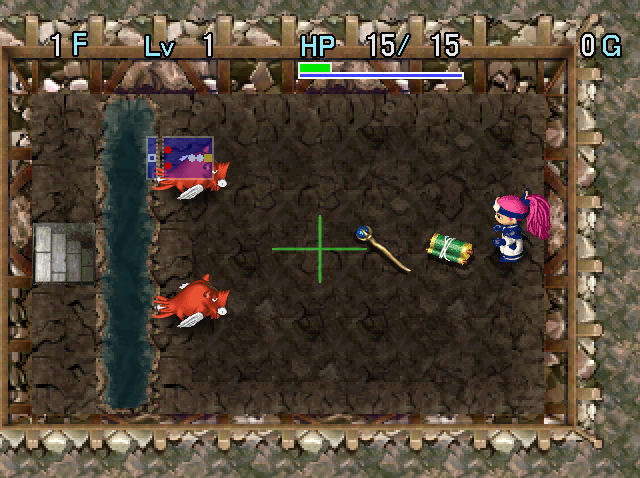

   

Dungeon where floors consist of puzzles, similar to Fay's Puzzles in Shiren 1 and Shiren GB. Items, monsters, and terrain are always the same without any random elements.

<ul class="quickLinksUL">
  <li><a href="#overview">Overview</a></li>
  <li><a href="#strategy">Strategy</a></li>
</ul>

# Overview

<table class="dungeonOverview">
  <tr>
    <th>Unlock</th>
    <td class="highlightYellow">Arrive in Yakagura Forest after clearing Tenrin Hard.</td>
  </tr>
  <tr>
    <th>Entrance</th>
    <td class="highlightYellow">Yakagura Forest (South exit)</td>
  </tr>
</table>

<table class="dungeonTable">
  <tr>
    <th>JP Name</th>
    <td colspan="3">ムラドの試練</td>
  </tr>
  <tr>
    <th>Floors</th>
    <td>20F (story) 50F (postgame)</td>
    <th>Stairs</th>
    <td>Ascending</td>
  </tr>
  <tr>
    <th>Bring Items</th>
    <td>No</td>
    <th>Allies</th>
    <td>No</td>
  </tr>
  <tr>
    <th>Unidentified</th>
    <td colspan="3">None</td>
  </tr>
  <tr>
    <th>Shops</th>
    <td>No</td>
    <th>Monster Houses</th>
    <td>No</td>
  </tr>
  <tr>
    <th>Clear Icon</th>
    <td></td>
    <th>Reward</th>
    <td>Fuuma Stone (50F)</td>
  </tr>
</table>

# Strategy

<ul class="quickLinksUL">
  <li><a href="#dungeon-mechanics">Dungeon Mechanics</a></li>
  <li><a href="#solutions">Solutions</a></li>
</ul>

### Dungeon Mechanics

#### RNG

Turn RNG is the same at the start, so the result will be identical if the same actions are taken.

#### Accuracy

All attacks including arrows and thrown items have 100% accuracy. 
Spry Shield effectively lacks a special ability in this dungeon.

#### Damage

Damage dealt and received have zero variance, with 2 exceptions:

- Throwing a bracelet, scroll, or cursed item deals 1\~2 damage.
- Stepping on a Trip Stone deals 2\~4 damage.

#### Traps

Traps have a 100% activation rate when stepped on. They never break when triggered, except for Pitfall and Summon Trap.

#### Pitfalls

A character that falls into a Pitfall vanishes from the floor and is considered defeated. This applies to any character, including Asuka and Gold Mamels. The Pitfall always disappears after 1 activation.

#### Monster Behavior

Whether or not a monster uses its special attack is random. (100% if it has Enraged status) The direction an enemy proceeds in at a fork in a hallway is random, provided they haven't seen Asuka.

### Solutions

#### 1-20F

Video (Japanese):

<iframe width="560" height="315" src="https://www.youtube.com/embed/xr2kYCemQzk" title="YouTube video player" frameborder="0" allow="accelerometer; clipboard-write; encrypted-media; gyroscope; picture-in-picture" allowfullscreen></iframe>

#### 21-50F

