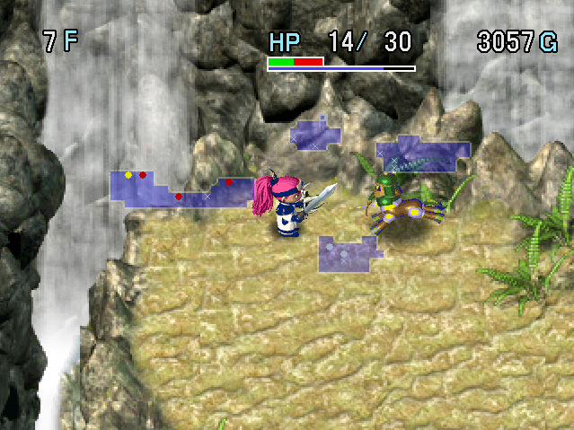

   

Dungeon where you can't level up, and can't increase max HP beyond the 30 points you start with. You can bring 5 items, so the idea is to bring items that let Asuka avoid taking 30+ damage.

Wearing a Mon Box can raise your max HP above 30, so the safest strategy is to bring strong Mon Boxes. This is likely the strategy the developers intended, since Gennou Village sells Mon Boxes and circuits.

<ul class="quickLinksUL">
  <li><a href="#overview">Overview</a></li>
  <li><a href="#strategy">Strategy</a></li>
  <li><a href="#floor-guide">Floor Guide</a></li>
  <li><a href="#monsters">Monsters</a></li>
  <li><a href="#items">Items</a></li>
  <li><a href="#traps">Traps</a></li>
</ul>

# Overview

<table class="dungeonOverview">
  <tr>
    <th>Unlock</th>
    <td class="highlightYellow">Obtain 4 ceremonial items in Yakagura Forest.</td>
  </tr>
  <tr>
    <th>Entrance</th>
    <td class="highlightYellow">Yakagura Forest (North exit)</td>
  </tr>
</table>

<table class="dungeonTable">
  <tr>
    <th>JP Name</th>
    <td colspan="3">リーバの試練</td>
  </tr>
  <tr>
    <th>Floors</th>
    <td>30F</td>
    <th>Stairs</th>
    <td>Descending</td>
  </tr>
  <tr>
    <th>Bring Items</th>
    <td>5 items</td>
    <th>Allies</th>
    <td>No</td>
  </tr>
  <tr>
    <th>Unidentified</th>
    <td colspan="3">All categories</td>
  </tr>
  <tr>
    <th>Shops</th>
    <td>Yes</td>
    <th>Monster Houses</th>
    <td>Regular</td>
  </tr>
  <tr>
    <th>Clear Icon</th>
    <td></td>
    <th>Reward</th>
    <td>None</td>
  </tr>
</table>

# Strategy

<ul class="quickLinksUL">
  <li><a href="#general">General</a></li>
  <li><a href="#important-items">Important Items</a></li>
  <li><a href="#mon-boxes">Mon Boxes</a></li>
</ul>

### General

The safest strategy is to bring strong Mon Boxes, since wearing a Mon Box lets you go above 30 max HP. Bring a Nigiri Boss or Nigiri Master to fill your inventory with onigiri, then rush stairs while wearing a Mon Box. ※ Mon Boxes don't gain experience points here, so you need to level them up elsewhere.

If you prefer to fight as Asuka, you'll want a shield with high defense and seals to counter fixed damage. It's nice to have 爆 (Blast Shield) for Pop Tank and 身 (Dodge Shield) for Gitan thrown by Bored Kappa. Gennou Village doesn't sell onigiri, so you'll probably want a weapon with 飯 (onigiri) seals as well.

Zap and Rockslide traps are never generated, so you generally won't collapse in 1 hit from stepping on a trap. That said, it's best to have Decoy Bracelets or Revival Grass on hand just to be safe.

### Important Items

#### Weapon

Since you're Lv1, you won't deal much damage unless you raise max strength with 根 (Bamboo Sword) seals or bring a weapon with very high base attack and upgrade value.

#### Shield

Fuuma Shield or Iron Shield with +20\~30 upgrade value is ideal.

##### Seals

- 身 (Dodge Shield)
    - Dodge Gitan thrown by Bored Kappas.
- 山 (Echo Shield)
    - Without this, Gazer could make you unequip your shield.
- 爆 (Blast Shield)
    - Reduce damage from Pop Tank's cannonballs.
- 弟 (Otogiriso)
    - Stack multiple seals to counter fixed damage attacks.
    - 爆弟弟弟 pretty much nullifies Pop Tank's cannonballs.

#### Bracelets

- Scout Bracelet
    - Knowing enemy positions is extremely helpful.
- Vision Bracelet
    - Makes traps a non-issue.

#### Other Items

- Revival Grass
    - Better than Decoy Bracelet, but doesn't activate if it's cursed.
    - No effect if it's inside a pot.
- Storage Pot
    - Only counts as 1 item toward the carry-in limit, even if it's filled with items.

### Mon Boxes

No-Magic, Dodge, and Steady circuits are nice to have. Bring at least 8000 Gitan if you need to buy Dodge Circuit in Gennou Village.

#### Grinding Required

- Nigiri Master
    - Enemies defeated by this Mon Box always drop a Large Onigiri. Install 2 Reflect Circuits instead of 1 Dodge Circuit to avoid getting one-shot by thrown onigiri.
- Cave Mamel
    - Combat Mon Box 1. Level it up so you can survive a few cannonball blasts.
- Astral Devil
    - Combat Mon Box 2. Triple speed and powerful, but beware of fullness depletion.

#### Minimal Grinding Required

The listed Mon Boxes are all pretty common, and can put up a fight with minimal leveling. You'll still want to level your main Mon Boxes up to \~Lv20, but that can be done in less than an hour.

- Shagga
    - Found in Bufu Trial (13-18F). Wear it to perform 3 consecutive attacks in 1 turn.
    - Level it to Lv20 - Even better if you upgrade it to Nashagga.
- Horse Ronin
    - Buy in Yakagura Forest. Wear it to shoot Silver Arrows.
    - Level it to Lv20 - It can be risky to leave it out, since it shoots through allies.
- Soldier Ant
    - Found in Bufu Trial (13-14F). General Ant is double speed and can dig wall tiles.
    - Soldier Ant's limit is Lv15, and Captain Ant is Lv30, so it doesn't take too long to reach General Ant.
- King Tusker
    - Buy in Yakagura Forest. Wear it to gain access to an unlimited use Paralysis Staff.
    - Level it to Lv15 - Don't upgrade it to Monarch Tusker since you'll lose the Paralysis Staff special.
- Custard
    - Pud is found in Bufu Trial (8-10F). Every rank has a limit of Lv15.
    - Its special attack deals a fixed 40 damage to a target and all creatures connected to the target.
- Kengo
    - Buy in Yakagura Forest. Use its special to obtain Shoddy Shields.
    - Don't upgrade it to Iai, since knocking away weapons slows things down.
- Fire Bomb
    - Bomb can be obtained from a Baribari event for free. High stats.
    - Bomb's limit is Lv10, and Elec Bomb's limit is Lv20, so it doesn't take long to reach Fire Bomb.
    - Never use its special attack while wearing it, since it makes you instantly collapse.
- Nigiri Morph
    - Nigiri Novice is found in Bufu Trial (3-4F). 15\~20% chance for defeated enemies to drop an Onigiri.
    - It's a bit unreliable as a food source, so upgrade it to Nigiri Boss (100% chance) if possible.
    - Instantly collapses if it gets hit by an onigiri thrown by a Bored Kappa.
- Dance Polygon
    - Laugh Polygon is found in Bufu Trial (5-6F). Use its special to replenish fullness.
    - Paralyze a monster using King Tusker beforehand to ensure safety.

# Floor Guide

This section assumes you're bringing Shagga, Horse Ronin, King Tusker, and Kengo for Mon Boxes, and a Storage Pot[4] with 4 Large Onigiri - If you feel that's too few onigiri, swap King Tusker with another pot.

### 1-3F

Wear Kengo and use its special attack to obtain 2\~3 Shoddy Shields. Keep any Elegant, Gold, Scale, and Dragon shields to sell in Gennou Village.

### 4-6F

You don't gain experience points in this dungeon, so there's no reason to fight monsters. Once you've obtained some Shoddy Shields, start rushing stairs.

### Gennou Village

Sell the shields you stocked up on earlier, and buy as many Decoy Bracelets as you can. Decoy Bracelet completely replenishes fullness when it activates, so it can be used to counter starvation too. Dozikon appears near the end, so buy Dodge Circuits for Shagga, Horse Ronin, and King Tusker. Extinction Scroll isn't necessary to clear this dungeon, but it's fine to buy it if you want.

#### Item Shop

|Item|Price|
|-|-|
|Bow Boy|4000|
|Spearfish|4400|
|Bored Kappa|4600|
|Laugh Polygon|3400|
|Cold Circuit|5000|
|Blast Circuit|5000|
|Dodge Circuit|8000|
|Steady Circuit|5000|
|Decoy Bracelet|7500|
|Extinction Scroll|25000|

### 7-10F

Shuffle Dungeon floors. You shouldn't have trouble thanks to better visibility.

### 11-14F

Random Dungeon floors. Wear a Mon Box in hallways to avoid Curse Girl (9-18F)'s special attack.

### Yomiji Road

#### Inn

Pay 500 Gitan to fully restore HP and fullness.

### 15-16F

Shuffle Dungeon floors.

### 17-20F

Enemies are getting to be a bit stronger, so keep a Decoy Bracelet equipped from this point. Don't forget that you can use King Tusker's Paralysis Staff to avoid fights.

### 21-24F

Pop Tank (21-30F) deals a fixed 20 damage, so it's risky to explore without wearing a Mon Box. It's best to search for the stairs while wearing a Mon Box until the end now.

### 25-30F

Shuffle Dungeon floors. Visibility is good, but Dozikon (25-30F) appears so don't let your guard down. Your run might come to an end if you don't have Dodge Circuits installed on your Mon Boxes. Porko (24-30F) also appears, so really, Dodge Circuit is the key to success.

### Boss

Fight against Lagoon and his hands.

|Name|HP|Atk|Def|Exp|Notes|
|-|-|-|-|-|-|
|Lagoon|300|50|0|9999|・Doesn't move, and immune to fire damage. ・Changes the behavior of his hands based on a dice roll. 　・Oni → Summons hands until there are 2 on the floor, hands summon monsters. 　・Woman → Hands do a 20 damage lightning attack, monsters near hands level up. 　・Clown → Hands power up and deal knockback when they attack. 　・Flame → Fire pillars surround Lagoon and his hands.|
|Lagoon's Hand|50|40|5|500|・Immune to fire damage. ・Behavior changes based on a dice roll.|

Shagga or Horse Ronin can make quick work of Lagoon if they're still alive. Shagga → Wear the Mon Box and use its triple attack on Lagoon's body. Horse Ronin → Wear the Mon Box and shoot Silver Arrows from the starting position.

# Monsters

Enemy Colors: Farming Useful Destroys Items Dangerous Very Dangerous

<table class="monsterTable">
  <thead>
    <tr>
      <th>F</th>
      <th colspan="8">Monsters</th>
    </tr>
  </thead>
  <tbody>
    <tr>
      <th>1</th>
      <td>N'dubba</td>
      <td>Laugh Polygon</td>
      <td>Mid Chintala</td>
      <td>Rocket Boar</td>
      <td>Bow Boy</td>
      <td>Nigiri Novice</td>
      <td>Sluggy</td>
      <td>Tug Frog</td>
    </tr>
    <tr>
      <th>2</th>
      <td>N'dubba Crow Tengu</td>
      <td>Laugh Polygon</td>
      <td>Mid Chintala</td>
      <td>Rocket Boar</td>
      <td>Bow Boy</td>
      <td>Nigiri Novice</td>
      <td>Sluggy</td>
      <td>Tug Frog</td>
    </tr>
    <tr>
      <th>3</th>
      <td>N'dubba Crow Tengu</td>
      <td>Laugh Polygon Shadow Hat</td>
      <td>Mid Chintala Spike Dragon</td>
      <td>Rocket Boar</td>
      <td>Bow Boy</td>
      <td>Nigiri Novice</td>
      <td>Sluggy</td>
      <td>Tug Frog</td>
    </tr>
    <tr>
      <th>4</th>
      <td>N'dubba Crow Tengu</td>
      <td>Laugh Polygon Shadow Hat</td>
      <td>Mid Chintala Spike Dragon</td>
      <td>Rocket Boar Nigiri Morph</td>
      <td>Bow Boy Zalokleft</td>
      <td>Nigiri Novice Froggo</td>
      <td>Sluggy</td>
      <td>Tug Frog</td>
    </tr>
    <tr>
      <th>5</th>
      <td>N'dubba Crow Tengu Thief Pelican</td>
      <td>Laugh Polygon Shadow Hat Pull Frog</td>
      <td>Mid Chintala Spike Dragon Bitter Sluggy</td>
      <td>Rocket Boar Nigiri Morph Tiger Tosser</td>
      <td>Bow Boy Zalokleft Gazer</td>
      <td>Nigiri Novice Froggo</td>
      <td>Sluggy Boy Cart</td>
      <td>Tug Frog Bored Kappa</td>
    </tr>
    <tr>
      <th>6</th>
      <td>N'dubba Thief Pelican</td>
      <td>Laugh Polygon Shadow Hat Pull Frog</td>
      <td>Mid Chintala Spike Dragon Bitter Sluggy</td>
      <td>Rocket Boar Nigiri Morph Tiger Tosser</td>
      <td>Bow Boy Zalokleft Gazer</td>
      <td>Nigiri Novice Pumphantasm</td>
      <td>Sluggy Boy Cart</td>
      <td>Tug Frog Bored Kappa</td>
    </tr>
    <tr>
      <th>7</th>
      <td>N'dubba Spearfish Thief Pelican</td>
      <td>Shadow Hat Pull Frog</td>
      <td>Mid Chintala Spike Dragon Bitter Sluggy</td>
      <td>Rocket Boar Nigiri Morph Tiger Tosser</td>
      <td>Demon Warrior Zalokleft Gazer</td>
      <td>Horse Ronin</td>
      <td>Jagan Mask Boy Cart</td>
      <td>Lovely Locks Bored Kappa</td>
    </tr>
    <tr>
      <th>8</th>
      <td>N'dubba Spearfish Thief Pelican</td>
      <td>Shadow Hat Pull Frog</td>
      <td>Mid Chintala Spike Dragon Bitter Sluggy</td>
      <td>Rocket Boar Nigiri Morph Tiger Tosser</td>
      <td>Demon Warrior Zalokleft</td>
      <td>Horse Ronin Mutaikon</td>
      <td>Jagan Mask Boy Cart</td>
      <td>Lovely Locks Bored Kappa</td>
    </tr>
    <tr>
      <th>9</th>
      <td>N'dubba Bone Dragon Thief Pelican</td>
      <td>Spin Polygon Shadow Hat</td>
      <td>Mid Chintala Spike Dragon Bitter Sluggy</td>
      <td>Rocket Boar Nigiri Morph Tiger Tosser</td>
      <td>Demon Warrior Zalokleft Ether Devil</td>
      <td>Horse Ronin Mutaikon Pumphantasm</td>
      <td>Jagan Mask Boy Cart Inferno</td>
      <td>Lovely Locks Bored Kappa Curse Girl</td>
    </tr>
    <tr>
      <th>10</th>
      <td>N'dubba Bone Dragon Thief Pelican Falcon Tengu</td>
      <td>Spin Polygon Shadow Hat</td>
      <td>Mid Chintala Spike Dragon Bitter Sluggy</td>
      <td>Rocket Boar Nigiri Morph Tiger Tosser</td>
      <td>Demon Warrior Zalokleft Ether Devil</td>
      <td>Horse Ronin Mutaikon Pumphantasm</td>
      <td>Jagan Mask Boy Cart Inferno</td>
      <td>Lovely Locks Bored Kappa Curse Girl</td>
    </tr>
    <tr>
      <th>11</th>
      <td>N'dubba Bone Dragon Falcon Tengu</td>
      <td>Spin Polygon Shadow Hat Pull Frog Schubell</td>
      <td>Kengo Spike Dragon Bitter Sluggy</td>
      <td>Porky Nigiri Morph Tiger Tosser</td>
      <td>Demon Warrior Zalokleft</td>
      <td>Horse Ronin Mutaikon Pumphantasm</td>
      <td>Jagan Mask Boy Cart Inferno</td>
      <td>Lovely Locks Kappa Pest Curse Girl</td>
    </tr>
    <tr>
      <th>12</th>
      <td>N'dubba Bone Dragon Robber Pelican Falcon Tengu</td>
      <td>Spin Polygon Shadow Hat Pull Frog Schubell</td>
      <td>Kengo Spike Dragon Bitter Sluggy</td>
      <td>Porky Nigiri Morph Tiger Tosser</td>
      <td>Demon Warrior Zalokleft</td>
      <td>Horse Ronin Mutaikon Pumphantasm</td>
      <td>Jagan Mask Boy Cart Inferno</td>
      <td>Lovely Locks Kappa Pest Curse Girl</td>
    </tr>
    <tr>
      <th>13</th>
      <td>N'dubba Bone Dragon Robber Pelican Falcon Tengu</td>
      <td>Spin Polygon Black Hat Pull Frog Schubell</td>
      <td>Kengo King Tusker Bitter Sluggy Dragon</td>
      <td>Porky Shagga Tiger Tosser Slime</td>
      <td>Demon Warrior Floor Dragon Lt. Spearfish</td>
      <td>Horse Samurai Mutaikon Pumphantasm Capt. Spearfish</td>
      <td>Jagan Mask Boy Cart Inferno Soldier Ant</td>
      <td>Lovely Locks Kappa Pest Curse Girl</td>
    </tr>
    <tr>
      <th>14</th>
      <td>N'dubba Bone Dragon Robber Pelican Kigny</td>
      <td>Spin Polygon Black Hat Pull Frog Schubell</td>
      <td>Kengo King Tusker Bitter Sluggy Dragon</td>
      <td>Porky Shagga Tiger Tosser Slime</td>
      <td>Demon Warrior Floor Dragon Lt. Spearfish</td>
      <td>Horse Samurai Dazikon Pumphantasm Capt. Spearfish</td>
      <td>Jagan Mask Boy Cart Inferno Soldier Ant</td>
      <td>Lovely Locks Kappa Pest Curse Girl</td>
    </tr>
    <tr>
      <th>15</th>
      <td>N'dubba Bone Dragon Robber Pelican Kigny</td>
      <td>Spin Polygon Black Hat Pull Frog Schubell</td>
      <td>Kengo King Tusker Ironhead Dragon</td>
      <td>Porky Shagga Tiny Phoenix Slime</td>
      <td>Hannya Warrior Floor Dragon Lt. Spearfish</td>
      <td>Horse Samurai Dazikon Pumphantasm Capt. Spearfish</td>
      <td>Jagan Mask Inferno Bat Kangaroo</td>
      <td>Lovely Locks Kappa Pest Curse Girl</td>
    </tr>
    <tr>
      <th>16</th>
      <td>N'dubba Bone Dragon Robber Pelican Kigny Froggucci</td>
      <td>Spin Polygon Black Hat Pull Frog Schubell</td>
      <td>Kengo King Tusker Ironhead Dragon</td>
      <td>Porky Shagga Tiny Phoenix Slime</td>
      <td>Hannya Warrior Floor Dragon Lt. Spearfish</td>
      <td>Horse Samurai Dazikon Pumphantasm Capt. Spearfish</td>
      <td>Jagan Mask Inferno Bat Kangaroo</td>
      <td>Lovely Locks Kappa Pest Curse Girl Taur</td>
    </tr>
    <tr>
      <th>17</th>
      <td>N'dubba Bone Dragon Robber Pelican Kigny Froggucci</td>
      <td>Spin Polygon Black Hat Menbell</td>
      <td>Kengo King Tusker Ironhead</td>
      <td>Porky Shagga Tiny Phoenix Slime</td>
      <td>Hannya Warrior Floor Dragon Ether Devil Bomb</td>
      <td>Horse Samurai Dazikon Pumphantasm</td>
      <td>Jagar Prince Boy Cart Inferno Evil Kangaroo</td>
      <td>Jet Boar Kappa Pest Curse Girl Taur</td>
    </tr>
    <tr>
      <th>18</th>
      <td>N'dubba Bone Dragon Kigny Froggucci</td>
      <td>Spin Polygon Black Hat Menbell</td>
      <td>Kengo King Tusker Ironhead</td>
      <td>Porky Shagga Tiny Phoenix Slime</td>
      <td>Hannya Warrior Floor Dragon Ether Devil Bomb</td>
      <td>Horse Samurai Dazikon</td>
      <td>Jagar Prince Boy Cart Inferno Evil Kangaroo</td>
      <td>Jet Boar Kappa Pest Curse Girl Taur</td>
    </tr>
    <tr>
      <th>19</th>
      <td>N'dubba Skull Dragon Bandit Pelican Kigny Froggucci</td>
      <td>Black Hat Menbell</td>
      <td>Kengo King Tusker Ironhead</td>
      <td>Porky Shagga Tiny Phoenix Slime</td>
      <td>Hannya Warrior Floor Dragon Ether Devil Bomb</td>
      <td>Horse Samurai Dazikon</td>
      <td>Jagar Prince Boy Cart Evil Kangaroo</td>
      <td>Jet Boar Kappa Pest Taur</td>
    </tr>
    <tr>
      <th>20</th>
      <td>N'dubba Skull Dragon Bandit Pelican Kigny</td>
      <td>Dance Polygon Black Hat Menbell</td>
      <td>Kengo King Tusker Ironhead</td>
      <td>Porky Shagga Tiny Phoenix Slime</td>
      <td>Hannya Warrior Dragon Head Ether Devil Bomb</td>
      <td>Horse Samurai Dazikon</td>
      <td>Jagar Prince Boy Cart Evil Kangaroo</td>
      <td>Jet Boar Kappa Pest Taur</td>
    </tr>
    <tr>
      <th>21</th>
      <td>N'dubba Skull Dragon Bandit Pelican Kigny</td>
      <td>Dance Polygon Black Hat Nigiri Boss Menbell</td>
      <td>Iai King Tusker Ironhead Dragon</td>
      <td>Shagga Tiny Phoenix Slime</td>
      <td>Hannya Warrior Dragon Head Ether Devil Bomb</td>
      <td>Horse Samurai Dazikon Pumphantom</td>
      <td>Jagar Prince Pop Tank Rancor Sluggy Bat Kangaroo</td>
      <td>Jet Boar Vexing Kappa Super Gazer Taur</td>
    </tr>
    <tr>
      <th>22</th>
      <td>N'dubba Skull Dragon Bandit Pelican Kigny</td>
      <td>Dance Polygon Black Hat Nigiri Boss Menbell</td>
      <td>Iai King Tusker Ironhead Dragon</td>
      <td>Shagga Tiny Phoenix Slime</td>
      <td>Shogun Dragon Head Ether Devil Bomb</td>
      <td>Horse Samurai Dazikon Pumphantom</td>
      <td>Jagar Prince Pop Tank Rancor Sluggy Bat Kangaroo</td>
      <td>Jet Boar Vexing Kappa Super Gazer Taur</td>
    </tr>
    <tr>
      <th>23</th>
      <td>N'dubba Skull Dragon Bandit Pelican Lime Zalokleft</td>
      <td>Dance Polygon Big Chintala Nigiri Boss Menbell</td>
      <td>Iai Monarch Tusker Ironhead Dragon</td>
      <td>Tiny Phoenix</td>
      <td>Shogun Dragon Head Ether Devil Bomb</td>
      <td>Horse Shogun Pumphantom</td>
      <td>Jagar Prince Pop Tank Rancor Sluggy Bat Kangaroo</td>
      <td>Jet Boar Vexing Kappa Super Gazer Taur</td>
    </tr>
    <tr>
      <th>24</th>
      <td>N'dubba Skull Dragon Bandit Pelican Lime Zalokleft</td>
      <td>Dance Polygon Big Chintala Nigiri Boss Menbell</td>
      <td>Iai Monarch Tusker Ironhead Dragon</td>
      <td>Porko Nashagga Tiny Phoenix</td>
      <td>Shogun Dragon Head Minotaur Bomb</td>
      <td>Horse Shogun Pumphantom</td>
      <td>Jagar Prince Pop Tank Rancor Sluggy Bat Kangaroo</td>
      <td>Jet Boar Vexing Kappa Super Gazer Taur</td>
    </tr>
    <tr>
      <th>25</th>
      <td>N'dubba Skull Dragon Muron Lime Zalokleft</td>
      <td>Dance Polygon Big Chintala Nigiri Boss Menbell</td>
      <td>Iai Monarch Tusker Chainhead Dragon</td>
      <td>Porko Nashagga</td>
      <td>Shogun Dragon Head Minotaur Bomb</td>
      <td>Horse Shogun Dozikon Pumphantom</td>
      <td>Jagar Prince Pop Tank Rancor Sluggy</td>
      <td>Jet Boar Curse Sister Super Gazer Taur</td>
    </tr>
    <tr>
      <th>26</th>
      <td>N'dubba Skull Dragon Muron</td>
      <td>Dance Polygon Big Chintala Nigiri Boss Menbell</td>
      <td>Iai Monarch Tusker Chainhead Dragon</td>
      <td>Porko Nashagga</td>
      <td>Shogun Dragon Head Minotaur Bomb</td>
      <td>Horse Shogun Dozikon Pumphantom</td>
      <td>Jagar Prince Pop Tank Rancor Sluggy</td>
      <td>Jet Boar Curse Sister Super Gazer</td>
    </tr>
    <tr>
      <th>27</th>
      <td>N'dubba Skull Dragon Muron</td>
      <td>Dance Polygon Big Chintala Nigiri Boss</td>
      <td>Iai Monarch Tusker Chainhead</td>
      <td>Porko Nashagga</td>
      <td>Shogun Dragon Head Minotaur</td>
      <td>Horse Shogun Dozikon Pumphantom</td>
      <td>Pop Tank Rancor Sluggy</td>
      <td>Curse Sister Super Gazer</td>
    </tr>
    <tr>
      <th>28</th>
      <td>N'dubba Skull Dragon Muron</td>
      <td>Dance Polygon Big Chintala Nigiri Boss</td>
      <td>Iai Monarch Tusker Chainhead</td>
      <td>Porko Nashagga</td>
      <td>Shogun Dragon Head Minotaur</td>
      <td>Horse Shogun Dozikon Pumphantom</td>
      <td>Pop Tank Rancor Sluggy</td>
      <td>Curse Sister Super Gazer</td>
    </tr>
    <tr>
      <th>29</th>
      <td>N'dubba Muron</td>
      <td>Dance Polygon Big Chintala Nigiri Boss</td>
      <td>Iai Monarch Tusker Chainhead</td>
      <td>Porko Nashagga</td>
      <td>Shogun Dragon Head Minotaur</td>
      <td>Horse Shogun Dozikon Pumphantom</td>
      <td>Pop Tank Rancor Sluggy</td>
      <td>Curse Sister Super Gazer</td>
    </tr>
    <tr>
      <th>30</th>
      <td>N'dubba Muron</td>
      <td>Big Chintala Nigiri Boss</td>
      <td>Iai Monarch Tusker Chainhead</td>
      <td>Porko Nashagga</td>
      <td>Shogun Minotaur</td>
      <td>Horse Shogun Dozikon Pumphantom</td>
      <td>Pop Tank Rancor Sluggy</td>
      <td>Curse Sister Super Gazer</td>
    </tr>
  </tbody>
</table>

# Items

The values like "1-18" and "19+" in columns represent the floor range where the item can appear.

- F = Floor
- S = Shop
- E = Special Shop

 

<table class="dungeonItemTable">
  <tr>
    <th colspan="4" class="highlightNeon">Weapon</th>
    <th rowspan="76"></th>
    <th colspan="4" class="highlightNeon">Bracelet</th>
    <th rowspan="76"></th>
    <th colspan="4" class="highlightNeon">Grass</th>
  </tr>
  <tr>
    <th>Name</th>
    <th>F</th>
    <th>S</th>
    <th>E</th>
    <th>Name</th>
    <th>F</th>
    <th>S</th>
    <th>E</th>
    <th>Name</th>
    <th>F</th>
    <th>S</th>
    <th>E</th>
  </tr>
  <tr>
    <td class="leftText">Wooden Sword</td>
    <td></td>
    <td>19+</td>
    <td></td>
    <td class="leftText">Calm Bracelet</td>
    <td>X</td>
    <td>X</td>
    <td>X</td>
    <td class="leftText">Weeds</td>
    <td></td>
    <td></td>
    <td></td>
  </tr>
  <tr>
    <td class="leftText">Club</td>
    <td></td>
    <td></td>
    <td></td>
    <td class="leftText">No-Rust Bracelet</td>
    <td>X</td>
    <td>X</td>
    <td>X</td>
    <td class="leftText">Herb</td>
    <td>X</td>
    <td>X</td>
    <td>X</td>
  </tr>
  <tr>
    <td class="leftText">Nagamaki</td>
    <td>X</td>
    <td></td>
    <td></td>
    <td class="leftText">Alert Bracelet</td>
    <td>X</td>
    <td>X</td>
    <td>X</td>
    <td class="leftText">Sleep Grass</td>
    <td>X</td>
    <td>X</td>
    <td>X</td>
  </tr>
  <tr>
    <td class="leftText">Katana</td>
    <td>X</td>
    <td></td>
    <td></td>
    <td class="leftText">Holy Bracelet</td>
    <td>X</td>
    <td>X</td>
    <td>X</td>
    <td class="leftText">Dizzy Grass</td>
    <td>X</td>
    <td></td>
    <td>X</td>
  </tr>
  <tr>
    <td class="leftText">Dotanuki</td>
    <td>X</td>
    <td>1-18</td>
    <td>X</td>
    <td class="leftText">Bind Bracelet</td>
    <td>X</td>
    <td>X</td>
    <td>X</td>
    <td class="leftText">Swift Seed</td>
    <td>X</td>
    <td>X</td>
    <td>X</td>
  </tr>
  <tr>
    <td class="leftText">Kabura's Blade</td>
    <td></td>
    <td>1-18</td>
    <td>X</td>
    <td class="leftText">Warp Bracelet</td>
    <td>X</td>
    <td></td>
    <td></td>
    <td class="leftText">Warp Grass</td>
    <td>X</td>
    <td>X</td>
    <td>X</td>
  </tr>
  <tr>
    <td class="leftText">Ghost Sickle</td>
    <td>X</td>
    <td>1-18</td>
    <td>X</td>
    <td class="leftText">Strength Bracelet</td>
    <td>X</td>
    <td>X</td>
    <td>X</td>
    <td class="leftText">Amnesia Grass</td>
    <td>X</td>
    <td></td>
    <td></td>
  </tr>
  <tr>
    <td class="leftText">Marine Slasher</td>
    <td></td>
    <td>X</td>
    <td>X</td>
    <td class="leftText">Thief Bracelet</td>
    <td>X</td>
    <td>X</td>
    <td>X</td>
    <td class="leftText">Kigny Seed</td>
    <td>X</td>
    <td></td>
    <td></td>
  </tr>
  <tr>
    <td class="leftText">Cyclops Killer</td>
    <td>X</td>
    <td>1-18, 21+</td>
    <td>X</td>
    <td class="leftText">Wish Bracelet</td>
    <td></td>
    <td></td>
    <td>X</td>
    <td class="leftText">Twisty Grass</td>
    <td>X</td>
    <td></td>
    <td>X</td>
  </tr>
  <tr>
    <td class="leftText">Drain Buster</td>
    <td>X</td>
    <td>1-18, 21+</td>
    <td>X</td>
    <td class="leftText">Pierce Bracelet</td>
    <td>X</td>
    <td>X</td>
    <td>X</td>
    <td class="leftText">Life Grass</td>
    <td></td>
    <td>X</td>
    <td>X</td>
  </tr>
  <tr>
    <td class="leftText">Crescent Arm</td>
    <td>X</td>
    <td>X</td>
    <td>X</td>
    <td class="leftText">Bullseye Bracelet</td>
    <td>X</td>
    <td>X</td>
    <td>X</td>
    <td class="leftText">Antidote Grass</td>
    <td>X</td>
    <td>1-18</td>
    <td>X</td>
  </tr>
  <tr>
    <td class="leftText">Dragon Killer</td>
    <td>X</td>
    <td>1-18</td>
    <td>X</td>
    <td class="leftText">Bend Bracelet</td>
    <td>X</td>
    <td></td>
    <td>X</td>
    <td class="leftText">Expand Seed</td>
    <td>X</td>
    <td>1-18</td>
    <td>X</td>
  </tr>
  <tr>
    <td class="leftText">Sapping Branch</td>
    <td>X</td>
    <td>11+</td>
    <td>X</td>
    <td class="leftText">Heal Bracelet</td>
    <td>X</td>
    <td>X</td>
    <td>X</td>
    <td class="leftText">Shrink Seed</td>
    <td>X</td>
    <td></td>
    <td></td>
  </tr>
  <tr>
    <td class="leftText">Pickaxe</td>
    <td>X</td>
    <td>1-18</td>
    <td>X</td>
    <td class="leftText">No-Drain Bracelet</td>
    <td></td>
    <td></td>
    <td>X</td>
    <td class="leftText">Disaster Seed</td>
    <td></td>
    <td></td>
    <td></td>
  </tr>
  <tr>
    <td class="leftText">Razor Wind</td>
    <td>X</td>
    <td>1-18, 21+</td>
    <td>X</td>
    <td class="leftText">Vision Bracelet</td>
    <td>X</td>
    <td>X</td>
    <td>X</td>
    <td class="leftText">Otogiriso</td>
    <td></td>
    <td></td>
    <td>X</td>
  </tr>
  <tr>
    <td class="leftText">Froggo Whip</td>
    <td></td>
    <td></td>
    <td></td>
    <td class="leftText">Critical Bracelet</td>
    <td>X</td>
    <td>X</td>
    <td>X</td>
    <td class="leftText">Sight Grass</td>
    <td>X</td>
    <td>X</td>
    <td>X</td>
  </tr>
  <tr>
    <td class="leftText">Bamboo Sword</td>
    <td>X</td>
    <td>11+</td>
    <td>X</td>
    <td class="leftText">Regret Bracelet</td>
    <td>X</td>
    <td>X</td>
    <td>X</td>
    <td class="leftText">Dragon Grass</td>
    <td>X</td>
    <td>1-18</td>
    <td>X</td>
  </tr>
  <tr>
    <td class="leftText">Gold Sword</td>
    <td>1-20</td>
    <td>X</td>
    <td>X</td>
    <td class="leftText">Protect Bracelet</td>
    <td>X</td>
    <td>X</td>
    <td>X</td>
    <td class="leftText">Flame Grass</td>
    <td>X</td>
    <td>1-18</td>
    <td>X</td>
  </tr>
  <tr>
    <td class="leftText">Onigiri Sword</td>
    <td></td>
    <td></td>
    <td></td>
    <td class="leftText">Decoy Bracelet</td>
    <td>X</td>
    <td>X</td>
    <td>X</td>
    <td class="leftText">Boost Grass</td>
    <td>X</td>
    <td>X</td>
    <td>X</td>
  </tr>
  <tr>
    <td class="leftText">Homing Blade</td>
    <td>21+</td>
    <td></td>
    <td></td>
    <td class="leftText">Float Bracelet</td>
    <td>X</td>
    <td>X</td>
    <td>X</td>
    <td class="leftText">Strength Seed</td>
    <td>1-7</td>
    <td>X</td>
    <td>X</td>
  </tr>
  <tr>
    <td class="leftText">Dried Bonito</td>
    <td>X</td>
    <td>X</td>
    <td>X</td>
    <td class="leftText">Scout Bracelet</td>
    <td>X</td>
    <td>X</td>
    <td>X</td>
    <td class="leftText">Poison Grass</td>
    <td>X</td>
    <td></td>
    <td></td>
  </tr>
  <tr>
    <td class="leftText">Bladed Wheel</td>
    <td>21+</td>
    <td></td>
    <td></td>
    <td class="leftText">Phantasm Bracelet</td>
    <td>X</td>
    <td>X</td>
    <td>X</td>
    <td class="leftText">Happy Grass</td>
    <td></td>
    <td>X</td>
    <td>X</td>
  </tr>
  <tr>
    <td class="leftText">Crisis Sword</td>
    <td></td>
    <td></td>
    <td></td>
    <td class="leftText">Bargain Bracelet</td>
    <td>X</td>
    <td></td>
    <td></td>
    <td class="leftText">Unlucky Seed</td>
    <td></td>
    <td></td>
    <td></td>
  </tr>
  <tr>
    <td class="leftText">Kengo's Katana</td>
    <td></td>
    <td></td>
    <td></td>
    <td class="leftText">Parry Bracelet</td>
    <td>X</td>
    <td>X</td>
    <td>X</td>
    <td class="leftText">Invincible Grass</td>
    <td>X</td>
    <td>X</td>
    <td>X</td>
  </tr>
  <tr>
    <td class="leftText">Tessen</td>
    <td>X</td>
    <td>11+</td>
    <td>X</td>
    <td class="leftText">Happy Bracelet</td>
    <td>X</td>
    <td>X</td>
    <td>X</td>
    <td class="leftText">Revival Grass</td>
    <td>X</td>
    <td>X</td>
    <td>X</td>
  </tr>
  <tr>
    <td class="leftText">Shoddy Sword</td>
    <td>X</td>
    <td>1-18, 22+</td>
    <td>X</td>
    <td class="leftText">Nirvana Bracelet</td>
    <td>X</td>
    <td>X</td>
    <td>X</td>
    <td class="leftText">Angel Seed</td>
    <td></td>
    <td>X</td>
    <td>X</td>
  </tr>
  <tr>
    <td class="leftText">Morning Star</td>
    <td>X</td>
    <td>X</td>
    <td>X</td>
    <td class="leftText">Hunger Bracelet</td>
    <td>X</td>
    <td></td>
    <td></td>
    <th colspan="4" class="highlightNeon">Staff</th>
  </tr>
  <tr>
    <td class="leftText">Power Pole</td>
    <td>X</td>
    <td>X</td>
    <td>X</td>
    <td class="leftText">Spirit Bracelet</td>
    <td></td>
    <td>X</td>
    <td>X</td>
    <th>Name</th>
    <th>F</th>
    <th>S</th>
    <th>E</th>
  </tr>
  <tr>
    <td class="leftText">Ironhead's Head</td>
    <td></td>
    <td></td>
    <td></td>
    <td class="leftText">Identify Bracelet</td>
    <td>X</td>
    <td></td>
    <td>X</td>
    <td class="leftText">Knockback Staff</td>
    <td>X</td>
    <td></td>
    <td>X</td>
  </tr>
  <tr>
    <td class="leftText">Spear</td>
    <td>X</td>
    <td>1-18</td>
    <td>X</td>
    <td class="leftText">Trapper Bracelet</td>
    <td></td>
    <td></td>
    <td></td>
    <td class="leftText">Rage Staff</td>
    <td></td>
    <td></td>
    <td></td>
  </tr>
  <tr>
    <td class="leftText">Blast Hammer</td>
    <td></td>
    <td>1-18, 22+</td>
    <td>X</td>
    <th colspan="4" class="highlightNeon">Scroll</th>
    <td class="leftText">Empathy Staff</td>
    <td>X</td>
    <td></td>
    <td>X</td>
  </tr>
  <tr>
    <td class="leftText">Mallet</td>
    <td>X</td>
    <td>X</td>
    <td>X</td>
    <th>Name</th>
    <th>F</th>
    <th>S</th>
    <th>E</th>
    <td class="leftText">Exchange Staff</td>
    <td>X</td>
    <td></td>
    <td>X</td>
  </tr>
  <tr>
    <td class="leftText">Minotaur's Axe</td>
    <td></td>
    <td></td>
    <td></td>
    <td class="leftText">Trap Scroll</td>
    <td>X</td>
    <td></td>
    <td>X</td>
    <td class="leftText">Monster Staff</td>
    <td>X</td>
    <td></td>
    <td>X</td>
  </tr>
  <tr>
    <td class="leftText">Yomino Minasoko</td>
    <td></td>
    <td></td>
    <td></td>
    <td class="leftText">Identify Scroll</td>
    <td>X</td>
    <td>X</td>
    <td>X</td>
    <td class="leftText">Bomb Staff</td>
    <td>X</td>
    <td></td>
    <td>X</td>
  </tr>
  <tr>
    <th colspan="4" class="highlightNeon">Shield</th>
    <td class="leftText">Navigation Scroll</td>
    <td>X</td>
    <td>X</td>
    <td>X</td>
    <td class="leftText">Swap Staff</td>
    <td>X</td>
    <td></td>
    <td>X</td>
  </tr>
  <tr>
    <th>Name</th>
    <th>F</th>
    <th>S</th>
    <th>E</th>
    <td class="leftText">Puddle Scroll</td>
    <td>X</td>
    <td>X</td>
    <td>X</td>
    <td class="leftText">Pull Staff</td>
    <td>X</td>
    <td></td>
    <td>X</td>
  </tr>
  <tr>
    <td class="leftText">Wooden Shield</td>
    <td></td>
    <td></td>
    <td></td>
    <td class="leftText">Burn Scroll</td>
    <td>X</td>
    <td>X</td>
    <td>X</td>
    <td class="leftText">Heal Staff</td>
    <td>X</td>
    <td></td>
    <td>X</td>
  </tr>
  <tr>
    <td class="leftText">Elegant Shield</td>
    <td>X</td>
    <td>1-18</td>
    <td>X</td>
    <td class="leftText">Retreat Scroll</td>
    <td></td>
    <td>X</td>
    <td>X</td>
    <td class="leftText">Balance Staff</td>
    <td>X</td>
    <td></td>
    <td>X</td>
  </tr>
  <tr>
    <td class="leftText">Bronze Shield</td>
    <td>X</td>
    <td></td>
    <td></td>
    <td class="leftText">Purify Scroll</td>
    <td>X</td>
    <td>X</td>
    <td>X</td>
    <td class="leftText">Slow Staff</td>
    <td>X</td>
    <td></td>
    <td>X</td>
  </tr>
  <tr>
    <td class="leftText">Iron Shield</td>
    <td>X</td>
    <td></td>
    <td></td>
    <td class="leftText">Fear Scroll</td>
    <td>X</td>
    <td>X</td>
    <td>X</td>
    <td class="leftText">Transient Staff</td>
    <td>X</td>
    <td></td>
    <td>X</td>
  </tr>
  <tr>
    <td class="leftText">Beast Shield</td>
    <td></td>
    <td></td>
    <td></td>
    <td class="leftText">Accuracy Scroll</td>
    <td>X</td>
    <td>X</td>
    <td>X</td>
    <td class="leftText">Paralysis Staff</td>
    <td>X</td>
    <td></td>
    <td>X</td>
  </tr>
  <tr>
    <td class="leftText">Fuuma Shield</td>
    <td></td>
    <td>X</td>
    <td>X</td>
    <td class="leftText">Cheer Scroll</td>
    <td>X</td>
    <td></td>
    <td></td>
    <td class="leftText">Seal Staff</td>
    <td>X</td>
    <td></td>
    <td>X</td>
  </tr>
  <tr>
    <td class="leftText">Leather Shield</td>
    <td>X</td>
    <td>1-18</td>
    <td>X</td>
    <td class="leftText">Trap Erase Scroll</td>
    <td>X</td>
    <td>X</td>
    <td>X</td>
    <td class="leftText">Lightning Staff</td>
    <td>X</td>
    <td></td>
    <td>X</td>
  </tr>
  <tr>
    <td class="leftText">Spry Shield</td>
    <td></td>
    <td>1-18</td>
    <td>X</td>
    <td class="leftText">Pin Scroll</td>
    <td>X</td>
    <td>X</td>
    <td>X</td>
    <td class="leftText">Invisible Staff</td>
    <td>X</td>
    <td></td>
    <td>X</td>
  </tr>
  <tr>
    <td class="leftText">Echo Shield</td>
    <td></td>
    <td>1-18</td>
    <td>X</td>
    <td class="leftText">Gravity Scroll</td>
    <td>X</td>
    <td></td>
    <td></td>
    <td class="leftText">Tunnel Staff</td>
    <td>X</td>
    <td></td>
    <td>X</td>
  </tr>
  <tr>
    <td class="leftText">Festive Shield</td>
    <td></td>
    <td></td>
    <td>X</td>
    <td class="leftText">Escape Scroll</td>
    <td>X</td>
    <td>X</td>
    <td>X</td>
    <td class="leftText">Decoy Staff</td>
    <td>X</td>
    <td></td>
    <td>X</td>
  </tr>
  <tr>
    <td class="leftText">Walrus Shield</td>
    <td>X</td>
    <td>1-18</td>
    <td>X</td>
    <td class="leftText">Heaven Scroll</td>
    <td>X</td>
    <td>X</td>
    <td>X</td>
    <td class="leftText">Quarter Staff</td>
    <td></td>
    <td></td>
    <td></td>
  </tr>
  <tr>
    <td class="leftText">Gold Shield</td>
    <td>1-24</td>
    <td>X</td>
    <td>X</td>
    <td class="leftText">Earth Scroll</td>
    <td>X</td>
    <td>X</td>
    <td>X</td>
    <td class="leftText">Swift Staff</td>
    <td>X</td>
    <td></td>
    <td>X</td>
  </tr>
  <tr>
    <td class="leftText">Rubber Shield</td>
    <td>X</td>
    <td>X</td>
    <td>X</td>
    <td class="leftText">Slumber Scroll</td>
    <td>X</td>
    <td>X</td>
    <td>X</td>
    <td class="leftText">Fury Staff</td>
    <td></td>
    <td></td>
    <td></td>
  </tr>
  <tr>
    <td class="leftText">Froggo Shield</td>
    <td></td>
    <td></td>
    <td>X</td>
    <td class="leftText">Blaze Scroll</td>
    <td>X</td>
    <td>X</td>
    <td>X</td>
    <td class="leftText">Miss Staff</td>
    <td>X</td>
    <td></td>
    <td>X</td>
  </tr>
  <tr>
    <td class="leftText">Blast Shield</td>
    <td>X</td>
    <td>X</td>
    <td>X</td>
    <td class="leftText">Confusion Scroll</td>
    <td>X</td>
    <td>X</td>
    <td>X</td>
    <td class="leftText">Fire Staff</td>
    <td>X</td>
    <td></td>
    <td>X</td>
  </tr>
  <tr>
    <td class="leftText">Counter Shield</td>
    <td>X</td>
    <td>1-18</td>
    <td>X</td>
    <td class="leftText">Rockfall Scroll</td>
    <td>X</td>
    <td>X</td>
    <td>X</td>
    <td class="leftText">Happy Staff</td>
    <td>X</td>
    <td></td>
    <td>X</td>
  </tr>
  <tr>
    <td class="leftText">Bowl Shield</td>
    <td>X</td>
    <td>X</td>
    <td>X</td>
    <td class="leftText">Lightning Scroll</td>
    <td>X</td>
    <td>X</td>
    <td>X</td>
    <td class="leftText">Unlucky Staff</td>
    <td>X</td>
    <td></td>
    <td>X</td>
  </tr>
  <tr>
    <td class="leftText">Dodge Shield</td>
    <td></td>
    <td></td>
    <td></td>
    <td class="leftText">Fixer Scroll</td>
    <td>X</td>
    <td>X</td>
    <td>X</td>
    <th colspan="4" class="highlightNeon">Pot</th>
  </tr>
  <tr>
    <td class="leftText">Scale Shield</td>
    <td>1-24</td>
    <td>X</td>
    <td>X</td>
    <td class="leftText">Trouble Scroll</td>
    <td>X</td>
    <td></td>
    <td></td>
    <th>Name</th>
    <th>F</th>
    <th>S</th>
    <th>E</th>
  </tr>
  <tr>
    <td class="leftText">Happy Shield</td>
    <td>X</td>
    <td>X</td>
    <td>X</td>
    <td class="leftText">Mon House Scroll</td>
    <td></td>
    <td></td>
    <td></td>
    <td class="leftText">Heal Pot</td>
    <td>X</td>
    <td>X</td>
    <td>X</td>
  </tr>
  <tr>
    <td class="leftText">Steady Shield</td>
    <td>X</td>
    <td>X</td>
    <td></td>
    <td class="leftText">Technique Scroll</td>
    <td></td>
    <td></td>
    <td></td>
    <td class="leftText">Water Pot</td>
    <td>X</td>
    <td>1-16</td>
    <td>X</td>
  </tr>
  <tr>
    <td class="leftText">Dragon Shield</td>
    <td>X</td>
    <td>X</td>
    <td>X</td>
    <td class="leftText">Desert Scroll</td>
    <td>X</td>
    <td>X</td>
    <td></td>
    <td class="leftText">Degrade Pot</td>
    <td>X</td>
    <td></td>
    <td></td>
  </tr>
  <tr>
    <td class="leftText">Heavy Shield</td>
    <td>X</td>
    <td>1-18</td>
    <td>X</td>
    <td class="leftText">Great Hall Scroll</td>
    <td>X</td>
    <td>X</td>
    <td>X</td>
    <td class="leftText">Storage Pot</td>
    <td>X</td>
    <td>1-16</td>
    <td>X</td>
  </tr>
  <tr>
    <td class="leftText">Frontal Shield</td>
    <td></td>
    <td></td>
    <td></td>
    <td class="leftText">Sturdy Pot Scroll</td>
    <td>X</td>
    <td>X</td>
    <td>X</td>
    <td class="leftText">Sale Pot</td>
    <td>X</td>
    <td>1-16</td>
    <td>X</td>
  </tr>
  <tr>
    <td class="leftText">Shoddy Shield</td>
    <td>X</td>
    <td>1-18</td>
    <td>X</td>
    <td class="leftText">Pot Expand Scroll</td>
    <td>X</td>
    <td>X</td>
    <td>X</td>
    <td class="leftText">Identify Pot</td>
    <td>X</td>
    <td>X</td>
    <td>X</td>
  </tr>
  <tr>
    <td class="leftText">Halberd Shield</td>
    <td>1-24</td>
    <td>1-18</td>
    <td>X</td>
    <td class="leftText">Copy Scroll</td>
    <td>X</td>
    <td>X</td>
    <td>X</td>
    <td class="leftText">Presto Pot</td>
    <td>X</td>
    <td>1-16</td>
    <td>X</td>
  </tr>
  <tr>
    <td class="leftText">Grand Counter</td>
    <td></td>
    <td></td>
    <td></td>
    <td class="leftText">Suction Scroll</td>
    <td>X</td>
    <td>X</td>
    <td>X</td>
    <td class="leftText">Hide Pot</td>
    <td>X</td>
    <td>X</td>
    <td>X</td>
  </tr>
  <tr>
    <td class="leftText">Yomino Mikogami</td>
    <td></td>
    <td></td>
    <td></td>
    <td class="leftText">Plating Scroll</td>
    <td>X</td>
    <td>X</td>
    <td>X</td>
    <td class="leftText">Black Hole Pot</td>
    <td>X</td>
    <td></td>
    <td></td>
  </tr>
  <tr>
    <th colspan="4" class="highlightNeon">Projectile</th>
    <td class="leftText">Blank Scroll</td>
    <td>X</td>
    <td>X</td>
    <td>X</td>
    <td class="leftText">Sticky Pot</td>
    <td>X</td>
    <td></td>
    <td></td>
  </tr>
  <tr>
    <th>Name</th>
    <th>F</th>
    <th>S</th>
    <th>E</th>
    <td class="leftText">Sanctuary Scroll</td>
    <td>X</td>
    <td>X</td>
    <td>X</td>
    <td class="leftText">Mailing Pot</td>
    <td>X</td>
    <td>X</td>
    <td>X</td>
  </tr>
  <tr>
    <td class="leftText">Wood Arrow</td>
    <td>1-14</td>
    <td></td>
    <td>X</td>
    <td class="leftText">Extinction Scroll</td>
    <td>X</td>
    <td>X</td>
    <td>X</td>
    <td class="leftText">Synthesis Pot</td>
    <td>X</td>
    <td>X</td>
    <td>X</td>
  </tr>
  <tr>
    <td class="leftText">Iron Arrow</td>
    <td>7-24</td>
    <td>X</td>
    <td>X</td>
    <th colspan="4" class="highlightNeon">Food</th>
    <td class="leftText">Blessing Pot</td>
    <td></td>
    <td></td>
    <td></td>
  </tr>
  <tr>
    <td class="leftText">Silver Arrow</td>
    <td>19+</td>
    <td>X</td>
    <td>X</td>
    <th>Name</th>
    <th>F</th>
    <th>S</th>
    <th>E</th>
    <td class="leftText">Upgrade Pot</td>
    <td>21+</td>
    <td></td>
    <td></td>
  </tr>
  <tr>
    <td class="leftText">Critical Arrow</td>
    <td>X</td>
    <td>11+</td>
    <td>X</td>
    <td class="leftText">Onigiri</td>
    <td>X</td>
    <td></td>
    <td>X</td>
    <th colspan="4" class="highlightNeon">Other</th>
  </tr>
  <tr>
    <td class="leftText">Razor Arrow</td>
    <td>X</td>
    <td>11+</td>
    <td>X</td>
    <td class="leftText">Large Onigiri</td>
    <td>X</td>
    <td>1-18</td>
    <td>X</td>
    <th>Name</th>
    <th>F</th>
    <th>S</th>
    <th>E</th>
  </tr>
  <tr>
    <td class="leftText">Cannonball</td>
    <td>X</td>
    <td></td>
    <td></td>
    <td class="leftText">Huge Onigiri</td>
    <td>X</td>
    <td>X</td>
    <td>X</td>
    <td class="leftText">Gitan</td>
    <td>X</td>
    <td></td>
    <td></td>
  </tr>
  <tr>
    <td class="leftText">Porky Rock</td>
    <td>X</td>
    <td></td>
    <td></td>
    <td class="leftText">Special Onigiri</td>
    <td></td>
    <td>X</td>
    <td>X</td>
    <td rowspan="2" colspan="4" class="highlightGray"></td>
  </tr>
  <tr>
    <td colspan="4" class="highlightGray"></td>
    <td class="leftText">Spoiled Onigiri</td>
    <td>X</td>
    <td></td>
    <td></td>
  </tr>
</table>

# Traps
