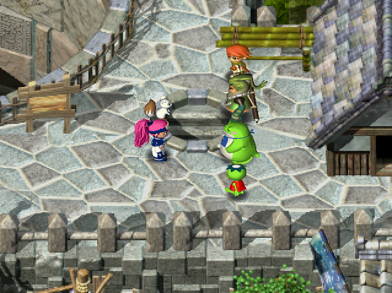

   

The final dungeon of the main story, which can be challenged after clearing all 7 trials. It has a depth of 36F, the monster table ramps up quickly, and Monster Houses are pretty common. There's also a rematch against a member of the Eight Fiends group every 4 floors during the first clear.

That might sound intimidating, but you're allowed to bring items, so it tends to be manageable. Bring your strongest equipment and Mon Boxes, and be careful around Curse Girl and Kengo types. Enraged and furious monsters are also mean, so don't let down your guard even if things are going well.

A staircase leading to treasure appears on the deepest floor after clearing the main story. The right side leads to Amano Kagura (weapon), and the left side leads to Hoshino Mikoshi (shield). Only 1 is obtainable per visit, and if you already have the item, there will be an Upgrade Pot[1] instead.

<ul class="quickLinksUL">
  <li><a href="#overview">Overview</a></li>
  <li><a href="#strategy">Strategy</a></li>
  <li><a href="#floor-guide">Floor Guide</a></li>
  <li><a href="#monsters">Monsters</a></li>
  <li><a href="#items">Items</a></li>
  <li><a href="#traps">Traps</a></li>
</ul>

# Overview

<table class="dungeonOverview">
  <tr>
    <th>Unlock</th>
    <td class="highlightYellow">Obtain 8 ceremonial items in Yakagura Forest.</td>
  </tr>
  <tr>
    <th>Entrance</th>
    <td class="highlightYellow">Shichiten City (Near large hole)</td>
  </tr>
</table>

<table class="dungeonTable">
  <tr>
    <th>JP Name</th>
    <td colspan="3">星華の大筒</td>
  </tr>
  <tr>
    <th>Floors</th>
    <td>36F</td>
    <th>Stairs</th>
    <td>Descending</td>
  </tr>
  <tr>
    <th>Bring Items</th>
    <td>Yes</td>
    <th>Allies</th>
    <td>Yes</td>
  </tr>
  <tr>
    <th>Unidentified</th>
    <td colspan="3">All categories</td>
  </tr>
  <tr>
    <th>Shops</th>
    <td>Yes</td>
    <th>Monster Houses</th>
    <td>Regular</td>
  </tr>
  <tr>
    <th>Clear Icon</th>
    <td></td>
    <th>Reward</th>
    <td>Amano Kagura (right) Hoshino Mikoshi (left)</td>
  </tr>
</table>

※ If you already have the reward equipment, there will be an Upgrade Pot[1] instead.

# Strategy

<ul class="quickLinksUL">
  <li><a href="#general">General</a></li>
  <li><a href="#equipment">Equipment</a></li>
  <li><a href="#other-items">Other Items</a></li>
</ul>

### General

The order of boss appearances is Tina → Soran & Doran → Sanju → Aquila → Ponto → Nemuri → Kufuku. Every Eight Fiends boss has the same stats and abilities as before, and Soran & Doran don't actually fight.

If you have a Cave Mamel box, you can quickly win most of these fights just by throwing it at the boss. However, you'll want to play more carefully against Nemuri since she deals fixed damage. Mon Boxes are also innately immune to the final boss's lightning attacks.

It's best to rush stairs between 21-24F and possibly 25-32F due to the lineup of dangerous monsters.

### Equipment

#### Weapon

##### Main Weapon

<table class="dungeonTable">
  <thead>
    <tr>
      <th>Name</th>
      <th>Atk</th>
      <th>Slot</th>
      <th>Notes</th>
    </tr>
  </thead>
  <tbody>
    <tr>
      <td class="highlightGray">Ryujin Sword</td>
      <td class="centeredText">25</td>
      <td class="centeredText">7</td>
      <td>Deal x2.0 damage to Dragon type monsters. Ryujin Sword → Synthesize 3 竜 (Dragon Killer) seals into a Dragon Killer.</td>
    </tr>
    <tr>
      <td class="highlightGray">Kabura's Blade</td>
      <td class="centeredText">18</td>
      <td class="centeredText">6</td>
      <td>Obtain in Tenrin Hard using an Iai Mon Box, but it's quite rare.</td>
    </tr>
    <tr>
      <td class="highlightGray">Dotanuki</td>
      <td class="centeredText">10</td>
      <td class="centeredText">6</td>
      <td>Basically a stronger katana.</td>
    </tr>
    <tr>
      <td class="highlightGray">Katana</td>
      <td class="centeredText">8</td>
      <td class="centeredText">5</td>
      <td>Purchase from the shop in Negoro Shrine (Tenrin Easy).</td>
    </tr>
  </tbody>
</table>

##### Seals

<table class="dungeonTable">
  <thead>
    <tr>
      <th>Seal</th>
      <th>Item</th>
      <th>Notes</th>
    </tr>
  </thead>
  <tbody>
    <tr>
      <td class="highlightGray">回</td>
      <td>Healing Sword</td>
      <td>Heal HP equal to 1/3 of damage dealt. Healing Sword → Synthesize Herb, Otogiriso, and Life Grass into a weapon.</td>
    </tr>
    <tr>
      <td class="highlightGray">三</td>
      <td>Razor Wind</td>
      <td>Great to have for hallway corners and Monster House entrances.</td>
    </tr>
    <tr>
      <td class="highlightGray">会</td>
      <td>Minotaur's Axe</td>
      <td>1/4 chance to land a critical hit. Obtain Minotaur's Axe on 20-21F (Menbell) or 25-27F in Tenrin Hard.</td>
    </tr>
    <tr>
      <td class="highlightGray">根</td>
      <td>Bamboo Sword</td>
      <td>Increase strength by 1 every 100 swings. Synthesize 2 of these seals to reduce it to 50 swings.</td>
    </tr>
    <tr>
      <td class="highlightGray">金</td>
      <td>Plating Scroll Gold Sword</td>
      <td>Upgrade value never decreases due to rust. Nice for weapons with high base attack, but skip it on weaker weapons.</td>
    </tr>
    <tr>
      <td class="highlightGray">サ</td>
      <td>Wonder Pick</td>
      <td>Dig shortcuts, plays well with 三 (Razor Wind), Scout Bracelet, etc. Obtain Wonder Pick in Gitau Trial.</td>
    </tr>
    <tr>
      <td class="highlightGray">扇</td>
      <td>Tessen</td>
      <td>Increases shield base defense by 3. Skip this if your shield is already strong on its own.</td>
    </tr>
  </tbody>
</table>

#### Shield

##### Main Shield

<table class="dungeonTable">
  <thead>
    <tr>
      <th>Name</th>
      <th>Def</th>
      <th>Slot</th>
      <th>Notes</th>
    </tr>
  </thead>
  <tbody>
    <tr>
      <td class="highlightGray">Fuuma Shield</td>
      <td class="centeredText">16</td>
      <td class="centeredText">6</td>
      <td>Obtain in Tenrin Hard using a Kengo Mon Box, but it's quite rare.</td>
    </tr>
    <tr>
      <td class="highlightGray">Iron Shield</td>
      <td class="centeredText">9</td>
      <td class="centeredText">5</td>
      <td>Purchase from the shop in Negoro Shrine (Tenrin Easy).</td>
    </tr>
    <tr>
      <td class="highlightGray">Beast Shield</td>
      <td class="centeredText">12</td>
      <td class="centeredText">4</td>
      <td>High base defense but only 4 slots, so Iron Shield is likely better.</td>
    </tr>
  </tbody>
</table>

##### Seals

<table class="dungeonTable">
  <thead>
    <tr>
      <th>Seal</th>
      <th>Item</th>
      <th>Notes</th>
    </tr>
  </thead>
  <tbody>
    <tr>
      <td class="highlightGray">山</td>
      <td>Echo Shield</td>
      <td>Reflects Gazer hypnosis, King Tusker's magic, Jagan Mask's curse, etc.</td>
    </tr>
    <tr>
      <td class="highlightGray">金</td>
      <td>Plating Scroll Gold Shield</td>
      <td>Upgrade value never decreases due to rust. Higher level slimes appear, so it's not a bad option.</td>
    </tr>
    <tr>
      <td class="highlightGray">見</td>
      <td>Spry Shield</td>
      <td>Significantly increases evasion against direct attacks.</td>
    </tr>
    <tr>
      <td class="highlightGray">消 or う</td>
      <td>Antidote Grass Scale Shield</td>
      <td>Prevents strength loss from poisons and slug licks. Can be skipped if you have 根 (Bamboo Sword) to regain lost strength.</td>
    </tr>
    <tr>
      <td class="highlightGray">弟</td>
      <td>Otogiriso</td>
      <td>Restore 3.5 HP (Rounded up) after taking damage. Synthesize 2~3 of these seals to take far less damage.</td>
    </tr>
    <tr>
      <td class="highlightGray">ト</td>
      <td>Walrus Shield</td>
      <td>Blocks Zalokleft, Thief Pelican, and Froggo special attacks. Iron Zaloklefts steal equipped items, so it's not a bad option.</td>
    </tr>
    <tr>
      <td class="highlightGray">ゴ</td>
      <td>Rubber Shield</td>
      <td>Immunity to lightning damage is excellent for the final boss (1st clear).</td>
    </tr>
  </tbody>
</table>

#### Bracelets

<table class="dungeonTable">
  <thead>
    <tr>
      <th>Item</th>
      <th>Notes</th>
    </tr>
  </thead>
  <tbody>
    <tr>
      <td class="highlightGray">Scout Bracelet</td>
      <td>Reveals Monster Houses and shops at a glance.</td>
    </tr>
    <tr>
      <td class="highlightGray">Vision Bracelet</td>
      <td>Makes traps a non-issue, and reveals Ether Devil types.</td>
    </tr>
    <tr>
      <td class="highlightGray">Thief Bracelet</td>
      <td>Makes Monster Houses mostly a non-issue if you're playing without allies.</td>
    </tr>
    <tr>
      <td class="highlightGray">Decoy Bracelet</td>
      <td>Revives you if you collapse, but must be equipped when your HP falls to 0.</td>
    </tr>
    <tr>
      <td class="highlightGray">Phantasm Bracelet</td>
      <td>Unequip it inside a wall to warp to a random room on the current floor.</td>
    </tr>
    <tr>
      <td class="highlightGray">Float Bracelet</td>
      <td>Lets you walk on water or lava tiles, but you're still susceptible to traps.</td>
    </tr>
    <tr>
      <td class="highlightGray">No-Rust Bracelet</td>
      <td>Protects against Sludge's seal erasing special attack.</td>
    </tr>
    <tr>
      <td class="highlightGray">Bind Bracelet</td>
      <td>Protects against Kengo type's equipment disarming special attack.</td>
    </tr>
    <tr>
      <td class="highlightGray">Spirit Bracelet</td>
      <td>Counters Cranky Tank and Sky Dragon if you've mastered Nullify Blast and Zen.</td>
    </tr>
    <tr>
      <td class="highlightGray">Identify Bracelet</td>
      <td>Makes it easier to resupply items using floor drops inside the dungeon.</td>
    </tr>
  </tbody>
</table>

### Other Items

#### Mon Boxes

The same Mon Boxes listed on [Reeva Trial's page](/dungeons/reeva-trial#mon-boxes) can be used for this dungeon. If you feel like grinding, these Mon Boxes are a significant help in particular:

- Cave Mamel
    - Pretty much turns the dungeon into a victory lap.
    - Use it as an ally, wear it to ensure safety in hallways, throw it at bosses, and so on.
    - Just be careful of fixed damage such as Cranky Tank's cannonballs.
- Nigiri Master
    - Increase max fullness to 200% to reduce the risk of starvation while wearing Mon Boxes. 
- Astral Devil
    - Obtained by purchasing it from Baribari in the Rescue Branch in Yakagura Forest.
    - Triple speed from the start, and can move over water and through walls.
    - Use Mirage Devil if you want it to be more predictable as an ally.
- Curse Mom
    - Instantly purifies all inventory items when you wear it.
    - It's still good to bring a Purify Scroll in case this Mon Box gets cursed.

#### Miscellaneous

- Revival Grass
    - Revives you if you collapse while carrying it, as long as it's not inside a pot.
- Warp Grass
    - Escape from a Monster House, or if you become surrounded.
- Swift Seed
    - Escape from a Monster House or other sticky situation.
- Blank Scroll
    - Use it as any scroll you've read at least once in the past.
- Copy Scroll
    - Lets you duplicate any scroll.
- Extinction Scroll
    - Throw it at a troublesome monster like Devil Kangaroo or Sludge.
- Confusion Scroll
    - Great to have for Monster Houses.
- Slumber Scroll
    - Not as good as Confusion Scroll, but not bad for Monster Houses.
- Fear Scroll
    - Inflict Afraid status on a Thief Pelican to safely synthesize items, or use it when you're surrounded.
- Fixer Scroll
    - Can be used to replenish fullness, or heal HP and paralyze monsters when you're surrounded.
- Sanctuary Scroll
    - Powerful for Monster Houses and other sticky situations, but can't be used during boss fights.
- Decoy Staff
    - Great to escape from a bad situation.
- Slow Staff
    - Makes most 1 vs 1 fights winnable.
- Seal Staff
    - Use it against furious monsters or those with troublesome special attacks.
    - Example targets include Kengo, Curse Girl, Nigiri Morph, Sludge, Bellthoven, etc.

# Floor Guide

### 1-2F

Mamel, Chintala, Lady Locks, Sluggy, Tug Frog, Crow Tengu, Gazer.

Beware of Gazer if you don't have the 山 (Echo Shield) seal. Discard risky items like cannonballs that can cause you to self-destruct when hypnotized.

### 3-4F

Pit Mamel, Mid Chintala, Lovely Locks, Bitter Sluggy, Pull Frog, Falcon Tengu, Gazer, Bomb.

Most monsters have already leveled up to their Lv2 variant. Continue to be careful around Gazers.

### Tina

Fight against Tina and 2 Taurs.

|Name|HP|Atk|Def|Exp|Notes|
|-|-|-|-|-|-|
|Tina|200|50|10|3000|・Throws Asuka or a monster within a 20 tile radius.|

You shouldn't have problems if you brought strong equipment or Mon Boxes, but you might want to level up a bit beforehand.

### 5-6F

Bat Kangaroo, Curse Girl, Mutaikon, King Tusker, Shadow Hat, Jagan Mask, Pud, Bored Kappa, Lt. Spearfish.

Bat Kangaroo grants Enraged status to monsters, which raises special usage rate to 100% and doubles strength. As you can imagine, this can be a problem if you're facing an enraged Curse Girl or King Tusker.

### 7-8F

Bat Kangaroo, Curse Girl, Mutaikon, King Tusker, Black Hat, Jagar Prince, Pudding, Kappa Pest, Capt. Spearfish.

Bat Kangaroo is still around, so play carefully around enraged monsters.

### Soran & Doran

Soran and Doran don't fight, but instead increase the number of hidden traps to 30 on the next floor.

### 9-12F

Boy Cart, Kengo, Horse Samurai, Ironhead, Tiny Phoenix, Lime Zalokleft, Froggucci, Robber Pelican, Twisty Hani.

Nothing too threatening, so synthesize using Robber Pelicans if desired.

### Sanju

Fight against Sanju.

|Name|HP|Atk|Def|Exp|Notes|
|-|-|-|-|-|-|
|Sanju|150|30|12|3000|・Warps and summons 1 Sanju clone when hit. ・Steals an item and warps. (Can't be blocked by Walrus Shield) ・Uses the stolen item on himself, or throws it at Asuka.|

Be careful not to have important items stolen - If he gets close, attack him to make him warp away.

### 13-14F

Spike Dragon, Ether Devil, Dazikon, Curse Sister, Soldier Ant, Rocket Boar, Tiger Tosser, Muron, Porky, Grime.

Water tiles are often generated, so beware of being tripped and losing items due to Rocket Boar. If you have a Balance Staff, keep it outside of a pot.

### 15-16F

Spike Dragon, Ether Devil, Dazikon, Curse Sister, Captain Ant, Jet Boar, Tiger Hurler, Yenron, Porko, Ooze.

A selection of monsters level up to their Lv2 variants - Again, be careful near Jet Boar.

### Aquila

Fight against Aquila.

|Name|HP|Atk|Def|Exp|Notes|
|-|-|-|-|-|-|
|Aquila|100|20|5|3000|・Tries to stay at least 2 tiles away from Asuka. ・Does a knockback attack when adjacent. ・Summons Whirlwinds.|
|Whirlwind|5|3|1|6|・Converts non-fixed damage attacks to 1 damage. ・Does a knockback attack when adjacent, then vanishes. ・Reflects projectiles.|

It's easiest to use projectiles, but note that summoned Whirlwinds will reflect flying objects.

### 17-20F

Inferno, Kigny, Shagga, Goldie Locks, Super Gazer, Chainhead, Iron Zalokleft, Vexing Kappa, Emperor Tusker, etc.

Beware of Iron Zalokleft's ability to steal equipped items if you don't have the ト (Walrus Shield) seal. Bind Bracelet can also be used to block its theft if you have one on hand.

Emperor Tusker swings a Slow Staff, which can be a problem if you're surrounded. If you're unsure about your current level, linger and hunt some Emperor Tuskers to level up.

### Ponto

Story scene without a fight or any obstruction effect.

### 21-24F

Devil Kangaroo, Iai, Jagar King, Curse Mom, Hyper Gazer, Pumphantom, Phantom Devil, Shogun, Dozikon, etc.

Extremely dangerous floor range - Devil Kangaroo has a high spawn rate, so rush stairs as fast as possible. Devil Kangaroo swings a Fury Staff, which grants both Enraged and Swift statuses at the same time. Combined with Iai, Curse Mom, Hyper Gazer, and Dozikon, a nightmare scenario can occur at any moment.

If you don't have Scout Bracelet, Bind Bracelet, Echo Shield, or other items that counter these monsters, don't be stingy with staves and scrolls, and throw an Extinction Scroll at a Devil Kangaroo if possible.

### Nemuri

Fight against Nemuri and her enamored monster followers. The fight begins with 9 other monsters on the field, including Dazikon, Horse Samurai, and Yenron.

|Name|HP|Atk|Def|Exp|Notes|
|-|-|-|-|-|-|
|Nemuri|80|30|15|3000|・Doesn't move, but warps and summons 1 monster when hit. ・Fires a long ranged 30 damage piercing laser when lined up. ・Reflects magic, and is immune to status conditions.|

As mentioned earlier, Nemuri deals fixed damage so it can be a bit risky to throw a Cave Mamel box at the start. If you've raised your strength using 根 (Bamboo Sword) seals, you might be able to one-shot her with an arrow.

### 25-28F

Sing Polygon, Venom Sluggy, Twisty Hani, Nigiri Boss, Nigiri Master, Bellthoven, Custard, Dark Hat, etc.

There's risk of starvation due to high level Laugh Polygon types, so be mindful of your remaining food. Fight Bellthoven in a hallway, and use a staff or scroll if you become adjacent to a Nigiri Master.

Monster Traps are also quite common on these floors.

### Kufuku

Fight against Kufuku.

|Name|HP|Atk|Def|Exp|Notes|
|-|-|-|-|-|-|
|Kufuku|200|40|15|3000|・Decreases max fullness by 50%. ・Warps and summons 1 Dance Polygon when hit.|

Be careful not to get hit by Kufuku's max fullness reducing special attack. This same attack will halve a Mon Box's HP, which might be a problem if the fight drags on.

### 29-32F

Yank Frog, Dragon, Nashagga, Dragon Head, Minotaur, Chainhead, Adm. Spearfish, Fire Bomb, Porkon, Sludge.

Sludge can erase equipment seals, has a chance to multiply when hit, and has 145 HP + 25 defense. No matter how strong your equipment is, you likely won't one-shot it, and its special attack can be devastating. Equip a No-Rust Bracelet, swing a Seal Staff or Unlucky Staff, or throw an Extinction Scroll.

If you have a counter to Sludge, go ahead and check for shops to see if you can obtain a rare Dragon Mon Box, which is shop-exclusive in both Bufu Trial (80F+) and this dungeon (29F+).

### Empty Chamber

This room is always empty, no matter when you visit.

### 33-36F

Earth Needle, Skull Dragon, Sky Dragon, Tunnel Dragon, Thunder Lance, Garm Dragon, Shenron, Lashagga.

Floor range where only Dragon type monsters appear. Thunder Lance and Lashagga have high HP and attack, so be careful even with strong Mon Boxes. Sky Dragons can be dangerous in single room Monster Houses, so keep a Confusion Scroll on hand.

Again, check for shops, since there's a chance of a rare Dragon Mon Box being for sale.

### Final Boss

Fight against Dark Elf and her hands.

|Name|HP|Atk|Def|Exp|Notes|
|-|-|-|-|-|-|
|Dark Elf|500|60|0|9999|・Doesn't move, but can warp. ・Immune to traps, scrolls, staff magic, fire, and lightning attacks. ・Unleashes lightning in a straight line which deals a fixed 30 damage. ・Changes the behavior of her hands based on a dice roll. 　・Oni → Summons hands until there are 4 on the floor, hands summon monsters. 　・Woman → Hands do a 20 damage lightning attack, monsters near hands level up. 　・Clown → Hands power up and deal knockback when they attack. 　・Flame → Fire pillars surround Lagoon and his hands.|
|Dark Elf's Hand|80|50|0|500|・Immune to magic, fire, and lightning attacks. ・Behavior changes based on a dice roll.|

Dark Elf has similar behavior to Lagoon, but also uses a lightning attack that deals 30 damage nearly every turn. Silver Arrows (Horse Ronin Mon Box) or a Pierce Bracelet can be used to attack from a distance through fire pillars. Allies that aren't Mon Boxes usually get wiped out by the lightning attacks, so don't count on them. There's risk of Sky Dragons leveling up into Archdragons if the fight drags on, so use items like Swift Seed or Invincible Grass and keep attacking to try and end the fight quickly.

# Monsters

Enemy Colors: Farming Useful Destroys Items Dangerous Very Dangerous

<table class="monsterTable">
  <thead>
    <tr>
      <th>F</th>
      <th colspan="5">Monsters</th>
    </tr>
  </thead>
  <tbody>
    <tr>
      <th>1</th>
      <td>Gazer Sluggy</td>
      <td>Mamel Lady Locks</td>
      <td>N'dubba Tug Frog</td>
      <td>Chintala</td>
      <td>Crow Tengu</td>
    </tr>
    <tr>
      <th>2</th>
      <td>Gazer Sluggy</td>
      <td>Mamel Lady Locks</td>
      <td>N'dubba Tug Frog</td>
      <td>Chintala</td>
      <td>Crow Tengu</td>
    </tr>
    <tr>
      <th>3</th>
      <td>Gazer Bitter Sluggy</td>
      <td>Pit Mamel Lovely Locks</td>
      <td>N'dubba Pull Frog</td>
      <td>Mid Chintala Bomb</td>
      <td>Falcon Tengu</td>
    </tr>
    <tr>
      <th>4</th>
      <td>Gazer Bitter Sluggy</td>
      <td>Pit Mamel Lovely Locks</td>
      <td>N'dubba Pull Frog</td>
      <td>Mid Chintala Bomb</td>
      <td>Falcon Tengu</td>
    </tr>
    <tr>
      <td colspan="6" class="highlightYellow">Boss (Tina)</td>
    </tr>
    <tr>
      <th>5</th>
      <td>Mutaikon Lt. Spearfish</td>
      <td>Curse Girl Jagan Mask</td>
      <td>Bored Kappa Pud</td>
      <td>King Tusker Shadow Hat</td>
      <td>Bat Kangaroo</td>
    </tr>
    <tr>
      <th>6</th>
      <td>Mutaikon Lt. Spearfish</td>
      <td>Curse Girl Jagan Mask</td>
      <td>Bored Kappa Pud</td>
      <td>King Tusker Shadow Hat</td>
      <td>Bat Kangaroo</td>
    </tr>
    <tr>
      <th>7</th>
      <td>Mutaikon Capt. Spearfish</td>
      <td>Curse Girl Jagar Prince</td>
      <td>Kappa Pest Pudding</td>
      <td>King Tusker Black Hat</td>
      <td>Bat Kangaroo</td>
    </tr>
    <tr>
      <th>8</th>
      <td>Mutaikon Capt. Spearfish</td>
      <td>Curse Girl Jagar Prince</td>
      <td>Kappa Pest Pudding</td>
      <td>King Tusker Black Hat</td>
      <td>Bat Kangaroo</td>
    </tr>
    <tr>
      <td colspan="6" class="highlightGreen">Event (Soran & Doran)</td>
    </tr>
    <tr>
      <th>9</th>
      <td>Froggucci Kengo</td>
      <td>Twisty Hani Tiny Phoenix</td>
      <td>Lime Zalokleft Ironhead</td>
      <td>Boy Cart Robber Pelican</td>
      <td>Horse Samurai</td>
    </tr>
    <tr>
      <th>10</th>
      <td>Froggucci Kengo</td>
      <td>Twisty Hani Tiny Phoenix</td>
      <td>Lime Zalokleft Ironhead</td>
      <td>Boy Cart Robber Pelican</td>
      <td>Horse Samurai</td>
    </tr>
    <tr>
      <th>11</th>
      <td>Froggucci Kengo</td>
      <td>Twisty Hani Tiny Phoenix</td>
      <td>Lime Zalokleft Ironhead</td>
      <td>Boy Cart Robber Pelican</td>
      <td>Horse Samurai</td>
    </tr>
    <tr>
      <th>12</th>
      <td>Froggucci Kengo</td>
      <td>Twisty Hani Tiny Phoenix</td>
      <td>Lime Zalokleft Ironhead</td>
      <td>Boy Cart Robber Pelican</td>
      <td>Horse Samurai</td>
    </tr>
    <tr>
      <td colspan="6" class="highlightYellow">Boss (Sanju)</td>
    </tr>
    <tr>
      <th>13</th>
      <td>Porky Grime</td>
      <td>Ether Devil Rocket Boar</td>
      <td>Dazikon Tiger Tosser</td>
      <td>Curse Sister Muron</td>
      <td>Soldier Ant Spike Dragon</td>
    </tr>
    <tr>
      <th>14</th>
      <td>Porky Grime</td>
      <td>Ether Devil Rocket Boar</td>
      <td>Dazikon Tiger Tosser</td>
      <td>Curse Sister Muron</td>
      <td>Soldier Ant Spike Dragon</td>
    </tr>
    <tr>
      <th>15</th>
      <td>Porko Ooze</td>
      <td>Ether Devil Jet Boar</td>
      <td>Dazikon Tiger Hurler</td>
      <td>Curse Sister Yenron</td>
      <td>Captain Ant Spike Dragon</td>
    </tr>
    <tr>
      <th>16</th>
      <td>Porko Ooze</td>
      <td>Ether Devil Jet Boar</td>
      <td>Dazikon Tiger Hurler</td>
      <td>Curse Sister Yenron</td>
      <td>Captain Ant Spike Dragon</td>
    </tr>
    <tr>
      <td colspan="6" class="highlightYellow">Boss (Aquila)</td>
    </tr>
    <tr>
      <th>17</th>
      <td>Super Gazer Vexing Kappa</td>
      <td>Iron Zalokleft Emperor Tusker</td>
      <td>Inferno Shagga</td>
      <td>Kigny Chainhead</td>
      <td>Big Chintala Goldie Locks</td>
    </tr>
    <tr>
      <th>18</th>
      <td>Super Gazer Vexing Kappa</td>
      <td>Iron Zalokleft Emperor Tusker</td>
      <td>Inferno Shagga</td>
      <td>Kigny Chainhead</td>
      <td>Big Chintala Goldie Locks</td>
    </tr>
    <tr>
      <th>19</th>
      <td>Super Gazer Vexing Kappa</td>
      <td>Iron Zalokleft Emperor Tusker</td>
      <td>Inferno Shagga</td>
      <td>Kigny Chainhead</td>
      <td>Big Chintala Goldie Locks</td>
    </tr>
    <tr>
      <th>20</th>
      <td>Super Gazer Vexing Kappa</td>
      <td>Iron Zalokleft Emperor Tusker</td>
      <td>Inferno Shagga</td>
      <td>Kigny Chainhead</td>
      <td>Big Chintala Goldie Locks</td>
    </tr>
    <tr>
      <td colspan="6" class="highlightGreen">Event (Ponto)</td>
    </tr>
    <tr>
      <th>21</th>
      <td>Hyper Gazer Shogun</td>
      <td>Pumphantom Curse Mom</td>
      <td>Phantom Devil Iai</td>
      <td>Dozikon Bone Dragon</td>
      <td>Devil Kangaroo Jagar King</td>
    </tr>
    <tr>
      <th>22</th>
      <td>Hyper Gazer Shogun</td>
      <td>Pumphantom Curse Mom</td>
      <td>Phantom Devil Iai</td>
      <td>Dozikon Bone Dragon</td>
      <td>Devil Kangaroo Jagar King</td>
    </tr>
    <tr>
      <th>23</th>
      <td>Hyper Gazer Shogun</td>
      <td>Pumphantom Curse Mom</td>
      <td>Phantom Devil Iai</td>
      <td>Dozikon Bone Dragon</td>
      <td>Devil Kangaroo Jagar King</td>
    </tr>
    <tr>
      <th>24</th>
      <td>Hyper Gazer Shogun</td>
      <td>Pumphantom Curse Mom</td>
      <td>Phantom Devil Iai</td>
      <td>Dozikon Bone Dragon</td>
      <td>Devil Kangaroo Jagar King</td>
    </tr>
    <tr>
      <td colspan="6" class="highlightYellow">Boss (Nemuri)</td>
    </tr>
    <tr>
      <th>25</th>
      <td>Twisty Hani Dance Polygon</td>
      <td>Bellthoven Sing Polygon</td>
      <td>Nigiri Boss Rancor Sluggy</td>
      <td>Nigiri Master Venom Sluggy</td>
      <td>Custard Dark Hat</td>
    </tr>
    <tr>
      <th>26</th>
      <td>Twisty Hani Dance Polygon</td>
      <td>Bellthoven Sing Polygon</td>
      <td>Nigiri Boss Rancor Sluggy</td>
      <td>Nigiri Master Venom Sluggy</td>
      <td>Custard Dark Hat</td>
    </tr>
    <tr>
      <th>27</th>
      <td>Twisty Hani Dance Polygon</td>
      <td>Bellthoven Sing Polygon</td>
      <td>Nigiri Boss Rancor Sluggy</td>
      <td>Nigiri Master Venom Sluggy</td>
      <td>Custard Dark Hat</td>
    </tr>
    <tr>
      <th>28</th>
      <td>Twisty Hani Dance Polygon</td>
      <td>Bellthoven Sing Polygon</td>
      <td>Nigiri Boss Rancor Sluggy</td>
      <td>Nigiri Master Venom Sluggy</td>
      <td>Custard Dark Hat</td>
    </tr>
    <tr>
      <td colspan="6" class="highlightYellow">Boss (Kufuku)</td>
    </tr>
    <tr>
      <th>29</th>
      <td>Minotaur Fire Bomb</td>
      <td>Porkon Nashagga</td>
      <td>Dragon Adm. Spearfish</td>
      <td>Dragon Head Chainhead</td>
      <td>Sludge Yank Frog</td>
    </tr>
    <tr>
      <th>30</th>
      <td>Minotaur Fire Bomb</td>
      <td>Porkon Nashagga</td>
      <td>Dragon Adm. Spearfish</td>
      <td>Dragon Head Chainhead</td>
      <td>Sludge Yank Frog</td>
    </tr>
    <tr>
      <th>31</th>
      <td>Minotaur Fire Bomb</td>
      <td>Porkon Nashagga</td>
      <td>Dragon Adm. Spearfish</td>
      <td>Dragon Head Chainhead</td>
      <td>Sludge Yank Frog</td>
    </tr>
    <tr>
      <th>32</th>
      <td>Minotaur Fire Bomb</td>
      <td>Porkon Nashagga</td>
      <td>Dragon Adm. Spearfish</td>
      <td>Dragon Head Chainhead</td>
      <td>Sludge Yank Frog</td>
    </tr>
    <tr>
      <td colspan="6" class="highlightGreen">Empty Chamber</td>
    </tr>
    <tr>
      <th>33</th>
      <td>Sky Dragon Shenron</td>
      <td>Tunnel Dragon Earth Needle</td>
      <td>Lashagga Thunder Lance</td>
      <td>Skull Dragon</td>
      <td>Garm Dragon</td>
    </tr>
    <tr>
      <th>34</th>
      <td>Sky Dragon Shenron</td>
      <td>Tunnel Dragon Earth Needle</td>
      <td>Lashagga Thunder Lance</td>
      <td>Skull Dragon</td>
      <td>Garm Dragon</td>
    </tr>
    <tr>
      <th>35</th>
      <td>Sky Dragon Shenron</td>
      <td>Tunnel Dragon Earth Needle</td>
      <td>Lashagga Thunder Lance</td>
      <td>Skull Dragon</td>
      <td>Garm Dragon</td>
    </tr>
    <tr>
      <th>36</th>
      <td>Sky Dragon Shenron</td>
      <td>Tunnel Dragon Earth Needle</td>
      <td>Lashagga Thunder Lance</td>
      <td>Skull Dragon</td>
      <td>Garm Dragon</td>
    </tr>
    <tr>
      <td colspan="6" class="highlightYellow">Final Boss</td>
    </tr>
  </tbody>
</table>

# Items

The values like "29+" in columns represent the floor where the item can begin to appear.

- F = Floor
- S = Shop
- E = Special Shop

 

<table class="dungeonItemTable">
  <tr>
    <th colspan="4" class="highlightNeon">Weapon</th>
    <th rowspan="76"></th>
    <th colspan="4" class="highlightNeon">Bracelet</th>
    <th rowspan="76"></th>
    <th colspan="4" class="highlightNeon">Grass</th>
  </tr>
  <tr>
    <th>Name</th>
    <th>F</th>
    <th>S</th>
    <th>E</th>
    <th>Name</th>
    <th>F</th>
    <th>S</th>
    <th>E</th>
    <th>Name</th>
    <th>F</th>
    <th>S</th>
    <th>E</th>
  </tr>
  <tr>
    <td class="leftText">Wooden Sword</td>
    <td></td>
    <td>X</td>
    <td>X</td>
    <td class="leftText">Calm Bracelet</td>
    <td>X</td>
    <td>X</td>
    <td>X</td>
    <td class="leftText">Weeds</td>
    <td>X</td>
    <td>X</td>
    <td>X</td>
  </tr>
  <tr>
    <td class="leftText">Club</td>
    <td></td>
    <td></td>
    <td></td>
    <td class="leftText">No-Rust Bracelet</td>
    <td>X</td>
    <td>X</td>
    <td>X</td>
    <td class="leftText">Herb</td>
    <td>X</td>
    <td>X</td>
    <td>X</td>
  </tr>
  <tr>
    <td class="leftText">Nagamaki</td>
    <td>X</td>
    <td></td>
    <td></td>
    <td class="leftText">Alert Bracelet</td>
    <td>X</td>
    <td>X</td>
    <td>X</td>
    <td class="leftText">Sleep Grass</td>
    <td>X</td>
    <td>X</td>
    <td>X</td>
  </tr>
  <tr>
    <td class="leftText">Katana</td>
    <td>X</td>
    <td></td>
    <td></td>
    <td class="leftText">Holy Bracelet</td>
    <td>X</td>
    <td>X</td>
    <td>X</td>
    <td class="leftText">Dizzy Grass</td>
    <td>X</td>
    <td>X</td>
    <td>X</td>
  </tr>
  <tr>
    <td class="leftText">Dotanuki</td>
    <td>X</td>
    <td>X</td>
    <td>X</td>
    <td class="leftText">Bind Bracelet</td>
    <td>X</td>
    <td>X</td>
    <td>X</td>
    <td class="leftText">Swift Seed</td>
    <td>X</td>
    <td>X</td>
    <td>X</td>
  </tr>
  <tr>
    <td class="leftText">Kabura's Blade</td>
    <td>X</td>
    <td>X</td>
    <td>X</td>
    <td class="leftText">Warp Bracelet</td>
    <td>X</td>
    <td>X</td>
    <td>X</td>
    <td class="leftText">Warp Grass</td>
    <td>X</td>
    <td>X</td>
    <td>X</td>
  </tr>
  <tr>
    <td class="leftText">Ghost Sickle</td>
    <td>X</td>
    <td>X</td>
    <td>X</td>
    <td class="leftText">Strength Bracelet</td>
    <td>X</td>
    <td>X</td>
    <td>X</td>
    <td class="leftText">Amnesia Grass</td>
    <td>X</td>
    <td></td>
    <td></td>
  </tr>
  <tr>
    <td class="leftText">Marine Slasher</td>
    <td>X</td>
    <td>X</td>
    <td>X</td>
    <td class="leftText">Thief Bracelet</td>
    <td>X</td>
    <td>X</td>
    <td>X</td>
    <td class="leftText">Kigny Seed</td>
    <td>X</td>
    <td>X</td>
    <td>X</td>
  </tr>
  <tr>
    <td class="leftText">Cyclops Killer</td>
    <td>X</td>
    <td>X</td>
    <td>X</td>
    <td class="leftText">Wish Bracelet</td>
    <td>X</td>
    <td>X</td>
    <td>X</td>
    <td class="leftText">Twisty Grass</td>
    <td>X</td>
    <td>X</td>
    <td>X</td>
  </tr>
  <tr>
    <td class="leftText">Drain Buster</td>
    <td>X</td>
    <td>X</td>
    <td>X</td>
    <td class="leftText">Pierce Bracelet</td>
    <td>X</td>
    <td>X</td>
    <td>X</td>
    <td class="leftText">Life Grass</td>
    <td>X</td>
    <td>X</td>
    <td>X</td>
  </tr>
  <tr>
    <td class="leftText">Crescent Arm</td>
    <td>X</td>
    <td>X</td>
    <td>X</td>
    <td class="leftText">Bullseye Bracelet</td>
    <td>X</td>
    <td>X</td>
    <td>X</td>
    <td class="leftText">Antidote Grass</td>
    <td>X</td>
    <td>X</td>
    <td>X</td>
  </tr>
  <tr>
    <td class="leftText">Dragon Killer</td>
    <td>X</td>
    <td>X</td>
    <td>X</td>
    <td class="leftText">Bend Bracelet</td>
    <td>X</td>
    <td>X</td>
    <td>X</td>
    <td class="leftText">Expand Seed</td>
    <td>X</td>
    <td>X</td>
    <td>X</td>
  </tr>
  <tr>
    <td class="leftText">Sapping Branch</td>
    <td></td>
    <td></td>
    <td></td>
    <td class="leftText">Heal Bracelet</td>
    <td>X</td>
    <td>X</td>
    <td>X</td>
    <td class="leftText">Shrink Seed</td>
    <td>X</td>
    <td>X</td>
    <td>X</td>
  </tr>
  <tr>
    <td class="leftText">Pickaxe</td>
    <td>X</td>
    <td></td>
    <td></td>
    <td class="leftText">No-Drain Bracelet</td>
    <td>X</td>
    <td>X</td>
    <td>X</td>
    <td class="leftText">Disaster Seed</td>
    <td></td>
    <td>33+</td>
    <td>33+</td>
  </tr>
  <tr>
    <td class="leftText">Razor Wind</td>
    <td>X</td>
    <td>X</td>
    <td>X</td>
    <td class="leftText">Vision Bracelet</td>
    <td>X</td>
    <td>X</td>
    <td>X</td>
    <td class="leftText">Otogiriso</td>
    <td>X</td>
    <td>X</td>
    <td>X</td>
  </tr>
  <tr>
    <td class="leftText">Froggo Whip</td>
    <td></td>
    <td></td>
    <td></td>
    <td class="leftText">Critical Bracelet</td>
    <td>X</td>
    <td>X</td>
    <td>X</td>
    <td class="leftText">Sight Grass</td>
    <td>X</td>
    <td>X</td>
    <td>X</td>
  </tr>
  <tr>
    <td class="leftText">Bamboo Sword</td>
    <td>X</td>
    <td>X</td>
    <td>X</td>
    <td class="leftText">Regret Bracelet</td>
    <td>X</td>
    <td>X</td>
    <td>X</td>
    <td class="leftText">Dragon Grass</td>
    <td>X</td>
    <td>X</td>
    <td>X</td>
  </tr>
  <tr>
    <td class="leftText">Gold Sword</td>
    <td>X</td>
    <td>X</td>
    <td>X</td>
    <td class="leftText">Protect Bracelet</td>
    <td>X</td>
    <td>X</td>
    <td>X</td>
    <td class="leftText">Flame Grass</td>
    <td>X</td>
    <td>X</td>
    <td>X</td>
  </tr>
  <tr>
    <td class="leftText">Onigiri Sword</td>
    <td></td>
    <td></td>
    <td></td>
    <td class="leftText">Decoy Bracelet</td>
    <td>X</td>
    <td>X</td>
    <td>X</td>
    <td class="leftText">Boost Grass</td>
    <td>X</td>
    <td>X</td>
    <td>X</td>
  </tr>
  <tr>
    <td class="leftText">Homing Blade</td>
    <td>X</td>
    <td>X</td>
    <td>X</td>
    <td class="leftText">Float Bracelet</td>
    <td>X</td>
    <td>X</td>
    <td>X</td>
    <td class="leftText">Strength Seed</td>
    <td>X</td>
    <td>X</td>
    <td>X</td>
  </tr>
  <tr>
    <td class="leftText">Dried Bonito</td>
    <td></td>
    <td>X</td>
    <td>X</td>
    <td class="leftText">Scout Bracelet</td>
    <td>X</td>
    <td>X</td>
    <td>X</td>
    <td class="leftText">Poison Grass</td>
    <td>X</td>
    <td>X</td>
    <td>X</td>
  </tr>
  <tr>
    <td class="leftText">Bladed Wheel</td>
    <td>X</td>
    <td>X</td>
    <td>X</td>
    <td class="leftText">Phantasm Bracelet</td>
    <td>X</td>
    <td>X</td>
    <td>X</td>
    <td class="leftText">Happy Grass</td>
    <td>X</td>
    <td>X</td>
    <td>X</td>
  </tr>
  <tr>
    <td class="leftText">Crisis Sword</td>
    <td></td>
    <td></td>
    <td></td>
    <td class="leftText">Bargain Bracelet</td>
    <td>X</td>
    <td></td>
    <td></td>
    <td class="leftText">Unlucky Seed</td>
    <td>X</td>
    <td></td>
    <td></td>
  </tr>
  <tr>
    <td class="leftText">Kengo's Katana</td>
    <td></td>
    <td></td>
    <td></td>
    <td class="leftText">Parry Bracelet</td>
    <td>X</td>
    <td>X</td>
    <td>X</td>
    <td class="leftText">Invincible Grass</td>
    <td>X</td>
    <td>X</td>
    <td>X</td>
  </tr>
  <tr>
    <td class="leftText">Tessen</td>
    <td>X</td>
    <td>X</td>
    <td>X</td>
    <td class="leftText">Happy Bracelet</td>
    <td>X</td>
    <td>X</td>
    <td>X</td>
    <td class="leftText">Revival Grass</td>
    <td></td>
    <td></td>
    <td></td>
  </tr>
  <tr>
    <td class="leftText">Shoddy Sword</td>
    <td>X</td>
    <td></td>
    <td></td>
    <td class="leftText">Nirvana Bracelet</td>
    <td>X</td>
    <td>X</td>
    <td>X</td>
    <td class="leftText">Angel Seed</td>
    <td></td>
    <td>X</td>
    <td>X</td>
  </tr>
  <tr>
    <td class="leftText">Morning Star</td>
    <td>X</td>
    <td>X</td>
    <td>X</td>
    <td class="leftText">Hunger Bracelet</td>
    <td>X</td>
    <td>X</td>
    <td>X</td>
    <th colspan="4" class="highlightNeon">Staff</th>
  </tr>
  <tr>
    <td class="leftText">Power Pole</td>
    <td>X</td>
    <td>X</td>
    <td>X</td>
    <td class="leftText">Spirit Bracelet</td>
    <td></td>
    <td></td>
    <td></td>
    <th>Name</th>
    <th>F</th>
    <th>S</th>
    <th>E</th>
  </tr>
  <tr>
    <td class="leftText">Ironhead's Head</td>
    <td></td>
    <td></td>
    <td></td>
    <td class="leftText">Identify Bracelet</td>
    <td></td>
    <td></td>
    <td>X</td>
    <td class="leftText">Knockback Staff</td>
    <td>X</td>
    <td>X</td>
    <td>X</td>
  </tr>
  <tr>
    <td class="leftText">Spear</td>
    <td>X</td>
    <td>X</td>
    <td>X</td>
    <td class="leftText">Trapper Bracelet</td>
    <td></td>
    <td></td>
    <td></td>
    <td class="leftText">Rage Staff</td>
    <td>X</td>
    <td></td>
    <td>X</td>
  </tr>
  <tr>
    <td class="leftText">Blast Hammer</td>
    <td>X</td>
    <td>X</td>
    <td>X</td>
    <th colspan="4" class="highlightNeon">Scroll</th>
    <td class="leftText">Empathy Staff</td>
    <td>X</td>
    <td>X</td>
    <td>X</td>
  </tr>
  <tr>
    <td class="leftText">Mallet</td>
    <td></td>
    <td>X</td>
    <td>X</td>
    <th>Name</th>
    <th>F</th>
    <th>S</th>
    <th>E</th>
    <td class="leftText">Exchange Staff</td>
    <td>X</td>
    <td></td>
    <td>X</td>
  </tr>
  <tr>
    <td class="leftText">Minotaur's Axe</td>
    <td></td>
    <td></td>
    <td></td>
    <td class="leftText">Trap Scroll</td>
    <td>X</td>
    <td>X</td>
    <td>X</td>
    <td class="leftText">Monster Staff</td>
    <td>X</td>
    <td></td>
    <td>X</td>
  </tr>
  <tr>
    <td class="leftText">Yomino Minasoko</td>
    <td></td>
    <td></td>
    <td></td>
    <td class="leftText">Identify Scroll</td>
    <td>X</td>
    <td>X</td>
    <td>X</td>
    <td class="leftText">Bomb Staff</td>
    <td>X</td>
    <td></td>
    <td>X</td>
  </tr>
  <tr>
    <th colspan="4" class="highlightNeon">Shield</th>
    <td class="leftText">Navigation Scroll</td>
    <td>X</td>
    <td>X</td>
    <td>X</td>
    <td class="leftText">Swap Staff</td>
    <td>X</td>
    <td>X</td>
    <td>X</td>
  </tr>
  <tr>
    <th>Name</th>
    <th>F</th>
    <th>S</th>
    <th>E</th>
    <td class="leftText">Puddle Scroll</td>
    <td>X</td>
    <td>X</td>
    <td>X</td>
    <td class="leftText">Pull Staff</td>
    <td>X</td>
    <td>X</td>
    <td>X</td>
  </tr>
  <tr>
    <td class="leftText">Wooden Shield</td>
    <td></td>
    <td>X</td>
    <td>X</td>
    <td class="leftText">Burn Scroll</td>
    <td>X</td>
    <td>X</td>
    <td>X</td>
    <td class="leftText">Heal Staff</td>
    <td>X</td>
    <td>X</td>
    <td>X</td>
  </tr>
  <tr>
    <td class="leftText">Elegant Shield</td>
    <td>X</td>
    <td>X</td>
    <td>X</td>
    <td class="leftText">Retreat Scroll</td>
    <td>X</td>
    <td>X</td>
    <td>X</td>
    <td class="leftText">Balance Staff</td>
    <td>X</td>
    <td>X</td>
    <td>X</td>
  </tr>
  <tr>
    <td class="leftText">Bronze Shield</td>
    <td></td>
    <td></td>
    <td></td>
    <td class="leftText">Purify Scroll</td>
    <td>X</td>
    <td>X</td>
    <td>X</td>
    <td class="leftText">Slow Staff</td>
    <td>X</td>
    <td>X</td>
    <td>X</td>
  </tr>
  <tr>
    <td class="leftText">Iron Shield</td>
    <td>X</td>
    <td></td>
    <td></td>
    <td class="leftText">Fear Scroll</td>
    <td>X</td>
    <td>X</td>
    <td>X</td>
    <td class="leftText">Transient Staff</td>
    <td>X</td>
    <td>X</td>
    <td>X</td>
  </tr>
  <tr>
    <td class="leftText">Beast Shield</td>
    <td>X</td>
    <td>X</td>
    <td>X</td>
    <td class="leftText">Accuracy Scroll</td>
    <td>X</td>
    <td>X</td>
    <td>X</td>
    <td class="leftText">Paralysis Staff</td>
    <td>X</td>
    <td>X</td>
    <td>X</td>
  </tr>
  <tr>
    <td class="leftText">Fuuma Shield</td>
    <td>X</td>
    <td>X</td>
    <td>X</td>
    <td class="leftText">Cheer Scroll</td>
    <td>X</td>
    <td>X</td>
    <td>X</td>
    <td class="leftText">Seal Staff</td>
    <td>X</td>
    <td>X</td>
    <td>X</td>
  </tr>
  <tr>
    <td class="leftText">Leather Shield</td>
    <td>X</td>
    <td>X</td>
    <td>X</td>
    <td class="leftText">Trap Erase Scroll</td>
    <td>X</td>
    <td>X</td>
    <td>X</td>
    <td class="leftText">Lightning Staff</td>
    <td>X</td>
    <td>X</td>
    <td>X</td>
  </tr>
  <tr>
    <td class="leftText">Spry Shield</td>
    <td>X</td>
    <td>X</td>
    <td>X</td>
    <td class="leftText">Pin Scroll</td>
    <td>X</td>
    <td>X</td>
    <td>X</td>
    <td class="leftText">Invisible Staff</td>
    <td>X</td>
    <td></td>
    <td>X</td>
  </tr>
  <tr>
    <td class="leftText">Echo Shield</td>
    <td>X</td>
    <td>X</td>
    <td>X</td>
    <td class="leftText">Gravity Scroll</td>
    <td>X</td>
    <td>X</td>
    <td>X</td>
    <td class="leftText">Tunnel Staff</td>
    <td>X</td>
    <td>X</td>
    <td></td>
  </tr>
  <tr>
    <td class="leftText">Festive Shield</td>
    <td>X</td>
    <td>X</td>
    <td>X</td>
    <td class="leftText">Escape Scroll</td>
    <td>X</td>
    <td>X</td>
    <td>X</td>
    <td class="leftText">Decoy Staff</td>
    <td>X</td>
    <td>X</td>
    <td>X</td>
  </tr>
  <tr>
    <td class="leftText">Walrus Shield</td>
    <td>X</td>
    <td>X</td>
    <td>X</td>
    <td class="leftText">Heaven Scroll</td>
    <td>X</td>
    <td>X</td>
    <td>X</td>
    <td class="leftText">Quarter Staff</td>
    <td></td>
    <td></td>
    <td></td>
  </tr>
  <tr>
    <td class="leftText">Gold Shield</td>
    <td>X</td>
    <td></td>
    <td></td>
    <td class="leftText">Earth Scroll</td>
    <td>X</td>
    <td>X</td>
    <td>X</td>
    <td class="leftText">Swift Staff</td>
    <td>X</td>
    <td></td>
    <td>X</td>
  </tr>
  <tr>
    <td class="leftText">Rubber Shield</td>
    <td>X</td>
    <td>X</td>
    <td>X</td>
    <td class="leftText">Slumber Scroll</td>
    <td>X</td>
    <td>X</td>
    <td>X</td>
    <td class="leftText">Fury Staff</td>
    <td></td>
    <td></td>
    <td></td>
  </tr>
  <tr>
    <td class="leftText">Froggo Shield</td>
    <td></td>
    <td></td>
    <td></td>
    <td class="leftText">Blaze Scroll</td>
    <td>X</td>
    <td>X</td>
    <td>X</td>
    <td class="leftText">Miss Staff</td>
    <td>X</td>
    <td>X</td>
    <td>X</td>
  </tr>
  <tr>
    <td class="leftText">Blast Shield</td>
    <td>X</td>
    <td>X</td>
    <td>X</td>
    <td class="leftText">Confusion Scroll</td>
    <td>X</td>
    <td>X</td>
    <td>X</td>
    <td class="leftText">Fire Staff</td>
    <td>X</td>
    <td>X</td>
    <td>X</td>
  </tr>
  <tr>
    <td class="leftText">Counter Shield</td>
    <td>X</td>
    <td>X</td>
    <td>X</td>
    <td class="leftText">Rockfall Scroll</td>
    <td>X</td>
    <td>X</td>
    <td>X</td>
    <td class="leftText">Happy Staff</td>
    <td>X</td>
    <td>X</td>
    <td>X</td>
  </tr>
  <tr>
    <td class="leftText">Bowl Shield</td>
    <td>X</td>
    <td>X</td>
    <td>X</td>
    <td class="leftText">Lightning Scroll</td>
    <td>X</td>
    <td>X</td>
    <td>X</td>
    <td class="leftText">Unlucky Staff</td>
    <td>X</td>
    <td>X</td>
    <td>X</td>
  </tr>
  <tr>
    <td class="leftText">Dodge Shield</td>
    <td></td>
    <td></td>
    <td></td>
    <td class="leftText">Fixer Scroll</td>
    <td>X</td>
    <td>X</td>
    <td>X</td>
    <th colspan="4" class="highlightNeon">Pot</th>
  </tr>
  <tr>
    <td class="leftText">Scale Shield</td>
    <td>X</td>
    <td>X</td>
    <td>X</td>
    <td class="leftText">Trouble Scroll</td>
    <td>X</td>
    <td>X</td>
    <td>X</td>
    <th>Name</th>
    <th>F</th>
    <th>S</th>
    <th>E</th>
  </tr>
  <tr>
    <td class="leftText">Happy Shield</td>
    <td>X</td>
    <td>X</td>
    <td>X</td>
    <td class="leftText">Mon House Scroll</td>
    <td>X</td>
    <td>X</td>
    <td>X</td>
    <td class="leftText">Heal Pot</td>
    <td>X</td>
    <td>X</td>
    <td>X</td>
  </tr>
  <tr>
    <td class="leftText">Steady Shield</td>
    <td>X</td>
    <td>X</td>
    <td>X</td>
    <td class="leftText">Technique Scroll</td>
    <td></td>
    <td></td>
    <td></td>
    <td class="leftText">Water Pot</td>
    <td>X</td>
    <td>X</td>
    <td>X</td>
  </tr>
  <tr>
    <td class="leftText">Dragon Shield</td>
    <td>X</td>
    <td>X</td>
    <td>X</td>
    <td class="leftText">Desert Scroll</td>
    <td>X</td>
    <td>X</td>
    <td>X</td>
    <td class="leftText">Degrade Pot</td>
    <td>X</td>
    <td>X</td>
    <td>X</td>
  </tr>
  <tr>
    <td class="leftText">Heavy Shield</td>
    <td>X</td>
    <td>X</td>
    <td>X</td>
    <td class="leftText">Great Hall Scroll</td>
    <td>X</td>
    <td>X</td>
    <td>X</td>
    <td class="leftText">Storage Pot</td>
    <td>X</td>
    <td>X</td>
    <td>X</td>
  </tr>
  <tr>
    <td class="leftText">Frontal Shield</td>
    <td></td>
    <td></td>
    <td></td>
    <td class="leftText">Sturdy Pot Scroll</td>
    <td>X</td>
    <td>X</td>
    <td>X</td>
    <td class="leftText">Sale Pot</td>
    <td>X</td>
    <td>X</td>
    <td>X</td>
  </tr>
  <tr>
    <td class="leftText">Shoddy Shield</td>
    <td>X</td>
    <td></td>
    <td></td>
    <td class="leftText">Pot Expand Scroll</td>
    <td>X</td>
    <td>X</td>
    <td>X</td>
    <td class="leftText">Identify Pot</td>
    <td>X</td>
    <td>X</td>
    <td>X</td>
  </tr>
  <tr>
    <td class="leftText">Halberd Shield</td>
    <td>X</td>
    <td>X</td>
    <td>X</td>
    <td class="leftText">Copy Scroll</td>
    <td>X</td>
    <td>X</td>
    <td>X</td>
    <td class="leftText">Presto Pot</td>
    <td>X</td>
    <td>X</td>
    <td>X</td>
  </tr>
  <tr>
    <td class="leftText">Grand Counter</td>
    <td>X</td>
    <td>X</td>
    <td>X</td>
    <td class="leftText">Suction Scroll</td>
    <td>X</td>
    <td>X</td>
    <td>X</td>
    <td class="leftText">Hide Pot</td>
    <td>X</td>
    <td>X</td>
    <td>X</td>
  </tr>
  <tr>
    <td class="leftText">Yomino Mikogami</td>
    <td></td>
    <td></td>
    <td></td>
    <td class="leftText">Plating Scroll</td>
    <td>X</td>
    <td>X</td>
    <td>X</td>
    <td class="leftText">Black Hole Pot</td>
    <td>X</td>
    <td></td>
    <td></td>
  </tr>
  <tr>
    <th colspan="4" class="highlightNeon">Projectile</th>
    <td class="leftText">Blank Scroll</td>
    <td>X</td>
    <td>X</td>
    <td>X</td>
    <td class="leftText">Sticky Pot</td>
    <td>X</td>
    <td>X</td>
    <td>X</td>
  </tr>
  <tr>
    <th>Name</th>
    <th>F</th>
    <th>S</th>
    <th>E</th>
    <td class="leftText">Sanctuary Scroll</td>
    <td>X</td>
    <td>X</td>
    <td>X</td>
    <td class="leftText">Mailing Pot</td>
    <td>X</td>
    <td>X</td>
    <td>X</td>
  </tr>
  <tr>
    <td class="leftText">Wood Arrow</td>
    <td>X</td>
    <td>X</td>
    <td>X</td>
    <td class="leftText">Extinction Scroll</td>
    <td>X</td>
    <td>X</td>
    <td>X</td>
    <td class="leftText">Synthesis Pot</td>
    <td>X</td>
    <td>X</td>
    <td>X</td>
  </tr>
  <tr>
    <td class="leftText">Iron Arrow</td>
    <td>X</td>
    <td>X</td>
    <td>X</td>
    <th colspan="4" class="highlightNeon">Food</th>
    <td class="leftText">Blessing Pot</td>
    <td></td>
    <td></td>
    <td></td>
  </tr>
  <tr>
    <td class="leftText">Silver Arrow</td>
    <td>X</td>
    <td>X</td>
    <td>X</td>
    <th>Name</th>
    <th>F</th>
    <th>S</th>
    <th>E</th>
    <td class="leftText">Upgrade Pot</td>
    <td></td>
    <td></td>
    <td>X</td>
  </tr>
  <tr>
    <td class="leftText">Critical Arrow</td>
    <td>X</td>
    <td>X</td>
    <td>X</td>
    <td class="leftText">Onigiri</td>
    <td>X</td>
    <td>X</td>
    <td>X</td>
    <th colspan="4" class="highlightNeon">Other</th>
  </tr>
  <tr>
    <td class="leftText">Razor Arrow</td>
    <td>X</td>
    <td></td>
    <td>X</td>
    <td class="leftText">Large Onigiri</td>
    <td>X</td>
    <td>X</td>
    <td>X</td>
    <th>Name</th>
    <th>F</th>
    <th>S</th>
    <th>E</th>
  </tr>
  <tr>
    <td class="leftText">Cannonball</td>
    <td>X</td>
    <td></td>
    <td></td>
    <td class="leftText">Huge Onigiri</td>
    <td>X</td>
    <td>X</td>
    <td>X</td>
    <td class="leftText">Gitan</td>
    <td>X</td>
    <td></td>
    <td></td>
  </tr>
  <tr>
    <td class="leftText">Porky Rock</td>
    <td>X</td>
    <td></td>
    <td></td>
    <td class="leftText">Special Onigiri</td>
    <td></td>
    <td>X</td>
    <td>X</td>
    <td class="leftText">Dragon</td>
    <td></td>
    <td>29+</td>
    <td></td>
  </tr>
  <tr>
    <td colspan="4" class="highlightGray"></td>
    <td class="leftText">Spoiled Onigiri</td>
    <td>X</td>
    <td></td>
    <td></td>
    <td colspan="4" class="highlightGray"></td>
  </tr>
</table>

# Traps
