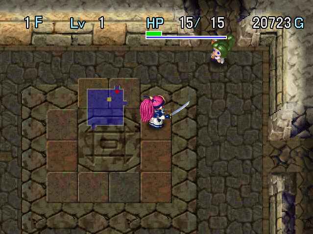

   

The final dungeon of the main story, which can be challenged after clearing all 7 trials. It has a depth of 36F, the monster table ramps up quickly, and Monster Houses are pretty common. There's also a rematch against a member of the Eight Fiends group every 4 floors during the first clear.

That might sound intimidating, but you're allowed to bring items, so it tends to be manageable. Bring your strongest equipment and Mon Boxes, and be careful around Curse Girl and Kengo types. Enraged and furious monsters are also mean, so don't let down your guard even if things are going well.

A staircase leading to treasure appears on the deepest floor after clearing the main story. The right side leads to Amano Kagura (weapon), and the left side leads to Hoshino Mikoshi (shield). Only 1 is obtainable per visit, and if you already have the item, there will be an Upgrade Pot[1] instead.

<ul class="quickLinksUL">
  <li><a href="#overview">Overview</a></li>
  <li><a href="#strategy">Strategy</a></li>
  <li><a href="#floor-guide">Floor Guide</a></li>
  <li><a href="#monsters">Monsters</a></li>
  <li><a href="#items">Items</a></li>
  <li><a href="#traps">Traps</a></li>
</ul>

# Overview

<table class="dungeonOverview">
  <tr>
    <th>Unlock</th>
    <td class="highlightYellow">Obtain 8 ceremonial items in Yakagura Forest.</td>
  </tr>
  <tr>
    <th>Entrance</th>
    <td class="highlightYellow">Shichiten City (Near large hole)</td>
  </tr>
</table>

<table class="dungeonTable">
  <tr>
    <th>JP Name</th>
    <td colspan="3">星華の大筒</td>
  </tr>
  <tr>
    <th>Floors</th>
    <td>36F</td>
    <th>Stairs</th>
    <td>Descending</td>
  </tr>
  <tr>
    <th>Bring Items</th>
    <td>Yes</td>
    <th>Allies</th>
    <td>Yes</td>
  </tr>
  <tr>
    <th>Unidentified</th>
    <td colspan="3">All categories</td>
  </tr>
  <tr>
    <th>Shops</th>
    <td>Yes</td>
    <th>Monster Houses</th>
    <td>Regular</td>
  </tr>
  <tr>
    <th>Clear Icon</th>
    <td></td>
    <th>Reward</th>
    <td>Amano Kagura (right) Hoshino Mikoshi (left)</td>
  </tr>
</table>

※ If you already have the reward equipment, there will be an Upgrade Pot[1] instead.

# Strategy

<ul class="quickLinksUL">
  <li><a href="#general">General</a></li>
  <li><a href="#equipment">Equipment</a></li>
  <li><a href="#other-items">Other Items</a></li>
</ul>

### General

### Equipment

#### Weapon

##### Main Weapon

<table class="dungeonTable">
  <thead>
    <tr>
      <th>Name</th>
      <th>Atk</th>
      <th>Slot</th>
      <th>Notes</th>
    </tr>
  </thead>
  <tbody>
    <tr>
      <td class="highlightGray">Ryujin Sword</td>
      <td class="centeredText">25</td>
      <td class="centeredText">7</td>
      <td>Deal x2.0 damage to Dragon type monsters. Ryujin Sword → Synthesize 3 竜 (Dragon Killer) seals into a Dragon Killer.</td>
    </tr>
    <tr>
      <td class="highlightGray">Kabura's Blade</td>
      <td class="centeredText">18</td>
      <td class="centeredText">6</td>
      <td>Obtain in Tenrin Hard using an Iai Mon Box, but it's quite rare.</td>
    </tr>
    <tr>
      <td class="highlightGray">Dotanuki</td>
      <td class="centeredText">10</td>
      <td class="centeredText">6</td>
      <td>Basically a stronger katana.</td>
    </tr>
    <tr>
      <td class="highlightGray">Katana</td>
      <td class="centeredText">8</td>
      <td class="centeredText">5</td>
      <td>Purchase from the shop in Negoro Shrine (Tenrin Easy).</td>
    </tr>
  </tbody>
</table>

##### Seals

<table class="dungeonTable">
  <thead>
    <tr>
      <th>Seal</th>
      <th>Item</th>
      <th>Notes</th>
    </tr>
  </thead>
  <tbody>
    <tr>
      <td class="highlightGray">回</td>
      <td>Healing Sword</td>
      <td>Heal HP equal to 1/3 of damage dealt. Healing Sword → Synthesize Herb, Otogiriso, and Life Grass into a weapon.</td>
    </tr>
    <tr>
      <td class="highlightGray">三</td>
      <td>Razor Wind</td>
      <td>Great to have for hallway corners and Monster House entrances.</td>
    </tr>
    <tr>
      <td class="highlightGray">会</td>
      <td>Minotaur's Axe</td>
      <td>1/4 chance to land a critical hit. Obtain Minotaur's Axe on 20-21F (Menbell) or 25-27F in Tenrin Hard.</td>
    </tr>
    <tr>
      <td class="highlightGray">根</td>
      <td>Bamboo Sword</td>
      <td>Increase strength by 1 every 100 swings. Synthesize 2 of these seals to reduce it to 50 swings.</td>
    </tr>
    <tr>
      <td class="highlightGray">金</td>
      <td>Plating Scroll Gold Sword</td>
      <td>Upgrade value never decreases due to rust. Nice for weapons with high base attack, but skip it on weaker weapons.</td>
    </tr>
    <tr>
      <td class="highlightGray">サ</td>
      <td>Wonder Pick</td>
      <td>Dig shortcuts, plays well with 三 (Razor Wind), Scout Bracelet, etc. Obtain Wonder Pick in Gitau Trial.</td>
    </tr>
    <tr>
      <td class="highlightGray">扇</td>
      <td>Tessen</td>
      <td>Increases shield base defense by 3. Skip this if your shield is already strong on its own.</td>
    </tr>
  </tbody>
</table>

#### Shield

##### Main Shield

<table class="dungeonTable">
  <thead>
    <tr>
      <th>Name</th>
      <th>Def</th>
      <th>Slot</th>
      <th>Notes</th>
    </tr>
  </thead>
  <tbody>
    <tr>
      <td class="highlightGray">Fuuma Shield</td>
      <td class="centeredText">16</td>
      <td class="centeredText">6</td>
      <td>Obtain in Tenrin Hard using a Kengo Mon Box, but it's quite rare.</td>
    </tr>
    <tr>
      <td class="highlightGray">Iron Shield</td>
      <td class="centeredText">9</td>
      <td class="centeredText">5</td>
      <td>Purchase from the shop in Negoro Shrine (Tenrin Easy).</td>
    </tr>
    <tr>
      <td class="highlightGray">Beast Shield</td>
      <td class="centeredText">12</td>
      <td class="centeredText">4</td>
      <td>High base defense but only 4 slots, so Iron Shield is likely better.</td>
    </tr>
  </tbody>
</table>

##### Seals

<table class="dungeonTable">
  <thead>
    <tr>
      <th>Seal</th>
      <th>Item</th>
      <th>Notes</th>
    </tr>
  </thead>
  <tbody>
    <tr>
      <td class="highlightGray">山</td>
      <td>Echo Shield</td>
      <td>Reflects Gazer hypnosis, King Tusker's magic, Jagan Mask's curse, etc.</td>
    </tr>
    <tr>
      <td class="highlightGray">金</td>
      <td>Plating Scroll Gold Shield</td>
      <td>Upgrade value never decreases due to rust. Higher level slimes appear, so it's not a bad option.</td>
    </tr>
    <tr>
      <td class="highlightGray">見</td>
      <td>Spry Shield</td>
      <td>Significantly increases evasion against direct attacks.</td>
    </tr>
    <tr>
      <td class="highlightGray">消 or う</td>
      <td>Antidote Grass Scale Shield</td>
      <td>Prevents strength loss from poisons and slug licks. Can be skipped if you have 根 (Bamboo Sword) to regain lost strength.</td>
    </tr>
    <tr>
      <td class="highlightGray">弟</td>
      <td>Otogiriso</td>
      <td>Restore 3.5 HP (Rounded up) after taking damage. Synthesize 2~3 of these seals to take far less damage.</td>
    </tr>
    <tr>
      <td class="highlightGray">ト</td>
      <td>Walrus Shield</td>
      <td>Blocks Zalokleft, Thief Pelican, and Froggo special attacks. Iron Zaloklefts steal equipped items, so it's not a bad option.</td>
    </tr>
    <tr>
      <td class="highlightGray">ゴ</td>
      <td>Rubber Shield</td>
      <td>Immunity to lightning damage is excellent for the final boss (1st clear).</td>
    </tr>
  </tbody>
</table>

#### Bracelets

<table class="dungeonTable">
  <thead>
    <tr>
      <th>Item</th>
      <th>Notes</th>
    </tr>
  </thead>
  <tbody>
    <tr>
      <td class="highlightGray">Scout Bracelet</td>
      <td>item_description</td>
    </tr>
    <tr>
      <td class="highlightGray">Vision Bracelet</td>
      <td>item_description</td>
    </tr>
    <tr>
      <td class="highlightGray">Thief Bracelet</td>
      <td>item_description</td>
    </tr>
    <tr>
      <td class="highlightGray">Decoy Bracelet</td>
      <td>item_description</td>
    </tr>
    <tr>
      <td class="highlightGray">Phantasm Bracelet</td>
      <td>item_description</td>
    </tr>
    <tr>
      <td class="highlightGray">Float Bracelet</td>
      <td>item_description</td>
    </tr>
    <tr>
      <td class="highlightGray">No-Rust Bracelet</td>
      <td>item_description</td>
    </tr>
    <tr>
      <td class="highlightGray">Bind Bracelet</td>
      <td>item_description</td>
    </tr>
    <tr>
      <td class="highlightGray">Spirit Bracelet</td>
      <td>item_description</td>
    </tr>
    <tr>
      <td class="highlightGray">Trapper Bracelet</td>
      <td>item_description</td>
    </tr>
    <tr>
      <td class="highlightGray">Identify Bracelet</td>
      <td>item_description</td>
    </tr>
  </tbody>
</table>

### Other Items

# Floor Guide

# Monsters

# Items

# Traps
