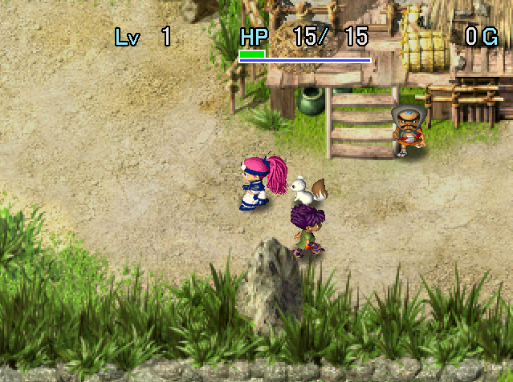
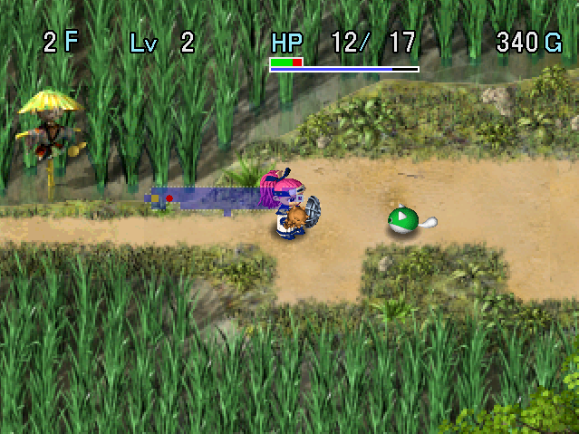

   

First dungeon of the game if you're playing the Dreamcast version. 
The dungeon is split into a number of areas, and there are a few overworld rest spots along the way. Thief Pelican (synthesis monster) appears later than in other dungeons, so defense may feel low early on. All items are found identified, negative effect items can't be found, and there's an easy boss fight at the end.

<ul class="quickLinksUL">
  <li><a href="#overview">Overview</a></li>
  <li><a href="#strategy">Strategy</a></li>
  <li><a href="#floor-guide">Floor Guide</a></li>
  <li><a href="#monsters">Monsters</a></li>
  <li><a href="#monster-table">Monster Table</a></li>
  <li><a href="#items">Items</a></li>
  <li><a href="#traps">Traps</a></li>
</ul>

# Overview

<table class="dungeonOverview">
  <tr>
    <th>Unlock</th>
    <td class="highlightYellow">Automatically unlocked after the opening.</td>
  </tr>
  <tr>
    <th>Entrance</th>
    <td class="highlightYellow">Izayoi Village (West exit)</td>
  </tr>
</table>

<table class="dungeonTable">
  <tr>
    <th>JP Name</th>
    <td colspan="3">天輪国初級</td>
  </tr>
  <tr>
    <th>Floors</th>
    <td>20F</td>
    <th>Stairs</th>
    <td>Ascending</td>
  </tr>
  <tr>
    <th>Bring Items</th>
    <td>Yes</td>
    <th>Allies</th>
    <td>Yes</td>
  </tr>
  <tr>
    <th>Unidentified</th>
    <td colspan="3">None</td>
  </tr>
  <tr>
    <th>Shops</th>
    <td>Yes</td>
    <th>Monster Houses</th>
    <td>None</td>
  </tr>
  <tr>
    <th>Clear Icon</th>
    <td>Kunai</td>
    <th>Reward</th>
    <td>None</td>
  </tr>
</table>

# Strategy

<ul class="quickLinksUL">
  <li><a href="#equipment">Equipment</a></li>
</ul>

### Equipment

Katana, Iron Shield, Antidote Grass, and Otogiriso can be purchased from village shops. Thief Pelicans (13-14F) can be used to synthesize equipment.

#### Weapon

##### Main Weapon

<table class="dungeonTable">
  <thead>
    <tr>
      <th>Name</th>
      <th>Atk</th>
      <th>Slot</th>
      <th>Notes</th>
    </tr>
  </thead>
  <tbody>
    <tr>
      <td class="highlightGray">Katana</td>
      <td class="centeredText">8</td>
      <td class="centeredText">5</td>
      <td>Can be purchased from the shop in Negoro Shrine.</td>
    </tr>
  </tbody>
</table>

##### Seals

弟 seals should be synthesized into your shield before a weapon. The 回 seal (Healing Sword) is powerful, but isn't listed due to the difficulty of creating it.

<table class="dungeonTable">
  <thead>
    <tr>
      <th>Seal</th>
      <th>Item</th>
      <th>Notes</th>
    </tr>
  </thead>
  <tbody>
    <tr>
      <td class="highlightGray">弟</td>
      <td>Otogiriso</td>
      <td>Direct attacks restore 3.5 HP (Rounded up). Synthesize 2~3 of these seals to feel its effect.</td>
    </tr>
    <tr>
      <td class="highlightGray">根</td>
      <td>Bamboo Sword</td>
      <td>Increase strength by 1 every 100 swings. Synthesize 2 of these seals to reduce it to 50 swings.</td>
    </tr>
    <tr>
      <td class="highlightGray">扇</td>
      <td>Tessen</td>
      <td>Increases shield base defense by 3. Base defense is incredibly important in this game.</td>
    </tr>
  </tbody>
</table>

#### Shield

##### Main Shield

<table class="dungeonTable">
  <thead>
    <tr>
      <th>Name</th>
      <th>Def</th>
      <th>Slot</th>
      <th>Notes</th>
    </tr>
  </thead>
  <tbody>
    <tr>
      <td class="highlightGray">Iron Shield</td>
      <td class="centeredText">9</td>
      <td class="centeredText">5</td>
      <td>Can be purchased from the shop in Negoro Shrine.</td>
    </tr>
  </tbody>
</table>

##### Seals

If you're using an Iron Shield, you can't go wrong with [金消弟弟弟].

<table class="dungeonTable">
  <thead>
    <tr>
      <th>Seal</th>
      <th>Item</th>
      <th>Notes</th>
    </tr>
  </thead>
  <tbody>
    <tr>
      <td class="highlightGray">弟</td>
      <td>Otogiriso</td>
      <td>Restore 3.5 HP (Rounded up) after taking damage. Synthesize 2~3 of these seals to take far less damage.</td>
    </tr>
    <tr>
      <td class="highlightGray">消 or う</td>
      <td>Antidote Grass Scale Shield</td>
      <td>Prevents strength loss from poisons and slug licks. Strength is very important in this game.</td>
    </tr>
    <tr>
      <td class="highlightGray">金</td>
      <td>Plating Scroll Gold Shield</td>
      <td>Upgrade value never decreases due to rust. Unneeded for this dungeon, but nice to have for future ones.</td>
    </tr>
  </tbody>
</table>

# Floor Guide

### Izayoi Paddy (1-2F)

Monsters are weak, so you shouldn't have problems - check every room and pick up all items. Lady Locks (2-4F) reflects projectiles, so don't shoot arrows or throw items at her.

### Kodama Pass (3-4F)

Nigiri Novice (3-5F) has higher attack than other monsters, so be careful if you don't have a shield.

Sluggy (4-5F) can lower your strength by 1, which decreases the amount of damage you deal. It's best to use projectiles to defeat it or staves to disable it from a distance to avoid strength loss. If you found a Scale Shield, keep it equipped to block the strength lowering effect of its licks. That said, village shops have Antidote Grass for sale, so don't worry too much if you lose strength here.

### Matagi Village

If you haven't found better equipment yet, go ahead and buy a Nagamaki and Bronze Shield. Buy 1 Antidote Grass and 3\~4 Otogiriso for synthesis later in the dungeon, along with some food. Storage Pots are great for expanding inventory and protecting onigiri from spoiling, but are a bit expensive. If you don't think you can clear the dungeon in a single attempt, buy an Escape Scroll.

If you have some extra money, visit the Mon Box Shop and buy Bow Boy for 4000 Gitan. This Mon Box lets you stock up on Wood Arrows without having to rely on enemy Bow Boys or floor items. In fact, some players prioritize this Bow Boy Box, since the next village has similar or better items.

#### Item Shop

|Item|Price|
|-|-|
|Nagamaki|700|
|Bronze Shield|400|
|Large Onigiri|200|
|Herb|100|
|Otogiriso|500|
|Antidote Grass|400|
|Storage Pot[4]|1440|
|Escape Scroll|1000|

#### Mon Box Shop

|Item|Price|
|-|-|
|Mamel|2000|
|Chintala|2500|
|Sluggy|3000|
|Bow Boy|4000|

#### Blacksmith

|Service|Price|
|-|-|
|Upgrade Weapon|1500|
|Erase Seal|1000|
|Repair Bracelet|500|

### Tengu Windhole (5-6F)

Field of view is now limited in hallways, and hidden traps can be generated in the ground. Bow Boy (5-7F) shoots arrows from a distance, so use zigzag movement to get closer while avoiding arrows. If you encounter a Bow Boy that never shoots arrows, it's a Crow Tengu (5-7F) in disguise.

Gazer (6-8F) can hypnotize Asuka, making her use an item or attack in a random direction. Keep valuable or risky items such as Revival Grass or Escape Scroll in pots instead of carrying them openly, and discard any Heal Pots you're carrying so that you don't lose your equipment.

Zalokleft (6-8F) steals an inventory item, warps, then runs away - defeat it to reclaim the stolen item. Likewise, Froggo (6-7F) steals Gitan, warps, then runs away at double speed - defeat it to reclaim your money. In either case, if you defeat the monster before it steals from you, it'll drop an item or Gitan bag.

### Reckless Tunnel (7-8F)

Nigiri Morph (8-10F) has a special attack that transforms an inventory item into a Large Onigiri. This is fine if you didn't need the item, but it might target a pot filled with important items, so it's best to use projectiles and items to ensure it doesn't get a chance to act.

### Stone Fort Ruins (9-10F)

Boy Cart (9-10F) shoots Iron Arrows, and likes to maintain a set distance while inside rooms. It won't shoot arrows when it's in a hallway, so retreat into a hallway to safely defeat it.

Shadow Hat (9-10F) is always generated napping, and won't wake up unless you move next to it. Its special attack takes control of a target for a while, which has a similar effect to confusion where you can't move or attack in the direction you aim for.

Twisty Hani (10-12F) can perform a dance that decreases a target's level by 1. It's quite a problem if it does it multiple times in a row, so it's best to use projectiles or items. Despite the risk, it provides 200 experience points, so it's worth it to hunt them if you have lots of arrows. It's always generated napping, so ignoring it is also an option.

### Negoro Shrine

Shield base defense is extremely important in this game, so it's worth upgrading to an Iron Shield here. On the flip side, weapon strength isn't as impactful, so you can get by without a Katana if you're short on money. Buy 1 Antidote Grass and 3\~4 Otogiriso for synthesis, even if you have to sell other items to fund it. If you're low on food, buy 2\~3 Huge Onigiri - you need to be able to linger on upcoming Thief Pelican floors.

#### Inn

Pay 500 Gitan to fully restore HP and fullness.

#### Item Shop

|Item|Price|
|-|-|
|Nagamaki|700|
|Katana|1200|
|Bronze Shield|400|
|Iron Shield|1200|
|Huge Onigiri|300|
|Otogiriso|500|
|Antidote Grass|400|
|Purify Scroll|1000|
|Storage Pot[4]|1440|
|Escape Scroll|1000|

#### Blacksmith

|Service|Price|
|-|-|
|Upgrade Shield|1500|
|Erase Seal|1000|
|Repair Bracelet|500|

### Tenrin Forest (11-12F)

The map generation switches back to Shuffle type for a while, so field of view isn't limited.

Mutaikon (11-14F) throws Poison Grass, which lowers your strength by 1 and inflicts Slow status. The strength lowering effect can be blocked by a Scale Shield, or the う or 消 synthesis seals. It has a throwing range of 2 tiles, so you can use arrows from outside its range to defeat it. If you become adjacent or if there are other monsters nearby, use a staff or scroll.

Spike Dragon (12-14F) retreats into its shell after 4 turns, then floats for 2 turns before coming out of its shell. Its attack pattern changes to a 1 tile radius when it's inside its shell, so be careful where you stand. If it defeats a different monster and levels up into an Earth Needle (150 HP), it's best to run away.

### Shirakami Swamp (13-14F)

Thief Pelican (13-14F), the synthesis monster of this game, finally appears. To synthesize, simply throw a weapon or shield to use as a base at Thief Pelican, followed by a secondary item. It's very highly recommended to synthesize an Antidote Grass and 3 Otogiriso into your shield here. Lv1 Thief Pelicans can only eat up to 2 items, so you'll need 4 of them to finalize your shield. If you have Otogiriso left after the above, go ahead and synthesize some into your weapon. ※ Thief Pelican can inhale an inventory item when it's adjacent to you, so keep your distance.

#### Midpoint

An event featuring Heiji and Kihachi occurs when you advance past 13F for the first time. You have to choose one of them to join you as an ally to proceed - be sure to listen to their explanations. Heiji has higher stats than Kihachi at lower levels, so just choose him if you can't make up your mind. Allies only gain experience points when they deal the finishing blow in this game.

### King's Rock (15-16F)

A dungeon shop is almost always generated on 16F, so check it out before advancing. However, don't try to steal from the shop unless you know what you're doing, as it's likely to end your run.

### Kouga Village

There's nothing in this village aside from story scenes at this point in the game. Go ahead and enter Kouga Castle when you're ready.

### Kouga Castle (17-20F)

Scrolls are the only item category that can be found on the ground between 17-20F. Keep an eye out for Rockfall and Lightning scrolls to use during the upcoming boss fight. If you find a Plating Scroll, go ahead and use it on your shield.

Kengo (17-20F) can disarm your equipped shield, sending it flying behind you. The shield is permanently lost if it hits a character or lands on an air tile, so be very careful - don't dash. It's best to fight them with your back against a wall, and use a staff or scroll if you're not near a wall.

Demon Warrior (17-20F) reappears as Ghost Warrior after 3 turns pass once defeated. Ghost Warrior runs toward a different monster and levels them up - bad if it's a Kengo or Horse Samurai. It has 4 HP, but it only receives 1 damage from direct attacks and arrows, and it might warp when hit. Therefore, it's best to use fixed damage attacks such as Knockback Staff to one-shot it.

### Boss

Fight against Head Ninja and an assortment of other Kouga ninjas.

|Name|HP|Atk|Def|Exp|Notes|
|-|-|-|-|-|-|
|Head Ninja|150|30|16|0|・Attacks in 3 forward directions. ・Does a lunge attack to close the gap when lined up. ・Warps and summons 3 Adept Ninjas after being hit when alone.|

His attacks sound a bit tricky, but the boss doesn't resist status conditions, so there are countless ways to have an easy fight - Confusion Scroll → Blaze Scroll combo, swing a Decoy Staff at the boss, etc. Sanctuary Scroll and Slumber Scroll are also effective against the boss.

If the other ninjas are giving you trouble, you can wipe them out using 2\~3 Rockfall or Lighting scrolls. Lightning Staff is another solid option, since they tend to group up.

# Monsters

<table class="dungeonMonsterList monsterListDay">
  <thead>
    <tr>
      <th>F</th>
      <th>Name</th>
      <th>HP</th>
      <th>Atk</th>
      <th>Def</th>
      <th>Exp</th>
      <th>Type</th>
      <th>Notes</th>
    </tr>
  </thead>
  <tbody>
    <tr>
      <td>1-2</td>
      <td>Mamel</td>
      <td>5</td>
      <td>2</td>
      <td>2</td>
      <td>2</td>
      <td>-</td>
      <td>-</td>
    </tr>
    <tr>
      <td>1-3</td>
      <td>Pit Mamel</td>
      <td>7</td>
      <td>3</td>
      <td>2</td>
      <td>4</td>
      <td>-</td>
      <td>-</td>
    </tr>
    <tr>
      <td>1-3</td>
      <td>Chintala</td>
      <td>6</td>
      <td>2</td>
      <td>3</td>
      <td>3</td>
      <td>-</td>
      <td>-</td>
    </tr>
    <tr>
      <td>2-4</td>
      <td>Lady Locks</td>
      <td>10</td>
      <td>5</td>
      <td>4</td>
      <td>5</td>
      <td>-</td>
      <td>HP Drain, reflects projectiles.</td>
    </tr>
    <tr>
      <td>3-5</td>
      <td>Tug Frog</td>
      <td>11+</td>
      <td>5</td>
      <td>5</td>
      <td>6</td>
      <td>Aquatic</td>
      <td>Pulls a target toward itself.</td>
    </tr>
    <tr>
      <td>3-5</td>
      <td>Nigiri Novice</td>
      <td>11+</td>
      <td>7</td>
      <td>6</td>
      <td>9</td>
      <td>-</td>
      <td>-</td>
    </tr>
    <tr>
      <td>4-5</td>
      <td>Sluggy</td>
      <td>14</td>
      <td>6</td>
      <td>5</td>
      <td>8</td>
      <td>Drain</td>
      <td>Decreases strength by 1.</td>
    </tr>
    <tr>
      <td>5-7</td>
      <td>Crow Tengu</td>
      <td>16</td>
      <td>9</td>
      <td>8</td>
      <td>12</td>
      <td>-</td>
      <td>Disguises itself as other monsters.</td>
    </tr>
    <tr>
      <td>5-7</td>
      <td>Bow Boy</td>
      <td>20</td>
      <td>3</td>
      <td>5</td>
      <td>14</td>
      <td>-</td>
      <td>Shoots Wood Arrows.</td>
    </tr>
    <tr>
      <td>6-7</td>
      <td>Froggo</td>
      <td>22</td>
      <td>0</td>
      <td>8</td>
      <td>10</td>
      <td>-</td>
      <td>Steals Gitan and warps.</td>
    </tr>
    <tr>
      <td>6-8</td>
      <td>Gazer</td>
      <td>23</td>
      <td>11+</td>
      <td>5</td>
      <td>20</td>
      <td>Cyclops</td>
      <td>Hypnotizes Asuka.</td>
    </tr>
    <tr>
      <td>6-8</td>
      <td>Novice Ninja</td>
      <td>21</td>
      <td>10</td>
      <td>6</td>
      <td>18</td>
      <td>-</td>
      <td>Throws Shurikens when HP is low.</td>
    </tr>
    <tr>
      <td>6-8</td>
      <td>Zalokleft</td>
      <td>25</td>
      <td>0</td>
      <td>6</td>
      <td>12</td>
      <td>Aquatic</td>
      <td>Steals an item and warps.</td>
    </tr>
    <tr>
      <td>7-9</td>
      <td>Laugh Polygon</td>
      <td>18</td>
      <td>10</td>
      <td>9</td>
      <td>18</td>
      <td>Drain</td>
      <td>Decreases fullness by 5%.</td>
    </tr>
    <tr>
      <td>8-9</td>
      <td>Mid Chintala</td>
      <td>25</td>
      <td>14</td>
      <td>7</td>
      <td>22</td>
      <td>-</td>
      <td>-</td>
    </tr>
    <tr>
      <td>8-10</td>
      <td>Spearfish</td>
      <td>24</td>
      <td>15</td>
      <td>8</td>
      <td>24</td>
      <td>Aquatic</td>
      <td>Can move underwater.</td>
    </tr>
    <tr>
      <td>8-10</td>
      <td>Nigiri Morph</td>
      <td>24</td>
      <td>11+</td>
      <td>10</td>
      <td>25</td>
      <td>-</td>
      <td>Turns an inventory item into a Large Onigiri.</td>
    </tr>
    <tr>
      <td>9-10</td>
      <td>Boy Cart</td>
      <td>30</td>
      <td>5</td>
      <td>11+</td>
      <td>28</td>
      <td>-</td>
      <td>Shoots Iron Arrows.</td>
    </tr>
    <tr>
      <td>9-10</td>
      <td>Bored Kappa</td>
      <td>32</td>
      <td>19</td>
      <td>7</td>
      <td>32</td>
      <td>Aquatic</td>
      <td>Throws items within 5 tiles.</td>
    </tr>
    <tr>
      <td>9-10</td>
      <td>Shadow Hat</td>
      <td>27</td>
      <td>20</td>
      <td>12</td>
      <td>30</td>
      <td>Cyclops</td>
      <td>Takes control of a target for 10 turns.</td>
    </tr>
    <tr>
      <td>9-11</td>
      <td>Pud</td>
      <td>35</td>
      <td>17</td>
      <td>8</td>
      <td>27</td>
      <td>-</td>
      <td>Electric attack that deals 20 damage.</td>
    </tr>
    <tr>
      <td>10-12</td>
      <td>Tiger Tosser</td>
      <td>39</td>
      <td>24</td>
      <td>8</td>
      <td>40</td>
      <td>-</td>
      <td>Throws Asuka and other monsters.</td>
    </tr>
    <tr>
      <td>10-12</td>
      <td>Twisty Hani</td>
      <td>32</td>
      <td>20</td>
      <td>13</td>
      <td>200</td>
      <td>Drain</td>
      <td>Decreases level by 1.</td>
    </tr>
    <tr>
      <td>11-12</td>
      <td>Horse Ronin</td>
      <td>40</td>
      <td>16</td>
      <td>12</td>
      <td>42</td>
      <td>-</td>
      <td>Shoots Silver Arrows.</td>
    </tr>
    <tr>
      <td>11-13</td>
      <td>Rocket Boar</td>
      <td>33</td>
      <td>21</td>
      <td>11+</td>
      <td>35</td>
      <td>-</td>
      <td>Makes Asuka trip and drop items.</td>
    </tr>
    <tr>
      <td>11-13</td>
      <td>Lovely Locks</td>
      <td>41</td>
      <td>23</td>
      <td>13</td>
      <td>48</td>
      <td>-</td>
      <td>HP Drain, reflects magic and projectiles.</td>
    </tr>
    <tr>
      <td>11-14</td>
      <td>Mutaikon</td>
      <td>38</td>
      <td>20</td>
      <td>11+</td>
      <td>51</td>
      <td>Ghost</td>
      <td>Throws Poison Grass.</td>
    </tr>
    <tr>
      <td>12-14</td>
      <td>Pull Frog</td>
      <td>43</td>
      <td>22</td>
      <td>10</td>
      <td>55</td>
      <td>Aquatic</td>
      <td>Pulls a target toward itself and attacks.</td>
    </tr>
    <tr>
      <td>12-14</td>
      <td>Spike Dragon</td>
      <td>48</td>
      <td>25</td>
      <td>12</td>
      <td>52</td>
      <td>Dragon</td>
      <td>Retreats into its shell for 2 turns.</td>
    </tr>
    <tr>
      <td>13-14</td>
      <td>Thief Pelican</td>
      <td>28</td>
      <td>10</td>
      <td>11+</td>
      <td>15</td>
      <td>-</td>
      <td>Eats and synthesizes up to 2 items.</td>
    </tr>
    <tr>
      <td>13-14</td>
      <td>Lt. Spearfish</td>
      <td>35</td>
      <td>20</td>
      <td>12</td>
      <td>50</td>
      <td>Aquatic</td>
      <td>Runs into water to heal when HP is low.</td>
    </tr>
    <tr>
      <td>13-15</td>
      <td>Kappa Pest</td>
      <td>49</td>
      <td>24</td>
      <td>7</td>
      <td>120</td>
      <td>Aquatic</td>
      <td>Throws items within 9 tiles.</td>
    </tr>
    <tr>
      <td>13-15</td>
      <td>Curse Girl</td>
      <td>50</td>
      <td>21</td>
      <td>8</td>
      <td>80</td>
      <td>-</td>
      <td>Curses 1 item.</td>
    </tr>
    <tr>
      <td>13-15</td>
      <td>Pumphantasm</td>
      <td>45</td>
      <td>28</td>
      <td>8</td>
      <td>50</td>
      <td>Ghost</td>
      <td>Can pass through walls.</td>
    </tr>
    <tr>
      <td>14-16</td>
      <td>Muron</td>
      <td>55</td>
      <td>20</td>
      <td>5</td>
      <td>62</td>
      <td>Dragon</td>
      <td>Beam that deals 10 damage + knockback.</td>
    </tr>
    <tr>
      <td>14-16</td>
      <td>Pudding</td>
      <td>43</td>
      <td>20</td>
      <td>11+</td>
      <td>63</td>
      <td>-</td>
      <td>Electric attack that deals 30 damage.</td>
    </tr>
    <tr>
      <td>14-20</td>
      <td>Adept Ninja</td>
      <td>55</td>
      <td>25</td>
      <td>7</td>
      <td>85</td>
      <td>-</td>
      <td>Throws Shurikens when HP is low.</td>
    </tr>
    <tr>
      <td>15-16</td>
      <td>Schubell</td>
      <td>53</td>
      <td>22</td>
      <td>10</td>
      <td>58</td>
      <td>-</td>
      <td>Summons one Lv1 monster.</td>
    </tr>
    <tr>
      <td>15-16</td>
      <td>Falcon Tengu</td>
      <td>50</td>
      <td>15</td>
      <td>10</td>
      <td>60</td>
      <td>-</td>
      <td>Disguises itself as other monsters.</td>
    </tr>
    <tr>
      <td>15-16</td>
      <td>Soldier Ant</td>
      <td>58</td>
      <td>28</td>
      <td>8</td>
      <td>65</td>
      <td>-</td>
      <td>Digs out wall tiles.</td>
    </tr>
    <tr>
      <td>17-20</td>
      <td>Demon Warrior</td>
      <td>35</td>
      <td>23</td>
      <td>10</td>
      <td>30</td>
      <td>-</td>
      <td>Ghost Warrior appears when defeated.</td>
    </tr>
    <tr>
      <td>17-20</td>
      <td>Horse Samurai</td>
      <td>65</td>
      <td>27</td>
      <td>12</td>
      <td>110</td>
      <td>-</td>
      <td>Shoots Silver Arrows.</td>
    </tr>
    <tr>
      <td>17-20</td>
      <td>Kengo</td>
      <td>55</td>
      <td>28</td>
      <td>13</td>
      <td>80</td>
      <td>-</td>
      <td>Disarms shields.</td>
    </tr>
    <tr>
      <td>17-20</td>
      <td>Goldie Locks</td>
      <td>60</td>
      <td>25</td>
      <td>15</td>
      <td>90</td>
      <td>-</td>
      <td>HP Drain, reflects magic and projectiles.</td>
    </tr>
    <tr>
      <td>17-20</td>
      <td>Master Ninja</td>
      <td>70</td>
      <td>24</td>
      <td>12</td>
      <td>100</td>
      <td>-</td>
      <td>Throws Shurikens when HP is low.</td>
    </tr>
    <tr>
      <td>N/A</td>
      <td>Ghost Warrior</td>
      <td>4</td>
      <td>0</td>
      <td>0</td>
      <td>10</td>
      <td>-</td>
      <td>Increases the level of a monster.</td>
    </tr>
  </tbody>
</table>

# Monster Table

Enemy Colors: Farming Useful Destroys Items Dangerous

<table class="monsterTable">
  <thead>
    <tr>
      <th>F</th>
      <th colspan="7">Monsters</th>
    </tr>
  </thead>
  <tbody>
    <tr>
      <th>1</th>
      <td>Mamel</td>
      <td>Pit Mamel</td>
      <td>Chintala</td>
      <td class="highlightGray"></td>
      <td class="highlightGray"></td>
      <td class="highlightGray"></td>
      <td class="highlightGray"></td>
    </tr>
    <tr>
      <th>2</th>
      <td>Mamel</td>
      <td>Pit Mamel</td>
      <td>Chintala</td>
      <td>Lady Locks</td>
      <td class="highlightGray"></td>
      <td class="highlightGray"></td>
      <td class="highlightGray"></td>
    </tr>
    <tr>
      <th>3</th>
      <td class="highlightGray"></td>
      <td>Pit Mamel</td>
      <td>Chintala</td>
      <td>Lady Locks</td>
      <td>Tug Frog</td>
      <td>Nigiri Novice</td>
      <td class="highlightGray"></td>
    </tr>
    <tr>
      <th>4</th>
      <td>Sluggy</td>
      <td class="highlightGray"></td>
      <td class="highlightGray"></td>
      <td>Lady Locks</td>
      <td>Tug Frog</td>
      <td>Nigiri Novice</td>
      <td class="highlightGray"></td>
    </tr>
    <tr>
      <td colspan="8" class="monsterTableVillage">Matagi Village</td>
    </tr>
    <tr>
      <th>5</th>
      <td>Sluggy</td>
      <td>Crow Tengu</td>
      <td>Bow Boy</td>
      <td class="highlightGray"></td>
      <td>Tug Frog</td>
      <td>Nigiri Novice</td>
      <td class="highlightGray"></td>
    </tr>
    <tr>
      <th>6</th>
      <td>Novice Ninja</td>
      <td>Crow Tengu Zalokleft</td>
      <td>Bow Boy</td>
      <td>Froggo</td>
      <td class="highlightGray"></td>
      <td class="highlightGray"></td>
      <td>Gazer</td>
    </tr>
    <tr>
      <th>7</th>
      <td>Laugh Polygon Novice Ninja</td>
      <td>Crow Tengu Zalokleft</td>
      <td>Bow Boy</td>
      <td>Froggo</td>
      <td class="highlightGray"></td>
      <td class="highlightGray"></td>
      <td>Gazer</td>
    </tr>
    <tr>
      <th>8</th>
      <td>Laugh Polygon Novice Ninja</td>
      <td>Zalokleft</td>
      <td>Nigiri Morph</td>
      <td class="highlightGray"></td>
      <td>Mid Chintala</td>
      <td>Spearfish</td>
      <td>Gazer</td>
    </tr>
    <tr>
      <th>9</th>
      <td>Laugh Polygon</td>
      <td>Boy Cart</td>
      <td>Bored Kappa Nigiri Morph</td>
      <td>Shadow Hat Pud</td>
      <td>Mid Chintala</td>
      <td>Spearfish</td>
      <td class="highlightGray"></td>
    </tr>
    <tr>
      <th>10</th>
      <td>Twisty Hani</td>
      <td>Boy Cart</td>
      <td>Bored Kappa Nigiri Morph</td>
      <td>Shadow Hat Pud</td>
      <td class="highlightGray"></td>
      <td>Spearfish</td>
      <td>Tiger Tosser</td>
    </tr>
    <tr>
      <td colspan="8" class="monsterTableVillage">Negoro Shrine</td>
    </tr>
    <tr>
      <th>11</th>
      <td>Rocket Boar Twisty Hani</td>
      <td>Mutaikon</td>
      <td class="highlightGray"></td>
      <td>Pud</td>
      <td>Horse Ronin Lovely Locks</td>
      <td class="highlightGray"></td>
      <td>Tiger Tosser</td>
    </tr>
    <tr>
      <th>12</th>
      <td>Rocket Boar Twisty Hani</td>
      <td>Pull Frog Mutaikon</td>
      <td>Spike Dragon</td>
      <td class="highlightGray"></td>
      <td>Horse Ronin Lovely Locks</td>
      <td class="highlightGray"></td>
      <td>Tiger Tosser</td>
    </tr>
    <tr>
      <th>13</th>
      <td>Rocket Boar</td>
      <td>Pull Frog Mutaikon</td>
      <td>Spike Dragon Kappa Pest</td>
      <td>Thief Pelican Curse Girl</td>
      <td>Lovely Locks</td>
      <td>Lt. Spearfish Pumphantasm</td>
      <td class="highlightGray"></td>
    </tr>
    <tr>
      <td colspan="8" class="monsterTableVillage">Shirakami Swamp - Midpoint</td>
    </tr>
    <tr>
      <th>14</th>
      <td class="highlightGray"></td>
      <td>Pull Frog Mutaikon</td>
      <td>Spike Dragon Kappa Pest</td>
      <td>Thief Pelican Curse Girl</td>
      <td>Muron</td>
      <td>Lt. Spearfish Pumphantasm</td>
      <td>Pudding Adept Ninja</td>
    </tr>
    <tr>
      <th>15</th>
      <td>Schubell Falcon Tengu</td>
      <td class="highlightGray"></td>
      <td>Kappa Pest</td>
      <td>Curse Girl</td>
      <td>Muron Soldier Ant</td>
      <td>Pumphantasm</td>
      <td>Pudding Adept Ninja</td>
    </tr>
    <tr>
      <th>16</th>
      <td>Schubell Falcon Tengu</td>
      <td class="highlightGray"></td>
      <td class="highlightGray"></td>
      <td class="highlightGray"></td>
      <td>Muron Soldier Ant</td>
      <td class="highlightGray"></td>
      <td>Pudding Adept Ninja</td>
    </tr>
    <tr>
      <td colspan="8" class="monsterTableVillage">Kouga Village</td>
    </tr>
    <tr>
      <th>17</th>
      <td>Demon Warrior</td>
      <td>Horse Samurai</td>
      <td>Kengo</td>
      <td>Goldie Locks</td>
      <td>Master Ninja</td>
      <td class="highlightGray"></td>
      <td>Adept Ninja</td>
    </tr>
    <tr>
      <th>18</th>
      <td>Demon Warrior</td>
      <td>Horse Samurai</td>
      <td>Kengo</td>
      <td>Goldie Locks</td>
      <td>Master Ninja</td>
      <td class="highlightGray"></td>
      <td>Adept Ninja</td>
    </tr>
    <tr>
      <th>19</th>
      <td>Demon Warrior</td>
      <td>Horse Samurai</td>
      <td>Kengo</td>
      <td>Goldie Locks</td>
      <td>Master Ninja</td>
      <td class="highlightGray"></td>
      <td>Adept Ninja</td>
    </tr>
    <tr>
      <th>20</th>
      <td>Demon Warrior</td>
      <td>Horse Samurai</td>
      <td>Kengo</td>
      <td>Goldie Locks</td>
      <td>Master Ninja</td>
      <td class="highlightGray"></td>
      <td>Adept Ninja</td>
    </tr>
    <tr>
      <td colspan="8" class="highlightYellow">Boss</td>
    </tr>
  </tbody>
</table>

# Items

The values like "1-6" and "11+" in columns represent the floor range where the item can appear. ※ Scrolls are the only item category that can be found between 17-20F in Tenrin Easy.

- F = Floor
- S = Shop
- E = Special Shop

 

<table class="dungeonItemTable">
  <tr>
    <th colspan="4" class="highlightNeon">Weapon</th>
    <th rowspan="76"></th>
    <th colspan="4" class="highlightNeon">Bracelet</th>
    <th rowspan="76"></th>
    <th colspan="4" class="highlightNeon">Grass</th>
  </tr>
  <tr>
    <th>Name</th>
    <th>F</th>
    <th>S</th>
    <th>E</th>
    <th>Name</th>
    <th>F</th>
    <th>S</th>
    <th>E</th>
    <th>Name</th>
    <th>F</th>
    <th>S</th>
    <th>E</th>
  </tr>
  <tr>
    <td class="leftText">Wooden Sword</td>
    <td></td>
    <td>X</td>
    <td>X</td>
    <td class="leftText">Calm Bracelet</td>
    <td></td>
    <td>X</td>
    <td>X</td>
    <td class="leftText">Weeds</td>
    <td></td>
    <td></td>
    <td></td>
  </tr>
  <tr>
    <td class="leftText">Club</td>
    <td>X</td>
    <td>X</td>
    <td></td>
    <td class="leftText">No-Rust Bracelet</td>
    <td></td>
    <td>X</td>
    <td>X</td>
    <td class="leftText">Herb</td>
    <td>X</td>
    <td></td>
    <td></td>
  </tr>
  <tr>
    <td class="leftText">Nagamaki</td>
    <td>X</td>
    <td>X</td>
    <td>X</td>
    <td class="leftText">Alert Bracelet</td>
    <td></td>
    <td>X</td>
    <td>X</td>
    <td class="leftText">Sleep Grass</td>
    <td></td>
    <td></td>
    <td></td>
  </tr>
  <tr>
    <td class="leftText">Katana</td>
    <td>X</td>
    <td>X</td>
    <td>X</td>
    <td class="leftText">Holy Bracelet</td>
    <td>X</td>
    <td>X</td>
    <td>X</td>
    <td class="leftText">Dizzy Grass</td>
    <td></td>
    <td></td>
    <td></td>
  </tr>
  <tr>
    <td class="leftText">Dotanuki</td>
    <td>X</td>
    <td>X</td>
    <td>X</td>
    <td class="leftText">Bind Bracelet</td>
    <td>X</td>
    <td>X</td>
    <td>X</td>
    <td class="leftText">Swift Seed</td>
    <td>X</td>
    <td>X</td>
    <td>X</td>
  </tr>
  <tr>
    <td class="leftText">Kabura's Blade</td>
    <td></td>
    <td>X</td>
    <td>X</td>
    <td class="leftText">Warp Bracelet</td>
    <td></td>
    <td>X</td>
    <td>X</td>
    <td class="leftText">Warp Grass</td>
    <td>X</td>
    <td></td>
    <td></td>
  </tr>
  <tr>
    <td class="leftText">Ghost Sickle</td>
    <td>X</td>
    <td>X</td>
    <td>X</td>
    <td class="leftText">Strength Bracelet</td>
    <td>X</td>
    <td>X</td>
    <td>X</td>
    <td class="leftText">Amnesia Grass</td>
    <td></td>
    <td></td>
    <td></td>
  </tr>
  <tr>
    <td class="leftText">Marine Slasher</td>
    <td>X</td>
    <td>X</td>
    <td>X</td>
    <td class="leftText">Thief Bracelet</td>
    <td></td>
    <td></td>
    <td></td>
    <td class="leftText">Kigny Seed</td>
    <td></td>
    <td></td>
    <td></td>
  </tr>
  <tr>
    <td class="leftText">Cyclops Killer</td>
    <td>X</td>
    <td>X</td>
    <td>X</td>
    <td class="leftText">Wish Bracelet</td>
    <td></td>
    <td></td>
    <td></td>
    <td class="leftText">Twisty Grass</td>
    <td></td>
    <td></td>
    <td></td>
  </tr>
  <tr>
    <td class="leftText">Drain Buster</td>
    <td>X</td>
    <td>X</td>
    <td>X</td>
    <td class="leftText">Pierce Bracelet</td>
    <td></td>
    <td>X</td>
    <td>X</td>
    <td class="leftText">Life Grass</td>
    <td>X</td>
    <td>X</td>
    <td>X</td>
  </tr>
  <tr>
    <td class="leftText">Crescent Arm</td>
    <td></td>
    <td></td>
    <td></td>
    <td class="leftText">Bullseye Bracelet</td>
    <td>X</td>
    <td>X</td>
    <td>X</td>
    <td class="leftText">Antidote Grass</td>
    <td>X</td>
    <td>X</td>
    <td>X</td>
  </tr>
  <tr>
    <td class="leftText">Dragon Killer</td>
    <td></td>
    <td></td>
    <td></td>
    <td class="leftText">Bend Bracelet</td>
    <td></td>
    <td></td>
    <td></td>
    <td class="leftText">Expand Seed</td>
    <td>X</td>
    <td>X</td>
    <td>X</td>
  </tr>
  <tr>
    <td class="leftText">Sapping Branch</td>
    <td></td>
    <td></td>
    <td></td>
    <td class="leftText">Heal Bracelet</td>
    <td></td>
    <td></td>
    <td></td>
    <td class="leftText">Shrink Seed</td>
    <td></td>
    <td></td>
    <td></td>
  </tr>
  <tr>
    <td class="leftText">Pickaxe</td>
    <td></td>
    <td>X</td>
    <td>X</td>
    <td class="leftText">No-Drain Bracelet</td>
    <td>X</td>
    <td>X</td>
    <td>X</td>
    <td class="leftText">Disaster Seed</td>
    <td></td>
    <td></td>
    <td></td>
  </tr>
  <tr>
    <td class="leftText">Razor Wind</td>
    <td>X</td>
    <td>X</td>
    <td>X</td>
    <td class="leftText">Vision Bracelet</td>
    <td>X</td>
    <td>X</td>
    <td>X</td>
    <td class="leftText">Otogiriso</td>
    <td>X</td>
    <td>X</td>
    <td>X</td>
  </tr>
  <tr>
    <td class="leftText">Froggo Whip</td>
    <td></td>
    <td></td>
    <td></td>
    <td class="leftText">Critical Bracelet</td>
    <td></td>
    <td></td>
    <td></td>
    <td class="leftText">Sight Grass</td>
    <td>X</td>
    <td>X</td>
    <td>X</td>
  </tr>
  <tr>
    <td class="leftText">Bamboo Sword</td>
    <td>X</td>
    <td></td>
    <td></td>
    <td class="leftText">Regret Bracelet</td>
    <td></td>
    <td></td>
    <td></td>
    <td class="leftText">Dragon Grass</td>
    <td>X</td>
    <td>X</td>
    <td>X</td>
  </tr>
  <tr>
    <td class="leftText">Gold Sword</td>
    <td></td>
    <td>X</td>
    <td>X</td>
    <td class="leftText">Protect Bracelet</td>
    <td>X</td>
    <td>X</td>
    <td>X</td>
    <td class="leftText">Flame Grass</td>
    <td>X</td>
    <td></td>
    <td></td>
  </tr>
  <tr>
    <td class="leftText">Onigiri Sword</td>
    <td></td>
    <td></td>
    <td></td>
    <td class="leftText">Decoy Bracelet</td>
    <td></td>
    <td></td>
    <td>X</td>
    <td class="leftText">Boost Grass</td>
    <td>X</td>
    <td>X</td>
    <td>X</td>
  </tr>
  <tr>
    <td class="leftText">Homing Blade</td>
    <td></td>
    <td></td>
    <td></td>
    <td class="leftText">Float Bracelet</td>
    <td></td>
    <td></td>
    <td></td>
    <td class="leftText">Strength Seed</td>
    <td>X</td>
    <td>X</td>
    <td>X</td>
  </tr>
  <tr>
    <td class="leftText">Dried Bonito</td>
    <td></td>
    <td></td>
    <td></td>
    <td class="leftText">Scout Bracelet</td>
    <td>X</td>
    <td>X</td>
    <td>X</td>
    <td class="leftText">Poison Grass</td>
    <td></td>
    <td></td>
    <td></td>
  </tr>
  <tr>
    <td class="leftText">Bladed Wheel</td>
    <td></td>
    <td></td>
    <td></td>
    <td class="leftText">Phantasm Bracelet</td>
    <td></td>
    <td></td>
    <td></td>
    <td class="leftText">Happy Grass</td>
    <td>X</td>
    <td>X</td>
    <td>X</td>
  </tr>
  <tr>
    <td class="leftText">Crisis Sword</td>
    <td></td>
    <td></td>
    <td></td>
    <td class="leftText">Bargain Bracelet</td>
    <td></td>
    <td></td>
    <td></td>
    <td class="leftText">Unlucky Seed</td>
    <td></td>
    <td></td>
    <td></td>
  </tr>
  <tr>
    <td class="leftText">Kengo's Katana</td>
    <td></td>
    <td></td>
    <td></td>
    <td class="leftText">Parry Bracelet</td>
    <td></td>
    <td></td>
    <td></td>
    <td class="leftText">Invincible Grass</td>
    <td>X</td>
    <td>X</td>
    <td>X</td>
  </tr>
  <tr>
    <td class="leftText">Tessen</td>
    <td>X</td>
    <td></td>
    <td></td>
    <td class="leftText">Happy Bracelet</td>
    <td>X</td>
    <td>X</td>
    <td>X</td>
    <td class="leftText">Revival Grass</td>
    <td>X</td>
    <td>X</td>
    <td>X</td>
  </tr>
  <tr>
    <td class="leftText">Shoddy Sword</td>
    <td></td>
    <td>X</td>
    <td>X</td>
    <td class="leftText">Nirvana Bracelet</td>
    <td>X</td>
    <td></td>
    <td></td>
    <td class="leftText">Angel Seed</td>
    <td></td>
    <td>X</td>
    <td>X</td>
  </tr>
  <tr>
    <td class="leftText">Morning Star</td>
    <td>X</td>
    <td>X</td>
    <td>X</td>
    <td class="leftText">Hunger Bracelet</td>
    <td></td>
    <td></td>
    <td></td>
    <th colspan="4" class="highlightNeon">Staff</th>
  </tr>
  <tr>
    <td class="leftText">Power Pole</td>
    <td></td>
    <td>X</td>
    <td>X</td>
    <td class="leftText">Spirit Bracelet</td>
    <td></td>
    <td></td>
    <td></td>
    <th>Name</th>
    <th>F</th>
    <th>S</th>
    <th>E</th>
  </tr>
  <tr>
    <td class="leftText">Ironhead's Head</td>
    <td></td>
    <td></td>
    <td></td>
    <td class="leftText">Identify Bracelet</td>
    <td></td>
    <td></td>
    <td></td>
    <td class="leftText">Knockback Staff</td>
    <td>X</td>
    <td>X</td>
    <td></td>
  </tr>
  <tr>
    <td class="leftText">Spear</td>
    <td></td>
    <td>X</td>
    <td>X</td>
    <td class="leftText">Trapper Bracelet</td>
    <td></td>
    <td></td>
    <td></td>
    <td class="leftText">Rage Staff</td>
    <td></td>
    <td></td>
    <td></td>
  </tr>
  <tr>
    <td class="leftText">Blast Hammer</td>
    <td></td>
    <td></td>
    <td></td>
    <th colspan="4" class="highlightNeon">Scroll</th>
    <td class="leftText">Empathy Staff</td>
    <td></td>
    <td></td>
    <td></td>
  </tr>
  <tr>
    <td class="leftText">Mallet</td>
    <td></td>
    <td></td>
    <td></td>
    <th>Name</th>
    <th>F</th>
    <th>S</th>
    <th>E</th>
    <td class="leftText">Exchange Staff</td>
    <td></td>
    <td></td>
    <td></td>
  </tr>
  <tr>
    <td class="leftText">Minotaur's Axe</td>
    <td></td>
    <td></td>
    <td></td>
    <td class="leftText">Trap Scroll</td>
    <td></td>
    <td></td>
    <td></td>
    <td class="leftText">Monster Staff</td>
    <td></td>
    <td></td>
    <td></td>
  </tr>
  <tr>
    <td class="leftText">Yomino Minasoko</td>
    <td></td>
    <td></td>
    <td></td>
    <td class="leftText">Identify Scroll</td>
    <td></td>
    <td></td>
    <td></td>
    <td class="leftText">Bomb Staff</td>
    <td></td>
    <td></td>
    <td></td>
  </tr>
  <tr>
    <th colspan="4" class="highlightNeon">Shield</th>
    <td class="leftText">Navigation Scroll</td>
    <td></td>
    <td>X</td>
    <td></td>
    <td class="leftText">Swap Staff</td>
    <td></td>
    <td>X</td>
    <td></td>
  </tr>
  <tr>
    <th>Name</th>
    <th>F</th>
    <th>S</th>
    <th>E</th>
    <td class="leftText">Puddle Scroll</td>
    <td></td>
    <td></td>
    <td></td>
    <td class="leftText">Pull Staff</td>
    <td></td>
    <td></td>
    <td></td>
  </tr>
  <tr>
    <td class="leftText">Wooden Shield</td>
    <td></td>
    <td>X</td>
    <td>X</td>
    <td class="leftText">Burn Scroll</td>
    <td></td>
    <td></td>
    <td></td>
    <td class="leftText">Heal Staff</td>
    <td></td>
    <td></td>
    <td></td>
  </tr>
  <tr>
    <td class="leftText">Elegant Shield</td>
    <td></td>
    <td></td>
    <td></td>
    <td class="leftText">Retreat Scroll</td>
    <td>X</td>
    <td></td>
    <td></td>
    <td class="leftText">Balance Staff</td>
    <td></td>
    <td>X</td>
    <td></td>
  </tr>
  <tr>
    <td class="leftText">Bronze Shield</td>
    <td>X</td>
    <td>X</td>
    <td></td>
    <td class="leftText">Purify Scroll</td>
    <td></td>
    <td>X</td>
    <td>X</td>
    <td class="leftText">Slow Staff</td>
    <td>X</td>
    <td>X</td>
    <td></td>
  </tr>
  <tr>
    <td class="leftText">Iron Shield</td>
    <td>X</td>
    <td>X</td>
    <td>X</td>
    <td class="leftText">Fear Scroll</td>
    <td>X</td>
    <td>X</td>
    <td>X</td>
    <td class="leftText">Transient Staff</td>
    <td>X</td>
    <td>X</td>
    <td></td>
  </tr>
  <tr>
    <td class="leftText">Beast Shield</td>
    <td></td>
    <td></td>
    <td></td>
    <td class="leftText">Accuracy Scroll</td>
    <td></td>
    <td></td>
    <td></td>
    <td class="leftText">Paralysis Staff</td>
    <td>X</td>
    <td>X</td>
    <td></td>
  </tr>
  <tr>
    <td class="leftText">Fuuma Shield</td>
    <td></td>
    <td>X</td>
    <td>X</td>
    <td class="leftText">Cheer Scroll</td>
    <td></td>
    <td></td>
    <td></td>
    <td class="leftText">Seal Staff</td>
    <td></td>
    <td>X</td>
    <td></td>
  </tr>
  <tr>
    <td class="leftText">Leather Shield</td>
    <td>X</td>
    <td>X</td>
    <td>X</td>
    <td class="leftText">Trap Erase Scroll</td>
    <td></td>
    <td></td>
    <td></td>
    <td class="leftText">Lightning Staff</td>
    <td>X</td>
    <td>X</td>
    <td></td>
  </tr>
  <tr>
    <td class="leftText">Spry Shield</td>
    <td>X</td>
    <td>X</td>
    <td>X</td>
    <td class="leftText">Pin Scroll</td>
    <td></td>
    <td></td>
    <td></td>
    <td class="leftText">Invisible Staff</td>
    <td></td>
    <td></td>
    <td></td>
  </tr>
  <tr>
    <td class="leftText">Echo Shield</td>
    <td>11+</td>
    <td>X</td>
    <td>X</td>
    <td class="leftText">Gravity Scroll</td>
    <td></td>
    <td></td>
    <td></td>
    <td class="leftText">Tunnel Staff</td>
    <td></td>
    <td></td>
    <td></td>
  </tr>
  <tr>
    <td class="leftText">Festive Shield</td>
    <td></td>
    <td></td>
    <td></td>
    <td class="leftText">Escape Scroll</td>
    <td>11+</td>
    <td></td>
    <td></td>
    <td class="leftText">Decoy Staff</td>
    <td>X</td>
    <td>X</td>
    <td></td>
  </tr>
  <tr>
    <td class="leftText">Walrus Shield</td>
    <td>X</td>
    <td>X</td>
    <td>X</td>
    <td class="leftText">Heaven Scroll</td>
    <td>X</td>
    <td>X</td>
    <td>X</td>
    <td class="leftText">Quarter Staff</td>
    <td></td>
    <td></td>
    <td></td>
  </tr>
  <tr>
    <td class="leftText">Gold Shield</td>
    <td>X</td>
    <td>X</td>
    <td>X</td>
    <td class="leftText">Earth Scroll</td>
    <td>X</td>
    <td>X</td>
    <td>X</td>
    <td class="leftText">Swift Staff</td>
    <td></td>
    <td></td>
    <td></td>
  </tr>
  <tr>
    <td class="leftText">Rubber Shield</td>
    <td></td>
    <td></td>
    <td></td>
    <td class="leftText">Slumber Scroll</td>
    <td>X</td>
    <td>X</td>
    <td>X</td>
    <td class="leftText">Fury Staff</td>
    <td></td>
    <td></td>
    <td></td>
  </tr>
  <tr>
    <td class="leftText">Froggo Shield</td>
    <td></td>
    <td></td>
    <td></td>
    <td class="leftText">Blaze Scroll</td>
    <td>X</td>
    <td>X</td>
    <td>X</td>
    <td class="leftText">Miss Staff</td>
    <td>X</td>
    <td>X</td>
    <td></td>
  </tr>
  <tr>
    <td class="leftText">Blast Shield</td>
    <td>11+</td>
    <td>X</td>
    <td>X</td>
    <td class="leftText">Confusion Scroll</td>
    <td>X</td>
    <td>X</td>
    <td>X</td>
    <td class="leftText">Fire Staff</td>
    <td>X</td>
    <td>X</td>
    <td></td>
  </tr>
  <tr>
    <td class="leftText">Counter Shield</td>
    <td>X</td>
    <td>X</td>
    <td>X</td>
    <td class="leftText">Rockfall Scroll</td>
    <td>X</td>
    <td>X</td>
    <td>X</td>
    <td class="leftText">Happy Staff</td>
    <td></td>
    <td></td>
    <td></td>
  </tr>
  <tr>
    <td class="leftText">Bowl Shield</td>
    <td>1-6</td>
    <td></td>
    <td></td>
    <td class="leftText">Lightning Scroll</td>
    <td>X</td>
    <td>X</td>
    <td>X</td>
    <td class="leftText">Unlucky Staff</td>
    <td></td>
    <td></td>
    <td></td>
  </tr>
  <tr>
    <td class="leftText">Dodge Shield</td>
    <td></td>
    <td></td>
    <td></td>
    <td class="leftText">Fixer Scroll</td>
    <td>X</td>
    <td>X</td>
    <td>X</td>
    <th colspan="4" class="highlightNeon">Pot</th>
  </tr>
  <tr>
    <td class="leftText">Scale Shield</td>
    <td>X</td>
    <td>X</td>
    <td>X</td>
    <td class="leftText">Trouble Scroll</td>
    <td></td>
    <td></td>
    <td></td>
    <th>Name</th>
    <th>F</th>
    <th>S</th>
    <th>E</th>
  </tr>
  <tr>
    <td class="leftText">Happy Shield</td>
    <td>X</td>
    <td>X</td>
    <td>X</td>
    <td class="leftText">Mon House Scroll</td>
    <td></td>
    <td></td>
    <td></td>
    <td class="leftText">Heal Pot</td>
    <td>X</td>
    <td>X</td>
    <td>X</td>
  </tr>
  <tr>
    <td class="leftText">Steady Shield</td>
    <td></td>
    <td></td>
    <td></td>
    <td class="leftText">Technique Scroll</td>
    <td></td>
    <td></td>
    <td></td>
    <td class="leftText">Water Pot</td>
    <td></td>
    <td></td>
    <td></td>
  </tr>
  <tr>
    <td class="leftText">Dragon Shield</td>
    <td></td>
    <td></td>
    <td></td>
    <td class="leftText">Desert Scroll</td>
    <td></td>
    <td></td>
    <td></td>
    <td class="leftText">Degrade Pot</td>
    <td></td>
    <td></td>
    <td>X</td>
  </tr>
  <tr>
    <td class="leftText">Heavy Shield</td>
    <td>X</td>
    <td>X</td>
    <td></td>
    <td class="leftText">Great Hall Scroll</td>
    <td></td>
    <td>X</td>
    <td>X</td>
    <td class="leftText">Storage Pot</td>
    <td>X</td>
    <td>X</td>
    <td>X</td>
  </tr>
  <tr>
    <td class="leftText">Frontal Shield</td>
    <td></td>
    <td></td>
    <td></td>
    <td class="leftText">Sturdy Pot Scroll</td>
    <td></td>
    <td>X</td>
    <td>X</td>
    <td class="leftText">Sale Pot</td>
    <td></td>
    <td></td>
    <td></td>
  </tr>
  <tr>
    <td class="leftText">Shoddy Shield</td>
    <td>X</td>
    <td>X</td>
    <td>X</td>
    <td class="leftText">Pot Expand Scroll</td>
    <td></td>
    <td>X</td>
    <td>X</td>
    <td class="leftText">Identify Pot</td>
    <td></td>
    <td>X</td>
    <td>X</td>
  </tr>
  <tr>
    <td class="leftText">Halberd Shield</td>
    <td>X</td>
    <td>X</td>
    <td>X</td>
    <td class="leftText">Copy Scroll</td>
    <td></td>
    <td></td>
    <td></td>
    <td class="leftText">Presto Pot</td>
    <td></td>
    <td>X</td>
    <td>X</td>
  </tr>
  <tr>
    <td class="leftText">Grand Counter</td>
    <td></td>
    <td></td>
    <td></td>
    <td class="leftText">Suction Scroll</td>
    <td></td>
    <td></td>
    <td></td>
    <td class="leftText">Hide Pot</td>
    <td>X</td>
    <td>X</td>
    <td>X</td>
  </tr>
  <tr>
    <td class="leftText">Yomino Mikogami</td>
    <td></td>
    <td></td>
    <td></td>
    <td class="leftText">Plating Scroll</td>
    <td>X</td>
    <td>X</td>
    <td>X</td>
    <td class="leftText">Black Hole Pot</td>
    <td></td>
    <td></td>
    <td></td>
  </tr>
  <tr>
    <th colspan="4" class="highlightNeon">Projectile</th>
    <td class="leftText">Blank Scroll</td>
    <td></td>
    <td>X</td>
    <td>X</td>
    <td class="leftText">Sticky Pot</td>
    <td></td>
    <td></td>
    <td>X</td>
  </tr>
  <tr>
    <th>Name</th>
    <th>F</th>
    <th>S</th>
    <th>E</th>
    <td class="leftText">Sanctuary Scroll</td>
    <td>X</td>
    <td>X</td>
    <td>X</td>
    <td class="leftText">Mailing Pot</td>
    <td>X</td>
    <td></td>
    <td></td>
  </tr>
  <tr>
    <td class="leftText">Wood Arrow</td>
    <td>X</td>
    <td>X</td>
    <td>X</td>
    <td class="leftText">Extinction Scroll</td>
    <td></td>
    <td>X</td>
    <td>X</td>
    <td class="leftText">Synthesis Pot</td>
    <td>11+</td>
    <td>X</td>
    <td>X</td>
  </tr>
  <tr>
    <td class="leftText">Iron Arrow</td>
    <td>X</td>
    <td>X</td>
    <td>X</td>
    <th colspan="4" class="highlightNeon">Food</th>
    <td class="leftText">Blessing Pot</td>
    <td></td>
    <td></td>
    <td></td>
  </tr>
  <tr>
    <td class="leftText">Silver Arrow</td>
    <td></td>
    <td>X</td>
    <td>X</td>
    <th>Name</th>
    <th>F</th>
    <th>S</th>
    <th>E</th>
    <td class="leftText">Upgrade Pot</td>
    <td></td>
    <td></td>
    <td></td>
  </tr>
  <tr>
    <td class="leftText">Critical Arrow</td>
    <td></td>
    <td>X</td>
    <td></td>
    <td class="leftText">Onigiri</td>
    <td>X</td>
    <td>X</td>
    <td>X</td>
    <th colspan="4" class="highlightNeon">Other</th>
  </tr>
  <tr>
    <td class="leftText">Razor Arrow</td>
    <td></td>
    <td></td>
    <td></td>
    <td class="leftText">Large Onigiri</td>
    <td>X</td>
    <td>X</td>
    <td>X</td>
    <th>Name</th>
    <th>F</th>
    <th>S</th>
    <th>E</th>
  </tr>
  <tr>
    <td class="leftText">Cannonball</td>
    <td></td>
    <td></td>
    <td></td>
    <td class="leftText">Huge Onigiri</td>
    <td>X</td>
    <td>X</td>
    <td>X</td>
    <td class="leftText">Gitan</td>
    <td>X</td>
    <td></td>
    <td></td>
  </tr>
  <tr>
    <td class="leftText">Porky Rock</td>
    <td></td>
    <td></td>
    <td></td>
    <td class="leftText">Special Onigiri</td>
    <td></td>
    <td>X</td>
    <td>X</td>
    <td rowspan="2" colspan="4" class="highlightGray"></td>
  </tr>
  <tr>
    <td colspan="4" class="highlightGray"></td>
    <td class="leftText">Spoiled Onigiri</td>
    <td></td>
    <td></td>
    <td></td>
  </tr>
</table>

# Traps
