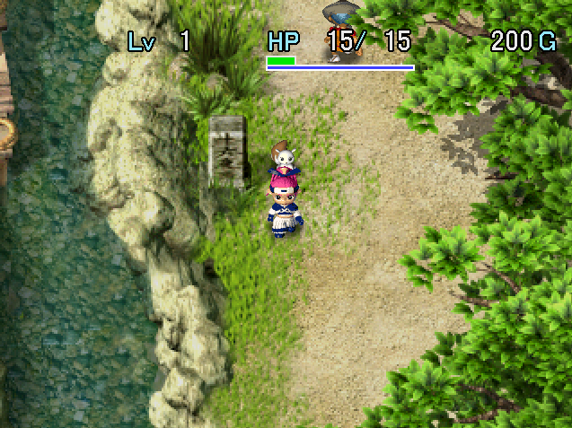

   

The 2nd dungeon of the game, and a decent bit harder than Tenrin Easy. Despite being a story dungeon, staves, pots, grass, and scrolls are found unidentified. That said, there's no limit to the number of items you can bring, so it's not all that difficult.

The 1st ending plays after clearing this dungeon, but don't be fooled - the story continues in a new region. There are plenty of new dungeons and gameplay mechanics to be enjoyed, so don't stop playing. If you revisit Kouga Village after clearing this dungeon, you'll be given a Synthesis Pot[5].

<ul class="quickLinksUL">
  <li><a href="#overview">Overview</a></li>
  <li><a href="#strategy">Strategy</a></li>
  <li><a href="#floor-guide">Floor Guide</a></li>
  <li><a href="#monsters">Monsters</a></li>
  <li><a href="#monster-table">Monster Table</a></li>
  <li><a href="#items">Items</a></li>
  <li><a href="#traps">Traps</a></li>
</ul>

# Overview

<table class="dungeonOverview">
  <tr>
    <th>Unlock</th>
    <td class="highlightYellow">Automatically unlocked after clearing Tenrin Easy.</td>
  </tr>
  <tr>
    <th>Entrance</th>
    <td class="highlightYellow">Izayoi Village (South East exit)</td>
  </tr>
</table>

<table class="dungeonTable">
  <tr>
    <th>JP Name</th>
    <td colspan="3">天輪国上級</td>
  </tr>
  <tr>
    <th>Floors</th>
    <td>27F</td>
    <th>Stairs</th>
    <td>Ascending</td>
  </tr>
  <tr>
    <th>Bring Items</th>
    <td>Yes</td>
    <th>Allies</th>
    <td>Yes</td>
  </tr>
  <tr>
    <th>Unidentified</th>
    <td colspan="3">Staves, Pots, Grass, Scrolls</td>
  </tr>
  <tr>
    <th>Shops</th>
    <td>Yes</td>
    <th>Monster Houses</th>
    <td>Regular</td>
  </tr>
  <tr>
    <th>Clear Icon</th>
    <td>Flower</td>
    <th>Reward</th>
    <td>Synthesis Pot[5]</td>
  </tr>
</table>

# Strategy

<ul class="quickLinksUL">
  <li><a href="#equipment">Equipment</a></li>
  <li><a href="#other-items">Other Items</a></li>
</ul>

### Equipment

#### Weapon

##### Main Weapon

<table class="dungeonTable">
  <thead>
    <tr>
      <th>Name</th>
      <th>Atk</th>
      <th>Slot</th>
      <th>Notes</th>
    </tr>
  </thead>
  <tbody>
    <tr>
      <td class="highlightGray">Kabura's Blade</td>
      <td class="centeredText">18</td>
      <td class="centeredText">6</td>
      <td>Can be found on the ground, but it's extremely rare.</td>
    </tr>
    <tr>
      <td class="highlightGray">Dotanuki</td>
      <td class="centeredText">10</td>
      <td class="centeredText">6</td>
      <td>Can be found on the ground.</td>
    </tr>
    <tr>
      <td class="highlightGray">Katana</td>
      <td class="centeredText">8</td>
      <td class="centeredText">5</td>
      <td>Purchase from the shop in Negoro Shrine (Tenrin Easy).</td>
    </tr>
  </tbody>
</table>

##### Seals

<table class="dungeonTable">
  <thead>
    <tr>
      <th>Seal</th>
      <th>Item</th>
      <th>Notes</th>
    </tr>
  </thead>
  <tbody>
    <tr>
      <td class="highlightGray">回</td>
      <td>Healing Sword</td>
      <td>Heal HP equal to 1/3 of damage dealt. Healing Sword → Synthesize Herb, Otogiriso, and Life Grass into a weapon.</td>
    </tr>
    <tr>
      <td class="highlightGray">金</td>
      <td>Plating Scroll Gold Sword</td>
      <td>Upgrade value never decreases due to rust. Nice for weapons with high base attack, but skip it on weaker weapons.</td>
    </tr>
    <tr>
      <td class="highlightGray">会</td>
      <td>Minotaur's Axe</td>
      <td>1/4 chance to land a critical hit. Minotaur's Axe can be obtained between 20-21F (Menbell) or 25-27F.</td>
    </tr>
    <tr>
      <td class="highlightGray">扇</td>
      <td>Tessen</td>
      <td>Increases shield base defense by 3. Base defense is incredibly important in this game.</td>
    </tr>
    <tr>
      <td class="highlightGray">根</td>
      <td>Bamboo Sword</td>
      <td>Increase strength by 1 every 100 swings. Synthesize 2 of these seals to reduce it to 50 swings.</td>
    </tr>
    <tr>
      <td class="highlightGray">弟</td>
      <td>Otogiriso</td>
      <td>Direct attacks restore 3.5 HP (Rounded up). Other seals should be prioritized, but it's not exactly a bad option.</td>
    </tr>
  </tbody>
</table>

#### Shield

##### Main Shield

<table class="dungeonTable">
  <thead>
    <tr>
      <th>Name</th>
      <th>Def</th>
      <th>Slot</th>
      <th>Notes</th>
    </tr>
  </thead>
  <tbody>
    <tr>
      <td class="highlightGray">Fuuma Shield</td>
      <td class="centeredText">16</td>
      <td class="centeredText">6</td>
      <td>Can be found on the ground, but it's extremely rare.</td>
    </tr>
    <tr>
      <td class="highlightGray">Iron Shield</td>
      <td class="centeredText">9</td>
      <td class="centeredText">5</td>
      <td>Purchase from the shop in Negoro Shrine (Tenrin Easy).</td>
    </tr>
    <tr>
      <td class="highlightGray">Beast Shield</td>
      <td class="centeredText">12</td>
      <td class="centeredText">4</td>
      <td>High base defense but only 4 slots, so Iron Shield might be better.</td>
    </tr>
  </tbody>
</table>

##### Seals

If you're using an Iron Shield, you can't go wrong with [金消弟弟弟].

<table class="dungeonTable">
  <thead>
    <tr>
      <th>Seal</th>
      <th>Item</th>
      <th>Notes</th>
    </tr>
  </thead>
  <tbody>
    <tr>
      <td class="highlightGray">消 or う</td>
      <td>Antidote Grass Scale Shield</td>
      <td>Prevents strength loss from poisons and slug licks. Strength is very important in this game.</td>
    </tr>
    <tr>
      <td class="highlightGray">弟</td>
      <td>Otogiriso</td>
      <td>Restore 3.5 HP (Rounded up) after taking damage. Synthesize 2~3 of these seals to take far less damage.</td>
    </tr>
    <tr>
      <td class="highlightGray">金</td>
      <td>Plating Scroll Gold Shield</td>
      <td>Upgrade value never decreases due to rust. Slimes only appear between 25-27F, so it's not essential here.</td>
    </tr>
    <tr>
      <td class="highlightGray">山</td>
      <td>Echo Shield</td>
      <td>Reflects Gazer hypnosis, King Tusker's magic, Jagan Mask's curse, etc. Echo Shield is extremely rare, but it's definitely worth synthesizing.</td>
    </tr>
    <tr>
      <td class="highlightGray">ト</td>
      <td>Walrus Shield</td>
      <td>Blocks Zalokleft, Thief Pelican, and Froggo special attacks. Walrus Shield can be purchased from the shop in Yokai Village.</td>
    </tr>
  </tbody>
</table>

### Other Items

#### Grass

<table class="dungeonTable">
  <thead>
    <tr>
      <th>Item</th>
      <th>Notes</th>
    </tr>
  </thead>
  <tbody>
    <tr>
      <td class="highlightGray">Revival Grass</td>
      <td>Revives you on the spot if you collapse - No effect if it's inside a pot.</td>
    </tr>
    <tr>
      <td class="highlightGray">Warp Grass</td>
      <td>Escape from a Monster House, or if you're surrounded.</td>
    </tr>
    <tr>
      <td class="highlightGray">Swift Seed</td>
      <td>Useful for running away, or if you need to make quick work of enemies.</td>
    </tr>
  </tbody>
</table>

#### Scrolls

<table class="dungeonTable">
  <thead>
    <tr>
      <th>Item</th>
      <th>Notes</th>
    </tr>
  </thead>
  <tbody>
    <tr>
      <td class="highlightGray">Blank Scroll</td>
      <td>Write the name of any scroll you've read before, and use this as that scroll.</td>
    </tr>
    <tr>
      <td class="highlightGray">Confusion Scroll</td>
      <td>Keep 1 on hand in case you encounter a Monster House.</td>
    </tr>
    <tr>
      <td class="highlightGray">Slumber Scroll</td>
      <td>Only use it if you can reach the stairs or defeat all enemies within 15 turns.</td>
    </tr>
    <tr>
      <td class="highlightGray">Fear Scroll</td>
      <td>Use it on Thief Pelicans to synthesize without risk of having items stolen.</td>
    </tr>
    <tr>
      <td class="highlightGray">Fixer Scroll</td>
      <td>Substitute for food, recover HP and paralyze enemies when surrounded, etc.</td>
    </tr>
    <tr>
      <td class="highlightGray">Sanctuary Scroll</td>
      <td>Nice for Monster Houses - Cannot be used during the boss fight.</td>
    </tr>
    <tr>
      <td class="highlightGray">Blaze Scroll</td>
      <td>Can be useful during the boss fight, but a bit dangerous if you have allies.</td>
    </tr>
  </tbody>
</table>

#### Staves

<table class="dungeonTable">
  <thead>
    <tr>
      <th>Item</th>
      <th>Notes</th>
    </tr>
  </thead>
  <tbody>
    <tr>
      <td class="highlightGray">Decoy Staff</td>
      <td>Lets you overcome a variety of dangerous situations with a single swing.</td>
    </tr>
    <tr>
      <td class="highlightGray">Slow Staff</td>
      <td>Basically ensures victory when fighting a single enemy.</td>
    </tr>
    <tr>
      <td class="highlightGray">Seal Staff</td>
      <td>Seal monsters with nasty specials such as Kengo, Curse Girl, Nigiri Boss. Sealed Thief Pelicans will approach you instead of running away.</td>
    </tr>
  </tbody>
</table>

# Floor Guide

### Izayoi Paddy - South (1-2F)

Monsters are weak, so you shouldn't have problems - check every room and pick up all items. Lady Locks (2-4F) can reflect Minamo's kunai attack, so don't let Minamo roam around on her own. Remember, an ally has to land the final hit to gain experience points in this game.

### Morigami Underpass (3-4F)

Sluggy (3-4F) appears, so use arrows or staves if you don't have the う or 消 seal on your shield. It's hard to restore ally strength if they get licked, so consider taking the hit for them if they're facing a Sluggy.

### Jade Cave (5-6F)

Gazer (5-7F) and Nigiri Morph (6-8F) can destroy items. Use projectiles to safely defeat them from a distance, and use a staff or scroll if adjacent.

### Mountain Pass

Choose between Heiji and Kihachi to join you as an ally to proceed. If you want to focus on leveling Minamo, choose Kihachi and defeat him right away. (Heiji dodges arrows)

### Tenrin Forest - East (7-8F)

Thief Pelican (7-10F) can be used to synthesize items. Again, it's highly recommended to synthesize an Antidote Grass and 3 Otogiriso into your shield. Lv1 Thief Pelicans can only eat up to 2 items, so you'll need 4 of them to finalize your shield. Walrus Shield can be equipped to block Thief Pelican from inhaling items when adjacent.

Rocket Boar (7-9F) can make you trip and drop items, so fight with your back against a wall. If you found a Balance Staff, keep it in your inventory to prevent tripping.

### Shirakami Swamp - East (9-10F)

Bored Kappa (9-10F) throws items on the ground at you, so check rooms quickly. Leave 1 slot open in a Storage Pot to have a chance at catching an item thrown by a Bored Kappa.

Bitter Sluggy (9-11F) lowers max strength by 1, so avoid direct attacks unless you have う or 消 on your shield. If an ally gets licked, their strength will be lowered by 20%.

Demon Warrior (9-11F) reappears as Ghost Warrior after 3 turns pass once defeated. 
Ghost Warrior runs toward a different monster and levels them up, so use a Knockback Staff to one-shot it.

Twisty Hani (10-12F) can perform a dance that decreases a target's level by 1. Allies attack napping monsters, so expect to fight Twisty Hanis if you have allies with you. Otherwise, they only wake up if you walk next to them, so they can be ignored.

### Fuigo Copper Mine (11-12F)

Curse Girl (12-14F) can curse 1 item, which generally makes the item unable to be unequipped, or unusable. Pots can't be cursed in this game, so protect important items by inserting them into pots. Purify Scroll can never be cursed, so it's safe to carry it outside of a pot.

Spin Polygon (12-14F) teleports to you inside rooms, which can be dangerous in a Monster House. If that happens, use a Swap Staff to escape into a hallway.

Mutaikon (12-14F) throws Poison Grass, which lowers your strength by 1 and inflicts Slow status. It has a throwing range of 2 tiles, so you can use arrows from outside its range to defeat it.

### Fire Dragon's Fangs (13-14F)

Falcon Tengu (11-13F) disguises itself as a different monster, and overlaps with Robber Pelican (13-16F) on 13F. Therefore, don't throw equipment right away at Robber Pelicans on 13F - shoot an arrow to check if it's real first. If you want to be extra safe, wait to synthesize until 14F where Falcon Tengu no longer appears.

### Ancient Tomb (15-16F)

Kengo (14-16F) can disarm your equipped shield, sending it flying behind you. The shield is permanently lost if it hits a character, so be careful - don't dash, and fight with a wall behind you.

Pop Tank (14-16F) fires cannonballs that deal a fixed 20 damage. The cannonball blasts deal damage in a 1 tile radius, so watch where you stand to avoid leveling it up. Water Pot can be used to inflict Sealed status, which prevents a monster from using its special attack.

### Yokai Village

A peculiar village full of friendly monsters - don't worry, you won't have to fight any of them. Stock up at the item shop if you're running low on food or healing items.

#### Inn

Pay 500 Gitan to fully restore HP and fullness.

#### Item Shop

|Item|Price|
|-|-|
|Dried Bonito|2000|
|Walrus Shield|6000|
|Huge Onigiri|300|
|Otogiriso|500|
|Antidote Grass|400|
|Purify Scroll|1000|
|Identify Scroll|500|
|Storage Pot[4]|1440|
|Heal Pot[4]|1200|
|Escape Scroll|1000|

### Hourai Cave (17-18F)

Dragon (17-20F) has high attack power, and can breathe fire that deals 20 damage in a straight line. Be careful where you stand if there are other monsters around so that it doesn't level up into a Sky Dragon.

King Tusker (17-20F) swings a Paralysis Staff, which is very dangerous if there are other monsters in the room. It's best to assume red dots outside of your view are King Tuskers in this floor range.

### Mount Hourai (19-20F)

Nigiri Boss (20-22F) inflicts Onigiri status, which nullifies equipment and prevents item usage for 10 turns. It's mostly fine if it's a 1 vs 1 fight, but it's extremely dangerous if other monsters are around.

Bandit Pelican (20-24F) acts at double speed, and can be rather annoying if you can't defeat it quickly. Thief Pelican types gain strength when they eat, so consider stepping away after they steal if your defense is low. If you want to synthesize, it's recommended to do so on 20F for terrain reasons.

If you're feeling adventurous, have Menbell (20-22F) summon monsters until you obtain a Minotaur's Axe. This axe can be synthesized into your main weapon to gain the 会 seal (1/4 chance to land a critical hit). However, be warned that monsters Menbell summons including Minotaur can be quite powerful. ※ This can only be done between 20-21F, since Taurs don't appear on 22F.

### Water Dragon's Spine (21-22F)

Area where you utilize springs to change rooms instead of hallways.

Iai (22-24F) can disarm your equipped weapon or shield, sending it flying behind you. It has high attack power and defense, so don't hesitate to use items - Water Pot reduces its attack power.

### Meiouran (23-27F)

Super Gazer (23-25F) can hypnotize Asuka, making her use an item or attack in a random direction. If you're unlucky, it could make you read an Escape Scroll or insert your weapon or shield into a Heal Pot, so keep Escape Scroll inside a pot, and either discard any Heal Pots or keep your weapon and shield cursed.

Rancor Sluggy (24-27F) lowers max strength by 2 and multiplies, but you should have う or 消 on your shield at this point, so the main danger is an ally getting licked if you have allies with you.

Power type monsters like Minotaur, Chainhead, Nashagga, Sky Dragon, Cranky Tank appear between 25-27F. It's fine to trade hits if your shield is strong and you have lots of 弟 seals, but otherwise it's best to rush stairs. If you have Navigation Scrolls, go ahead and read them on these floors.

### Meiouran Peak

#### 1st Fight

Fight against the incomplete form of Meiouran.

|Name|HP|Atk|Def|Exp|Notes|
|-|-|-|-|-|-|
|Meiouran|300|45|20|9999|・Eats projectiles to heal 20 HP. ・Doesn't move or attack. ・Closes its flower bud to become invulnerable. ・Summons 1 monster while flower bud is open.|

Meiouran doesn't move or use direct attacks, but can close its flower bud to shield itself from damage. The flower bud loop: closed for 4 turns → opens flower bud → open for 6 turns → closes flower bud  → repeat. It's completely invulnerable while its flower bud is closed, so you have to wait until it opens up to deal damage. It can eat projectiles and thrown items to heal itself by 20 HP, and it summons 1 monster while its flower bud is open.

The fight begins with monsters on the field - 1 Sky Dragon, 2 Earth Needles, 2 Nashaggas, and 2 Horse Shoguns. The monsters it can summon include Nashagga, Horse Shogun, Skull Dragon, Rancor Sluggy, and Yenron.

There's distance between Asuka and monsters at the start, so Sky Dragon and Horse Shogun can be troublesome. Confusion Scroll seals their special attacks for 20 turns, and Swap Staff can be used to quickly get closer. Decoy Staff is rather risky, since Lv3 versions of any of the monsters in this fight are quite strong. Sanctuary Scroll cannot be used, so don't bother placing it on the ground.

#### 2nd Fight

Fight against the complete form of Meiouran.

|Name|HP|Atk|Def|Exp|Notes|
|-|-|-|-|-|-|
|Meiouran|300|45|20|9999|・Doesn't move or attack. ・Closes its flower bud to become invulnerable. ・Summons 1 monster while flower bud is open.|
|Stamen|50|25|15|500|・Doesn't move. ・2 tile radius attack that lowers strength by 1.|
|Vine|50|30|10|500|・Moves underfoot and launches Asuka away.|

Minamo joins you as an ally before this fight begins, even if she wasn't present for the 1st fight. If she was present for the 1st fight, her HP won't be restored, so use Heal Staff or Otogiriso on her.

Meiouran doesn't behave differently, other than not being able to eat projectiles and thrown items. Minamo's kunai attack and arrows are a nice source of damage, and the flower bud tile can be set on fire. Other monsters don't appear at the start of the fight, so it's easier to approach Meiouran.

The stamens don't move, but attack a 2 tile radius which lowers strength by 1 point after 3 turns. Vines approach Asuka, and will hit Asuka away from Meiouran if you don't move when they're underfoot. Decoy Staff can be used to make vines go after a different target, letting you focus on the boss.

Most story dungeons after this one don't allow carry-in items, so don't hesitate to use up your items.

# Monsters

<table class="dungeonMonsterList monsterListDay">
  <thead>
    <tr>
      <th>F</th>
      <th>Name</th>
      <th>HP</th>
      <th>Atk</th>
      <th>Def</th>
      <th>Exp</th>
      <th>Type</th>
      <th>Notes</th>
    </tr>
  </thead>
  <tbody>
    <tr>
      <td>1-2</td>
      <td>Mamel</td>
      <td>5</td>
      <td>2</td>
      <td>2</td>
      <td>2</td>
      <td>-</td>
      <td>-</td>
    </tr>
    <tr>
      <td>1-2</td>
      <td>Pit Mamel</td>
      <td>7</td>
      <td>3</td>
      <td>2</td>
      <td>4</td>
      <td>-</td>
      <td>-</td>
    </tr>
    <tr>
      <td>1-2</td>
      <td>Chintala</td>
      <td>6</td>
      <td>2</td>
      <td>3</td>
      <td>3</td>
      <td>-</td>
      <td>-</td>
    </tr>
    <tr>
      <td>2-4</td>
      <td>Lady Locks</td>
      <td>10</td>
      <td>5</td>
      <td>4</td>
      <td>5</td>
      <td>-</td>
      <td>HP Drain, reflects projectiles.</td>
    </tr>
    <tr>
      <td>3-4</td>
      <td>Nigiri Novice</td>
      <td>11</td>
      <td>7</td>
      <td>6</td>
      <td>9</td>
      <td>-</td>
      <td>-</td>
    </tr>
    <tr>
      <td>3-4</td>
      <td>Tug Frog</td>
      <td>11</td>
      <td>5</td>
      <td>5</td>
      <td>6</td>
      <td>Aquatic</td>
      <td>Pulls a target toward itself.</td>
    </tr>
    <tr>
      <td>3-4</td>
      <td>Sluggy</td>
      <td>14</td>
      <td>6</td>
      <td>5</td>
      <td>8</td>
      <td>Drain</td>
      <td>Decreases strength by 1.</td>
    </tr>
    <tr>
      <td>4-5</td>
      <td>Froggo</td>
      <td>22</td>
      <td>0</td>
      <td>8</td>
      <td>10</td>
      <td>-</td>
      <td>Steals Gitan and warps.</td>
    </tr>
    <tr>
      <td>4-5</td>
      <td>Bow Boy</td>
      <td>20</td>
      <td>3</td>
      <td>5</td>
      <td>14</td>
      <td>-</td>
      <td>Shoots Wood Arrows.</td>
    </tr>
    <tr>
      <td>4-5</td>
      <td>Crow Tengu</td>
      <td>16</td>
      <td>9</td>
      <td>8</td>
      <td>12</td>
      <td>-</td>
      <td>Disguises itself as other monsters.</td>
    </tr>
    <tr>
      <td>4-5</td>
      <td>Novice Ninja</td>
      <td>21</td>
      <td>10</td>
      <td>6</td>
      <td>18</td>
      <td>-</td>
      <td>Throws Shurikens when HP is low.</td>
    </tr>
    <tr>
      <td>5-7</td>
      <td>Gazer</td>
      <td>23</td>
      <td>11</td>
      <td>5</td>
      <td>20</td>
      <td>Cyclops</td>
      <td>Hypnotizes Asuka.</td>
    </tr>
    <tr>
      <td>5-7</td>
      <td>Zalokleft</td>
      <td>25</td>
      <td>0</td>
      <td>6</td>
      <td>12</td>
      <td>Aquatic</td>
      <td>Steals an item and warps.</td>
    </tr>
    <tr>
      <td>5-7</td>
      <td>Laugh Polygon</td>
      <td>18</td>
      <td>10</td>
      <td>9</td>
      <td>18</td>
      <td>Drain</td>
      <td>Decreases fullness by 5%.</td>
    </tr>
    <tr>
      <td>6-7</td>
      <td>Spearfish</td>
      <td>24</td>
      <td>15</td>
      <td>8</td>
      <td>24</td>
      <td>Aquatic</td>
      <td>Can move underwater.</td>
    </tr>
    <tr>
      <td>6-8</td>
      <td>Mid Chintala</td>
      <td>25</td>
      <td>14</td>
      <td>7</td>
      <td>22</td>
      <td>-</td>
      <td>-</td>
    </tr>
    <tr>
      <td>6-8</td>
      <td>Nigiri Morph</td>
      <td>24</td>
      <td>11</td>
      <td>10</td>
      <td>25</td>
      <td>-</td>
      <td>Turns an inventory item into a Large Onigiri.</td>
    </tr>
    <tr>
      <td>6-8</td>
      <td>N'dubba</td>
      <td>15</td>
      <td>5</td>
      <td>5</td>
      <td>25</td>
      <td>-</td>
      <td>Disguises itself as an item.</td>
    </tr>
    <tr>
      <td>7-8</td>
      <td>Shadow Hat</td>
      <td>27</td>
      <td>20</td>
      <td>12</td>
      <td>30</td>
      <td>Cyclops</td>
      <td>Takes control of a target for 10 turns.</td>
    </tr>
    <tr>
      <td>7-9</td>
      <td>Rocket Boar</td>
      <td>33</td>
      <td>21</td>
      <td>11</td>
      <td>35</td>
      <td>-</td>
      <td>Makes Asuka trip and drop items.</td>
    </tr>
    <tr>
      <td>7-10</td>
      <td>Thief Pelican</td>
      <td>28</td>
      <td>10</td>
      <td>11</td>
      <td>15</td>
      <td>-</td>
      <td>Eats and synthesizes up to 2 items.</td>
    </tr>
    <tr>
      <td>8-10</td>
      <td>Boy Cart</td>
      <td>30</td>
      <td>5</td>
      <td>11</td>
      <td>28</td>
      <td>-</td>
      <td>Shoots Iron Arrows.</td>
    </tr>
    <tr>
      <td>8-10</td>
      <td>Pud</td>
      <td>35</td>
      <td>17</td>
      <td>8</td>
      <td>27</td>
      <td>-</td>
      <td>Electric attack that deals 20 damage.</td>
    </tr>
    <tr>
      <td>9-10</td>
      <td>Bored Kappa</td>
      <td>32</td>
      <td>19</td>
      <td>7</td>
      <td>32</td>
      <td>Aquatic</td>
      <td>Throws items within 5 tiles.</td>
    </tr>
    <tr>
      <td>9-10</td>
      <td>Lt. Spearfish</td>
      <td>35</td>
      <td>20</td>
      <td>12</td>
      <td>50</td>
      <td>Aquatic</td>
      <td>Runs into water to heal when HP is low.</td>
    </tr>
    <tr>
      <td>9-11</td>
      <td>Pull Frog</td>
      <td>43</td>
      <td>22</td>
      <td>10</td>
      <td>55</td>
      <td>Aquatic</td>
      <td>Pulls a target toward itself and attacks.</td>
    </tr>
    <tr>
      <td>9-11</td>
      <td>Demon Warrior</td>
      <td>35</td>
      <td>23</td>
      <td>10</td>
      <td>30</td>
      <td>-</td>
      <td>Ghost Warrior appears when defeated.</td>
    </tr>
    <tr>
      <td>9-11</td>
      <td>Twisty Hani</td>
      <td>32</td>
      <td>20</td>
      <td>13</td>
      <td>200</td>
      <td>Drain</td>
      <td>Decreases level by 1.</td>
    </tr>
    <tr>
      <td>9-11</td>
      <td>Bitter Sluggy</td>
      <td>40</td>
      <td>20</td>
      <td>8</td>
      <td>60</td>
      <td>Drain</td>
      <td>Decreases max strength by 1.</td>
    </tr>
    <tr>
      <td>10-12</td>
      <td>Tiger Tosser</td>
      <td>39</td>
      <td>24</td>
      <td>8</td>
      <td>40</td>
      <td>-</td>
      <td>Throws Asuka and other monsters.</td>
    </tr>
    <tr>
      <td>11-12</td>
      <td>Horse Ronin</td>
      <td>40</td>
      <td>16</td>
      <td>12</td>
      <td>42</td>
      <td>-</td>
      <td>Shoots Silver Arrows.</td>
    </tr>
    <tr>
      <td>11-13</td>
      <td>Pumphantasm</td>
      <td>45</td>
      <td>28</td>
      <td>8</td>
      <td>50</td>
      <td>Ghost</td>
      <td>Can pass through walls.</td>
    </tr>
    <tr>
      <td>11-13</td>
      <td>Spike Dragon</td>
      <td>48</td>
      <td>25</td>
      <td>12</td>
      <td>52</td>
      <td>Dragon</td>
      <td>Retreats into its shell for 2 turns.</td>
    </tr>
    <tr>
      <td>11-13</td>
      <td>Lovely Locks</td>
      <td>41</td>
      <td>23</td>
      <td>13</td>
      <td>48</td>
      <td>-</td>
      <td>HP Drain, reflects magic and projectiles.</td>
    </tr>
    <tr>
      <td>11-13</td>
      <td>Falcon Tengu</td>
      <td>50</td>
      <td>15</td>
      <td>10</td>
      <td>60</td>
      <td>-</td>
      <td>Disguises itself as other monsters.</td>
    </tr>
    <tr>
      <td>12-14</td>
      <td>Spin Polygon</td>
      <td>53</td>
      <td>22</td>
      <td>12</td>
      <td>68</td>
      <td>Drain</td>
      <td>Decreases fullness by 10%.</td>
    </tr>
    <tr>
      <td>12-14</td>
      <td>Adept Ninja</td>
      <td>55</td>
      <td>25</td>
      <td>7</td>
      <td>85</td>
      <td>-</td>
      <td>Throws Shurikens when HP is low.</td>
    </tr>
    <tr>
      <td>12-14</td>
      <td>Mutaikon</td>
      <td>38</td>
      <td>20</td>
      <td>11</td>
      <td>51</td>
      <td>Ghost</td>
      <td>Throws Poison Grass.</td>
    </tr>
    <tr>
      <td>12-14</td>
      <td>Curse Girl</td>
      <td>50</td>
      <td>21</td>
      <td>8</td>
      <td>80</td>
      <td>-</td>
      <td>Curses 1 item.</td>
    </tr>
    <tr>
      <td>13-14</td>
      <td>Inferno</td>
      <td>62</td>
      <td>28</td>
      <td>10</td>
      <td>65</td>
      <td>-</td>
      <td>Burns thrown items.</td>
    </tr>
    <tr>
      <td>13-15</td>
      <td>Muron</td>
      <td>55</td>
      <td>20</td>
      <td>5</td>
      <td>62</td>
      <td>Dragon</td>
      <td>Beam that deals 10 damage + knockback.</td>
    </tr>
    <tr>
      <td>13-15</td>
      <td>Jagan Mask</td>
      <td>36</td>
      <td>15</td>
      <td>16</td>
      <td>66</td>
      <td>Ghost</td>
      <td>Casts a curse that kills after 30 turns.</td>
    </tr>
    <tr>
      <td>13-16</td>
      <td>Robber Pelican</td>
      <td>50</td>
      <td>20</td>
      <td>12</td>
      <td>30</td>
      <td>-</td>
      <td>Eats and synthesizes up to 3 items.</td>
    </tr>
    <tr>
      <td>14-16</td>
      <td>Porky</td>
      <td>70</td>
      <td>25</td>
      <td>8</td>
      <td>80</td>
      <td>-</td>
      <td>Throws Porky Rocks from 2 tiles away.</td>
    </tr>
    <tr>
      <td>14-16</td>
      <td>Pop Tank</td>
      <td>40</td>
      <td>12</td>
      <td>15</td>
      <td>150</td>
      <td>Bomb</td>
      <td>Fires 20 damage cannonballs.</td>
    </tr>
    <tr>
      <td>14-16</td>
      <td>Kengo</td>
      <td>55</td>
      <td>28</td>
      <td>13</td>
      <td>80</td>
      <td>-</td>
      <td>Disarms shields.</td>
    </tr>
    <tr>
      <td>14-16</td>
      <td>Pudding</td>
      <td>43</td>
      <td>20</td>
      <td>11</td>
      <td>63</td>
      <td>-</td>
      <td>Electric attack that deals 30 damage.</td>
    </tr>
    <tr>
      <td>15-16</td>
      <td>Schubell</td>
      <td>53</td>
      <td>22</td>
      <td>10</td>
      <td>58</td>
      <td>-</td>
      <td>Summons one Lv1 monster.</td>
    </tr>
    <tr>
      <td>15-16</td>
      <td>Soldier Ant</td>
      <td>58</td>
      <td>28</td>
      <td>8</td>
      <td>65</td>
      <td>-</td>
      <td>Digs out wall tiles.</td>
    </tr>
    <tr>
      <td>15-16</td>
      <td>Master Ninja</td>
      <td>70</td>
      <td>24</td>
      <td>12</td>
      <td>100</td>
      <td>-</td>
      <td>Throws Shurikens when HP is low.</td>
    </tr>
    <tr>
      <td>15-17</td>
      <td>Hannya Warrior</td>
      <td>57</td>
      <td>26</td>
      <td>11</td>
      <td>92</td>
      <td>-</td>
      <td>Ghost Warrior appears when defeated.</td>
    </tr>
    <tr>
      <td>15-18</td>
      <td>Shagga</td>
      <td>63</td>
      <td>30</td>
      <td>12</td>
      <td>95</td>
      <td>Dragon</td>
      <td>-</td>
    </tr>
    <tr>
      <td>16-18</td>
      <td>Horse Samurai</td>
      <td>65</td>
      <td>27</td>
      <td>12</td>
      <td>110</td>
      <td>-</td>
      <td>Shoots Silver Arrows.</td>
    </tr>
    <tr>
      <td>16-18</td>
      <td>Floor Dragon</td>
      <td>65</td>
      <td>25</td>
      <td>12</td>
      <td>82</td>
      <td>Dragon</td>
      <td>Goes behind you if there's another monster.</td>
    </tr>
    <tr>
      <td>17-19</td>
      <td>Black Hat</td>
      <td>50</td>
      <td>20</td>
      <td>15</td>
      <td>120</td>
      <td>Cyclops</td>
      <td>Takes control of a target for 15 turns.</td>
    </tr>
    <tr>
      <td>17-19</td>
      <td>Kigny</td>
      <td>60</td>
      <td>28</td>
      <td>13</td>
      <td>60</td>
      <td>-</td>
      <td>Attacks any creature, friend or foe.</td>
    </tr>
    <tr>
      <td>17-19</td>
      <td>King Tusker</td>
      <td>55</td>
      <td>20</td>
      <td>12</td>
      <td>47</td>
      <td>-</td>
      <td>Swings a Paralysis Staff.</td>
    </tr>
    <tr>
      <td>17-19</td>
      <td>Goldie Locks</td>
      <td>60</td>
      <td>25</td>
      <td>15</td>
      <td>90</td>
      <td>-</td>
      <td>HP Drain, reflects magic and projectiles.</td>
    </tr>
    <tr>
      <td>17-20</td>
      <td>Dragon</td>
      <td>70</td>
      <td>35</td>
      <td>15</td>
      <td>450</td>
      <td>Dragon</td>
      <td>Breathes 20 damage fire in a straight line.</td>
    </tr>
    <tr>
      <td>18-20</td>
      <td>Ironhead</td>
      <td>75</td>
      <td>32</td>
      <td>8</td>
      <td>200</td>
      <td>Cyclops</td>
      <td>Attacks from 3 tiles away.</td>
    </tr>
    <tr>
      <td>19-21</td>
      <td>Ether Devil</td>
      <td>50</td>
      <td>30</td>
      <td>15</td>
      <td>95</td>
      <td>Ghost</td>
      <td>Invisible, moves randomly, reflects magic.</td>
    </tr>
    <tr>
      <td>19-21</td>
      <td>Taur</td>
      <td>95</td>
      <td>30</td>
      <td>2</td>
      <td>120</td>
      <td>-</td>
      <td>1/4 chance for a x1.3 damage brutal hit.</td>
    </tr>
    <tr>
      <td>19-21</td>
      <td>Tiny Phoenix</td>
      <td>75</td>
      <td>23</td>
      <td>11</td>
      <td>350</td>
      <td>-</td>
      <td>Warps to a hurt monster and heals 50 HP.</td>
    </tr>
    <tr>
      <td>19-21</td>
      <td>Bone Dragon</td>
      <td>52</td>
      <td>23</td>
      <td>12</td>
      <td>64</td>
      <td>Ghost Dragon</td>
      <td>-</td>
    </tr>
    <tr>
      <td>20-22</td>
      <td>Yenron</td>
      <td>80</td>
      <td>35</td>
      <td>10</td>
      <td>120</td>
      <td>Dragon</td>
      <td>Beam that deals 20 damage + knockback.</td>
    </tr>
    <tr>
      <td>20-22</td>
      <td>Menbell</td>
      <td>64</td>
      <td>28</td>
      <td>11</td>
      <td>103</td>
      <td>-</td>
      <td>Summons one Lv2 monster.</td>
    </tr>
    <tr>
      <td>20-22</td>
      <td>Nigiri Boss</td>
      <td>68</td>
      <td>25</td>
      <td>15</td>
      <td>108</td>
      <td>-</td>
      <td>Inflicts Onigiri status on a target.</td>
    </tr>
    <tr>
      <td>20-22</td>
      <td>Bomb</td>
      <td>50</td>
      <td>31</td>
      <td>25</td>
      <td>150</td>
      <td>Bomb</td>
      <td>Explodes after HP falls below 1/2.</td>
    </tr>
    <tr>
      <td>20-22</td>
      <td>Jagar Prince</td>
      <td>70</td>
      <td>30</td>
      <td>17</td>
      <td>99</td>
      <td>Ghost</td>
      <td>Casts a curse that kills after 20 turns.</td>
    </tr>
    <tr>
      <td>20-24</td>
      <td>Bandit Pelican</td>
      <td>62</td>
      <td>20</td>
      <td>15</td>
      <td>70</td>
      <td>-</td>
      <td>Eats and synthesizes up to 4 items.</td>
    </tr>
    <tr>
      <td>21-23</td>
      <td>Yank Frog</td>
      <td>82</td>
      <td>27</td>
      <td>12</td>
      <td>121</td>
      <td>Aquatic</td>
      <td>Pulls a target toward itself and attacks.</td>
    </tr>
    <tr>
      <td>21-24</td>
      <td>Capt. Spearfish</td>
      <td>65</td>
      <td>26</td>
      <td>23</td>
      <td>116</td>
      <td>Aquatic</td>
      <td>Runs into water to heal when HP is low.</td>
    </tr>
    <tr>
      <td>22-24</td>
      <td>Jet Boar</td>
      <td>85</td>
      <td>35</td>
      <td>5</td>
      <td>135</td>
      <td>-</td>
      <td>Makes Asuka trip and drop items.</td>
    </tr>
    <tr>
      <td>22-24</td>
      <td>Pumphantom</td>
      <td>80</td>
      <td>45</td>
      <td>10</td>
      <td>180</td>
      <td>Ghost</td>
      <td>Can pass through walls.</td>
    </tr>
    <tr>
      <td>22-24</td>
      <td>Iai</td>
      <td>90</td>
      <td>40</td>
      <td>20</td>
      <td>380</td>
      <td>-</td>
      <td>Disarms weapons and shields.</td>
    </tr>
    <tr>
      <td>22-24</td>
      <td>Lime Zalokleft</td>
      <td>60</td>
      <td>0</td>
      <td>10</td>
      <td>78</td>
      <td>Aquatic</td>
      <td>Steals an item and warps.</td>
    </tr>
    <tr>
      <td>23-25</td>
      <td>Dance Polygon</td>
      <td>62</td>
      <td>30</td>
      <td>24</td>
      <td>115</td>
      <td>Drain</td>
      <td>Decreases fullness by 30%.</td>
    </tr>
    <tr>
      <td>23-25</td>
      <td>Super Gazer</td>
      <td>72</td>
      <td>32</td>
      <td>16</td>
      <td>200</td>
      <td>Cyclops</td>
      <td>Hypnotizes Asuka.</td>
    </tr>
    <tr>
      <td>23-25</td>
      <td>Dragon Head</td>
      <td>77</td>
      <td>30</td>
      <td>15</td>
      <td>160</td>
      <td>Dragon</td>
      <td>Goes behind you if there's another monster.</td>
    </tr>
    <tr>
      <td>23-25</td>
      <td>Horse Shogun</td>
      <td>68</td>
      <td>25</td>
      <td>15</td>
      <td>165</td>
      <td>-</td>
      <td>Shoots Silver Arrows.</td>
    </tr>
    <tr>
      <td>24-27</td>
      <td>Rancor Sluggy</td>
      <td>88</td>
      <td>27</td>
      <td>12</td>
      <td>127</td>
      <td>Drain</td>
      <td>Decreases max strength by 2.</td>
    </tr>
    <tr>
      <td>24-27</td>
      <td>Chainhead</td>
      <td>110</td>
      <td>38</td>
      <td>13</td>
      <td>400</td>
      <td>Cyclops</td>
      <td>Attacks from 3 tiles away.</td>
    </tr>
    <tr>
      <td>25-27</td>
      <td>Slime</td>
      <td>60</td>
      <td>0</td>
      <td>15</td>
      <td>50</td>
      <td>Drain</td>
      <td>Lowers equipment upgrade value by 1.</td>
    </tr>
    <tr>
      <td>25-27</td>
      <td>Minotaur</td>
      <td>120</td>
      <td>50</td>
      <td>5</td>
      <td>450</td>
      <td>-</td>
      <td>1/4 chance for a x1.3 damage brutal hit.</td>
    </tr>
    <tr>
      <td>25-27</td>
      <td>Monarch Tusker</td>
      <td>108</td>
      <td>32</td>
      <td>5</td>
      <td>155</td>
      <td>-</td>
      <td>Swings a Seal Staff.</td>
    </tr>
    <tr>
      <td>25-27</td>
      <td>Cranky Tank</td>
      <td>80</td>
      <td>15</td>
      <td>11</td>
      <td>800</td>
      <td>Bomb</td>
      <td>Fires 20 damage cannonballs.</td>
    </tr>
    <tr>
      <td>25-27</td>
      <td>Sky Dragon</td>
      <td>100</td>
      <td>50</td>
      <td>20</td>
      <td>1200</td>
      <td>Dragon</td>
      <td>Breathes 30 damage fire inside rooms.</td>
    </tr>
    <tr>
      <td>25-27</td>
      <td>Nashagga</td>
      <td>86</td>
      <td>30</td>
      <td>15</td>
      <td>300</td>
      <td>Dragon</td>
      <td>Attacks 2 times.</td>
    </tr>
    <tr>
      <td>26-27</td>
      <td>Big Chintala</td>
      <td>80</td>
      <td>35</td>
      <td>10</td>
      <td>300</td>
      <td>-</td>
      <td>-</td>
    </tr>
    <tr>
      <td>26-27</td>
      <td>Porko</td>
      <td>75</td>
      <td>40</td>
      <td>12</td>
      <td>800</td>
      <td>-</td>
      <td>Throws Porky Rocks from 5 tiles away.</td>
    </tr>
    <tr>
      <td>26-27</td>
      <td>Curse Sister</td>
      <td>90</td>
      <td>36</td>
      <td>10</td>
      <td>300</td>
      <td>-</td>
      <td>Curses 2 items.</td>
    </tr>
    <tr>
      <td>N/A</td>
      <td>Ghost Warrior</td>
      <td>4</td>
      <td>0</td>
      <td>0</td>
      <td>10</td>
      <td>-</td>
      <td>Increases the level of a monster.</td>
    </tr>
  </tbody>
</table>

# Monster Table

Enemy Colors: Farming Useful Destroys Items Dangerous

<table class="monsterTable">
  <thead>
    <tr>
      <th>F</th>
      <th colspan="6">Monsters</th>
    </tr>
  </thead>
  <tbody>
    <tr>
      <th>1</th>
      <td>Mamel</td>
      <td>Pit Mamel</td>
      <td>Chintala</td>
      <td class="highlightGray"></td>
      <td class="highlightGray"></td>
      <td class="highlightGray"></td>
    </tr>
    <tr>
      <th>2</th>
      <td>Mamel</td>
      <td>Pit Mamel</td>
      <td>Chintala</td>
      <td>Lady Locks</td>
      <td class="highlightGray"></td>
      <td class="highlightGray"></td>
    </tr>
    <tr>
      <th>3</th>
      <td>Nigiri Novice</td>
      <td>Sluggy</td>
      <td>Tug Frog</td>
      <td>Lady Locks</td>
      <td class="highlightGray"></td>
      <td class="highlightGray"></td>
    </tr>
    <tr>
      <th>4</th>
      <td>Nigiri Novice Crow Tengu</td>
      <td>Sluggy Novice Ninja</td>
      <td>Tug Frog</td>
      <td>Lady Locks</td>
      <td>Froggo</td>
      <td>Bow Boy</td>
    </tr>
    <tr>
      <th>5</th>
      <td>Gazer Crow Tengu</td>
      <td>Zalokleft Novice Ninja</td>
      <td>Laugh Polygon</td>
      <td class="highlightGray"></td>
      <td>Froggo</td>
      <td>Bow Boy</td>
    </tr>
    <tr>
      <th>6</th>
      <td>Gazer Mid Chintala</td>
      <td>Zalokleft</td>
      <td>Laugh Polygon</td>
      <td>Spearfish</td>
      <td>Nigiri Morph</td>
      <td>N'dubba</td>
    </tr>
    <tr>
      <td colspan="7" class="monsterTableVillage">Mountain Pass</td>
    </tr>
    <tr>
      <th>7</th>
      <td>Gazer Mid Chintala</td>
      <td>Zalokleft Shadow Hat</td>
      <td>Laugh Polygon</td>
      <td>Spearfish Rocket Boar</td>
      <td>Nigiri Morph Thief Pelican</td>
      <td>N'dubba</td>
    </tr>
    <tr>
      <th>8</th>
      <td>Boy Cart Mid Chintala</td>
      <td>Pud Shadow Hat</td>
      <td class="highlightGray"></td>
      <td>Rocket Boar</td>
      <td>Nigiri Morph Thief Pelican</td>
      <td>N'dubba</td>
    </tr>
    <tr>
      <th>9</th>
      <td>Boy Cart Pull Frog</td>
      <td>Pud Twisty Hani</td>
      <td>Bored Kappa Demon Warrior</td>
      <td>Lt. Spearfish Rocket Boar</td>
      <td>Thief Pelican</td>
      <td>Bitter Sluggy</td>
    </tr>
    <tr>
      <th>10</th>
      <td>Boy Cart Pull Frog</td>
      <td>Pud Twisty Hani</td>
      <td>Bored Kappa Demon Warrior</td>
      <td>Lt. Spearfish Tiger Tosser</td>
      <td>Thief Pelican</td>
      <td>Bitter Sluggy</td>
    </tr>
    <tr>
      <th>11</th>
      <td>Pumphantasm Pull Frog</td>
      <td>Horse Ronin Twisty Hani</td>
      <td>Falcon Tengu Demon Warrior</td>
      <td>Spike Dragon Tiger Tosser</td>
      <td>Lovely Locks</td>
      <td>Bitter Sluggy</td>
    </tr>
    <tr>
      <th>12</th>
      <td>Pumphantasm Spin Polygon</td>
      <td>Horse Ronin Adept Ninja</td>
      <td>Falcon Tengu Mutaikon</td>
      <td>Spike Dragon Tiger Tosser</td>
      <td>Lovely Locks</td>
      <td>Curse Girl</td>
    </tr>
    <tr>
      <th>13</th>
      <td>Pumphantasm Spin Polygon</td>
      <td>Inferno Adept Ninja</td>
      <td>Falcon Tengu Mutaikon</td>
      <td>Spike Dragon Muron</td>
      <td>Lovely Locks Jagan Mask</td>
      <td>Curse Girl Robber Pelican</td>
    </tr>
    <tr>
      <th>14</th>
      <td>Porky Spin Polygon</td>
      <td>Inferno Adept Ninja</td>
      <td>Pop Tank Mutaikon</td>
      <td>Kengo Muron</td>
      <td>Pudding Jagan Mask</td>
      <td>Curse Girl Robber Pelican</td>
    </tr>
    <tr>
      <th>15</th>
      <td>Porky Shagga</td>
      <td>Schubell Soldier Ant</td>
      <td>Pop Tank Master Ninja</td>
      <td>Kengo Muron</td>
      <td>Pudding Jagan Mask</td>
      <td>Hannya Warrior Robber Pelican</td>
    </tr>
    <tr>
      <th>16</th>
      <td>Porky Shagga</td>
      <td>Schubell Soldier Ant</td>
      <td>Pop Tank Master Ninja</td>
      <td>Kengo Horse Samurai</td>
      <td>Pudding Floor Dragon</td>
      <td>Hannya Warrior Robber Pelican</td>
    </tr>
    <tr>
      <td colspan="7" class="monsterTableVillage">Yokai Village</td>
    </tr>
    <tr>
      <th>17</th>
      <td>Black Hat Shagga</td>
      <td>Kigny</td>
      <td>King Tusker</td>
      <td>Goldie Locks Horse Samurai</td>
      <td>Dragon Floor Dragon</td>
      <td>Hannya Warrior</td>
    </tr>
    <tr>
      <th>18</th>
      <td>Black Hat Shagga</td>
      <td>Kigny</td>
      <td>King Tusker</td>
      <td>Goldie Locks Horse Samurai</td>
      <td>Dragon Floor Dragon</td>
      <td>Ironhead</td>
    </tr>
    <tr>
      <th>19</th>
      <td>Black Hat Ether Devil</td>
      <td>Kigny Taur</td>
      <td>King Tusker Tiny Phoenix</td>
      <td>Goldie Locks Bone Dragon</td>
      <td>Dragon</td>
      <td>Ironhead</td>
    </tr>
    <tr>
      <th>20</th>
      <td>Yenron Ether Devil</td>
      <td>Menbell Taur</td>
      <td>Nigiri Boss Tiny Phoenix</td>
      <td>Bomb Bone Dragon</td>
      <td>Dragon Jagar Prince</td>
      <td>Ironhead Bandit Pelican</td>
    </tr>
    <tr>
      <th>21</th>
      <td>Yenron Ether Devil</td>
      <td>Menbell Taur</td>
      <td>Nigiri Boss Tiny Phoenix</td>
      <td>Bomb Bone Dragon</td>
      <td>Yank Frog Jagar Prince</td>
      <td>Capt. Spearfish Bandit Pelican</td>
    </tr>
    <tr>
      <th>22</th>
      <td>Yenron Jet Boar</td>
      <td>Menbell Pumphantom</td>
      <td>Nigiri Boss Iai</td>
      <td>Bomb Lime Zalokleft</td>
      <td>Yank Frog Jagar Prince</td>
      <td>Capt. Spearfish Bandit Pelican</td>
    </tr>
    <tr>
      <th>23</th>
      <td>Dance Polygon Jet Boar</td>
      <td>Super Gazer Pumphantom</td>
      <td>Dragon Head Iai</td>
      <td>Horse Shogun Lime Zalokleft</td>
      <td>Yank Frog</td>
      <td>Capt. Spearfish Bandit Pelican</td>
    </tr>
    <tr>
      <th>24</th>
      <td>Dance Polygon Jet Boar</td>
      <td>Super Gazer Pumphantom</td>
      <td>Dragon Head Iai</td>
      <td>Horse Shogun Lime Zalokleft</td>
      <td>Rancor Sluggy Chainhead</td>
      <td>Capt. Spearfish Bandit Pelican</td>
    </tr>
    <tr>
      <th>25</th>
      <td>Dance Polygon Slime</td>
      <td>Super Gazer Minotaur</td>
      <td>Dragon Head Monarch Tusker</td>
      <td>Horse Shogun Cranky Tank</td>
      <td>Rancor Sluggy Chainhead</td>
      <td>Sky Dragon Nashagga</td>
    </tr>
    <tr>
      <th>26</th>
      <td>Big Chintala Slime</td>
      <td>Porko Minotaur</td>
      <td>Curse Sister Monarch Tusker</td>
      <td>Cranky Tank</td>
      <td>Rancor Sluggy Chainhead</td>
      <td>Sky Dragon Nashagga</td>
    </tr>
    <tr>
      <th>27</th>
      <td>Big Chintala Slime</td>
      <td>Porko Minotaur</td>
      <td>Curse Sister Monarch Tusker</td>
      <td>Cranky Tank</td>
      <td>Rancor Sluggy Chainhead</td>
      <td>Sky Dragon Nashagga</td>
    </tr>
    <tr>
      <td colspan="7" class="highlightYellow">Boss</td>
    </tr>
  </tbody>
</table>

# Items

The values like "1-6" and "11+" in columns represent the floor range where the item can appear.

- F = Floor
- S = Shop
- E = Special Shop

 

<table class="dungeonItemTable">
  <tr>
    <th colspan="4" class="highlightNeon">Weapon</th>
    <th rowspan="76"></th>
    <th colspan="4" class="highlightNeon">Bracelet</th>
    <th rowspan="76"></th>
    <th colspan="4" class="highlightNeon">Grass</th>
  </tr>
  <tr>
    <th>Name</th>
    <th>F</th>
    <th>S</th>
    <th>E</th>
    <th>Name</th>
    <th>F</th>
    <th>S</th>
    <th>E</th>
    <th>Name</th>
    <th>F</th>
    <th>S</th>
    <th>E</th>
  </tr>
  <tr>
    <td class="leftText">Wooden Sword</td>
    <td>X</td>
    <td></td>
    <td></td>
    <td class="leftText">Calm Bracelet</td>
    <td>X</td>
    <td>X</td>
    <td>X</td>
    <td class="leftText">Weeds</td>
    <td></td>
    <td></td>
    <td></td>
  </tr>
  <tr>
    <td class="leftText">Club</td>
    <td>X</td>
    <td></td>
    <td></td>
    <td class="leftText">No-Rust Bracelet</td>
    <td>X</td>
    <td>X</td>
    <td>X</td>
    <td class="leftText">Herb</td>
    <td>X</td>
    <td>X</td>
    <td>X</td>
  </tr>
  <tr>
    <td class="leftText">Nagamaki</td>
    <td>X</td>
    <td></td>
    <td></td>
    <td class="leftText">Alert Bracelet</td>
    <td></td>
    <td>X</td>
    <td>X</td>
    <td class="leftText">Sleep Grass</td>
    <td>X</td>
    <td>X</td>
    <td></td>
  </tr>
  <tr>
    <td class="leftText">Katana</td>
    <td>X</td>
    <td>X</td>
    <td></td>
    <td class="leftText">Holy Bracelet</td>
    <td>X</td>
    <td>X</td>
    <td>X</td>
    <td class="leftText">Dizzy Grass</td>
    <td>X</td>
    <td>X</td>
    <td></td>
  </tr>
  <tr>
    <td class="leftText">Dotanuki</td>
    <td>X</td>
    <td>X</td>
    <td>X</td>
    <td class="leftText">Bind Bracelet</td>
    <td>X</td>
    <td>X</td>
    <td>X</td>
    <td class="leftText">Swift Seed</td>
    <td>X</td>
    <td>X</td>
    <td>X</td>
  </tr>
  <tr>
    <td class="leftText">Kabura's Blade</td>
    <td>X</td>
    <td>X</td>
    <td>X</td>
    <td class="leftText">Warp Bracelet</td>
    <td></td>
    <td>X</td>
    <td>X</td>
    <td class="leftText">Warp Grass</td>
    <td>X</td>
    <td>X</td>
    <td></td>
  </tr>
  <tr>
    <td class="leftText">Ghost Sickle</td>
    <td>X</td>
    <td>X</td>
    <td>X</td>
    <td class="leftText">Strength Bracelet</td>
    <td>X</td>
    <td>X</td>
    <td>X</td>
    <td class="leftText">Amnesia Grass</td>
    <td></td>
    <td></td>
    <td></td>
  </tr>
  <tr>
    <td class="leftText">Marine Slasher</td>
    <td>X</td>
    <td>X</td>
    <td>X</td>
    <td class="leftText">Thief Bracelet</td>
    <td></td>
    <td>X</td>
    <td>X</td>
    <td class="leftText">Kigny Seed</td>
    <td></td>
    <td></td>
    <td></td>
  </tr>
  <tr>
    <td class="leftText">Cyclops Killer</td>
    <td>X</td>
    <td>X</td>
    <td>X</td>
    <td class="leftText">Wish Bracelet</td>
    <td>X</td>
    <td>X</td>
    <td>X</td>
    <td class="leftText">Twisty Grass</td>
    <td>X</td>
    <td>X</td>
    <td></td>
  </tr>
  <tr>
    <td class="leftText">Drain Buster</td>
    <td>X</td>
    <td>X</td>
    <td>X</td>
    <td class="leftText">Pierce Bracelet</td>
    <td>X</td>
    <td>X</td>
    <td>X</td>
    <td class="leftText">Life Grass</td>
    <td>X</td>
    <td>X</td>
    <td>X</td>
  </tr>
  <tr>
    <td class="leftText">Crescent Arm</td>
    <td>X</td>
    <td>X</td>
    <td>X</td>
    <td class="leftText">Bullseye Bracelet</td>
    <td>X</td>
    <td>X</td>
    <td>X</td>
    <td class="leftText">Antidote Grass</td>
    <td>X</td>
    <td>X</td>
    <td>X</td>
  </tr>
  <tr>
    <td class="leftText">Dragon Killer</td>
    <td>X</td>
    <td>X</td>
    <td>X</td>
    <td class="leftText">Bend Bracelet</td>
    <td></td>
    <td></td>
    <td></td>
    <td class="leftText">Expand Seed</td>
    <td>X</td>
    <td>X</td>
    <td>X</td>
  </tr>
  <tr>
    <td class="leftText">Sapping Branch</td>
    <td></td>
    <td></td>
    <td></td>
    <td class="leftText">Heal Bracelet</td>
    <td>X</td>
    <td>X</td>
    <td>X</td>
    <td class="leftText">Shrink Seed</td>
    <td>X</td>
    <td>X</td>
    <td>X</td>
  </tr>
  <tr>
    <td class="leftText">Pickaxe</td>
    <td>X</td>
    <td>X</td>
    <td>X</td>
    <td class="leftText">No-Drain Bracelet</td>
    <td>X</td>
    <td>X</td>
    <td>X</td>
    <td class="leftText">Disaster Seed</td>
    <td></td>
    <td></td>
    <td></td>
  </tr>
  <tr>
    <td class="leftText">Razor Wind</td>
    <td>X</td>
    <td>X</td>
    <td>X</td>
    <td class="leftText">Vision Bracelet</td>
    <td>X</td>
    <td>X</td>
    <td>X</td>
    <td class="leftText">Otogiriso</td>
    <td>X</td>
    <td>X</td>
    <td>X</td>
  </tr>
  <tr>
    <td class="leftText">Froggo Whip</td>
    <td></td>
    <td></td>
    <td></td>
    <td class="leftText">Critical Bracelet</td>
    <td></td>
    <td></td>
    <td>X</td>
    <td class="leftText">Sight Grass</td>
    <td>X</td>
    <td>X</td>
    <td>X</td>
  </tr>
  <tr>
    <td class="leftText">Bamboo Sword</td>
    <td>X</td>
    <td>X</td>
    <td></td>
    <td class="leftText">Regret Bracelet</td>
    <td></td>
    <td></td>
    <td></td>
    <td class="leftText">Dragon Grass</td>
    <td>X</td>
    <td>X</td>
    <td>X</td>
  </tr>
  <tr>
    <td class="leftText">Gold Sword</td>
    <td>X</td>
    <td>X</td>
    <td>X</td>
    <td class="leftText">Protect Bracelet</td>
    <td>X</td>
    <td>X</td>
    <td>X</td>
    <td class="leftText">Flame Grass</td>
    <td>X</td>
    <td>X</td>
    <td>X</td>
  </tr>
  <tr>
    <td class="leftText">Onigiri Sword</td>
    <td></td>
    <td></td>
    <td></td>
    <td class="leftText">Decoy Bracelet</td>
    <td></td>
    <td></td>
    <td></td>
    <td class="leftText">Boost Grass</td>
    <td>X</td>
    <td>X</td>
    <td>X</td>
  </tr>
  <tr>
    <td class="leftText">Homing Blade</td>
    <td></td>
    <td></td>
    <td></td>
    <td class="leftText">Float Bracelet</td>
    <td></td>
    <td>X</td>
    <td>X</td>
    <td class="leftText">Strength Seed</td>
    <td>X</td>
    <td>X</td>
    <td>X</td>
  </tr>
  <tr>
    <td class="leftText">Dried Bonito</td>
    <td></td>
    <td></td>
    <td></td>
    <td class="leftText">Scout Bracelet</td>
    <td>X</td>
    <td>X</td>
    <td>X</td>
    <td class="leftText">Poison Grass</td>
    <td>X</td>
    <td>X</td>
    <td></td>
  </tr>
  <tr>
    <td class="leftText">Bladed Wheel</td>
    <td>X</td>
    <td>X</td>
    <td>X</td>
    <td class="leftText">Phantasm Bracelet</td>
    <td></td>
    <td></td>
    <td></td>
    <td class="leftText">Happy Grass</td>
    <td>X</td>
    <td>X</td>
    <td>X</td>
  </tr>
  <tr>
    <td class="leftText">Crisis Sword</td>
    <td></td>
    <td></td>
    <td></td>
    <td class="leftText">Bargain Bracelet</td>
    <td></td>
    <td></td>
    <td></td>
    <td class="leftText">Unlucky Seed</td>
    <td>14+</td>
    <td></td>
    <td></td>
  </tr>
  <tr>
    <td class="leftText">Kengo's Katana</td>
    <td></td>
    <td></td>
    <td></td>
    <td class="leftText">Parry Bracelet</td>
    <td></td>
    <td>X</td>
    <td></td>
    <td class="leftText">Invincible Grass</td>
    <td>X</td>
    <td>X</td>
    <td>X</td>
  </tr>
  <tr>
    <td class="leftText">Tessen</td>
    <td>X</td>
    <td>X</td>
    <td>X</td>
    <td class="leftText">Happy Bracelet</td>
    <td>1-15</td>
    <td>X</td>
    <td>X</td>
    <td class="leftText">Revival Grass</td>
    <td>X</td>
    <td>X</td>
    <td>X</td>
  </tr>
  <tr>
    <td class="leftText">Shoddy Sword</td>
    <td>X</td>
    <td>X</td>
    <td>X</td>
    <td class="leftText">Nirvana Bracelet</td>
    <td></td>
    <td></td>
    <td></td>
    <td class="leftText">Angel Seed</td>
    <td></td>
    <td>X</td>
    <td>X</td>
  </tr>
  <tr>
    <td class="leftText">Morning Star</td>
    <td>X</td>
    <td>X</td>
    <td>X</td>
    <td class="leftText">Hunger Bracelet</td>
    <td></td>
    <td></td>
    <td></td>
    <th colspan="4" class="highlightNeon">Staff</th>
  </tr>
  <tr>
    <td class="leftText">Power Pole</td>
    <td>X</td>
    <td>X</td>
    <td>X</td>
    <td class="leftText">Spirit Bracelet</td>
    <td></td>
    <td></td>
    <td></td>
    <th>Name</th>
    <th>F</th>
    <th>S</th>
    <th>E</th>
  </tr>
  <tr>
    <td class="leftText">Ironhead's Head</td>
    <td></td>
    <td></td>
    <td></td>
    <td class="leftText">Identify Bracelet</td>
    <td></td>
    <td></td>
    <td></td>
    <td class="leftText">Knockback Staff</td>
    <td>X</td>
    <td>X</td>
    <td>X</td>
  </tr>
  <tr>
    <td class="leftText">Spear</td>
    <td>X</td>
    <td>X</td>
    <td>X</td>
    <td class="leftText">Trapper Bracelet</td>
    <td></td>
    <td></td>
    <td></td>
    <td class="leftText">Rage Staff</td>
    <td></td>
    <td></td>
    <td></td>
  </tr>
  <tr>
    <td class="leftText">Blast Hammer</td>
    <td></td>
    <td>X</td>
    <td></td>
    <th colspan="4" class="highlightNeon">Scroll</th>
    <td class="leftText">Empathy Staff</td>
    <td>X</td>
    <td>X</td>
    <td>X</td>
  </tr>
  <tr>
    <td class="leftText">Mallet</td>
    <td></td>
    <td></td>
    <td></td>
    <th>Name</th>
    <th>F</th>
    <th>S</th>
    <th>E</th>
    <td class="leftText">Exchange Staff</td>
    <td></td>
    <td></td>
    <td></td>
  </tr>
  <tr>
    <td class="leftText">Minotaur's Axe</td>
    <td></td>
    <td></td>
    <td></td>
    <td class="leftText">Trap Scroll</td>
    <td></td>
    <td>X</td>
    <td></td>
    <td class="leftText">Monster Staff</td>
    <td></td>
    <td></td>
    <td></td>
  </tr>
  <tr>
    <td class="leftText">Yomino Minasoko</td>
    <td></td>
    <td></td>
    <td></td>
    <td class="leftText">Identify Scroll</td>
    <td>X</td>
    <td>X</td>
    <td>X</td>
    <td class="leftText">Bomb Staff</td>
    <td></td>
    <td></td>
    <td></td>
  </tr>
  <tr>
    <th colspan="4" class="highlightNeon">Shield</th>
    <td class="leftText">Navigation Scroll</td>
    <td>X</td>
    <td>X</td>
    <td>X</td>
    <td class="leftText">Swap Staff</td>
    <td>X</td>
    <td>X</td>
    <td>X</td>
  </tr>
  <tr>
    <th>Name</th>
    <th>F</th>
    <th>S</th>
    <th>E</th>
    <td class="leftText">Puddle Scroll</td>
    <td>X</td>
    <td>X</td>
    <td>X</td>
    <td class="leftText">Pull Staff</td>
    <td>X</td>
    <td>X</td>
    <td>X</td>
  </tr>
  <tr>
    <td class="leftText">Wooden Shield</td>
    <td>X</td>
    <td></td>
    <td></td>
    <td class="leftText">Burn Scroll</td>
    <td></td>
    <td></td>
    <td></td>
    <td class="leftText">Heal Staff</td>
    <td>X</td>
    <td>X</td>
    <td>X</td>
  </tr>
  <tr>
    <td class="leftText">Elegant Shield</td>
    <td>X</td>
    <td>X</td>
    <td>X</td>
    <td class="leftText">Retreat Scroll</td>
    <td>X</td>
    <td></td>
    <td></td>
    <td class="leftText">Balance Staff</td>
    <td>X</td>
    <td>X</td>
    <td>X</td>
  </tr>
  <tr>
    <td class="leftText">Bronze Shield</td>
    <td>X</td>
    <td>X</td>
    <td>X</td>
    <td class="leftText">Purify Scroll</td>
    <td>X</td>
    <td>X</td>
    <td>X</td>
    <td class="leftText">Slow Staff</td>
    <td>X</td>
    <td>X</td>
    <td>X</td>
  </tr>
  <tr>
    <td class="leftText">Iron Shield</td>
    <td>X</td>
    <td>X</td>
    <td>X</td>
    <td class="leftText">Fear Scroll</td>
    <td>X</td>
    <td>X</td>
    <td>X</td>
    <td class="leftText">Transient Staff</td>
    <td>X</td>
    <td>X</td>
    <td>X</td>
  </tr>
  <tr>
    <td class="leftText">Beast Shield</td>
    <td>X</td>
    <td></td>
    <td>X</td>
    <td class="leftText">Accuracy Scroll</td>
    <td></td>
    <td>X</td>
    <td>X</td>
    <td class="leftText">Paralysis Staff</td>
    <td>X</td>
    <td>X</td>
    <td>X</td>
  </tr>
  <tr>
    <td class="leftText">Fuuma Shield</td>
    <td>X</td>
    <td>X</td>
    <td>X</td>
    <td class="leftText">Cheer Scroll</td>
    <td></td>
    <td></td>
    <td></td>
    <td class="leftText">Seal Staff</td>
    <td>X</td>
    <td>X</td>
    <td>X</td>
  </tr>
  <tr>
    <td class="leftText">Leather Shield</td>
    <td>X</td>
    <td>X</td>
    <td>X</td>
    <td class="leftText">Trap Erase Scroll</td>
    <td></td>
    <td>X</td>
    <td>X</td>
    <td class="leftText">Lightning Staff</td>
    <td></td>
    <td>X</td>
    <td>X</td>
  </tr>
  <tr>
    <td class="leftText">Spry Shield</td>
    <td>X</td>
    <td>X</td>
    <td>X</td>
    <td class="leftText">Pin Scroll</td>
    <td></td>
    <td>X</td>
    <td></td>
    <td class="leftText">Invisible Staff</td>
    <td></td>
    <td></td>
    <td></td>
  </tr>
  <tr>
    <td class="leftText">Echo Shield</td>
    <td>X</td>
    <td>X</td>
    <td>X</td>
    <td class="leftText">Gravity Scroll</td>
    <td></td>
    <td></td>
    <td></td>
    <td class="leftText">Tunnel Staff</td>
    <td>X</td>
    <td></td>
    <td>X</td>
  </tr>
  <tr>
    <td class="leftText">Festive Shield</td>
    <td></td>
    <td></td>
    <td></td>
    <td class="leftText">Escape Scroll</td>
    <td>X</td>
    <td></td>
    <td>X</td>
    <td class="leftText">Decoy Staff</td>
    <td>X</td>
    <td>X</td>
    <td>X</td>
  </tr>
  <tr>
    <td class="leftText">Walrus Shield</td>
    <td>X</td>
    <td>X</td>
    <td>X</td>
    <td class="leftText">Heaven Scroll</td>
    <td>X</td>
    <td>X</td>
    <td>X</td>
    <td class="leftText">Quarter Staff</td>
    <td></td>
    <td></td>
    <td></td>
  </tr>
  <tr>
    <td class="leftText">Gold Shield</td>
    <td>X</td>
    <td>X</td>
    <td>X</td>
    <td class="leftText">Earth Scroll</td>
    <td>X</td>
    <td>X</td>
    <td>X</td>
    <td class="leftText">Swift Staff</td>
    <td></td>
    <td></td>
    <td></td>
  </tr>
  <tr>
    <td class="leftText">Rubber Shield</td>
    <td></td>
    <td></td>
    <td></td>
    <td class="leftText">Slumber Scroll</td>
    <td>X</td>
    <td>X</td>
    <td>X</td>
    <td class="leftText">Fury Staff</td>
    <td></td>
    <td></td>
    <td></td>
  </tr>
  <tr>
    <td class="leftText">Froggo Shield</td>
    <td></td>
    <td></td>
    <td></td>
    <td class="leftText">Blaze Scroll</td>
    <td>X</td>
    <td>X</td>
    <td>X</td>
    <td class="leftText">Miss Staff</td>
    <td>X</td>
    <td>X</td>
    <td>X</td>
  </tr>
  <tr>
    <td class="leftText">Blast Shield</td>
    <td>X</td>
    <td>X</td>
    <td>X</td>
    <td class="leftText">Confusion Scroll</td>
    <td>X</td>
    <td>X</td>
    <td>X</td>
    <td class="leftText">Fire Staff</td>
    <td>X</td>
    <td>X</td>
    <td>X</td>
  </tr>
  <tr>
    <td class="leftText">Counter Shield</td>
    <td>X</td>
    <td>X</td>
    <td>X</td>
    <td class="leftText">Rockfall Scroll</td>
    <td>X</td>
    <td>X</td>
    <td>X</td>
    <td class="leftText">Happy Staff</td>
    <td>X</td>
    <td>X</td>
    <td>X</td>
  </tr>
  <tr>
    <td class="leftText">Bowl Shield</td>
    <td>X</td>
    <td>X</td>
    <td>X</td>
    <td class="leftText">Lightning Scroll</td>
    <td>X</td>
    <td>X</td>
    <td>X</td>
    <td class="leftText">Unlucky Staff</td>
    <td>X</td>
    <td>X</td>
    <td>X</td>
  </tr>
  <tr>
    <td class="leftText">Dodge Shield</td>
    <td></td>
    <td></td>
    <td></td>
    <td class="leftText">Fixer Scroll</td>
    <td>X</td>
    <td>X</td>
    <td>X</td>
    <th colspan="4" class="highlightNeon">Pot</th>
  </tr>
  <tr>
    <td class="leftText">Scale Shield</td>
    <td>X</td>
    <td>X</td>
    <td>X</td>
    <td class="leftText">Trouble Scroll</td>
    <td></td>
    <td></td>
    <td></td>
    <th>Name</th>
    <th>F</th>
    <th>S</th>
    <th>E</th>
  </tr>
  <tr>
    <td class="leftText">Happy Shield</td>
    <td>X</td>
    <td>X</td>
    <td>X</td>
    <td class="leftText">Mon House Scroll</td>
    <td></td>
    <td></td>
    <td></td>
    <td class="leftText">Heal Pot</td>
    <td>X</td>
    <td>X</td>
    <td>X</td>
  </tr>
  <tr>
    <td class="leftText">Steady Shield</td>
    <td></td>
    <td></td>
    <td>X</td>
    <td class="leftText">Technique Scroll</td>
    <td></td>
    <td></td>
    <td></td>
    <td class="leftText">Water Pot</td>
    <td>X</td>
    <td></td>
    <td></td>
  </tr>
  <tr>
    <td class="leftText">Dragon Shield</td>
    <td>X</td>
    <td>X</td>
    <td>X</td>
    <td class="leftText">Desert Scroll</td>
    <td>X</td>
    <td></td>
    <td></td>
    <td class="leftText">Degrade Pot</td>
    <td>X</td>
    <td></td>
    <td>X</td>
  </tr>
  <tr>
    <td class="leftText">Heavy Shield</td>
    <td>X</td>
    <td>X</td>
    <td>X</td>
    <td class="leftText">Great Hall Scroll</td>
    <td>X</td>
    <td></td>
    <td>X</td>
    <td class="leftText">Storage Pot</td>
    <td>X</td>
    <td>X</td>
    <td>X</td>
  </tr>
  <tr>
    <td class="leftText">Frontal Shield</td>
    <td></td>
    <td></td>
    <td></td>
    <td class="leftText">Sturdy Pot Scroll</td>
    <td>X</td>
    <td>X</td>
    <td>X</td>
    <td class="leftText">Sale Pot</td>
    <td></td>
    <td></td>
    <td></td>
  </tr>
  <tr>
    <td class="leftText">Shoddy Shield</td>
    <td>X</td>
    <td>X</td>
    <td>X</td>
    <td class="leftText">Pot Expand Scroll</td>
    <td>X</td>
    <td>X</td>
    <td>X</td>
    <td class="leftText">Identify Pot</td>
    <td>X</td>
    <td>X</td>
    <td>X</td>
  </tr>
  <tr>
    <td class="leftText">Halberd Shield</td>
    <td>X</td>
    <td>X</td>
    <td>X</td>
    <td class="leftText">Copy Scroll</td>
    <td></td>
    <td></td>
    <td></td>
    <td class="leftText">Presto Pot</td>
    <td>X</td>
    <td>X</td>
    <td>X</td>
  </tr>
  <tr>
    <td class="leftText">Grand Counter</td>
    <td></td>
    <td></td>
    <td></td>
    <td class="leftText">Suction Scroll</td>
    <td></td>
    <td>X</td>
    <td>X</td>
    <td class="leftText">Hide Pot</td>
    <td>X</td>
    <td>X</td>
    <td>X</td>
  </tr>
  <tr>
    <td class="leftText">Yomino Mikogami</td>
    <td></td>
    <td></td>
    <td></td>
    <td class="leftText">Plating Scroll</td>
    <td>X</td>
    <td>X</td>
    <td>X</td>
    <td class="leftText">Black Hole Pot</td>
    <td>X</td>
    <td></td>
    <td></td>
  </tr>
  <tr>
    <th colspan="4" class="highlightNeon">Projectile</th>
    <td class="leftText">Blank Scroll</td>
    <td>X</td>
    <td>X</td>
    <td>X</td>
    <td class="leftText">Sticky Pot</td>
    <td></td>
    <td></td>
    <td>X</td>
  </tr>
  <tr>
    <th>Name</th>
    <th>F</th>
    <th>S</th>
    <th>E</th>
    <td class="leftText">Sanctuary Scroll</td>
    <td>X</td>
    <td>X</td>
    <td>X</td>
    <td class="leftText">Mailing Pot</td>
    <td>X</td>
    <td></td>
    <td>X</td>
  </tr>
  <tr>
    <td class="leftText">Wood Arrow</td>
    <td>X</td>
    <td>X</td>
    <td>X</td>
    <td class="leftText">Extinction Scroll</td>
    <td>X</td>
    <td>X</td>
    <td>X</td>
    <td class="leftText">Synthesis Pot</td>
    <td>X</td>
    <td>X</td>
    <td>X</td>
  </tr>
  <tr>
    <td class="leftText">Iron Arrow</td>
    <td>X</td>
    <td>X</td>
    <td>X</td>
    <th colspan="4" class="highlightNeon">Food</th>
    <td class="leftText">Blessing Pot</td>
    <td></td>
    <td></td>
    <td></td>
  </tr>
  <tr>
    <td class="leftText">Silver Arrow</td>
    <td>19+</td>
    <td>X</td>
    <td>X</td>
    <th>Name</th>
    <th>F</th>
    <th>S</th>
    <th>E</th>
    <td class="leftText">Upgrade Pot</td>
    <td></td>
    <td></td>
    <td></td>
  </tr>
  <tr>
    <td class="leftText">Critical Arrow</td>
    <td></td>
    <td>X</td>
    <td>X</td>
    <td class="leftText">Onigiri</td>
    <td>X</td>
    <td>X</td>
    <td>X</td>
    <th colspan="4" class="highlightNeon">Other</th>
  </tr>
  <tr>
    <td class="leftText">Razor Arrow</td>
    <td></td>
    <td>X</td>
    <td>X</td>
    <td class="leftText">Large Onigiri</td>
    <td>X</td>
    <td>X</td>
    <td>X</td>
    <th>Name</th>
    <th>F</th>
    <th>S</th>
    <th>E</th>
  </tr>
  <tr>
    <td class="leftText">Cannonball</td>
    <td>X</td>
    <td></td>
    <td></td>
    <td class="leftText">Huge Onigiri</td>
    <td>X</td>
    <td>X</td>
    <td>X</td>
    <td class="leftText">Gitan</td>
    <td>X</td>
    <td></td>
    <td></td>
  </tr>
  <tr>
    <td class="leftText">Porky Rock</td>
    <td>X</td>
    <td></td>
    <td></td>
    <td class="leftText">Special Onigiri</td>
    <td>X</td>
    <td>X</td>
    <td>X</td>
    <td rowspan="2" colspan="4" class="highlightGray"></td>
  </tr>
  <tr>
    <td colspan="4" class="highlightGray"></td>
    <td class="leftText">Spoiled Onigiri</td>
    <td>X</td>
    <td></td>
    <td></td>
  </tr>
</table>

# Traps
