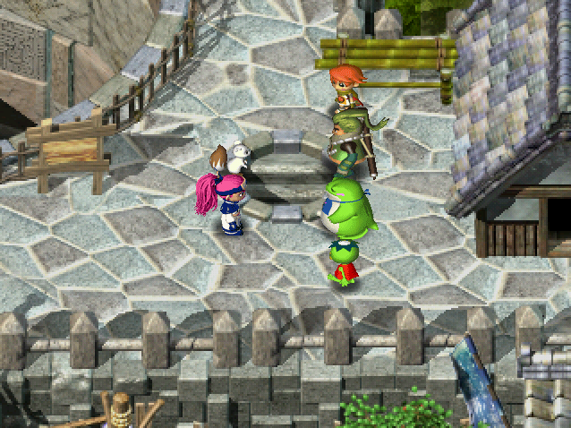

This page provides details on where to go to progress through the game.

<ul class="quickLinksUL">
  <li><a href="#tenrin-Easy-(1st-dungeon)">Tenrin Easy (1st Dungeon)</a></li>
  <li><a href="#tenrin-hard-(2nd-dungeon)">Tenrin Hard (2nd Dungeon)</a></li>
  <li><a href="#sairai-(2nd-region)">Sairai (2nd Region)</a></li>
  <li><a href="#ninja-cart">Ninja Cart</a></li>
  <li><a href="#trial-dungeons-1">Trial Dungeons 1</a></li>
  <li><a href="#trial-dungeons-2">Trial Dungeons 2</a></li>
  <li><a href="#star-shaft">Star Shaft</a></li>
  <li><a href="#white-snake-isle">White Snake Isle</a></li>
</ul>

### Tenrin Easy (1st Dungeon)

  

After the opening, go to the West exit in Izayoi Village.

### Tenrin Hard (2nd Dungeon)

  

After clearing [Tenrin Easy](/dungeons/tenrin-easy), go to the South East exit in Izayoi Village.

### Sairai (2nd Region)

  

After clearing [Tenrin Hard](/dungeons/tenrin-hard), talk to the NPC near the boat in Izayoi Village to travel to Yakagura Forest.

### Ninja Cart

A blue ninja in each of the main villages offers a fast-travel service after you clear Tenrin Hard. ※ The Yakagura Forest option is unlocked once you've traveled to Sairai.

#### Izayoi Village (十六夜の里)

  

The blue ninja is located near the entrance to Tenrin Hard.

#### Kouga Village (鋼賀村)

  

The blue ninja is located near the entrance to Kouga Castle.

#### Yakagura Forest (八神楽の森)

  

The blue ninja is located near the entrance to the storage facility.

### Trial Dungeons 1

  

The first set of trial dungeons can be accessed via the South exit in Yakagura Forest.

### Trial Dungeons 2

  

The second set of trial dungeons can be accessed via the North West exit in Yakagura Forest. ※ If this entrance doesn't unlock after clearing the first set of trial dungeons, revisit Kouga Castle.

### Star Shaft

  

Talk to the NPC near the cart in Yakagura Forest to fast-travel to Shichiten City (七天京).

  

In Shichiten City, go north up the stairs and to the right of the large hole.

### White Snake Isle

  

Talk to the NPC near the cart in Yakagura Forest to fast-travel to Sanba Fort (三婆砦). ※ This NPC will offer a fast-travel option to White Snake Isle after you enter the dungeon once.

  

Go down to the lowest level of the fort, and talk to the NPC near a boat after descending a ladder.

  

Travel to White Snake Isle (白蛇島) by boat, then go South to enter the dungeon.
