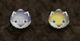
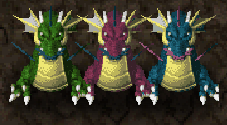
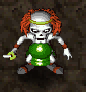

※ English names might change as the translation project progresses.

# Monster List

<table id="monsterList" class="monsterPageTable">
  <tr>
    <th colspan="9">Monster (Family)</th>
  </tr>
  <tr>
    <th class="highlightNormal">1</th>
    <th class="highlightNormal">2</th>
    <th class="highlightNormal">3</th>
    <th class="highlightNormal">4</th>
    <th class="highlightNormal">5</th>
    <th class="highlightNormal">6</th>
    <th class="highlightNormal">7</th>
    <th class="highlightNormal">8</th>
    <th class="highlightNormal">9</th>
  </tr>
  <tr>
    <td class="highlightYellow"><a href="#mamel">Mamel</a></td>
    <td class="highlightYellow2"><a href="#bomb">Bomb</a></td>
    <td class="highlightYellow"><a href="#tug-frog">Tug Frog</a></td>
    <td class="highlightYellow2"><a href="#curse-girl">Curse Girl</a></td>
    <td class="highlightYellow"><a href="#jagan-mask">Jagan Mask</a></td>
    <td class="highlightYellow2"><a href="#laugh-polygon">Laugh Polygon</a></td>
    <td class="highlightYellow"><a href="#spike-dragon">Spike Dragon</a></td>
    <td class="highlightYellow2"><a href="#demon-warrior">Demon Warrior</a></td>
    <td class="highlightYellow"><a href="#kigny">Kigny</a></td>
  </tr>
  <tr>
    <td class="highlightYellow"><a href="#silver-mamel">Silver Mamel</a></td>
    <td class="highlightYellow2"><a href="#bow-boy">Bow Boy</a></td>
    <td class="highlightYellow"><a href="#spearfish">Spearfish</a></td>
    <td class="highlightYellow2"><a href="#rocket-boar">Rocket Boar</a></td>
    <td class="highlightYellow"><a href="#gazer">Gazer</a></td>
    <td class="highlightYellow2"><a href="#sluggy">Sluggy</a></td>
    <td class="highlightYellow"><a href="#bone-dragon">Bone Dragon</a></td>
    <td class="highlightYellow2"><a href="#kengo">Kengo</a></td>
    <td class="highlightYellow"><a href="#n'dubba">N'dubba</a></td>
  </tr>
  <tr>
    <td class="highlightYellow"><a href="#chintala">Chintala</a></td>
    <td class="highlightYellow2"><a href="#porky">Porky</a></td>
    <td class="highlightYellow"><a href="#zalokleft">Zalokleft</a></td>
    <td class="highlightYellow2"><a href="#schubell">Schubell</a></td>
    <td class="highlightYellow"><a href="#ironhead">Ironhead</a></td>
    <td class="highlightYellow2"><a href="#dragon">Dragon</a></td>
    <td class="highlightYellow"><a href="#pumphantasm">Pumphantasm</a></td>
    <td class="highlightYellow2"><a href="#taur">Taur</a></td>
    <td class="highlightYellow"><a href="#shopkeeper">Shopkeeper</a></td>
  </tr>
  <tr>
    <td class="highlightYellow"><a href="#crow-tengu">Crow Tengu</a></td>
    <td class="highlightYellow2"><a href="#tiger-tosser">Tiger Tosser</a></td>
    <td class="highlightYellow"><a href="#froggo">Froggo</a></td>
    <td class="highlightYellow2"><a href="#king-tusker">King Tusker</a></td>
    <td class="highlightYellow"><a href="#shadow-hat">Shadow Hat</a></td>
    <td class="highlightYellow2"><a href="#shagga">Shagga</a></td>
    <td class="highlightYellow"><a href="#ether-devil">Ether Devil</a></td>
    <td class="highlightYellow2"><a href="#soldier-ant">Soldier Ant</a></td>
    <td class="highlightYellow"><a href="#sheriff">Sheriff</a></td>
  </tr>
  <tr>
    <td class="highlightYellow"><a href="#tiny-phoenix">Tiny Phoenix</a></td>
    <td class="highlightYellow2"><a href="#horse-ronin">Horse Ronin</a></td>
    <td class="highlightYellow"><a href="#thief-pelican">Thief Pelican</a></td>
    <td class="highlightYellow2"><a href="#bat-kangaroo">Bat Kangaroo</a></td>
    <td class="highlightYellow"><a href="#twisty-hani">Twisty Hani</a></td>
    <td class="highlightYellow2"><a href="#floor-dragon">Floor Dragon</a></td>
    <td class="highlightYellow"><a href="#mutaikon">Mutaikon</a></td>
    <td class="highlightYellow2"><a href="#novice-ninja">Novice Ninja</a></td>
    <td class="highlightYellow"><a href="#guard-dog">Guard Dog</a></td>
  </tr>
  <tr>
    <td class="highlightYellow"><a href="#pud">Pud</a></td>
    <td class="highlightYellow2"><a href="#bored-kappa">Bored Kappa</a></td>
    <td class="highlightYellow"><a href="#nigiri-novice">Nigiri Novice</a></td>
    <td class="highlightYellow2"><a href="#lady-locks">Lady Locks</a></td>
    <td class="highlightYellow"><a href="#slime">Slime</a></td>
    <td class="highlightYellow2"><a href="#muron">Muron</a></td>
    <td class="highlightYellow"><a href="#ghost-warrior">Ghost Warrior</a></td>
    <td class="highlightYellow2"><a href="#inferno">Inferno</a></td>
    <td class="highlightYellow"><a href="#boss-group">Boss Group</a></td>
  </tr>
</table>

# Details

### Table Explanation

- Lv = Monster level.
- HP = Monster's hit points.
- Atk = Monster's attack power.
- Def = Monster's defense.
- Exp = Experience points awarded when the monster is defeated.
- Drop = Item drop rate.
    - Some monsters have fixed or unique drops instead.
- Elem. = Element or type.
    - Swift 2 = Double action speed.
    - Swift 3 = Triple action speed.
    - Floating = Can move across water and lava tiles.
    - Wall Clip = Can pass through breakable wall tiles.
    - Weapon = Water Pot halves the monster's attack power.
    - Drain = Weak to ド (Drain Buster) seal.
    - Cyclops = Weak to 目 (Cyclops Killer) seal.
    - Aquatic = Weak to 水 (Marine Slasher) seal.
    - Dragon = Weak to 竜 (Dragon Killer) and 龍 (Ryujin Sword) seals.
    - Ghost = Weak to 仏 (Ghost Sickle) seal, HP restoring items deal damage.
    - Bomb = Weak to 月 (Crescent Arm) seal, Water Pot inflicts sealed status.
- Sp = Special Attack Usage Rate.
    - Left = When the monster is adjacent.
    - Right = When the monster is at a distance.
    - If there's only one value, it's the same for both cases.

### Mamel

  

<table class="monsterPageTable">
  <tr>
    <th>Lv</th>
    <th>Name</th>
    <th>HP</th>
    <th>Atk</th>
    <th>Def</th>
    <th>Exp</th>
    <th>Drop</th>
    <th>Elem.</th>
    <th>Sp</th>
    <th>Notes</th>
  </tr>
  <tr>
    <td class="highlightYellow">1</td>
    <td>Mamel</td>
    <td>5</td>
    <td>2</td>
    <td>2</td>
    <td>2</td>
    <td>1.56%</td>
    <td>-</td>
    <td>-</td>
    <td rowspan="3">No abilities.</td>
  </tr>
  <tr>
    <td class="highlightYellow">2</td>
    <td>Pit Mamel</td>
    <td>7</td>
    <td>3</td>
    <td>2</td>
    <td>4</td>
    <td>2.34%</td>
    <td>-</td>
    <td>-</td>
  </tr>
  <tr>
    <td class="highlightYellow">3</td>
    <td>Cave Mamel</td>
    <td>5</td>
    <td>50</td>
    <td>99</td>
    <td>500</td>
    <td>3.52%</td>
    <td>-</td>
    <td>-</td>
  </tr>
</table>

### Silver Mamel

  

<table class="monsterPageTable">
  <tr>
    <th>Lv</th>
    <th>Name</th>
    <th>HP</th>
    <th>Atk</th>
    <th>Def</th>
    <th>Exp</th>
    <th>Drop</th>
    <th>Elem.</th>
    <th>Sp</th>
    <th>Notes</th>
  </tr>
  <tr>
    <td class="highlightYellow">1</td>
    <td>Silver Mamel</td>
    <td>10</td>
    <td>50</td>
    <td>99</td>
    <td>5000</td>
    <td>100%</td>
    <td>-</td>
    <td>-</td>
    <td>Always drops 5000 Gitan. Converts all damage received to 1 point. Status conditions are effective.</td>
  </tr>
  <tr>
    <td class="highlightYellow">2</td>
    <td>Gold Mamel</td>
    <td>10</td>
    <td>70</td>
    <td>99</td>
    <td>7777</td>
    <td>100%</td>
    <td>Swift 2</td>
    <td>-</td>
    <td>Always drops 10000 Gitan. Converts all damage received to 1 point. Immune to status conditions excluding movement. Twisty Grass and Unlucky Seed are effective.</td>
  </tr>
</table>

### Chintala

  

<table class="monsterPageTable">
  <tr>
    <th>Lv</th>
    <th>Name</th>
    <th>HP</th>
    <th>Atk</th>
    <th>Def</th>
    <th>Exp</th>
    <th>Drop</th>
    <th>Elem.</th>
    <th>Sp</th>
    <th>Notes</th>
  </tr>
  <tr>
    <td class="highlightYellow">1</td>
    <td>Chintala</td>
    <td>6</td>
    <td>2</td>
    <td>3</td>
    <td>3</td>
    <td>1.17%</td>
    <td>-</td>
    <td>-</td>
    <td rowspan="3">No abilities.</td>
  </tr>
  <tr>
    <td class="highlightYellow">2</td>
    <td>Mid Chintala</td>
    <td>25</td>
    <td>14</td>
    <td>7</td>
    <td>22</td>
    <td>1.17%</td>
    <td>-</td>
    <td>-</td>
  </tr>
  <tr>
    <td class="highlightYellow">3</td>
    <td>Big Chintala</td>
    <td>80</td>
    <td>35</td>
    <td>10</td>
    <td>300</td>
    <td>1.17%</td>
    <td>-</td>
    <td>-</td>
  </tr>
</table>

### Crow Tengu

  

<table class="monsterPageTable">
  <tr>
    <th>Lv</th>
    <th>Name</th>
    <th>HP</th>
    <th>Atk</th>
    <th>Def</th>
    <th>Exp</th>
    <th>Drop</th>
    <th>Elem.</th>
    <th>Sp</th>
    <th>Notes</th>
  </tr>
  <tr>
    <td class="highlightYellow">1</td>
    <td>Crow Tengu</td>
    <td>16</td>
    <td>9</td>
    <td>8</td>
    <td>12</td>
    <td>1.56%</td>
    <td>-</td>
    <td>-</td>
    <td rowspan="3">Disguises itself as a different monster.</td>
  </tr>
  <tr>
    <td class="highlightYellow">2</td>
    <td>Falcon Tengu</td>
    <td>50</td>
    <td>15</td>
    <td>10</td>
    <td>60</td>
    <td>1.56%</td>
    <td>-</td>
    <td>-</td>
  </tr>
  <tr>
    <td class="highlightYellow">3</td>
    <td>Eagle Tengu</td>
    <td>100</td>
    <td>40</td>
    <td>15</td>
    <td>300</td>
    <td>1.56%</td>
    <td>-</td>
    <td>-</td>
  </tr>
</table>

### Tiny Phoenix

  

<table class="monsterPageTable">
  <tr>
    <th>Lv</th>
    <th>Name</th>
    <th>HP</th>
    <th>Atk</th>
    <th>Def</th>
    <th>Exp</th>
    <th>Drop</th>
    <th>Elem.</th>
    <th>Sp</th>
    <th>Notes</th>
  </tr>
  <tr>
    <td class="highlightYellow">1</td>
    <td>Tiny Phoenix</td>
    <td>75</td>
    <td>23</td>
    <td>11</td>
    <td>350</td>
    <td>8.20%</td>
    <td>Floating</td>
    <td>50%</td>
    <td>Immune to fire damage. Warps to a hurt monster and heals 50 of their HP.</td>
  </tr>
</table>

### Pud

  

<table class="monsterPageTable">
  <tr>
    <th>Lv</th>
    <th>Name</th>
    <th>HP</th>
    <th>Atk</th>
    <th>Def</th>
    <th>Exp</th>
    <th>Drop</th>
    <th>Elem.</th>
    <th>Sp</th>
    <th>Notes</th>
  </tr>
  <tr>
    <td class="highlightYellow">1</td>
    <td>Pud</td>
    <td>35</td>
    <td>17</td>
    <td>8</td>
    <td>27</td>
    <td>12.9%</td>
    <td rowspan="3">Floating</td>
    <td>30%</td>
    <td>Does an electric attack that travels through adjacent creatures. Electric attack deals 20 damage. Only drops Strength Seed.</td>
  </tr>
  <tr>
    <td class="highlightYellow">2</td>
    <td>Pudding</td>
    <td>43</td>
    <td>20</td>
    <td>11</td>
    <td>63</td>
    <td>6.64%</td>
    <td>40%</td>
    <td>Electric attack deals 30 damage. Only drops Happy Grass.</td>
  </tr>
  <tr>
    <td class="highlightYellow">3</td>
    <td>Custard</td>
    <td>120</td>
    <td>45</td>
    <td>15</td>
    <td>800</td>
    <td>3.52%</td>
    <td>50%</td>
    <td>Electric attack deals 40 damage. Only drops Revival Grass.</td>
  </tr>
</table>

### Bomb

  

<table class="monsterPageTable">
  <tr>
    <th>Lv</th>
    <th>Name</th>
    <th>HP</th>
    <th>Atk</th>
    <th>Def</th>
    <th>Exp</th>
    <th>Drop</th>
    <th>Elem.</th>
    <th>Sp</th>
    <th>Notes</th>
  </tr>
  <tr>
    <td class="highlightYellow">1</td>
    <td>Bomb</td>
    <td>50</td>
    <td>31</td>
    <td>25</td>
    <td>150</td>
    <td>1.56%</td>
    <td rowspan="3">Bomb</td>
    <td>-</td>
    <td>Stops moving at 50% HP, then explodes if hit again. Instantly explodes when hit by explosion damage. Explosion has the same effect as Landmine.</td>
  </tr>
  <tr>
    <td class="highlightYellow">2</td>
    <td>Elec Bomb</td>
    <td>80</td>
    <td>30</td>
    <td>15</td>
    <td>550</td>
    <td>1.56%</td>
    <td>-</td>
    <td>Stops moving at 50% HP, then explodes if hit again. Immune to electric damage. Explosion deals 30 electric damage.</td>
  </tr>
  <tr>
    <td class="highlightYellow">3</td>
    <td>Fire Bomb</td>
    <td>150</td>
    <td>50</td>
    <td>25</td>
    <td>1200</td>
    <td>1.56%</td>
    <td>-</td>
    <td>Stops moving at 50% HP, then explodes if hit again. Instantly explodes when hit by fire damage. Explosion creates 20 damage fire pillars. (10 turns)</td>
  </tr>
</table>

### Bow Boy

  

<table class="monsterPageTable">
  <tr>
    <th>Lv</th>
    <th>Name</th>
    <th>HP</th>
    <th>Atk</th>
    <th>Def</th>
    <th>Exp</th>
    <th>Drop</th>
    <th>Elem.</th>
    <th>Sp</th>
    <th>Notes</th>
  </tr>
  <tr>
    <td class="highlightYellow">1</td>
    <td>Bow Boy</td>
    <td>20</td>
    <td>3</td>
    <td>5</td>
    <td>14</td>
    <td>0%</td>
    <td>-</td>
    <td>50%</td>
    <td>Shoots Wood Arrows.</td>
  </tr>
  <tr>
    <td class="highlightYellow">2</td>
    <td>Boy Cart</td>
    <td>30</td>
    <td>5</td>
    <td>11</td>
    <td>28</td>
    <td>0%</td>
    <td>-</td>
    <td>70%</td>
    <td>Shoots Iron Arrows. Moves away from Asuka.</td>
  </tr>
  <tr>
    <td class="highlightYellow">3</td>
    <td>Pop Tank</td>
    <td>40</td>
    <td>12</td>
    <td>15</td>
    <td>150</td>
    <td>1.17%</td>
    <td>Bomb</td>
    <td>60%</td>
    <td rowspan="2">Fires 20 damage Cannonballs.</td>
  </tr>
  <tr>
    <td class="highlightYellow">4</td>
    <td>Cranky Tank</td>
    <td>80</td>
    <td>15</td>
    <td>11</td>
    <td>800</td>
    <td>1.17%</td>
    <td>Bomb Swift 2</td>
    <td>60%</td>
  </tr>
</table>

### Porky

  

<table class="monsterPageTable">
  <tr>
    <th>Lv</th>
    <th>Name</th>
    <th>HP</th>
    <th>Atk</th>
    <th>Def</th>
    <th>Exp</th>
    <th>Drop</th>
    <th>Elem.</th>
    <th>Sp</th>
    <th>Notes</th>
  </tr>
  <tr>
    <td class="highlightYellow">1</td>
    <td>Porky</td>
    <td>70</td>
    <td>25</td>
    <td>8</td>
    <td>80</td>
    <td>1.56%</td>
    <td>-</td>
    <td>50%</td>
    <td>Throws rocks within a 2 tile radius. Rocks have the same power as a direct attack.</td>
  </tr>
  <tr>
    <td class="highlightYellow">2</td>
    <td>Porko</td>
    <td>75</td>
    <td>40</td>
    <td>12</td>
    <td>800</td>
    <td>1.56%</td>
    <td>-</td>
    <td>25%</td>
    <td>Same as Porky, but throwing range of 5 tiles.</td>
  </tr>
  <tr>
    <td class="highlightYellow">3</td>
    <td>Porkon</td>
    <td>130</td>
    <td>60</td>
    <td>15</td>
    <td>2150</td>
    <td>1.56%</td>
    <td>-</td>
    <td>13%</td>
    <td>Same as Porky, but throwing range of 10 tiles.</td>
  </tr>
</table>

### Tiger Tosser

  

<table class="monsterPageTable">
  <tr>
    <th>Lv</th>
    <th>Name</th>
    <th>HP</th>
    <th>Atk</th>
    <th>Def</th>
    <th>Exp</th>
    <th>Drop</th>
    <th>Elem.</th>
    <th>Sp</th>
    <th>Notes</th>
  </tr>
  <tr>
    <td class="highlightYellow">1</td>
    <td>Tiger Tosser</td>
    <td>39</td>
    <td>24</td>
    <td>8</td>
    <td>40</td>
    <td>1.56%</td>
    <td>-</td>
    <td>50%</td>
    <td>Throws an adjacent creature at Asuka, or throws Asuka at another creature, onto a trap, or into a Monster House. Throwing range of 5 tiles, deals 5 damage.</td>
  </tr>
  <tr>
    <td class="highlightYellow">2</td>
    <td>Tiger Hurler</td>
    <td>80</td>
    <td>35</td>
    <td>12</td>
    <td>420</td>
    <td>1.56%</td>
    <td>-</td>
    <td>50%</td>
    <td>Same as Tiger Tosser, but throwing range of 10 tiles. Can throw Asuka onto hidden traps in the same room.</td>
  </tr>
  <tr>
    <td class="highlightYellow">3</td>
    <td>Tiger Chucker</td>
    <td>160</td>
    <td>50</td>
    <td>15</td>
    <td>4200</td>
    <td>1.56%</td>
    <td>-</td>
    <td>50%</td>
    <td>Same as Tiger Tosser, but throwing range of 20 tiles. Can throw Asuka onto hidden traps or monsters in other rooms.</td>
  </tr>
</table>

### Horse Ronin

  

<table class="monsterPageTable">
  <tr>
    <th>Lv</th>
    <th>Name</th>
    <th>HP</th>
    <th>Atk</th>
    <th>Def</th>
    <th>Exp</th>
    <th>Drop</th>
    <th>Elem.</th>
    <th>Sp</th>
    <th>Notes</th>
  </tr>
  <tr>
    <td class="highlightYellow">1</td>
    <td>Horse Ronin</td>
    <td>40</td>
    <td>16</td>
    <td>12</td>
    <td>42</td>
    <td>1.56%</td>
    <td>-</td>
    <td>25% | 50%</td>
    <td rowspan="4">Shoots Silver Arrows.</td>
  </tr>
  <tr>
    <td class="highlightYellow">2</td>
    <td>Horse Samurai</td>
    <td>65</td>
    <td>27</td>
    <td>12</td>
    <td>110</td>
    <td>1.56%</td>
    <td>-</td>
    <td>25% | 50%</td>
  </tr>
  <tr>
    <td class="highlightYellow">3</td>
    <td>Horse Shogun</td>
    <td>68</td>
    <td>25</td>
    <td>15</td>
    <td>165</td>
    <td>1.56%</td>
    <td rowspan="2">Swift 2</td>
    <td>25% | 50%</td>
  </tr>
  <tr>
    <td class="highlightYellow">4</td>
    <td>Horse Emperor</td>
    <td>200</td>
    <td>45</td>
    <td>12</td>
    <td>3100</td>
    <td>1.56%</td>
    <td>25% | 50%</td>
  </tr>
</table>

### Bored Kappa

  

<table class="monsterPageTable">
  <tr>
    <th>Lv</th>
    <th>Name</th>
    <th>HP</th>
    <th>Atk</th>
    <th>Def</th>
    <th>Exp</th>
    <th>Drop</th>
    <th>Elem.</th>
    <th>Sp</th>
    <th>Notes</th>
  </tr>
  <tr>
    <td class="highlightYellow">1</td>
    <td>Bored Kappa</td>
    <td>32</td>
    <td>19</td>
    <td>7</td>
    <td>32</td>
    <td>0%</td>
    <td rowspan="3">Aquatic</td>
    <td>-</td>
    <td>Throws items in the room at Asuka. (5 tile radius)</td>
  </tr>
  <tr>
    <td class="highlightYellow">2</td>
    <td>Kappa Pest</td>
    <td>49</td>
    <td>24</td>
    <td>7</td>
    <td>120</td>
    <td>0%</td>
    <td>-</td>
    <td>Throws items in the room at Asuka. (9 tile radius)</td>
  </tr>
  <tr>
    <td class="highlightYellow">3</td>
    <td>Vexing Kappa</td>
    <td>120</td>
    <td>35</td>
    <td>10</td>
    <td>1500</td>
    <td>0%</td>
    <td>-</td>
    <td>Throws items in the room at Asuka. (Anywhere in the room)</td>
  </tr>
</table>

### Tug Frog

  

<table class="monsterPageTable">
  <tr>
    <th>Lv</th>
    <th>Name</th>
    <th>HP</th>
    <th>Atk</th>
    <th>Def</th>
    <th>Exp</th>
    <th>Drop</th>
    <th>Elem.</th>
    <th>Sp</th>
    <th>Notes</th>
  </tr>
  <tr>
    <td class="highlightYellow">1</td>
    <td>Tug Frog</td>
    <td>11</td>
    <td>5</td>
    <td>5</td>
    <td>6</td>
    <td>1.56%</td>
    <td rowspan="3">Aquatic</td>
    <td>40%</td>
    <td>Pulls Asuka closer from up to 3 tiles away when lined up.</td>
  </tr>
  <tr>
    <td class="highlightYellow">2</td>
    <td>Pull Frog</td>
    <td>43</td>
    <td>22</td>
    <td>10</td>
    <td>55</td>
    <td>1.56%</td>
    <td>50%</td>
    <td>Pulls Asuka closer from up to 5 tiles away when lined up. Immediately attacks after pulling Asuka closer.</td>
  </tr>
  <tr>
    <td class="highlightYellow">3</td>
    <td>Yank Frog</td>
    <td>82</td>
    <td>27</td>
    <td>12</td>
    <td>121</td>
    <td>1.56%</td>
    <td>60%</td>
    <td>Pulls Asuka closer from up to 10 tiles away when lined up. Immediately attacks after pulling Asuka closer.</td>
  </tr>
</table>

### Spearfish

  

<table class="monsterPageTable">
  <tr>
    <th>Lv</th>
    <th>Name</th>
    <th>HP</th>
    <th>Atk</th>
    <th>Def</th>
    <th>Exp</th>
    <th>Drop</th>
    <th>Elem.</th>
    <th>Sp</th>
    <th>Notes</th>
  </tr>
  <tr>
    <td class="highlightYellow">1</td>
    <td>Spearfish</td>
    <td>24</td>
    <td>15</td>
    <td>8</td>
    <td>24</td>
    <td>1.56%</td>
    <td rowspan="4">Aquatic</td>
    <td>-</td>
    <td>Can move underwater.</td>
  </tr>
  <tr>
    <td class="highlightYellow">2</td>
    <td>Lt. Spearfish</td>
    <td>35</td>
    <td>20</td>
    <td>12</td>
    <td>50</td>
    <td>1.56%</td>
    <td>-</td>
    <td>Can attack characters on land while underwater. Runs toward water when remaining HP is &le; 7. Heals 5 HP per turn while underwater.</td>
  </tr>
  <tr>
    <td class="highlightYellow">3</td>
    <td>Capt. Spearfish</td>
    <td>65</td>
    <td>26</td>
    <td>23</td>
    <td>116</td>
    <td>1.56%</td>
    <td>-</td>
    <td>Can attack characters on land while underwater. Runs toward water when remaining HP is &le; 15. Heals 7 HP per turn while underwater.</td>
  </tr>
  <tr>
    <td class="highlightYellow">4</td>
    <td>Adm. Spearfish</td>
    <td>98</td>
    <td>50</td>
    <td>18</td>
    <td>1200</td>
    <td>1.56%</td>
    <td>-</td>
    <td>Can attack characters on land while underwater. Runs toward water when remaining HP is &le; 23. Heals 9 HP per turn while underwater.</td>
  </tr>
</table>

### Zalokleft

  

<table class="monsterPageTable">
  <tr>
    <th>Lv</th>
    <th>Name</th>
    <th>HP</th>
    <th>Atk</th>
    <th>Def</th>
    <th>Exp</th>
    <th>Drop</th>
    <th>Elem.</th>
    <th>Sp</th>
    <th>Notes</th>
  </tr>
  <tr>
    <td class="highlightYellow">1</td>
    <td>Zalokleft</td>
    <td>25</td>
    <td>0</td>
    <td>6</td>
    <td>12</td>
    <td>100%</td>
    <td rowspan="3">Aquatic</td>
    <td>50%</td>
    <td>Steals an item from Asuka, excluding equipped items. Warps and runs away after stealing.</td>
  </tr>
  <tr>
    <td class="highlightYellow">2</td>
    <td>Lime Zalokleft</td>
    <td>60</td>
    <td>0</td>
    <td>10</td>
    <td>78</td>
    <td>100%</td>
    <td>50%</td>
    <td>Same as Zalokleft. Occasionally multiplies when it receives damage.</td>
  </tr>
  <tr>
    <td class="highlightYellow">3</td>
    <td>Iron Zalokleft</td>
    <td>80</td>
    <td>0</td>
    <td>8</td>
    <td>200</td>
    <td>100%</td>
    <td>50%</td>
    <td>Steals an item from Asuka, prioritizing equipped items. Warps and runs away after stealing. Occasionally multiplies when it receives damage.</td>
  </tr>
</table>

### Froggo

  

<table class="monsterPageTable">
  <tr>
    <th>Lv</th>
    <th>Name</th>
    <th>HP</th>
    <th>Atk</th>
    <th>Def</th>
    <th>Exp</th>
    <th>Drop</th>
    <th>Elem.</th>
    <th>Sp</th>
    <th>Notes</th>
  </tr>
  <tr>
    <td class="highlightYellow">1</td>
    <td>Froggo</td>
    <td>22</td>
    <td>0</td>
    <td>8</td>
    <td>10</td>
    <td>100%</td>
    <td>-</td>
    <td>70%</td>
    <td rowspan="3">Always drops Gitan when defeated. Sits on any Gitan it finds on the ground. Doesn't attack, but instead observes or steals Gitan. Runs away at double speed after stealing Gitan.</td>
  </tr>
  <tr>
    <td class="highlightYellow">2</td>
    <td>Froggucci</td>
    <td>50</td>
    <td>0</td>
    <td>15</td>
    <td>50</td>
    <td>100%</td>
    <td>-</td>
    <td>80%</td>
  </tr>
  <tr>
    <td class="highlightYellow">3</td>
    <td>Froggon</td>
    <td>100</td>
    <td>0</td>
    <td>20</td>
    <td>300</td>
    <td>100%</td>
    <td>-</td>
    <td>25%</td>
  </tr>
</table>

### Thief Pelican

  

<table class="monsterPageTable">
  <tr>
    <th>Lv</th>
    <th>Name</th>
    <th>HP</th>
    <th>Atk</th>
    <th>Def</th>
    <th>Exp</th>
    <th>Drop</th>
    <th>Elem.</th>
    <th>Sp</th>
    <th>Notes</th>
  </tr>
  <tr>
    <td class="highlightYellow">1</td>
    <td>Thief Pelican</td>
    <td>28</td>
    <td>10</td>
    <td>11</td>
    <td>15</td>
    <td>0%</td>
    <td>-</td>
    <td>50%</td>
    <td>Eats thrown items. Inhales an inventory item, excluding equipped items. Synthesizes eaten items if the items are compatible. Runs from Asuka after eating an item, but can still attack. Drops eaten items when tripped or defeated. Eats up to 2 items. Gains 4 strength per item. (10→14→18)</td>
  </tr>
  <tr>
    <td class="highlightYellow">2</td>
    <td>Robber Pelican</td>
    <td>50</td>
    <td>20</td>
    <td>12</td>
    <td>30</td>
    <td>0%</td>
    <td>-</td>
    <td>50%</td>
    <td>Same as Thief Pelican, but eats up to 3 items. Gains 6 strength per item. (20→26→32→38)</td>
  </tr>
  <tr>
    <td class="highlightYellow">3</td>
    <td>Bandit Pelican</td>
    <td>62</td>
    <td>20</td>
    <td>15</td>
    <td>70</td>
    <td>0%</td>
    <td rowspan="2">Swift 2</td>
    <td>50%</td>
    <td>Same as Thief Pelican, but eats up to 4 items. Gains 8 strength per item. (20→28→36→44→52)</td>
  </tr>
  <tr>
    <td class="highlightYellow">4</td>
    <td>Raider Pelican</td>
    <td>80</td>
    <td>30</td>
    <td>18</td>
    <td>500</td>
    <td>0%</td>
    <td>50%</td>
    <td>Same as Thief Pelican, but eats up to 5 items. Gains 10 strength per item. (30→40→50→60→70→80)</td>
  </tr>
</table>

### Nigiri Novice

  

<table class="monsterPageTable">
  <tr>
    <th>Lv</th>
    <th>Name</th>
    <th>HP</th>
    <th>Atk</th>
    <th>Def</th>
    <th>Exp</th>
    <th>Drop</th>
    <th>Elem.</th>
    <th>Sp</th>
    <th>Notes</th>
  </tr>
  <tr>
    <td class="highlightYellow">1</td>
    <td>Nigiri Novice</td>
    <td>11</td>
    <td>7</td>
    <td>6</td>
    <td>9</td>
    <td>1.56%</td>
    <td>-</td>
    <td>-</td>
    <td>No abilities.</td>
  </tr>
  <tr>
    <td class="highlightYellow">2</td>
    <td>Nigiri Morph</td>
    <td>24</td>
    <td>11</td>
    <td>10</td>
    <td>25</td>
    <td>1.56%</td>
    <td>-</td>
    <td>13%</td>
    <td>Transforms an item into Large Onigiri, excluding equipped items.</td>
  </tr>
  <tr>
    <td class="highlightYellow">3</td>
    <td>Nigiri Boss</td>
    <td>68</td>
    <td>25</td>
    <td>15</td>
    <td>108</td>
    <td>1.56%</td>
    <td>-</td>
    <td>13%</td>
    <td>Inflicts Onigiri status on Asuka for 10 turns.</td>
  </tr>
  <tr>
    <td class="highlightYellow">4</td>
    <td>Nigiri Master</td>
    <td>120</td>
    <td>50</td>
    <td>15</td>
    <td>1600</td>
    <td>1.56%</td>
    <td>-</td>
    <td>13%</td>
    <td>Inflicts Onigiri status on Asuka for 10 turns. If Asuka has Onigiri status, transforms an item into Large Onigiri, excluding equipped items.</td>
  </tr>
</table>

※ This family instantly collapses when hit by thrown onigiri.

### Curse Girl

  

<table class="monsterPageTable">
  <tr>
    <th>Lv</th>
    <th>Name</th>
    <th>HP</th>
    <th>Atk</th>
    <th>Def</th>
    <th>Exp</th>
    <th>Drop</th>
    <th>Elem.</th>
    <th>Sp</th>
    <th>Notes</th>
  </tr>
  <tr>
    <td class="highlightYellow">1</td>
    <td>Curse Girl</td>
    <td>50</td>
    <td>21</td>
    <td>8</td>
    <td>80</td>
    <td>1.56%</td>
    <td>-</td>
    <td>20%</td>
    <td>Curses 1 inventory item.</td>
  </tr>
  <tr>
    <td class="highlightYellow">2</td>
    <td>Curse Sister</td>
    <td>90</td>
    <td>36</td>
    <td>10</td>
    <td>300</td>
    <td>1.56%</td>
    <td>-</td>
    <td>30%</td>
    <td>Curses 2 inventory items.</td>
  </tr>
  <tr>
    <td class="highlightYellow">3</td>
    <td>Curse Mom</td>
    <td>150</td>
    <td>40</td>
    <td>15</td>
    <td>500</td>
    <td>1.56%</td>
    <td>-</td>
    <td>40%</td>
    <td>Curses 4 inventory items.</td>
  </tr>
</table>

### Rocket Boar

  

<table class="monsterPageTable">
  <tr>
    <th>Lv</th>
    <th>Name</th>
    <th>HP</th>
    <th>Atk</th>
    <th>Def</th>
    <th>Exp</th>
    <th>Drop</th>
    <th>Elem.</th>
    <th>Sp</th>
    <th>Notes</th>
  </tr>
  <tr>
    <td class="highlightYellow">1</td>
    <td>Rocket Boar</td>
    <td>33</td>
    <td>21</td>
    <td>11</td>
    <td>35</td>
    <td>1.56%</td>
    <td>-</td>
    <td>25%</td>
    <td>Lundge deals 4 damage and 1 tile of knockback, and makes Asuka trip and drop items if she isn't against a wall.</td>
  </tr>
  <tr>
    <td class="highlightYellow">2</td>
    <td>Jet Boar</td>
    <td>85</td>
    <td>35</td>
    <td>5</td>
    <td>135</td>
    <td>1.56%</td>
    <td>-</td>
    <td>25%</td>
    <td>Same as Rocket Boar, but 6 damage and 2 tiles of knockback.</td>
  </tr>
  <tr>
    <td class="highlightYellow">3</td>
    <td>Sonic Boar</td>
    <td>150</td>
    <td>60</td>
    <td>20</td>
    <td>800</td>
    <td>1.56%</td>
    <td>-</td>
    <td>25%</td>
    <td>Same as Rocket Boar, but 10 damage and 3 tiles of knockback.</td>
  </tr>
</table>

### Schubell

  

<table class="monsterPageTable">
  <tr>
    <th>Lv</th>
    <th>Name</th>
    <th>HP</th>
    <th>Atk</th>
    <th>Def</th>
    <th>Exp</th>
    <th>Drop</th>
    <th>Elem.</th>
    <th>Sp</th>
    <th>Notes</th>
  </tr>
  <tr>
    <td class="highlightYellow">1</td>
    <td>Schubell</td>
    <td>53</td>
    <td>22</td>
    <td>10</td>
    <td>58</td>
    <td>1.56%</td>
    <td>-</td>
    <td>30%</td>
    <td>Summons 1 level 1 monster from the current floor's monster table.</td>
  </tr>
  <tr>
    <td class="highlightYellow">2</td>
    <td>Menbell</td>
    <td>64</td>
    <td>28</td>
    <td>11</td>
    <td>103</td>
    <td>1.56%</td>
    <td>-</td>
    <td>30%</td>
    <td>Summons 1 level 2 monster from the current floor's monster table.</td>
  </tr>
  <tr>
    <td class="highlightYellow">3</td>
    <td>Bellthoven</td>
    <td>200</td>
    <td>50</td>
    <td>15</td>
    <td>1500</td>
    <td>1.56%</td>
    <td>-</td>
    <td>30%</td>
    <td>Summons 1~3 level 3 monsters from the current floor's monster table.</td>
  </tr>
</table>

### King Tusker

  

<table class="monsterPageTable">
  <tr>
    <th>Lv</th>
    <th>Name</th>
    <th>HP</th>
    <th>Atk</th>
    <th>Def</th>
    <th>Exp</th>
    <th>Drop</th>
    <th>Elem.</th>
    <th>Sp</th>
    <th>Notes</th>
  </tr>
  <tr>
    <td class="highlightYellow">1</td>
    <td>King Tusker</td>
    <td>55</td>
    <td>20</td>
    <td>12</td>
    <td>47</td>
    <td>3.52%</td>
    <td>-</td>
    <td>20% | 50%</td>
    <td>Swings a Paralysis Staff. (Duration: 10 turns) Only drops Paralysis Staff.</td>
  </tr>
  <tr>
    <td class="highlightYellow">2</td>
    <td>Monarch Tusker</td>
    <td>108</td>
    <td>32</td>
    <td>5</td>
    <td>155</td>
    <td>3.52%</td>
    <td>-</td>
    <td>20% | 50%</td>
    <td>Swings a Seal Staff. (Duration: 20 turns) Only drops Seal Staff.</td>
  </tr>
  <tr>
    <td class="highlightYellow">3</td>
    <td>Emperor Tusker</td>
    <td>130</td>
    <td>48</td>
    <td>18</td>
    <td>3500</td>
    <td>3.52%</td>
    <td>-</td>
    <td>20% | 50%</td>
    <td>Swings a Slow Staff. (Duration: 10 turns) Only drops Slow Staff.</td>
  </tr>
</table>

### Bat Kangaroo

  

<table class="monsterPageTable">
  <tr>
    <th>Lv</th>
    <th>Name</th>
    <th>HP</th>
    <th>Atk</th>
    <th>Def</th>
    <th>Exp</th>
    <th>Drop</th>
    <th>Elem.</th>
    <th>Sp</th>
    <th>Notes</th>
  </tr>
  <tr>
    <td class="highlightYellow">1</td>
    <td>Bat Kangaroo</td>
    <td>62</td>
    <td>24</td>
    <td>10</td>
    <td>80</td>
    <td>8.20%</td>
    <td>-</td>
    <td>20% | 50%</td>
    <td>Swings a Rage Staff at monsters. (Duration: 50 turns) Only drops Rage Staff.</td>
  </tr>
  <tr>
    <td class="highlightYellow">2</td>
    <td>Evil Kangaroo</td>
    <td>95</td>
    <td>32</td>
    <td>13</td>
    <td>250</td>
    <td>8.20%</td>
    <td>-</td>
    <td>20% | 50%</td>
    <td>Swings a Swift Staff at monsters. (Duration: Infinite) Only drops Swift Staff.</td>
  </tr>
  <tr>
    <td class="highlightYellow">3</td>
    <td>Devil Kangaroo</td>
    <td>105</td>
    <td>37</td>
    <td>15</td>
    <td>800</td>
    <td>0%</td>
    <td>-</td>
    <td>20% | 50%</td>
    <td>Swings a Fury Staff at monsters. (Duration: Rage: 50 turns, Swift: Infinite)</td>
  </tr>
</table>

### Lady Locks

  

<table class="monsterPageTable">
  <tr>
    <th>Lv</th>
    <th>Name</th>
    <th>HP</th>
    <th>Atk</th>
    <th>Def</th>
    <th>Exp</th>
    <th>Drop</th>
    <th>Elem.</th>
    <th>Sp</th>
    <th>Notes</th>
  </tr>
  <tr>
    <td class="highlightYellow">1</td>
    <td>Lady Locks</td>
    <td>10</td>
    <td>5</td>
    <td>4</td>
    <td>5</td>
    <td>1.56%</td>
    <td>-</td>
    <td>25%</td>
    <td>Reflects projectiles. Inflicts HP drain when adjacent.</td>
  </tr>
  <tr>
    <td class="highlightYellow">2</td>
    <td>Lovely Locks</td>
    <td>41</td>
    <td>23</td>
    <td>13</td>
    <td>48</td>
    <td>1.56%</td>
    <td>-</td>
    <td>25%</td>
    <td>Reflects projectiles and staff magic. Inflicts HP drain when lined up.</td>
  </tr>
  <tr>
    <td class="highlightYellow">3</td>
    <td>Goldie Locks</td>
    <td>60</td>
    <td>25</td>
    <td>15</td>
    <td>90</td>
    <td>1.56%</td>
    <td>-</td>
    <td>25%</td>
    <td>Reflects projectiles and staff magic. Inflicts HP drain when in the same room.</td>
  </tr>
</table>

### Jagan Mask

  

<table class="monsterPageTable">
  <tr>
    <th>Lv</th>
    <th>Name</th>
    <th>HP</th>
    <th>Atk</th>
    <th>Def</th>
    <th>Exp</th>
    <th>Drop</th>
    <th>Elem.</th>
    <th>Sp</th>
    <th>Notes</th>
  </tr>
  <tr>
    <td class="highlightYellow">1</td>
    <td>Jagan Mask</td>
    <td>36</td>
    <td>15</td>
    <td>16</td>
    <td>66</td>
    <td>1.56%</td>
    <td rowspan="3">Ghost</td>
    <td>20%</td>
    <td>Casts a curse that kills after 30 turns. Curse is removed when it's defeated.</td>
  </tr>
  <tr>
    <td class="highlightYellow">2</td>
    <td>Jagar Prince</td>
    <td>70</td>
    <td>30</td>
    <td>17</td>
    <td>99</td>
    <td>1.56%</td>
    <td>25%</td>
    <td>Same as Jagan Mask, but curse is 20 turns.</td>
  </tr>
  <tr>
    <td class="highlightYellow">3</td>
    <td>Jagar King</td>
    <td>120</td>
    <td>45</td>
    <td>25</td>
    <td>666</td>
    <td>1.56%</td>
    <td>30%</td>
    <td>Same as Jagan Mask, but curse is 10 turns.</td>
  </tr>
</table>

### Gazer

  

<table class="monsterPageTable">
  <tr>
    <th>Lv</th>
    <th>Name</th>
    <th>HP</th>
    <th>Atk</th>
    <th>Def</th>
    <th>Exp</th>
    <th>Drop</th>
    <th>Elem.</th>
    <th>Sp</th>
    <th>Notes</th>
  </tr>
  <tr>
    <td class="highlightYellow">1</td>
    <td>Gazer</td>
    <td>23</td>
    <td>11</td>
    <td>5</td>
    <td>20</td>
    <td>1.56%</td>
    <td rowspan="3">Cyclops</td>
    <td>25%</td>
    <td rowspan="3">Hypnotizes Asuka, making her perform a random action: Equip/unequip an item, eat food or grass, read a scroll, swing a staff, insert into a pot, push a Mon Box, throw a circuit, use a projectile, throw Gitan, or attack in a random direction.</td>
  </tr>
  <tr>
    <td class="highlightYellow">2</td>
    <td>Super Gazer</td>
    <td>72</td>
    <td>32</td>
    <td>16</td>
    <td>200</td>
    <td>1.56%</td>
    <td>25%</td>
  </tr>
  <tr>
    <td class="highlightYellow">3</td>
    <td>Hyper Gazer</td>
    <td>100</td>
    <td>50</td>
    <td>25</td>
    <td>2000</td>
    <td>1.56%</td>
    <td>25%</td>
  </tr>
</table>

※ Items inside Storage Pots are generally safe from hypnosis.

### Ironhead

  

<table class="monsterPageTable">
  <tr>
    <th>Lv</th>
    <th>Name</th>
    <th>HP</th>
    <th>Atk</th>
    <th>Def</th>
    <th>Exp</th>
    <th>Drop</th>
    <th>Elem.</th>
    <th>Sp</th>
    <th>Notes</th>
  </tr>
  <tr>
    <td class="highlightYellow">1</td>
    <td>Ironhead</td>
    <td>75</td>
    <td>32</td>
    <td>8</td>
    <td>200</td>
    <td>8.20%</td>
    <td rowspan="3">Cyclops</td>
    <td>50%</td>
    <td rowspan="3">Can attack from up to 3 tiles away. Only drops Ironhead's Head.</td>
  </tr>
  <tr>
    <td class="highlightYellow">2</td>
    <td>Chainhead</td>
    <td>110</td>
    <td>38</td>
    <td>13</td>
    <td>400</td>
    <td>1.56%</td>
    <td>50%</td>
  </tr>
  <tr>
    <td class="highlightYellow">3</td>
    <td>Gigahead</td>
    <td>140</td>
    <td>80</td>
    <td>25</td>
    <td>3150</td>
    <td>1.56%</td>
    <td>50%</td>
  </tr>
</table>

### Shadow Hat

  

<table class="monsterPageTable">
  <tr>
    <th>Lv</th>
    <th>Name</th>
    <th>HP</th>
    <th>Atk</th>
    <th>Def</th>
    <th>Exp</th>
    <th>Drop</th>
    <th>Elem.</th>
    <th>Sp</th>
    <th>Notes</th>
  </tr>
  <tr>
    <td class="highlightYellow">1</td>
    <td>Shadow Hat</td>
    <td>27</td>
    <td>20</td>
    <td>12</td>
    <td>30</td>
    <td>1.56%</td>
    <td>Cyclops Floating</td>
    <td>66%</td>
    <td>Possesses Asuka for 9 turns, making her control randomly. (Affects: Movement - 30% chance) Switches to its floating form afterwards, or if HP &le; 50%.</td>
  </tr>
  <tr>
    <td class="highlightYellow">2</td>
    <td>Black Hat</td>
    <td>50</td>
    <td>20</td>
    <td>15</td>
    <td>120</td>
    <td>1.56%</td>
    <td>Cyclops Floating Swift 2</td>
    <td>75%</td>
    <td>Possesses Asuka for 14 turns, making her control randomly. (Affects: Movement, attacks - 40% chance) Switches to its floating form afterwards, or if HP &le; 50%. Gains double speed in its floating form.</td>
  </tr>
  <tr>
    <td class="highlightYellow">3</td>
    <td>Dark Hat</td>
    <td>100</td>
    <td>35</td>
    <td>18</td>
    <td>2400</td>
    <td>1.56%</td>
    <td>Cyclops Floating Swift 3</td>
    <td>80%</td>
    <td>Possesses Asuka for 19 turns, making her control randomly. (Affects: Movement, attacks, projectiles - 50% chance) Switches to its floating form afterwards, or if HP &le; 50%. Gains triple speed in its floating form.</td>
  </tr>
</table>

### Twisty Hani

  

<table class="monsterPageTable">
  <tr>
    <th>Lv</th>
    <th>Name</th>
    <th>HP</th>
    <th>Atk</th>
    <th>Def</th>
    <th>Exp</th>
    <th>Drop</th>
    <th>Elem.</th>
    <th>Sp</th>
    <th>Notes</th>
  </tr>
  <tr>
    <td class="highlightYellow">1</td>
    <td>Twisty Hani</td>
    <td>32</td>
    <td>20</td>
    <td>13</td>
    <td>200</td>
    <td>10.16%</td>
    <td>Drain</td>
    <td>50%</td>
    <td>Decreases a target's level by 1.</td>
  </tr>
</table>

### Slime

  

<table class="monsterPageTable">
  <tr>
    <th>Lv</th>
    <th>Name</th>
    <th>HP</th>
    <th>Atk</th>
    <th>Def</th>
    <th>Exp</th>
    <th>Drop</th>
    <th>Elem.</th>
    <th>Sp</th>
    <th>Notes</th>
  </tr>
  <tr>
    <td class="highlightYellow">1</td>
    <td>Slime</td>
    <td>60</td>
    <td>0</td>
    <td>15</td>
    <td>50</td>
    <td>0%</td>
    <td rowspan="4">Drain</td>
    <td>30%</td>
    <td>Lowers equipped weapon or shield's upgrade value by 1. Reduces ally defense by 15%. (Duration: current adventure)</td>
  </tr>
  <tr>
    <td class="highlightYellow">2</td>
    <td>Grime</td>
    <td>100</td>
    <td>0</td>
    <td>20</td>
    <td>100</td>
    <td>0%</td>
    <td>30%</td>
    <td>Lowers equipped weapon or shield's upgrade value by 2. Reduces ally defense by 35%. (Duration: current adventure)</td>
  </tr>
  <tr>
    <td class="highlightYellow">3</td>
    <td>Ooze</td>
    <td>135</td>
    <td>0</td>
    <td>20</td>
    <td>200</td>
    <td>0%</td>
    <td>30%</td>
    <td>Lowers equipped weapon or shield's upgrade value by 3. Reduces ally defense to 0. (Duration: current adventure) Occasionally multiplies when it receives damage.</td>
  </tr>
  <tr>
    <td class="highlightYellow">4</td>
    <td>Sludge</td>
    <td>145</td>
    <td>0</td>
    <td>25</td>
    <td>400</td>
    <td>0%</td>
    <td>30%</td>
    <td>Lowers equipped weapon or shield's upgrade value by 3, and removes red 金 seal (Plating Scroll) at the same time. Inflicts Sealed status on an ally. (Duration: current floor) Erases 1 weapon or shield synthesis seal. Occasionally multiplies when it receives damage.</td>
  </tr>
</table>

※ No-Rust Bracelet protects against all of this family's special attacks.

### Laugh Polygon

  

<table class="monsterPageTable">
  <tr>
    <th>Lv</th>
    <th>Name</th>
    <th>HP</th>
    <th>Atk</th>
    <th>Def</th>
    <th>Exp</th>
    <th>Drop</th>
    <th>Elem.</th>
    <th>Sp</th>
    <th>Notes</th>
  </tr>
  <tr>
    <td class="highlightYellow">1</td>
    <td>Laugh Polygon</td>
    <td>18</td>
    <td>10</td>
    <td>9</td>
    <td>18</td>
    <td>1.56%</td>
    <td rowspan="4">Drain</td>
    <td>50%</td>
    <td>Warps to Asuka inside rooms. Lowers fullness by 5%, or HP by 50% if it's not Asuka.</td>
  </tr>
  <tr>
    <td class="highlightYellow">2</td>
    <td>Spin Polygon</td>
    <td>53</td>
    <td>22</td>
    <td>12</td>
    <td>68</td>
    <td>1.56%</td>
    <td>50%</td>
    <td>Same as Laugh Polygon, but lowers fullness by 10%.</td>
  </tr>
  <tr>
    <td class="highlightYellow">3</td>
    <td>Dance Polygon</td>
    <td>62</td>
    <td>30</td>
    <td>24</td>
    <td>115</td>
    <td>1.56%</td>
    <td>50%</td>
    <td>Same as Laugh Polygon, but lowers fullness by 30%.</td>
  </tr>
  <tr>
    <td class="highlightYellow">4</td>
    <td>Sing Polygon</td>
    <td>150</td>
    <td>40</td>
    <td>20</td>
    <td>2800</td>
    <td>1.56%</td>
    <td>50%</td>
    <td>Same as Laugh Polygon, but lowers max fullness by 5%.</td>
  </tr>
</table>

### Sluggy

  

<table class="monsterPageTable">
  <tr>
    <th>Lv</th>
    <th>Name</th>
    <th>HP</th>
    <th>Atk</th>
    <th>Def</th>
    <th>Exp</th>
    <th>Drop</th>
    <th>Elem.</th>
    <th>Sp</th>
    <th>Notes</th>
  </tr>
  <tr>
    <td class="highlightYellow">1</td>
    <td>Sluggy</td>
    <td>14</td>
    <td>6</td>
    <td>5</td>
    <td>8</td>
    <td>1.56%</td>
    <td rowspan="4">Drain</td>
    <td>20%</td>
    <td>Lowers Asuka's strength by 1. Lowers strength by 10% on other targets.</td>
  </tr>
  <tr>
    <td class="highlightYellow">2</td>
    <td>Bitter Sluggy</td>
    <td>40</td>
    <td>20</td>
    <td>8</td>
    <td>60</td>
    <td>1.56%</td>
    <td>20%</td>
    <td>Lowers Asuka's max strength by 1. Lowers strength by 20% on other targets.</td>
  </tr>
  <tr>
    <td class="highlightYellow">3</td>
    <td>Rancor Sluggy</td>
    <td>88</td>
    <td>27</td>
    <td>12</td>
    <td>127</td>
    <td>1.56%</td>
    <td>20%</td>
    <td>Lowers Asuka's max strength by 2. Lowers strength by 30% on other targets. Occasionally multiplies when it receives damage.</td>
  </tr>
  <tr>
    <td class="highlightYellow">4</td>
    <td>Venom Sluggy</td>
    <td>120</td>
    <td>58</td>
    <td>15</td>
    <td>1200</td>
    <td>1.56%</td>
    <td>20%</td>
    <td>Lowers Asuka's max strength by 3. Lowers strength by 40% on other targets. Occasionally multiplies when it receives damage.</td>
  </tr>
</table>

### Dragon

  

<table class="monsterPageTable">
  <tr>
    <th>Lv</th>
    <th>Name</th>
    <th>HP</th>
    <th>Atk</th>
    <th>Def</th>
    <th>Exp</th>
    <th>Drop</th>
    <th>Elem.</th>
    <th>Sp</th>
    <th>Notes</th>
  </tr>
  <tr>
    <td class="highlightYellow">1</td>
    <td>Dragon</td>
    <td>70</td>
    <td>35</td>
    <td>15</td>
    <td>450</td>
    <td>30.47%</td>
    <td rowspan="3">Dragon</td>
    <td>25%</td>
    <td>Breathes 20 damage fire in a straight line.</td>
  </tr>
  <tr>
    <td class="highlightYellow">2</td>
    <td>Sky Dragon</td>
    <td>100</td>
    <td>50</td>
    <td>20</td>
    <td>1200</td>
    <td>40.23%</td>
    <td>19%</td>
    <td>Breathes 30 damage fire from anywhere in the room.</td>
  </tr>
  <tr>
    <td class="highlightYellow">3</td>
    <td>Archdragon</td>
    <td>300</td>
    <td>130</td>
    <td>30</td>
    <td>9999</td>
    <td>50.39%</td>
    <td>13%</td>
    <td>Breathes 35 damage fire from anywhere on the floor.</td>
  </tr>
</table>

### Shagga

  

<table class="monsterPageTable">
  <tr>
    <th>Lv</th>
    <th>Name</th>
    <th>HP</th>
    <th>Atk</th>
    <th>Def</th>
    <th>Exp</th>
    <th>Drop</th>
    <th>Elem.</th>
    <th>Sp</th>
    <th>Notes</th>
  </tr>
  <tr>
    <td class="highlightYellow">1</td>
    <td>Shagga</td>
    <td>63</td>
    <td>30</td>
    <td>12</td>
    <td>95</td>
    <td>1.56%</td>
    <td rowspan="3">Dragon Weapon</td>
    <td>-</td>
    <td>No abilities.</td>
  </tr>
  <tr>
    <td class="highlightYellow">2</td>
    <td>Nashagga</td>
    <td>86</td>
    <td>30</td>
    <td>15</td>
    <td>300</td>
    <td>1.56%</td>
    <td>-</td>
    <td>Attacks 2 times in a row.</td>
  </tr>
  <tr>
    <td class="highlightYellow">3</td>
    <td>Lashagga</td>
    <td>200</td>
    <td>55</td>
    <td>20</td>
    <td>3500</td>
    <td>1.56%</td>
    <td>-</td>
    <td>Attacks 3 times in a row.</td>
  </tr>
</table>

### Floor Dragon

  

<table class="monsterPageTable">
  <tr>
    <th>Lv</th>
    <th>Name</th>
    <th>HP</th>
    <th>Atk</th>
    <th>Def</th>
    <th>Exp</th>
    <th>Drop</th>
    <th>Elem.</th>
    <th>Sp</th>
    <th>Notes</th>
  </tr>
  <tr>
    <td class="highlightYellow">1</td>
    <td>Floor Dragon</td>
    <td>65</td>
    <td>25</td>
    <td>12</td>
    <td>82</td>
    <td>1.56%</td>
    <td rowspan="3">Dragon</td>
    <td>-</td>
    <td rowspan="3">Tunnels to the other side of Asuka if an enemy is behind it.</td>
  </tr>
  <tr>
    <td class="highlightYellow">2</td>
    <td>Dragon Head</td>
    <td>77</td>
    <td>30</td>
    <td>15</td>
    <td>160</td>
    <td>1.56%</td>
    <td>-</td>
  </tr>
  <tr>
    <td class="highlightYellow">3</td>
    <td>Tunnel Dragon</td>
    <td>110</td>
    <td>36</td>
    <td>10</td>
    <td>500</td>
    <td>1.56%</td>
    <td>-</td>
  </tr>
</table>

### Muron

  

<table class="monsterPageTable">
  <tr>
    <th>Lv</th>
    <th>Name</th>
    <th>HP</th>
    <th>Atk</th>
    <th>Def</th>
    <th>Exp</th>
    <th>Drop</th>
    <th>Elem.</th>
    <th>Sp</th>
    <th>Notes</th>
  </tr>
  <tr>
    <td class="highlightYellow">1</td>
    <td>Muron</td>
    <td>55</td>
    <td>20</td>
    <td>5</td>
    <td>62</td>
    <td>1.56%</td>
    <td rowspan="3">Dragon</td>
    <td>50%</td>
    <td>Exhales a beam that deals 20 tiles of knockback when lined up. The beam deals 10 damage.</td>
  </tr>
  <tr>
    <td class="highlightYellow">2</td>
    <td>Yenron</td>
    <td>80</td>
    <td>35</td>
    <td>10</td>
    <td>120</td>
    <td>1.56%</td>
    <td>70%</td>
    <td>Same as Muron, but the beam deals 20 damage.</td>
  </tr>
  <tr>
    <td class="highlightYellow">3</td>
    <td>Shenron</td>
    <td>150</td>
    <td>40</td>
    <td>14</td>
    <td>1500</td>
    <td>1.56%</td>
    <td>90%</td>
    <td>Same as Muron, but the beam deals 30 damage.</td>
  </tr>
</table>

### Spike Dragon

  

<table class="monsterPageTable">
  <tr>
    <th>Lv</th>
    <th>Name</th>
    <th>HP</th>
    <th>Atk</th>
    <th>Def</th>
    <th>Exp</th>
    <th>Drop</th>
    <th>Elem.</th>
    <th>Sp</th>
    <th>Notes</th>
  </tr>
  <tr>
    <td class="highlightYellow">1</td>
    <td>Spike Dragon</td>
    <td>48</td>
    <td>25</td>
    <td>12</td>
    <td>52</td>
    <td>1.56%</td>
    <td rowspan="3">Dragon Floating</td>
    <td>-</td>
    <td>Changes forms every set number of turns: Normal (4) → Change (1) → Floating (2) → Change (1) → Repeat. Floating form lowers strength by 5, and raises defense by 3.</td>
  </tr>
  <tr>
    <td class="highlightYellow">2</td>
    <td>Earth Needle</td>
    <td>150</td>
    <td>40</td>
    <td>15</td>
    <td>700</td>
    <td>1.56%</td>
    <td>-</td>
    <td>Changes forms every set number of turns: Normal (3) → Change (1) → Floating (5) → Change (1) → Repeat. Floating form lowers strength by 10.</td>
  </tr>
  <tr>
    <td class="highlightYellow">3</td>
    <td>Thunder Lance</td>
    <td>160</td>
    <td>50</td>
    <td>15</td>
    <td>2080</td>
    <td>1.56%</td>
    <td>-</td>
    <td>Changes forms every set number of turns: Normal (2) → Change (1) → Floating (9) → Change (1) → Repeat. Floating form lowers strength by 10.</td>
  </tr>
</table>

### Bone Dragon

  

<table class="monsterPageTable">
  <tr>
    <th>Lv</th>
    <th>Name</th>
    <th>HP</th>
    <th>Atk</th>
    <th>Def</th>
    <th>Exp</th>
    <th>Drop</th>
    <th>Elem.</th>
    <th>Sp</th>
    <th>Notes</th>
  </tr>
  <tr>
    <td class="highlightYellow">1</td>
    <td>Bone Dragon</td>
    <td>52</td>
    <td>23</td>
    <td>12</td>
    <td>64</td>
    <td>1.56%</td>
    <td rowspan="3">Dragon Ghost</td>
    <td>-</td>
    <td rowspan="3">No abilities.</td>
  </tr>
  <tr>
    <td class="highlightYellow">2</td>
    <td>Skull Dragon</td>
    <td>80</td>
    <td>48</td>
    <td>20</td>
    <td>800</td>
    <td>1.56%</td>
    <td>-</td>
  </tr>
  <tr>
    <td class="highlightYellow">3</td>
    <td>Garm Dragon</td>
    <td>100</td>
    <td>70</td>
    <td>35</td>
    <td>3500</td>
    <td>1.56%</td>
    <td>-</td>
  </tr>
</table>

### Pumphantasm

  

<table class="monsterPageTable">
  <tr>
    <th>Lv</th>
    <th>Name</th>
    <th>HP</th>
    <th>Atk</th>
    <th>Def</th>
    <th>Exp</th>
    <th>Drop</th>
    <th>Elem.</th>
    <th>Sp</th>
    <th>Notes</th>
  </tr>
  <tr>
    <td class="highlightYellow">1</td>
    <td>Pumphantasm</td>
    <td>45</td>
    <td>28</td>
    <td>8</td>
    <td>50</td>
    <td>1.17%</td>
    <td rowspan="3">Ghost Floating Wall Clip</td>
    <td>-</td>
    <td rowspan="3">Can pass through walls. Random movement, sometimes doesn't attack.</td>
  </tr>
  <tr>
    <td class="highlightYellow">2</td>
    <td>Pumphantom</td>
    <td>80</td>
    <td>45</td>
    <td>10</td>
    <td>180</td>
    <td>1.17%</td>
    <td>-</td>
  </tr>
  <tr>
    <td class="highlightYellow">3</td>
    <td>Pumpanshee</td>
    <td>120</td>
    <td>60</td>
    <td>12</td>
    <td>950</td>
    <td>1.17%</td>
    <td>-</td>
  </tr>
</table>

### Ether Devil

  

<table class="monsterPageTable">
  <tr>
    <th>Lv</th>
    <th>Name</th>
    <th>HP</th>
    <th>Atk</th>
    <th>Def</th>
    <th>Exp</th>
    <th>Drop</th>
    <th>Elem.</th>
    <th>Sp</th>
    <th>Notes</th>
  </tr>
  <tr>
    <td class="highlightYellow">1</td>
    <td>Ether Devil</td>
    <td>50</td>
    <td>30</td>
    <td>15</td>
    <td>95</td>
    <td>1.56%</td>
    <td>Ghost Floating</td>
    <td>-</td>
    <td rowspan="4">Invisible, and has unpredictable movement. Reflects staff magic in a random direction.</td>
  </tr>
  <tr>
    <td class="highlightYellow">2</td>
    <td>Phantom Devil</td>
    <td>75</td>
    <td>45</td>
    <td>15</td>
    <td>500</td>
    <td>1.56%</td>
    <td>Ghost Floating Swift 2</td>
    <td>-</td>
  </tr>
  <tr>
    <td class="highlightYellow">3</td>
    <td>Mirage Devil</td>
    <td>100</td>
    <td>50</td>
    <td>20</td>
    <td>1000</td>
    <td>1.56%</td>
    <td>Ghost Floating Swift 3</td>
    <td>-</td>
  </tr>
  <tr>
    <td class="highlightYellow">4</td>
    <td>Astral Devil</td>
    <td>150</td>
    <td>60</td>
    <td>20</td>
    <td>3600</td>
    <td>1.56%</td>
    <td>Ghost Floating Swift 3 Wall Clip</td>
    <td>-</td>
  </tr>
</table>

### Mutaikon

  

<table class="monsterPageTable">
  <tr>
    <th>Lv</th>
    <th>Name</th>
    <th>HP</th>
    <th>Atk</th>
    <th>Def</th>
    <th>Exp</th>
    <th>Drop</th>
    <th>Elem.</th>
    <th>Sp</th>
    <th>Notes</th>
  </tr>
  <tr>
    <td class="highlightYellow">1</td>
    <td>Mutaikon</td>
    <td>38</td>
    <td>20</td>
    <td>11</td>
    <td>51</td>
    <td>1.56%</td>
    <td rowspan="3">Ghost</td>
    <td>25%</td>
    <td>Throws Poison Grass 2 tiles ahead.</td>
  </tr>
  <tr>
    <td class="highlightYellow">2</td>
    <td>Dazikon</td>
    <td>64</td>
    <td>23</td>
    <td>13</td>
    <td>105</td>
    <td>1.56%</td>
    <td>13%</td>
    <td>Throws Dizzy Grass within a 5 tile radius, or Poison Grass if Asuka is already confused.</td>
  </tr>
  <tr>
    <td class="highlightYellow">3</td>
    <td>Dozikon</td>
    <td>150</td>
    <td>45</td>
    <td>10</td>
    <td>1500</td>
    <td>1.56%</td>
    <td>13%</td>
    <td>Throws Sleep Grass within a 5 tile radius. Only uses direct attacks when Asuka is asleep.</td>
  </tr>
</table>

### Ghost Warrior

  

<table class="monsterPageTable">
  <tr>
    <th>Lv</th>
    <th>Name</th>
    <th>HP</th>
    <th>Atk</th>
    <th>Def</th>
    <th>Exp</th>
    <th>Drop</th>
    <th>Elem.</th>
    <th>Sp</th>
    <th>Notes</th>
  </tr>
  <tr>
    <td class="highlightYellow">1</td>
    <td>Ghost Warrior</td>
    <td>4</td>
    <td>0</td>
    <td>0</td>
    <td>10</td>
    <td>0%</td>
    <td>Ghost</td>
    <td>-</td>
    <td>Possesses a monster and raises their level by 1. Converts physical attacks received into 1 damage, but Ghost Sickle and Ghost Slash are effective. Occasionally warps when it takes damage.</td>
  </tr>
</table>

### Demon Warrior

  

<table class="monsterPageTable">
  <tr>
    <th>Lv</th>
    <th>Name</th>
    <th>HP</th>
    <th>Atk</th>
    <th>Def</th>
    <th>Exp</th>
    <th>Drop</th>
    <th>Elem.</th>
    <th>Sp</th>
    <th>Notes</th>
  </tr>
  <tr>
    <td class="highlightYellow">1</td>
    <td>Demon Warrior</td>
    <td>35</td>
    <td>23</td>
    <td>10</td>
    <td>30</td>
    <td>1.56%</td>
    <td rowspan="3">Weapon</td>
    <td>-</td>
    <td rowspan="3">Ghost Warrior appears 3 turns after it's defeated. (Or on the turn the tile becomes free if it's blocked)</td>
  </tr>
  <tr>
    <td class="highlightYellow">2</td>
    <td>Hannya Warrior</td>
    <td>57</td>
    <td>26</td>
    <td>11</td>
    <td>92</td>
    <td>1.56%</td>
    <td>-</td>
  </tr>
  <tr>
    <td class="highlightYellow">3</td>
    <td>Shogun</td>
    <td>120</td>
    <td>35</td>
    <td>15</td>
    <td>600</td>
    <td>1.56%</td>
    <td>-</td>
  </tr>
</table>

### Kengo

  

<table class="monsterPageTable">
  <tr>
    <th>Lv</th>
    <th>Name</th>
    <th>HP</th>
    <th>Atk</th>
    <th>Def</th>
    <th>Exp</th>
    <th>Drop</th>
    <th>Elem.</th>
    <th>Sp</th>
    <th>Notes</th>
  </tr>
  <tr>
    <td class="highlightYellow">1</td>
    <td>Kengo</td>
    <td>55</td>
    <td>28</td>
    <td>13</td>
    <td>80</td>
    <td>10.55%</td>
    <td rowspan="3">Weapon</td>
    <td>13%</td>
    <td>Knocks away Asuka's equipped shield. (10 tiles)</td>
  </tr>
  <tr>
    <td class="highlightYellow">2</td>
    <td>Iai</td>
    <td>90</td>
    <td>40</td>
    <td>20</td>
    <td>380</td>
    <td>10.55%</td>
    <td>13%</td>
    <td>Same as Kengo, but also knocks away weapons.</td>
  </tr>
  <tr>
    <td class="highlightYellow">3</td>
    <td>Shihan</td>
    <td>160</td>
    <td>70</td>
    <td>15</td>
    <td>3800</td>
    <td>10.55%</td>
    <td>13%</td>
    <td>Same as Kengo, but also knocks away weapons and bracelets.</td>
  </tr>
</table>

### Taur

  

<table class="monsterPageTable">
  <tr>
    <th>Lv</th>
    <th>Name</th>
    <th>HP</th>
    <th>Atk</th>
    <th>Def</th>
    <th>Exp</th>
    <th>Drop</th>
    <th>Elem.</th>
    <th>Sp</th>
    <th>Notes</th>
  </tr>
  <tr>
    <td class="highlightYellow">1</td>
    <td>Taur</td>
    <td>95</td>
    <td>30</td>
    <td>2</td>
    <td>120</td>
    <td>1.56%</td>
    <td rowspan="3">Weapon</td>
    <td>25%</td>
    <td rowspan="3">Chance to land a x1.3 damage brutal hit. Only drops Minotaur's Axe.</td>
  </tr>
  <tr>
    <td class="highlightYellow">2</td>
    <td>Minotaur</td>
    <td>120</td>
    <td>50</td>
    <td>5</td>
    <td>450</td>
    <td>25.39%</td>
    <td>25%</td>
  </tr>
  <tr>
    <td class="highlightYellow">3</td>
    <td>Megataur</td>
    <td>200</td>
    <td>100</td>
    <td>10</td>
    <td>5000</td>
    <td>1.56%</td>
    <td>25%</td>
  </tr>
</table>

### Soldier Ant

  

<table class="monsterPageTable">
  <tr>
    <th>Lv</th>
    <th>Name</th>
    <th>HP</th>
    <th>Atk</th>
    <th>Def</th>
    <th>Exp</th>
    <th>Drop</th>
    <th>Elem.</th>
    <th>Sp</th>
    <th>Notes</th>
  </tr>
  <tr>
    <td class="highlightYellow">1</td>
    <td>Soldier Ant</td>
    <td>58</td>
    <td>28</td>
    <td>8</td>
    <td>65</td>
    <td>1.56%</td>
    <td rowspan="2">Weapon</td>
    <td>-</td>
    <td>Digs out wall tiles at random. Can attack through corners.</td>
  </tr>
  <tr>
    <td class="highlightYellow">2</td>
    <td>Captain Ant</td>
    <td>90</td>
    <td>40</td>
    <td>10</td>
    <td>650</td>
    <td>1.56%</td>
    <td>-</td>
    <td>Digs out wall tiles to expand hallways. Can attack through corners.</td>
  </tr>
  <tr>
    <td class="highlightYellow">3</td>
    <td>General Ant</td>
    <td>150</td>
    <td>50</td>
    <td>15</td>
    <td>2450</td>
    <td>1.56%</td>
    <td>Weapon Swift 2</td>
    <td>-</td>
    <td>Digs out wall tiles to expand hallways. Stops moving to ambush after digging a while. Can attack through corners.</td>
  </tr>
</table>

### Novice Ninja

  

<table class="monsterPageTable">
  <tr>
    <th>Lv</th>
    <th>Name</th>
    <th>HP</th>
    <th>Atk</th>
    <th>Def</th>
    <th>Exp</th>
    <th>Drop</th>
    <th>Elem.</th>
    <th>Sp</th>
    <th>Notes</th>
  </tr>
  <tr>
    <td class="highlightYellow">1</td>
    <td>Novice Ninja</td>
    <td>21</td>
    <td>10</td>
    <td>6</td>
    <td>18</td>
    <td>0%</td>
    <td rowspan="3">Weapon</td>
    <td>20%</td>
    <td rowspan="3">Warps away at 50% HP, then throws Shurikens while maintaining a distance of 2 tiles.</td>
  </tr>
  <tr>
    <td class="highlightYellow">2</td>
    <td>Adept Ninja</td>
    <td>55</td>
    <td>25</td>
    <td>7</td>
    <td>85</td>
    <td>0%</td>
    <td>20%</td>
  </tr>
  <tr>
    <td class="highlightYellow">3</td>
    <td>Master Ninja</td>
    <td>70</td>
    <td>24</td>
    <td>12</td>
    <td>100</td>
    <td>0%</td>
    <td>20%</td>
  </tr>
</table>

### Inferno

  

<table class="monsterPageTable">
  <tr>
    <th>Lv</th>
    <th>Name</th>
    <th>HP</th>
    <th>Atk</th>
    <th>Def</th>
    <th>Exp</th>
    <th>Drop</th>
    <th>Elem.</th>
    <th>Sp</th>
    <th>Notes</th>
  </tr>
  <tr>
    <td class="highlightYellow">1</td>
    <td>Inferno</td>
    <td>62</td>
    <td>28</td>
    <td>10</td>
    <td>65</td>
    <td>0%</td>
    <td>-</td>
    <td>-</td>
    <td>Burns and nullifies projectiles that lack piercing properties. Multiplies from explosions. (1 time per turn) Levels up from fire damage. (Max: 99) Water Pot or Rust Trap will instantly defeat it. Color and stats change based on its level.</td>
  </tr>
</table>

### Kigny

  

<table class="monsterPageTable">
  <tr>
    <th>Lv</th>
    <th>Name</th>
    <th>HP</th>
    <th>Atk</th>
    <th>Def</th>
    <th>Exp</th>
    <th>Drop</th>
    <th>Elem.</th>
    <th>Sp</th>
    <th>Notes</th>
  </tr>
  <tr>
    <td class="highlightYellow">1</td>
    <td>Kigny</td>
    <td>60</td>
    <td>28</td>
    <td>13</td>
    <td>60</td>
    <td>1.56%</td>
    <td>-</td>
    <td>-</td>
    <td>Attacks any adjacent creature, friend or foe. Levels up when it defeats a creature. (Max: 99) Color and stats change based on its level.</td>
  </tr>
</table>

### N'dubba

  

<table class="monsterPageTable">
  <tr>
    <th>Lv</th>
    <th>Name</th>
    <th>HP</th>
    <th>Atk</th>
    <th>Def</th>
    <th>Exp</th>
    <th>Drop</th>
    <th>Elem.</th>
    <th>Sp</th>
    <th>Notes</th>
  </tr>
  <tr>
    <td class="highlightYellow">1</td>
    <td>N'dubba</td>
    <td>15</td>
    <td>5</td>
    <td>5</td>
    <td>25</td>
    <td>0%</td>
    <td>-</td>
    <td>-</td>
    <td>Disguises itself as an item. Does a surprise attack when Asuka tries to pick it up. Swift 2 action speed between ages 60~76. Color and stats change based on its level.</td>
  </tr>
</table>

### Shopkeeper

### Sheriff

  

### Guard Dog

  

### Boss Group
