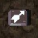
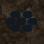

 

※ English names might change as the translation project progresses.

# Overview

- Traps are found on the ground and activate when stepped on, or when an object is thrown on top of them.
    - They generally apply a negative effect, but some can be utilized to your advantage.
- Traps are normally hidden, and are revealed when you step on them or do a direct attack above them.
    - They become visible if you eat Sight Grass, equip a Vision Bracelet, or have Trapper status.
    - Springs needed to escape islands or rooms without hallways are always visible.
- Traps have a chance to break when triggered, and some traps always break after 1 activation.
- Traps don't always trigger when you walk on top of them.
    - Hidden traps have a high activation rate, and visible traps have a low activation rate.
    - They always activate when selecting "Step" from the menu while standing on a trap.
- Asuka is normally the only character who can trigger traps while walking.
    - Monsters can activate traps by walking on top of them if you have Trapper status.
- Items can be thrown to activate traps while a monster is standing on the trap.
    - Arrow from 10 tiles away, Porky Rock from 2 tiles away, Bladed Wheel or broken monster box, etc.
- Traps can be generated on room entrance tiles and inside shops.

# Trap List

- Dmg = Damage.
- B = Bracelet damage.
- Break = Chance to break after activating.

 

<table class="trapTable">
  <thead>
    <tr>
      <th>Image</th>
      <th>Name JP</th>
      <th>Name EN</th>
      <th>Dmg</th>
      <th>B</th>
      <th>Break</th>
      <th>Notes</th>
    </tr>
  </thead>
  <tbody>
    <tr>
      <td></td>
      <td>木の矢</td>
      <td>Wood Arrow</td>
      <td>5</td>
      <td>1</td>
      <td>5%</td>
      <td>Wood Arrow flies from right side of character, dealing 5 damage.</td>
    </tr>
    <tr>
      <td></td>
      <td>鉄の矢</td>
      <td>Iron Arrow</td>
      <td>10</td>
      <td>1</td>
      <td>12%</td>
      <td>Iron Arrow flies from right side of character, dealing 10 damage.</td>
    </tr>
    <tr>
      <td></td>
      <td>毒矢</td>
      <td>Poison Arrow</td>
      <td>4</td>
      <td>1</td>
      <td>15%</td>
      <td>Poison Arrow flies from right side of character. Asuka or ally: 4 damage, strength -1. Monster: 4 damage, lowers strength to 0.</td>
    </tr>
    <tr>
      <td></td>
      <td>丸太</td>
      <td>Log</td>
      <td>5</td>
      <td>1</td>
      <td>12%</td>
      <td>Log flies from right side of character, dealing 5 damage and 10 tiles of knockback.</td>
    </tr>
    <tr>
      <td></td>
      <td>水滴ポットン</td>
      <td>Droplet</td>
      <td>5</td>
      <td>0</td>
      <td>10%</td>
      <td>Water droplet falls from above, dealing 5 damage.</td>
    </tr>
    <tr>
      <td></td>
      <td>イガイガボトボト</td>
      <td>Burr</td>
      <td>9</td>
      <td>0</td>
      <td>12%</td>
      <td>Burrs fall from above, dealing 9 damage.</td>
    </tr>
    <tr>
      <td></td>
      <td>トゲ</td>
      <td>Spike</td>
      <td>9</td>
      <td>0</td>
      <td>12%</td>
      <td>Spikes pop up from the floor, dealing 9 damage.</td>
    </tr>
    <tr>
      <td></td>
      <td>落石</td>
      <td>Rockfall</td>
      <td>13</td>
      <td>6</td>
      <td>20%</td>
      <td>Rock falls from above, dealing 13 damage.</td>
    </tr>
    <tr>
      <td></td>
      <td>大落石</td>
      <td>Rockslide</td>
      <td>30</td>
      <td>6</td>
      <td>30%</td>
      <td>Big rocks fall from above, dealing 30 damage. Hits all characters in a 1-tile radius around the trap.</td>
    </tr>
    <tr>
      <td></td>
      <td>いかずち</td>
      <td>Zap</td>
      <td>30</td>
      <td>0</td>
      <td>50%</td>
      <td>Zaps character who stepped on the trap and any connected characters (adjacent or water puddles), dealing 30 damage.</td>
    </tr>
    <tr>
      <td></td>
      <td>地雷</td>
      <td>Landmine</td>
      <td>50%</td>
      <td>5</td>
      <td>30%</td>
      <td>Deals damage equal to 50% of Asuka's current HP. Destroys items, monsters, walls in a 1-tile radius.</td>
    </tr>
    <tr>
      <td></td>
      <td>大型地雷</td>
      <td>Big Landmine</td>
      <td>75%</td>
      <td>5</td>
      <td>50%</td>
      <td>Deals damage equal to 75% of Asuka's current HP. Destroys items, monsters, walls in a 1-tile radius.</td>
    </tr>
    <tr>
      <td></td>
      <td>鈍足</td>
      <td>Slow</td>
      <td>-</td>
      <td>-</td>
      <td>16%</td>
      <td>Slows action speed by 1 stage for 10 turns. Monster: Permanently slows action speed.</td>
    </tr>
    <tr>
      <td></td>
      <td>回転板</td>
      <td>Spin</td>
      <td>-</td>
      <td>-</td>
      <td>20%</td>
      <td>Inflicts confusion for 10 turns.</td>
    </tr>
    <tr>
      <td></td>
      <td>眠りガス</td>
      <td>Sleep</td>
      <td>-</td>
      <td>-</td>
      <td>20%</td>
      <td>Inflicts sleep for 5 turns.</td>
    </tr>
    <tr>
      <td></td>
      <td>ケロケロの雨</td>
      <td>Rust</td>
      <td>-</td>
      <td>-</td>
      <td>20%</td>
      <td>Lowers upgrade value of equipped items by 1. Monster: Lowers defense to 0.</td>
    </tr>
    <tr>
      <td></td>
      <td>呪い</td>
      <td>Curse</td>
      <td>-</td>
      <td>-</td>
      <td>15%</td>
      <td>Curses 1 inventory item. Monster: Inflicts blind status.</td>
    </tr>
    <tr>
      <td></td>
      <td>装備外し</td>
      <td>Strip</td>
      <td>-</td>
      <td>-</td>
      <td>10%</td>
      <td>Unequips all equipped items. Monster: Permanently seals the monster.</td>
    </tr>
    <tr>
      <td></td>
      <td>モンスター</td>
      <td>Monster</td>
      <td>-</td>
      <td>-</td>
      <td>10%</td>
      <td>Transforms items in the room into monsters. Merchandise in shops will also turn into monsters. If activated by a thrown item, only that item changes.</td>
    </tr>
    <tr>
      <td></td>
      <td>転び石</td>
      <td>Trip Stone</td>
      <td>2~4</td>
      <td>0</td>
      <td>12%</td>
      <td>Makes you drop 4~6 items in front of you. Equipped items are never dropped when tripped. Carry a Balance Staff to avoid tripping. Monster: The monster drops 1 random item.</td>
    </tr>
    <tr>
      <td></td>
      <td>デロデロの湯</td>
      <td>Spoil</td>
      <td>-</td>
      <td>-</td>
      <td>20%</td>
      <td>Onigiri not in pots turn into Spoiled Onigiri. Monster: Monster is turned into a Spoiled Onigiri.</td>
    </tr>
    <tr>
      <td></td>
      <td>トラバサミ</td>
      <td>Bear</td>
      <td>-</td>
      <td>-</td>
      <td>5%</td>
      <td>Makes you unable to move for 7 turns.</td>
    </tr>
    <tr>
      <td></td>
      <td>バネ</td>
      <td>Spring</td>
      <td>-</td>
      <td>-</td>
      <td>6%</td>
      <td>Warps character or item to a random room.</td>
    </tr>
    <tr>
      <td></td>
      <td>一方通行</td>
      <td>One-Way</td>
      <td>-</td>
      <td>-</td>
      <td>6%</td>
      <td>Foces movement in the pointed direction.</td>
    </tr>
    <tr>
      <td></td>
      <td>落し穴</td>
      <td>Pitfall</td>
      <td>3~6</td>
      <td>0</td>
      <td>100%</td>
      <td>Makes you advance to the floor below. Monster: The monster vanishes from the floor.</td>
    </tr>
    <tr>
      <td></td>
      <td>警報スイッチ</td>
      <td>Alert</td>
      <td>-</td>
      <td>-</td>
      <td>12%</td>
      <td>Wakes up all monsters on the floor.</td>
    </tr>
    <tr>
      <td></td>
      <td>召喚スイッチ</td>
      <td>Summon</td>
      <td>-</td>
      <td>-</td>
      <td>100%</td>
      <td>Summons 4 of the same monster.</td>
    </tr>
    <tr>
      <td></td>
      <td>罠</td>
      <td>Multiply</td>
      <td>-</td>
      <td>-</td>
      <td>100%</td>
      <td>Generates lots of new traps in the room.</td>
    </tr>
    <tr>
      <td></td>
      <td>イカリ</td>
      <td>Rage</td>
      <td>-</td>
      <td>-</td>
      <td>20%</td>
      <td>Inflicts Enraged status on monsters in the room.</td>
    </tr>
  </tbody>
</table>
